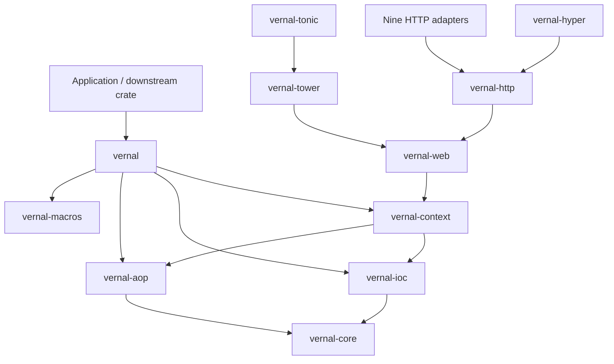
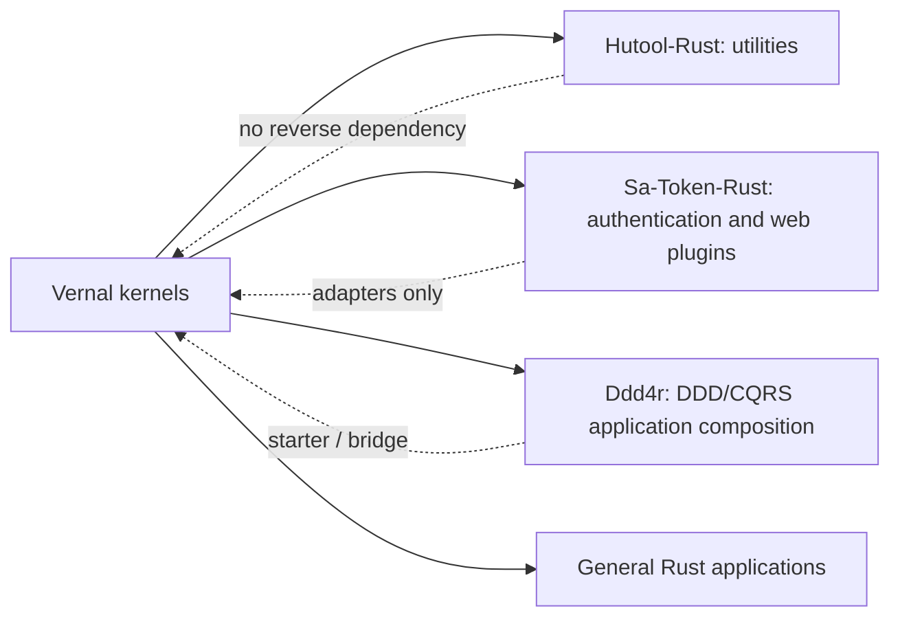

<a id="readme-top"></a>

# 句芒 · Vernal

**Vernal Framework**

**Vernal is a lightweight IoC, AOP and application context framework for Rust.**

> **Vernal — Let components grow.**<br>
> **Grow components. Weave capabilities.**

[English](./README.md) | [简体中文](./README.zh-CN.md)

Vernal is the English brand of **句芒**, the Chinese deity associated with
spring, wood, and the growth of living things. The name turns the idea behind
“spring” into a distinct Chinese cultural expression: components grow from
explicit dependencies, capabilities are woven around stable contracts, and an
application context governs their lifecycle.

```text
Application components
        │ definitions + dependencies + interceptors
        ▼
┌──────────────────────────────────────────────────────────┐
│ 句芒 · Vernal Framework                                  │
│ IoC kernel       construct, resolve, scope, validate      │
│ AOP kernel       match, compose and execute interceptors  │
│ Context          bootstrap, lifecycle, events, shutdown   │
│ Web              Web / HTTP / ten adapters                  │
└──────────────────────────────────────────────────────────┘
        │ explicit ports and framework-native values
        ▼
Hutool-Rust · Sa-Token-Rust · Ddd4r · general Rust applications
```

> **Project status:** experimental. Phase 1 IoC, the Tokio-first Phase 2 AOP
> kernel, Phase 3 application context, and the Phase 4 Web/HTTP/Tower/Hyper
> foundations are callable and contract-tested. All ten selected framework
> adapters—Axum, Actix Web, Rocket, Warp, Salvo, Poem, Ntex, Gotham, Tide, and
> Tonic—are runnable. The explicit Component derive and context-local async AOP
> method macro are callable but still experimental. Nothing is published yet.

## 1. Vision

Vernal aims to provide the reusable application foundation that is currently
missing between small Rust libraries and full web frameworks:

- a typed IoC kernel that can manage Tokio and framework-native objects
  directly;
- an independent AOP kernel for ordered, composable interception;
- an application context that composes IoC, AOP, lifecycle, events, and
  configuration without merging their kernels;
- procedural macros that generate ordinary Rust code rather than hiding a
  reflection runtime;
- framework-neutral Web and HTTP contracts plus thin integration crates for
  the ten selected HTTP/RPC frameworks and downstream ecosystems.

Vernal learns from Spring's proven concepts and from the local `tx-di` source,
but it is not a JVM proxy model translated line by line. Ownership, lifetimes,
trait bounds, explicit errors, and compile-time generation remain Rust-native.

## 2. Name and philosophy

### 2.1 Chinese brand: 句芒

句芒 is the project's cultural identity. In classical Chinese tradition it is
associated with spring and the growth of plants. The image is not decorative;
it expresses the framework model:

| Image | Framework meaning |
|:---|:---|
| Spring awakens life | The context discovers definitions and starts components |
| Roots provide nourishment | Dependencies are explicit and directionally resolved |
| Branches grow independently | IoC, AOP, adapters, and consumers remain modular |
| Vines interweave | Cross-cutting capabilities compose around invocations |
| Seasons have order | Components follow a defined lifecycle and shutdown order |

### 2.2 English brand: Vernal

“Vernal” means “of or relating to spring.” It is an independent English word,
not a transliteration of 句芒. Together the brands form one idea:

> **句芒 is the cultural soul. Vernal is the global technical identity.**

The mythology remains at the brand level. Public APIs will continue to use
clear engineering terms such as `Container`, `Component`, `Scope`,
`ApplicationContext`, `Interceptor`, and `Invocation`.

## 3. Architectural boundaries

Vernal follows four non-negotiable rules:

1. **IoC and AOP are independent kernels.** Either can be used without the
   application context or a web framework.
2. **The context composes; it does not absorb.** Lifecycle, events, and
   configuration depend on public kernel contracts.
3. **Adapters point inward.** Web frameworks, Sa-Token-Rust, Hutool-Rust, and
   Ddd4r never become dependencies of the kernels.
4. **Tokio-first without a global service locator.** Tokio is the official
   asynchronous runtime, while registries, component identity, and lifecycle
   state remain explicit and context-local.

Detailed decisions, flows, failure semantics, and acceptance criteria are in:

- [Architecture](./docs/Vernal-Architecture.md)
- [架构设计（简体中文）](./docs/Vernal-Architecture.zh_CN.md)
- [Web integration architecture](./docs/Vernal-Web-Architecture.md)
- [Web 集成架构（简体中文）](./docs/Vernal-Web-Architecture.zh_CN.md)
- [tx-di source snapshot and provenance](./third-party/tx-di/README.md)

## 4. Workspace

| Crate | Current state | Target responsibility |
|:---|:---:|:---|
| `vernal` | Experimental facade | Facade, prelude, feature composition |
| `vernal-core` | Experimental | Shared contracts for the Tokio-first framework |
| `vernal-ioc` | Phase 1/diagnostics kernel implemented | Definitions, scopes, resolution, graph validation, read-only snapshots |
| `vernal-aop` | Phase 2 kernel implemented | Around/Next, pointcuts, immutable plans, cancellation |
| `vernal-context` | Phase 3/diagnostics kernel implemented | Managed bootstrap, lifecycle, events, redacted startup reports |
| `vernal-macros` | Phase 2 macros implemented | Explicit `Arc<T>` injection metadata and context-local async method weaving |
| `vernal-web` | Phase 4 contract implemented | Framework-neutral context, request scope, handler, and error contracts |
| `vernal-http` | Phase 4 contract implemented | HTTP request, response, body, streaming, cancellation, and backpressure |
| `vernal-tower` | Phase 4 foundation implemented | Tower context, request scope, AOP invocation, and native error boundaries |
| `vernal-hyper` | Phase 4 foundation implemented | Lossless Hyper request/body-frame transport bridge |

The target integration set is recorded in
[`web-integration-manifest.toml`](./web-integration-manifest.toml). All ten
adapter crates contain runnable native integrations:

| Priority | Framework | Vernal crate | Protocol | Status |
|:---:|:---|:---|:---|:---:|
| 1 | Axum | `vernal-axum` | HTTP + Tower | Phase 5 adapter |
| 2 | Actix Web | `vernal-actix-web` | HTTP | Phase 5 adapter |
| 3 | Rocket | `vernal-rocket` | HTTP | Phase 5 adapter |
| 4 | Warp | `vernal-warp` | HTTP | Phase 5 adapter |
| 5 | Salvo | `vernal-salvo` | HTTP | Phase 5 adapter |
| 6 | Poem | `vernal-poem` | HTTP | Phase 5 adapter |
| 7 | Ntex | `vernal-ntex` | HTTP | Phase 5 adapter |
| 8 | Gotham | `vernal-gotham` | HTTP | Phase 5 adapter |
| 9 | Tide | `vernal-tide` | HTTP | Phase 5 adapter |
| 10 | Tonic | `vernal-tonic` | RPC streaming + Tower | Phase 5 adapter |

Axum provides native Router assembly plus Context, component, and request-scope
extractors. Actix Web provides App Data/Extension extractors and a native
`Transform`/`Service` whose Scope follows the response body. Rocket provides
Managed State, Request Guards, and a body-aware Fairing. Warp provides native
extension filters over its official Tower Service boundary. Salvo provides a
native Hoop, typed Depot access, and frame/trailer-preserving body cleanup.
Poem provides native `Middleware`/`Endpoint` composition, typed
Context/component/scope extractors, and body-bound cleanup. Ntex provides
native `Middleware`/`Service`, App State/Extension extractors, and a
`MessageBody`-bound request scope. Gotham provides native `StateData`, a
type-safe State extension, Pipeline middleware, and frame/trailer-preserving
body cleanup. Tide provides native `Middleware`, typed Request Extension access,
and response-reader-bound Scope cleanup. Tonic provides a Context interceptor,
typed Request extensions, stable `Status` mapping, and reusable Tower layers.

“Ten” is a versioned coverage priority derived from the reviewed local
integration superset and current registry availability, not a claim of an
objective universal popularity ranking. Tonic is explicitly an RPC integration,
while Tower and Hyper are foundations rather than application frameworks.

Target dependency direction:



## 5. IoC quick start

```rust
use std::{error::Error, sync::Arc};
use vernal_ioc::{ComponentDefinition, RegistryBuilder};

type AnyError = Box<dyn Error + Send + Sync + 'static>;

struct Config {
    name: &'static str,
}

struct Service {
    config: Arc<Config>,
}

fn main() -> Result<(), AnyError> {
    let mut registry = RegistryBuilder::new();
    registry.register(ComponentDefinition::singleton::<Config, _>(|_| Config {
        name: "vernal",
    }))?;
    registry.register(
        ComponentDefinition::try_singleton::<Service, _>(
            |resolver| -> Result<Service, AnyError> {
                Ok(Service {
                    config: resolver.resolve::<Config>()?,
                })
            },
        )
        .depends_on::<Config>(),
    )?;

    let container = registry.build()?.container();
    let service = container.resolve::<Service>()?;
    assert_eq!(service.config.name, "vernal");
    Ok(())
}
```

Factories may resolve only dependencies declared by the definition. Registries
are validated before a `Container` is created, and singleton state belongs to
that container rather than to a process-global store.

The component derive generates the same explicit definition without global
auto-registration:

```rust
use std::sync::Arc;
use vernal_ioc::Component;

#[derive(vernal_macros::Component)]
struct OrderService {
    repository: Arc<OrderRepository>,
    #[component(default)]
    retry_count: usize,
}

struct OrderRepository;

let definition = OrderService::definition();
```

Every unmarked field must be `Arc<T>` and becomes a declared dependency.
`#[component(default)]` is opt-in for local default state, while
`#[component(scope = "transient")]` changes the generated scope. Applications
still call `RegistryBuilder::register`, so registration provenance stays
explicit.

Trait objects join the same graph through explicit, type-checked bindings:

```rust
use vernal_ioc::{Component, TraitBinding};

registry.register_bundle(
    [EmailSender::definition()],
    [TraitBinding::new::<dyn MessageSender, EmailSender, _>(
        |sender| sender,
    ).primary()],
)?;
```

The Component derive injects the unique or primary implementation into
`Arc<dyn MessageSender>`, selects a named binding for
`#[component(qualifier = "email")]`, and injects every implementation into
`Vec<Arc<dyn MessageSender>>`. A binding reuses the original component
instance; `register_bundle` atomically commits definitions and bindings.

An AOP-enabled component explicitly receives its context-local plan catalog
and cancellation token. The method macro then performs ordinary async Rust
calls through the precompiled plan:

```rust
use std::sync::Arc;
use vernal_aop::{
    CancellationToken, InvocationError, InvocationPlanCatalog,
};

#[derive(vernal_macros::Component)]
#[component(aop)]
struct OrderService {
    invocation_plans: Arc<InvocationPlanCatalog>,
    cancellation: Arc<CancellationToken>,
}

impl OrderService {
    #[vernal_macros::intercept(component = "OrderService")]
    async fn create(
        self: Arc<Self>,
        order_id: u64,
    ) -> Result<u64, InvocationError> {
        Ok(order_id)
    }
}
```

The first macro contract intentionally accepts only `async fn`, an owned
`self: Arc<Self>` receiver, owned arguments, and
`Result<T, InvocationError>`. These restrictions make the generated target
future `'static` without reflection, process-global lookup, or hidden cloning.

Any `Send + Sync + 'static` Rust value can be a component, including
`reqwest::Client`, database pools, Tower services, framework state, Tokio
synchronization primitives, and user-defined objects. Their dependencies stay
in the application or integration crate that registers them.

Prebuilt framework objects can enter the graph without wrapper types:

```rust
use std::sync::Arc;
use tokio::runtime::Handle;
use vernal_ioc::{ComponentDefinition, RegistryBuilder};

let runtime = Arc::new(Handle::current());
let mut registry = RegistryBuilder::new();
registry.register(ComponentDefinition::shared_arc(Arc::clone(&runtime)))?;

let handle = registry.build()?.container().resolve::<Handle>()?;
assert!(Arc::ptr_eq(&runtime, &handle));
# Ok::<(), Box<dyn std::error::Error>>(())
```

Vernal is deliberately Tokio-first. Core crates may use Tokio directly when
the capability requires asynchronous tasks, synchronization, time, or
cancellation; Vernal does not introduce a second runtime abstraction.

### 5.1 Managed application context

`VernalApplicationBuilder` is the high-level bootstrap path. Before freezing
the dependency graph it registers the current Tokio `Handle`, the application
`CancellationToken`, the context-local `EventBus`, and the precompiled
`InvocationPlanCatalog` as ordinary typed components:

```rust
use vernal_aop::Operation;
use vernal_context::VernalApplicationBuilder;

# async fn bootstrap() -> Result<(), Box<dyn std::error::Error>> {
let mut application = VernalApplicationBuilder::current()?;
application.operation(Operation::new("OrderService", "create"));

let context = application.build()?;
context.refresh().await?;
context.start().await?;

assert!(context.runtime_handle().is_some());
assert!(context
    .invocation_plans()
    .get(&Operation::new("OrderService", "create"))
    .is_some());

context.close().await?;
# Ok(())
# }
```

Components may declare these native types with the same `depends_on::<T>()`
contract used for application services. The low-level
`Registry -> ApplicationContextBuilder` path remains available when automatic
runtime capture and built-in registration are not wanted.

Frozen registries and running contexts expose owned, read-only diagnostic
snapshots:

```rust
let registry_snapshot = context.container().registry().snapshot();
let startup_report = context.startup_report().await;
let json = serde_json::to_string(&startup_report)?;
```

`RegistrySnapshot` reuses the validated build plan instead of recomputing the
graph. `StartupReport` contains version/MSRV, scope and dependency summaries,
AOP plan slots, and lifecycle timing. Failure snapshots retain only the
component, phase, and outcome; business error text is never serialized.

## 6. Capabilities

| Capability | Target contract | Status |
|:---|:---|:---:|
| Typed component definitions | Constructor injection with explicit metadata | Phase 1 |
| Scopes | Per-container singleton and per-resolution transient | Phase 1 |
| Dependency graph | Deterministic build order and structured missing/ambiguous/cycle diagnostics | Phase 1 |
| Trait binding | Named/primary/multiple implementations without string lookup | Phase 1.1 kernel |
| Interceptor chain | Ordered Around/Next composition with short circuit and result/error transformation | Phase 2 kernel |
| Pointcuts | Operation matching compiled into immutable invocation plans | Phase 2 kernel |
| Application context | Serialized lifecycle, rollback, reverse shutdown, context-local typed events | Phase 3 kernel |
| Events | Context-local typed event publication | Phase 3 kernel |
| Async integration | Tokio-native cancellation, deadlines, and typed invocation context | Phase 2 kernel |
| Web context | Request context, request scope, handler invocation, error mapping | Phase 4 contract |
| HTTP | Request/response, body frames/trailers, explicit bounded collection, cancellation, backpressure | Phase 4 contract |
| Web integration foundation | Tower context/scope layers and Hyper streaming bridge | Phase 4 foundation |
| Framework adapters | Tower-first where possible, native adapters where necessary | Phase 5 adapters |
| Diagnostics | Serializable Registry snapshot and startup report without business error text | Phase 3 diagnostics kernel |

“Phase 1” and “Phase 2 kernel” mean callable implementation and contract tests
exist, but the API is still experimental. The first Component and AOP method
macros are implemented with compile-fail coverage; broader method signatures,
unused-definition runtime tracking, adapter auto-discovery, and benchmarks
remain open. No label is a compatibility or performance claim.

## 7. Ecosystem role



- **Hutool-Rust** remains a general-purpose utility library. It may consume
  Vernal capabilities, but Vernal does not become a Hutool-Rust module. Its
  consumer-owned `hutool-vernal` bridge now installs `HttpConfig` and the
  Tokio/Reqwest `HttpClient` as an atomic, context-local component bundle with
  an application-selected URL policy.
- **Sa-Token-Rust** is the single retained security integration target and
  remains the authority for authentication, sessions, and
  authorization. Vernal supplies component lifecycle and interception, not a
  competing security kernel. Its consumer-owned `sa-token-vernal` bridge now
  adapts `HttpRequestSnapshot`, projects `SecurityPrincipal`, and preserves
  request-level `SaTokenContext` across Tokio futures. `SaTokenComponents`
  atomically installs the caller's exact `Arc<SaTokenManager>` and its bridge
  into a validated Vernal dependency graph.
- **Ddd4r** uses its consumer-owned `ddd4r-vernal` bridge to register the
  native `Registry` and `DefaultCommandBus`, then enters Ddd4r's own Tokio
  task-local `ContextScope` with an isolated snapshot. Aggregates, events,
  CQRS, repositories, outbox, and transaction semantics remain Ddd4r-owned.
- **Web frameworks** retain ownership of routing, request/response types,
  transport limits, and server lifecycle.

## 8. Local development

Prerequisites:

- Declared MSRV: Rust `1.85.0` or newer
- Cargo with Edition 2024 and resolver 3 support

The current local gates were run with Rust `1.97.1`, including an explicit
`cargo +1.85.0 check --workspace --all-targets`. A dedicated MSRV CI job is
still planned; this local result is not yet a release compatibility promise.

Verified workspace commands:

```bash
cargo fmt --all -- --check
cargo check --workspace --all-targets
cargo clippy --workspace --all-targets -- -D warnings
cargo test --workspace
cargo doc --workspace --no-deps
```

The workspace intentionally uses `publish = false` while the contracts are
under design. There is no crates.io installation command or stable API yet.

## 9. Roadmap

| Phase | Deliverable | Exit evidence |
|:---|:---|:---|
| 0 | Brand, architecture, workspace boundaries | Docs and workspace gates pass |
| 1 | `vernal-core` + `vernal-ioc` minimum kernel | Graph, scope, resolution tests |
| 2 | `vernal-aop` + macros | Ordering, error, async, and compile-fail tests |
| 3 | `vernal-context` lifecycle and events | Startup, rollback, and shutdown tests |
| 4 | Web/HTTP contracts, Tower/Hyper, and ten adapters | Cross-framework conformance suite |
| 5 | Hutool-Rust, Sa-Token-Rust, and Ddd4r bridges | Consumer-owned integration examples |
| 6 | Preview release | MSRV, SemVer, security, docs.rs, and package gates |

Phase 5 is in progress: Sa-Token-Rust owns a tested and remotely integrated
`sa-token-vernal` bridge,
and Hutool-Rust locally owns a tested `hutool-vernal` HTTP component bridge;
both pin verified Vernal Git revisions. The Hutool-Rust checkout is currently
under a separate history-rewrite/refactor stream, so its clean remote
integration is still pending. Ddd4r now locally owns `ddd4r-vernal`; its real
Tokio test, Clippy gate, and documentation build pass in an isolated dependency
graph. The full Ddd4r workspace gate remains blocked by its pre-existing,
currently unavailable `rbatis-r2dbc` Git revision and is not reported as
passing.

Phase 1/1.1 now has 24 IoC contract tests for 1,000-node deterministic
planning, structured graph diagnostics, concurrent singleton construction,
container isolation, transient resolution, native objects, named/primary/all
Trait bindings, Trait graph cycles, hidden-dependency rejection, and atomic
definition-plus-binding module registration, plus stable Registry
serialization without factories or instance addresses.
The Phase 2 AOP kernel currently has eight contract tests covering ordered
enter/reverse exit, short circuit, success and error transformation, typed
context across `.await`, cancellation/deadline, pointcut selection, and
64-task concurrent plan reuse, plus deduplicated plan-catalog compilation.
The macro frontend has four runtime tests covering singleton Component
injection, transient construction, Trait Object injection, and context-local
intercepted invocation, plus four compile-fail cases for invalid component
fields, invalid collection qualifiers, non-async interception, and borrowed
receivers. Broader signature support, expanded
macro diagnostics, and AOP benchmarks remain open.
The Phase 3 kernel has eleven tests covering dependency-order startup,
reverse shutdown, initialize/start rollback, invalid transitions, idempotent
close, concurrent close serialization, and context-local typed event
isolation, plus managed injection of Tokio, cancellation, events, and AOP
plans, and read-only/redacted serialization of successful and failed startup
reports.

## 10. Contributing and license

The architecture is currently the contract. New code should first identify the
owning crate, dependency direction, failure semantics, and acceptance evidence.
Do not add a framework dependency to a kernel merely to simplify an adapter.

Vernal is licensed under the [MIT License](./LICENSE-MIT).

---

**Vernal — Let components grow.**

[Back to top](#readme-top)
