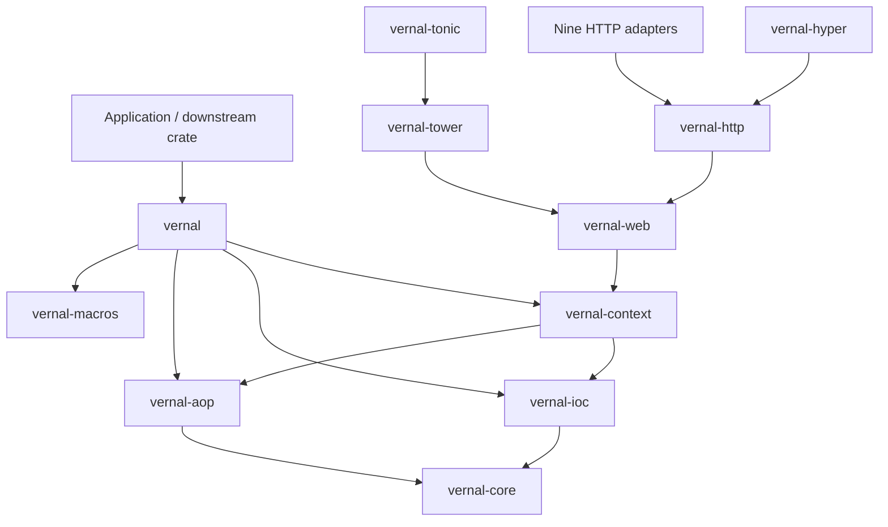
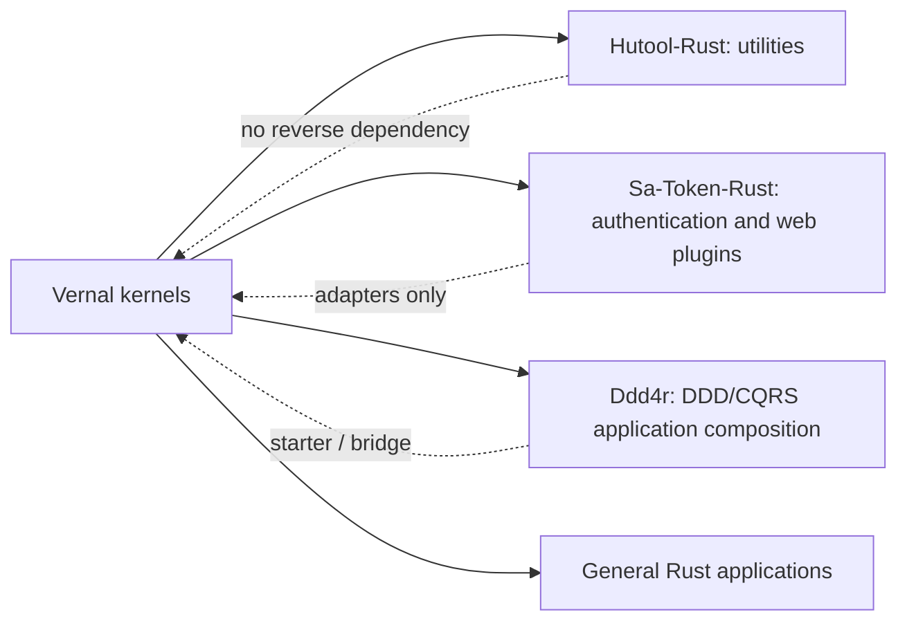

<a id="readme-top"></a>

# 句芒 · Vernal

**Vernal Framework**

**Vernal is a lightweight IoC, AOP and application context framework for Rust.**

> **Vernal — Let components grow.**<br>
> **Grow components. Weave capabilities.**

[English](./README.md) | [简体中文](./README.zh-CN.md)

Vernal is the English brand of **句芒**, the Chinese deity associated with
spring, wood, and the growth of living things. The name turns the idea behind
“spring” into a distinct Chinese cultural expression: components grow from
explicit dependencies, capabilities are woven around stable contracts, and an
application context governs their lifecycle.

```text
Application components
        │ definitions + dependencies + interceptors
        ▼
┌──────────────────────────────────────────────────────────┐
│ 句芒 · Vernal Framework                                  │
│ IoC kernel       construct, resolve, scope, validate      │
│ AOP kernel       match, compose and execute interceptors  │
│ Context          bootstrap, lifecycle, events, shutdown   │
│ Web              Web / HTTP / ten adapters                  │
└──────────────────────────────────────────────────────────┘
        │ explicit ports and framework-native values
        ▼
Hutool-Rust · Sa-Token-Rust · Ddd4r · general Rust applications
```

> **Project status:** design-stage, buildable workspace skeleton. The crate
> boundaries and architecture baseline exist; the framework API and runtime
> behavior are not implemented or published.

## 1. Vision

Vernal aims to provide the reusable application foundation that is currently
missing between small Rust libraries and full web frameworks:

- a runtime-neutral IoC kernel for typed component construction and resolution;
- an independent AOP kernel for ordered, composable interception;
- an application context that composes IoC, AOP, lifecycle, events, and
  configuration without merging their kernels;
- procedural macros that generate ordinary Rust code rather than hiding a
  reflection runtime;
- framework-neutral Web and HTTP contracts plus thin integration crates for
  the ten selected HTTP/RPC frameworks and downstream ecosystems.

Vernal learns from Spring's proven concepts and from the local `tx-di` source,
but it is not a JVM proxy model translated line by line. Ownership, lifetimes,
trait bounds, explicit errors, and compile-time generation remain Rust-native.

## 2. Name and philosophy

### 2.1 Chinese brand: 句芒

句芒 is the project's cultural identity. In classical Chinese tradition it is
associated with spring and the growth of plants. The image is not decorative;
it expresses the framework model:

| Image | Framework meaning |
|:---|:---|
| Spring awakens life | The context discovers definitions and starts components |
| Roots provide nourishment | Dependencies are explicit and directionally resolved |
| Branches grow independently | IoC, AOP, adapters, and consumers remain modular |
| Vines interweave | Cross-cutting capabilities compose around invocations |
| Seasons have order | Components follow a defined lifecycle and shutdown order |

### 2.2 English brand: Vernal

“Vernal” means “of or relating to spring.” It is an independent English word,
not a transliteration of 句芒. Together the brands form one idea:

> **句芒 is the cultural soul. Vernal is the global technical identity.**

The mythology remains at the brand level. Public APIs will continue to use
clear engineering terms such as `Container`, `Component`, `Scope`,
`ApplicationContext`, `Interceptor`, and `Invocation`.

## 3. Architectural boundaries

Vernal follows four non-negotiable rules:

1. **IoC and AOP are independent kernels.** Either can be used without the
   application context or a web framework.
2. **The context composes; it does not absorb.** Lifecycle, events, and
   configuration depend on public kernel contracts.
3. **Adapters point inward.** Web frameworks, Sa-Token-Rust, Hutool-Rust, and
   Ddd4r never become dependencies of the kernels.
4. **No hidden ambient runtime.** Global mutable registries, pointer-address
   identity, forced Tokio ownership, and panic-based control flow are excluded
   from the target core contract.

Detailed decisions, flows, failure semantics, and acceptance criteria are in:

- [Architecture](./docs/Vernal-Architecture.md)
- [架构设计（简体中文）](./docs/Vernal-Architecture.zh_CN.md)
- [Web integration architecture](./docs/Vernal-Web-Architecture.md)
- [Web 集成架构（简体中文）](./docs/Vernal-Web-Architecture.zh_CN.md)
- [tx-di source snapshot and provenance](./third-party/tx-di/README.md)

## 4. Workspace

| Crate | Current state | Target responsibility |
|:---|:---:|:---|
| `vernal` | Skeleton | Facade, prelude, feature composition |
| `vernal-core` | Skeleton | Shared stable contracts and errors |
| `vernal-ioc` | Skeleton | Definitions, scopes, resolution, graph validation |
| `vernal-aop` | Skeleton | Invocation, pointcuts, interceptor chains |
| `vernal-context` | Skeleton | Bootstrap, lifecycle, events, graceful shutdown |
| `vernal-macros` | Skeleton | Thin procedural macro entry points |
| `vernal-web` | Skeleton | Framework-neutral context, request scope, handler, and error contracts |
| `vernal-http` | Skeleton | HTTP request, response, body, streaming, cancellation, and backpressure |
| `vernal-tower` | Skeleton | Tower `Layer`/`Service` foundation |
| `vernal-hyper` | Skeleton | Hyper transport foundation |

The target integration set is recorded in
[`web-integration-manifest.toml`](./web-integration-manifest.toml). The ten
adapter crates exist as compile-checked descriptors, but do not yet contain
upstream middleware implementations:

| Priority | Framework | Vernal crate | Protocol | Status |
|:---:|:---|:---|:---|:---:|
| 1 | Axum | `vernal-axum` | HTTP + Tower | Skeleton |
| 2 | Actix Web | `vernal-actix-web` | HTTP | Skeleton |
| 3 | Rocket | `vernal-rocket` | HTTP | Skeleton |
| 4 | Warp | `vernal-warp` | HTTP | Skeleton |
| 5 | Salvo | `vernal-salvo` | HTTP | Skeleton |
| 6 | Poem | `vernal-poem` | HTTP | Skeleton |
| 7 | Ntex | `vernal-ntex` | HTTP | Skeleton |
| 8 | Gotham | `vernal-gotham` | HTTP | Skeleton |
| 9 | Tide | `vernal-tide` | HTTP | Skeleton |
| 10 | Tonic | `vernal-tonic` | RPC streaming + Tower | Skeleton |

“Ten” is a versioned coverage priority derived from the reviewed local
integration superset and current registry availability, not a claim of an
objective universal popularity ranking. Tonic is explicitly an RPC integration,
while Tower and Hyper are foundations rather than application frameworks.

Target dependency direction:



## 5. Target capabilities

| Capability | Target contract | Status |
|:---|:---|:---:|
| Typed component definitions | Constructor injection with explicit metadata | Planned |
| Scopes | Singleton, transient, and extensible scope SPI | Planned |
| Dependency graph | Deterministic build order and cycle diagnostics | Planned |
| Trait binding | Named/primary/multiple implementations without string lookup | Planned |
| Interceptor chain | Ordered around-invocation composition with typed errors | Planned |
| Pointcuts | Method/type/metadata matching generated at compile time | Planned |
| Application context | Refresh/start/ready/close lifecycle | Planned |
| Events | Context-local typed event publication | Planned |
| Async integration | Runtime-neutral core with optional runtime adapters | Planned |
| Web context | Request context, request scope, handler invocation, error mapping | Skeleton |
| HTTP | Request/response, body streams, cancellation, backpressure | Skeleton |
| Web integration | Tower-first where possible, native adapters where necessary | Adapter skeletons |
| Diagnostics | Introspectable graph and startup report without secret leakage | Planned |

“Planned” means no callable implementation exists yet. It is not a compatibility
or performance claim.

## 6. Ecosystem role



- **Hutool-Rust** remains a general-purpose utility library. It may consume
  Vernal capabilities, but Vernal does not become a Hutool-Rust module.
- **Sa-Token-Rust** is the single retained security integration target and
  remains the authority for authentication, sessions, and
  authorization. Vernal supplies component lifecycle and interception, not a
  competing security kernel.
- **Ddd4r** may use Vernal to compose domain services, application services,
  policies, and adapters while retaining its own DDD/CQRS semantics.
- **Web frameworks** retain ownership of routing, request/response types,
  transport limits, and server lifecycle.

## 7. Local development

Prerequisites:

- Declared MSRV: Rust `1.85.0` or newer
- Cargo with Edition 2024 and resolver 3 support

The current local gates were run with Rust `1.97.1`; a dedicated MSRV CI job
is planned and the 1.85.0 baseline is not yet release-verified.

Verified workspace commands:

```bash
cargo fmt --all -- --check
cargo check --workspace --all-targets
cargo clippy --workspace --all-targets -- -D warnings
cargo test --workspace
cargo doc --workspace --no-deps
```

The workspace intentionally uses `publish = false` while the contracts are
under design. There is no crates.io installation command or stable API yet.

## 8. Roadmap

| Phase | Deliverable | Exit evidence |
|:---|:---|:---|
| 0 | Brand, architecture, workspace boundaries | Docs and workspace gates pass |
| 1 | `vernal-core` + `vernal-ioc` minimum kernel | Graph, scope, resolution tests |
| 2 | `vernal-aop` + macros | Ordering, error, async, and compile-fail tests |
| 3 | `vernal-context` lifecycle and events | Startup, rollback, and shutdown tests |
| 4 | Web/HTTP contracts, Tower/Hyper, and ten adapters | Cross-framework conformance suite |
| 5 | Hutool-Rust, Sa-Token-Rust, and Ddd4r bridges | Consumer-owned integration examples |
| 6 | Preview release | MSRV, SemVer, security, docs.rs, and package gates |

## 9. Contributing and license

The architecture is currently the contract. New code should first identify the
owning crate, dependency direction, failure semantics, and acceptance evidence.
Do not add a framework dependency to a kernel merely to simplify an adapter.

Vernal is licensed under the [MIT License](./LICENSE-MIT).

---

**Vernal — Let components grow.**

[Back to top](#readme-top)
