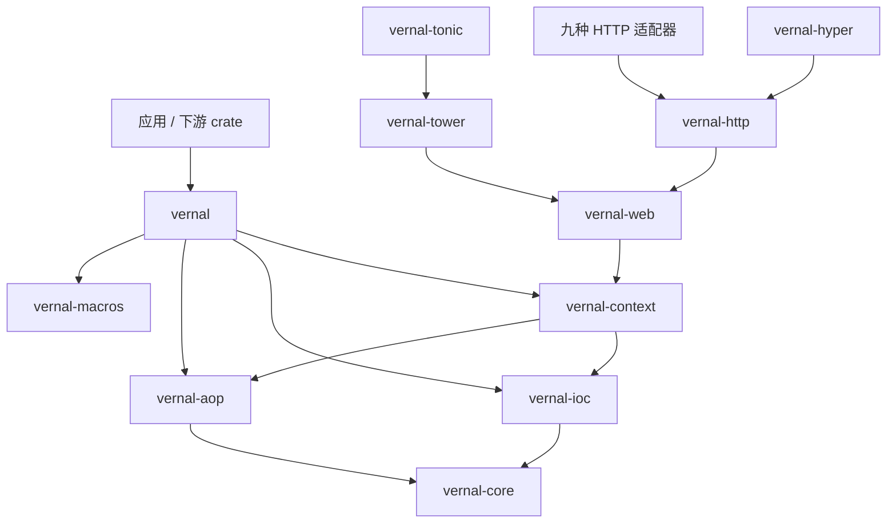
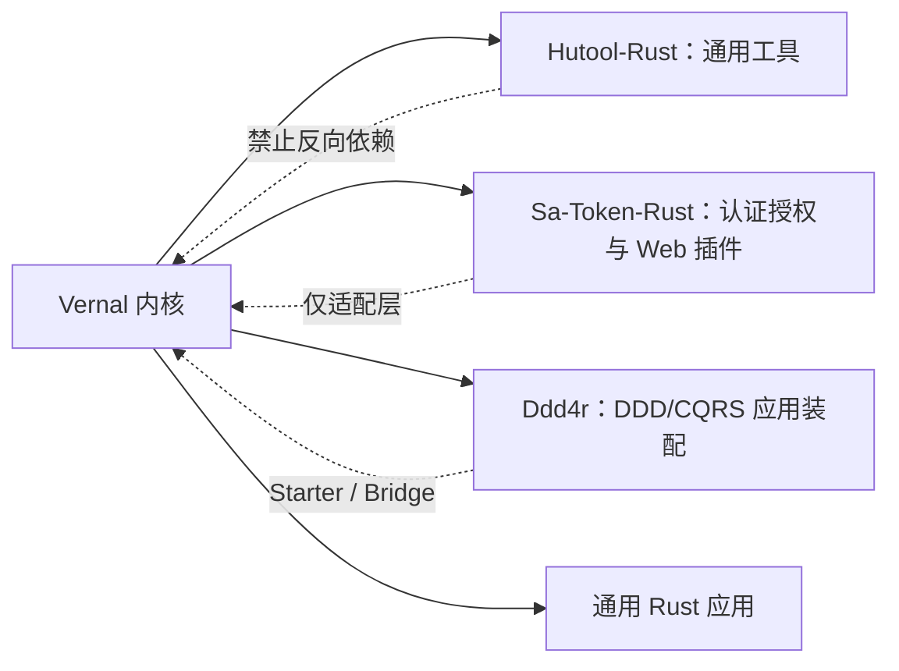

<a id="readme-top"></a>

# 句芒 · Vernal

**Vernal Framework**

**句芒是面向 Rust 生态的轻量级 IoC、AOP 与应用上下文框架。**

> **Vernal — Let components grow.**<br>
> **Grow components. Weave capabilities.**

[English](./README.md) | [简体中文](./README.zh-CN.md)

Vernal 是 **句芒** 的英文品牌。句芒在中国古代文化中与春天、草木和万物生发相联系。
这个名字不是装饰性的神话标签，而是框架模型的表达：组件从明确的依赖中生长，
能力围绕稳定合同交织，应用上下文管理它们完整的生命周期。

```text
应用组件
    │ 组件定义 + 依赖 + 拦截器
    ▼
┌──────────────────────────────────────────────────────────┐
│ 句芒 · Vernal Framework                                  │
│ IoC 内核        构建、解析、作用域、图校验                │
│ AOP 内核        匹配、组合、执行拦截器                    │
│ Context         启动、生命周期、事件、关闭                │
│ Web             Web / HTTP / 十个 Adapter                │
└──────────────────────────────────────────────────────────┘
    │ 显式端口与 Web 框架原生类型
    ▼
Hutool-Rust · Sa-Token-Rust · Ddd4r · 通用 Rust 应用
```

> **项目状态**：实验阶段。Phase 1 IoC、Tokio-first 的 Phase 2 AOP 内核、
> Phase 3 应用上下文，以及 Phase 4 Web/HTTP/Tower/Hyper 底座已有可调用实现
> 和合同测试；Axum、Actix Web、Rocket、Warp、Salvo、Poem、Ntex、Gotham、
> Tide 与 Tonic 十种适配器均已具备可运行实现，显式组件派生宏和 Context-local
> 异步 AOP 方法宏可调用但仍处实验阶段。当前尚未发布。

## 1. 愿景

Vernal 希望为 Rust 生态补齐小型基础库与完整 Web 框架之间可复用的应用基础：

- 类型驱动、可直接管理 Tokio 与框架原生对象的 IoC 内核；
- 可独立使用的 AOP 内核，负责有序、可组合的调用拦截；
- 组合 IoC、AOP、生命周期、事件和配置，但不吞并底层内核的应用上下文；
- 生成普通 Rust 代码、不隐藏反射运行时的过程宏；
- 框架中立的 Web/HTTP 合同，以及面向选定十种 HTTP/RPC 框架和下游生态的薄适配
  crate。

Vernal 借鉴 Spring 已验证的核心概念，也吸收本地 `tx-di` 源码中有价值的实现思路，
但不会逐行翻译 JVM 动态代理模型。所有权、生命周期、trait 约束、显式错误和编译期
代码生成必须保持 Rust 原生。

## 2. 名称与高级寓意

### 2.1 中文品牌：句芒

**句芒**是项目的文化身份。古代典籍以句芒对应春令与草木生发，《吕氏春秋·孟春》
有“其帝太皞，其神句芒”的记载。这一意象与框架能力形成一组完整映射：

| 文化意象 | 框架寓意 |
|:---|:---|
| 春来万物苏醒 | Context 发现定义并启动组件 |
| 根系输送养分 | 依赖显式声明并按方向解析 |
| 枝干各自生长 | IoC、AOP、适配器和消费方保持模块化 |
| 藤蔓彼此交织 | 横切能力围绕调用链有序组合 |
| 四时运行有序 | 组件遵循确定的启动和关闭生命周期 |

### 2.2 英文品牌：Vernal

`Vernal` 是“春天的、春季的、带来新生的”这一含义的英语单词，不是句芒的拼音。
中英文品牌共同表达同一个理念：

> **句芒是文化灵魂，Vernal 是面向全球 Rust 生态的技术身份。**

神话意象只存在于品牌层。公共 API 将继续使用工程师能够直接理解的英文术语，
例如 `Container`、`Component`、`Scope`、`ApplicationContext`、
`Interceptor` 和 `Invocation`，不把生僻神话名词强加给使用者。

## 3. 架构边界

Vernal 遵守四条不可退化的规则：

1. **IoC 与 AOP 是独立内核。** 二者都可以脱离应用上下文和 Web 框架单独使用。
2. **Context 只负责组合，不负责吞并。** 生命周期、事件和配置依赖内核公开合同。
3. **所有适配器向内依赖。** Web 框架、Sa-Token-Rust、Hutool-Rust 和 Ddd4r
   都不能成为底层内核依赖。
4. **Tokio-first，但不建立全局 Service Locator。** Tokio 是官方异步运行时；
   Registry、组件身份和生命周期状态仍然显式且按 Context 隔离。

详细决策、主链、失败语义和验收标准参见：

- [架构设计（简体中文）](./docs/Vernal-Architecture.zh_CN.md)
- [Architecture](./docs/Vernal-Architecture.md)
- [Web 集成架构（简体中文）](./docs/Vernal-Web-Architecture.zh_CN.md)
- [Web integration architecture](./docs/Vernal-Web-Architecture.md)
- [tx-di 原始源码快照与来源记录](./third-party/tx-di/README.md)

## 4. Workspace

| Crate | 当前状态 | 目标职责 |
|:---|:---:|:---|
| `vernal` | 实验性 Facade | Facade、prelude 与 feature 组合 |
| `vernal-core` | 实验性 | Tokio-first 框架的公共合同 |
| `vernal-ioc` | Phase 1/诊断内核已实现 | 定义、作用域、解析、依赖图和只读快照 |
| `vernal-aop` | Phase 2 内核已实现 | Send/Local Around/Next、不可变操作元数据、可组合切点代数、不可变计划和取消 |
| `vernal-context` | Phase 3/诊断内核已实现 | 应用环境、类型安全配置、条件装配、生命周期、事件、Runner、周期任务和脱敏报告 |
| `vernal-macros` | Phase 2/3 宏已实现 | 组件/配置元数据、Operation 声明与 Context-local 异步方法织入 |
| `vernal-web` | Phase 4 合同已实现 | 框架中立的 Context、请求 Scope、Handler 和错误合同 |
| `vernal-web-testkit` | Phase 4 绑定/生命周期合同已实现 | 十个 Adapter 共享 Context/Scope/组件绑定及成功、错误、Drop 清理断言 |
| `vernal-http` | Phase 4 合同已实现 | HTTP 请求、响应、Body、流、取消和背压合同 |
| `vernal-tower` | Phase 4 底座已实现 | Tower Context、请求 Scope、传播、AOP 与可配置原生错误恢复 |
| `vernal-hyper` | Phase 4 底座已实现 | Hyper 请求与 Body Frame 无损传输桥接 |

目标集成集合记录在
[`web-integration-manifest.toml`](./web-integration-manifest.toml)。十个 Adapter
crate 均已具备可运行的原生集成：

| 优先级 | 框架 | Vernal crate | 协议 | 状态 |
|:---:|:---|:---|:---|:---:|
| 1 | Axum | `vernal-axum` | HTTP + Tower | Phase 5 适配 + 严格 AOP 已实现 |
| 2 | Actix Web | `vernal-actix-web` | HTTP | Phase 5 适配 + 严格 Local-AOP 已实现 |
| 3 | Rocket | `vernal-rocket` | HTTP | Phase 5 适配 + 严格 AOP 已实现 |
| 4 | Warp | `vernal-warp` | HTTP | Phase 5 适配 + 严格 AOP 已实现 |
| 5 | Salvo | `vernal-salvo` | HTTP | Phase 5 适配 + 严格 AOP 已实现 |
| 6 | Poem | `vernal-poem` | HTTP | Phase 5 适配 + 严格 AOP 已实现 |
| 7 | Ntex | `vernal-ntex` | HTTP | Phase 5 适配 + 严格 Local-AOP 已实现 |
| 8 | Gotham | `vernal-gotham` | HTTP | Phase 5 适配 + 严格 AOP 已实现 |
| 9 | Tide | `vernal-tide` | HTTP | Phase 5 适配 + 严格 AOP 已实现 |
| 10 | Tonic | `vernal-tonic` | RPC Streaming + Tower | Phase 5 适配 + 严格 AOP 已实现 |

Axum 已提供原生 Router 装配、Context/组件/请求 Scope 提取器、匹配路由操作
身份和 fail-closed AOP 装配；Actix Web 已提供 App Data/Extension 提取器，以及
Scope 跟随响应 Body 的原生
`Transform`/`Service`。严格中间件在路由匹配后包裹具体 `Resource`，以低基数
资源模式建立操作身份，并通过 Local-AOP 链驱动完整的 `Rc`、非 `Send` Service
Future；缺少路由元数据或计划时 fail-closed，同时保留 Actix 原生错误。Rocket
已提供 Managed State、Request Guard、Body 感知 Fairing，以及包裹未修改 Route
Handler 的严格 Send-AOP；`routes![...]` 在 mount 前批量织入并保留路由元数据，
操作身份取自 Rocket 自有 URI 模板与真实方法，Success/Error/Forward Outcome
保持原生语义；Warp 已通过官方 Tower Service 边界提供原生 Extension Filter
和严格 Send-AOP。由于 Warp 不公开匹配后的模板，每个具体 Filter Service
显式接收完整低基数路由模式；真实方法与 owned 请求快照进入调用计划，缺少模式
或计划时 fail-closed，策略失败映射成 Warp 原生响应且不执行 Filter；
Salvo 已提供原生 Hoop、类型化 Depot 访问、Frame/Trailer 保真的 Body 释放，
以及覆盖完整 Handler 链的严格 Send-AOP。操作身份取自 Salvo 匹配后的低基数
路径和真实 HTTP 方法，请求上下文携带 owned 快照；缺少元数据或计划时
fail-closed，原生响应保持不变，借用型 Handler Future 通过
`BorrowedInvocationTarget` 执行而不克隆框架对象；
Poem 已提供原生 `Middleware`/`Endpoint` 组合、类型化
Context/组件/Scope/RequestContext 提取器、Body 绑定释放，以及覆盖完整
Endpoint Future 的严格 Around AOP；操作身份取自 Poem 匹配后的低基数
`PathPattern`，缺少元数据或计划时 fail-closed，并保留 Poem 原生错误。Ntex
已提供原生 `Middleware`/`Service`、App State/Extension 提取器和
`MessageBody` 绑定请求 Scope。由于 Ntex 公共请求 API 不暴露匹配后的
`ResourceDef`，严格中间件必须包裹具体 `web::resource(...)`，并显式接收相同的
低基数完整路径模式；HTTP 方法取自真实请求，完整 Worker-local Service Future
通过 `BorrowedLocalInvocationTarget` 执行。缺少计划时 fail-closed，请求不会
被克隆，Ntex 原生 Service 错误仍保持原生语义；Gotham 已提供原生
`StateData`、类型安全 State 扩展、Pipeline Middleware、Frame/Trailer
保真的 Body 释放，以及覆盖完整 Pipeline Chain 的严格 Send-AOP。具体 Pipeline
显式接收完整低基数路由模式，owned 请求元数据跨异步链传播；缺少模式或计划时
fail-closed，原生 `HandlerError` 的状态码与错误源保持不变；Tide 已提供原生
`Middleware`、类型化 Request Extension
访问、响应 Reader 绑定的 Scope 释放，以及覆盖完整 Middleware/Endpoint 链的
严格 Send-AOP。Tide 只暴露路由参数值而不暴露匹配模板，因此严格中间件显式
接收同一条低基数完整路径模式，结合真实方法并携带跨 HTTP 模型的 owned 快照；
缺少模式或计划时 fail-closed，原生响应通过 `BorrowedInvocationTarget` 保持；
Tonic 已提供 Context Interceptor、
类型化 Request 扩展、精确 Service/Method 操作身份、稳定 `Status` 映射和
fail-closed AOP Tower Layer。

这里的“十种”是基于本地源码集成并集和当前 registry 可用性形成的版本化覆盖优先级，
不是对全世界 Rust 框架热度的绝对排名。Tonic 明确属于 RPC 集成；Tower 和 Hyper
属于公共底座，不冒充应用层 Web 框架。

目标依赖方向：



## 5. IoC 快速开始

```rust
use std::{error::Error, sync::Arc};
use vernal_ioc::{ComponentDefinition, RegistryBuilder};

type AnyError = Box<dyn Error + Send + Sync + 'static>;

struct Config {
    name: &'static str,
}

struct Service {
    config: Arc<Config>,
}

fn main() -> Result<(), AnyError> {
    let mut registry = RegistryBuilder::new();
    registry.register(ComponentDefinition::singleton::<Config, _>(|_| Config {
        name: "vernal",
    }))?;
    registry.register(
        ComponentDefinition::try_singleton::<Service, _>(
            |resolver| -> Result<Service, AnyError> {
                Ok(Service {
                    config: resolver.resolve::<Config>()?,
                })
            },
        )
        .depends_on::<Config>(),
    )?;

    let container = registry.build()?.container();
    let service = container.resolve::<Service>()?;
    assert_eq!(service.config.name, "vernal");
    Ok(())
}
```

工厂只能解析定义中显式声明的依赖。Registry 在创建 `Container` 前完成图校验；
Singleton 状态属于具体 Container，而不是进程级全局 Store。

任何满足 `Send + Sync + 'static` 的 Rust 值都可以成为组件，包括
`reqwest::Client`、数据库连接池、Tower Service、框架 State、Tokio 同步原语和
业务对象。具体框架依赖由注册它们的应用或集成 crate 持有。

Trait Object 通过显式、类型安全的绑定进入同一依赖图：

```rust
use vernal_ioc::{Component, TraitBinding};

registry.register_bundle(
    [EmailSender::definition()],
    [TraitBinding::new::<dyn MessageSender, EmailSender, _>(
        |sender| sender,
    ).primary()],
)?;
```

`Arc<dyn MessageSender>` 字段由 Component 宏注入唯一或 Primary 实现，
`#[component(qualifier = "email")]` 选择命名实现，
`Vec<Arc<dyn MessageSender>>` 注入全部实现。绑定仍指向原始组件实例，不建立
第二套 Store；模块定义与绑定通过 `register_bundle` 原子提交。

只需要在构造时选择“零或一个”组件时，直接使用 Rust 原生
`Option<Arc<T>>` 或 `Option<Arc<dyn Trait>>`：

```rust
#[derive(vernal_macros::Component)]
struct OptionalExtensions {
    metrics: Option<Arc<Metrics>>,
    sender: Option<Arc<dyn MessageSender>>,
    #[component(qualifier = "strict")]
    policy: Option<Arc<SecurityPolicy>>,
}
```

Option 依赖仍是 eager 图边：候选存在时参与拓扑排序并在消费组件构造时解析；
只有零候选得到 `None`。多个候选、工厂失败、Trait 投影和 Scope 错误保持
fail-closed。可选性已经由字段类型表达，因此不需要
`#[component(optional)]`；该属性只用于下面的延迟 Provider。

需要按调用取得 Transient、可选扩展或当前请求 Scope 时，组件可以声明受限
Provider：具体类型使用 `ComponentProvider<T>`，Trait 端口使用
`TraitProvider<dyn Trait>`：

```rust
#[derive(vernal_macros::Component)]
struct JobFactory {
    jobs: vernal_ioc::ComponentProvider<Job>,
    #[component(optional)]
    extension: vernal_ioc::ComponentProvider<Extension>,
    sender: vernal_ioc::TraitProvider<dyn MessageSender>,
    #[component(qualifier = "email")]
    email_sender: vernal_ioc::TraitProvider<dyn MessageSender>,
}
```

Provider 的目标类型、qualifier 和 optional 语义都会写入同一依赖图：required
目标缺失或候选歧义会在 Registry 构建期失败，optional 只允许零候选，不会吞掉
歧义、构造或 Scope 错误。Provider 不提供任意类型查询；`get()` 按次取得
Transient，`get_in(&scope)` 显式使用调用方当前 Scope，并复用原 Container 的
Singleton/Scope 缓存。它是一条经过建图校验、在调用时才构造目标的延迟依赖边，
不是全局 Service Locator。`TraitProvider` 复用 `TraitBinding` 的唯一候选、
Primary 与 qualifier 选择规则，并返回绑定指向的原始组件实例；需要一次取得全部
实现时，仍使用急切注入的 `Vec<Arc<dyn Trait>>`。

启用 AOP 的组件显式持有 Context-local 计划目录与取消令牌。方法宏支持普通
`&self` 借用方法，也保留需要 owned `'static` 目标的 `self: Arc<Self>` 路径：

```rust
use std::sync::Arc;
use vernal_aop::{CancellationToken, InvocationError, InvocationPlanCatalog};

#[derive(vernal_macros::Component)]
#[component(aop)]
struct OrderService {
    invocation_plans: Arc<InvocationPlanCatalog>,
    cancellation: Arc<CancellationToken>,
}

impl OrderService {
    #[vernal_macros::intercept(
        component = "OrderService",
        tags = ["secured", "transactional"],
        qualifier = "command"
    )]
    async fn create(&self, order_id: &u64) -> Result<u64, InvocationError> {
        Ok(*order_id)
    }
}
```

应用装配直接登记方法宏生成的精确声明，不重复书写操作身份或元数据：

```rust
application.operation(vernal_macros::operation!(OrderService::create));
```

`&self` 与 `&mut self` 路径允许 owned 或引用参数，并通过 `invoke_borrowed`
把业务 Future 严格限制在当前 `.await`；`self: Arc<Self>` 路径要求 owned 参数
并生成 `'static` 目标。type、lifetime 与 const 泛型方法沿用同一 Operation
身份；每次单态化调用仍按实际返回类型完成安全恢复。三种接收器都不使用反射、
全局查找、unsafe 生命周期扩展或隐式克隆。

`&mut self` 要求调用方能够取得独占引用，因此最适合唯一持有的 Transient 组件；
被 Container 缓存并以 `Arc<T>` 共享的 Singleton 通常应使用锁、原子类型或 Channel
表达内部可变性，而不是绕过 Rust 的共享所有权。
`operation!(Type::method)` 属于显式 Context 装配，不是 classpath 扫描或全局
inventory，并让方法身份、标签和 qualifier 只有一个事实来源。

带默认方法体的异步 Trait 方法使用同一织入模型，业务 Trait 本身无需继承
`AopComponent`；宏只给该方法添加 `Self: AopComponent` 调用边界。应用使用
`operation!(<Service as Port>::method)` 精确选择 Trait 描述符，避免多个端口出现
同名方法时产生歧义。抽象 Trait 方法没有最终业务目标，必须在具体 impl 方法上
使用 `#[intercept]`。Trait 方法显式声明 `component` 时多个实现共享逻辑操作名；
未声明时默认使用最终实现类型名。

Send 与 Local 拦截器都可以作为普通 IoC 组件管理。应用先注册拦截器定义，再通过
`advisor_component::<AuditInterceptor, _>(pointcut, order)` 声明切面；Context
会使用最终应用 Container 构造拦截器并注入其 Tokio、Environment 或业务依赖，
随后一次性封存 `InvocationPlanCatalog`。运行期计划直接持有同一个 Singleton，
不再查询 Container，也不使用 tx-di 的全局实例指针表。缺失或构造失败会在
`build()` 阶段 fail-closed。`local_advisor_component` 使用相同模型，只有每次
Local 调用产生的 Future、目标与返回值保持 `!Send`。组件 Advisor 必须声明为
Singleton；Transient 或自定义 Scope 会在构建期被拒绝，避免调用计划意外延长
短生命周期实例的存活时间。

已冻结 Registry 和运行中的 Context 都提供拥有自身数据的只读诊断快照：

```rust
let registry_snapshot = context.container().registry().snapshot();
let startup_report = context.startup_report().await;
let json = serde_json::to_string(&startup_report)?;
```

`RegistrySnapshot` 复用真实构建计划，不重复执行拓扑算法；`StartupReport` 记录
版本、MSRV、Scope/依赖摘要、AOP 计划槽位和生命周期耗时。失败报告只保存组件名、
阶段和成功/失败分类，不序列化底层业务错误正文。请求 Scope 的运行期清理失败
只追加去重后的静态代码 `web.request-scope.cleanup-failed`；响应已被 Drop、
无法再返回原生错误时也能留下 Context-local 诊断证据。Scope 清理由取消安全的
Tokio 协调任务负责：某个等待者被丢弃或等待超时都不会遗弃关闭钩子。作为应用
内建组件注册的 `ScopeCleanupPolicy` 默认让应用拥有的 Scope 最多等待 30 秒；
等待超时后协调器仍在后台继续完成清理。受管任务执行或停机失败同样只追加
`context.managed-task.shutdown-failed`，任务错误正文只存在于调用方显式取得的
错误链。`ApplicationContext::close()` 同样由唯一 Tokio 协调任务持有：取消某个
关闭等待者不会遗弃组件 `stop`，并发调用者观察同一结果，单个钩子 panic 也不会
阻止后续组件继续释放。服务主入口可以等待 `run_until_cancelled()`，让受管任务
失败驱动 Context 完整进入 `Closed`；也可以等待 `run_until_shutdown_signal()`，
在应用取消与 Ctrl-C、Unix SIGTERM/SIGHUP、Windows 控制台信号之间竞速。
`SystemShutdownSignalListener` 是普通可注入组件；OS 信号会先发布成类型化
`ApplicationShutdownSignal` 事件再取消应用，信号注册失败则转成结构化错误并
执行保守关闭。

普通 IoC Singleton 组件还可以实现 `ApplicationEventListener<E>`，再通过
`event_listener::<E, L>()`、条件模块或 `ApplicationModuleRegistrar` 声明监听关系。
Vernal 在 `refresh()` 中先预热容器，按依赖计划解析监听器并完成全部类型化
broadcast 订阅，随后才调用任何 Lifecycle `initialize()`，因此初始化阶段发布的
事件也不会丢失。每个监听器拥有独立 Receiver，并作为
`ManagedTaskSupervisor` 受管任务运行。处理错误或 broadcast lag 都是 fail-fast
数据一致性失败：监督器记录结构化 `EventListenerError`、取消应用，原始根因只从
显式错误链暴露。Context 取消与关闭沿同一两阶段任务策略停止并排空监听器。
监听组件必须是 Singleton，Vernal 不会把 Transient 或自定义 Scope 静默提升为
应用级对象。

Context 会在状态成功提交后，通过同一 EventBus 发布两个框架事实：全部 Singleton
预热、监听订阅和 Lifecycle 初始化完成并提交 `Refreshed` 后发布
`ApplicationRefreshedEvent`；全部必要组件启动、一次性 Runner 成功且周期任务被
Context 任务监督器接受并提交 `Ready` 后发布
`ApplicationReadyEvent`。发布只负责把不可变事实放入队列，不是启动屏障，也不
保证不同监听器的完成顺序。监听器失败因此通过受管任务取消和关闭错误链异步暴露；
refresh/start 失败则不会发布对应事实。Vernal 刻意不提供语义虚假的 Closed
事件：任务排空后已没有监听器，取消前发布又无法诚实保证关闭投递完成。

普通 Singleton 组件还可以实现 `ApplicationRunner`，表达一次性启动工作。
Vernal 从最终 Container 解析 Runner，在全部 Lifecycle `start()` 成功后、
提交 `Ready` 前，按依赖计划顺序串行执行。这适合 Sa-Token-Rust 安全缓存预热、
Ddd4r 投影恢复检查和 Hutool-Rust 资源/索引预加载，但领域实现仍归消费方所有。
Runner 接收应用取消树的子令牌，并复用生命周期 start/abort 预算；错误、panic、
超时或应用取消会阻止后续 Runner 并触发完整逆序回滚。长期 Worker 必须提交给
`ManagedTaskSupervisor`，不能在 Runner 内 detach。直接、限定符、应用模块与
条件模块四条注册路径共享同一校验和排序语义。

长期周期工作可以由 IoC Singleton 实现 `ScheduledTask`。`TaskSchedule` 提供经过
非零间隔校验的固定延迟与固定频率计划，并支持初始延迟；同一任务永不重叠执行，
固定频率任务会跳过错过的时刻而不是突发补跑，不同任务组件则可以并发。Vernal 在
Runner 之后、`Ready` 之前按依赖计划顺序激活任务，再把句柄、取消、panic、错误、
优雅等待和有界 abort 全部交给现有 `ManagedTaskSupervisor`。激活只表示监督已经
建立，不表示首次执行成功；影响就绪的工作仍应使用 `ApplicationRunner`。该底座
可承载 Sa-Token-Rust 会话清理、Ddd4r Outbox/投影轮询和 Hutool-Rust 缓存维护，
但作业持久化、Cron、脚本执行和领域重试策略不会进入 Vernal。

高层建造器还会注册 Context-local `ApplicationEnvironment`：
应用显式添加 `PropertySource` 并声明高低优先级和 Profile，组件可以读取
`${key:default}` 占位符或转换成 `u16`、`bool` 等 Rust 类型。TOML、YAML、
Hutool `.setting`、进程环境变量和配置中心仍由 Adapter 加载；Vernal 不建立
tx-di 式全局配置，也不会在启动报告中序列化属性键和值。
`#[derive(ConfigurationProperties)]` 可以从显式前缀绑定已知 Rust 结构体，
支持必填、可选、默认值、字段改名与嵌套配置。绑定结果是声明
`ApplicationEnvironment` IoC 依赖的普通 Context-local Singleton：

```rust
#[derive(vernal::macros::ConfigurationProperties)]
#[configuration(prefix = "service", rename_all = "kebab-case")]
struct ServiceProperties {
    port: u16,
    token: Option<String>,
    #[configuration(default)]
    graceful_shutdown: bool,
}

application.configuration_properties::<ServiceProperties>()?;
```

纯 `Container` 会在首次解析该 Singleton 时绑定；`ApplicationContext::refresh()`
会预热全部 Singleton，所以应用模式会在进入 `Refreshed` 前校验配置并快速失败。
绑定错误只公开配置类型、Rust 字段、属性键和结构化原因，不包含属性值。
消费方 Bridge 可以实现 `ApplicationModule`，通过隔离 Registrar 把组件定义、
Trait Binding、生命周期、受管事件监听器、Send/Local Advisor、Operation、PropertySource 与
Profile 组织成一个具名装配单元，也可以携带显式
`ConditionalComponentModule`，让按 Profile/Property 启用的组件读取同一份最终
Environment。`register_module` 会先预检条件身份、克隆 Environment 与原子 IoC
Bundle，再一次提交全部贡献；配置、条件、环境或定义任一失败，真实应用建造器都
保持不变。模块只能由 Rust 代码显式安装，不进行 classpath 式发现或进程级全局注册。
`ConditionalComponentModule` 可以把组件定义、Trait Binding、生命周期登记与事件监听声明
绑定到同一个 `ProfileCondition`、`PropertyCondition` 或自定义
`PredicateCondition`。条件只在 Environment 冻结后、依赖图校验前求值一次：
命中模块原子提交，未命中模块不会留下半条 Binding 或生命周期登记，两类结果都
进入不含属性键和值的启动报告。这是 Rust 显式应用装配，不是 classpath 扫描或
Spring Boot 式隐式自动配置。`refresh()` 与
`start()` 由另一个 Context-local Tokio 协调器
持有：取消等待者不会遗弃初始化或启动，任一阶段收到应用取消都会执行结构化回滚，
而不会错误发布 `Ready`。每个 initialize/start/stop 钩子还受
`LifecycleExecutionPolicy` 约束：默认单钩子 30 秒、abort 后收口 1 秒；超时
返回结构化生命周期错误，stop 超时也会继续逆序释放其他组件。钩子必须保持异步
并主动让出 Tokio 执行权，abort 无法强制终止异步 task 内的永久阻塞调用或无让
出点死循环。

## 6. 能力状态

| 能力 | 目标合同 | 状态 |
|:---|:---|:---:|
| 类型化组件定义 | 构造器注入与显式元数据 | Phase 1 |
| 作用域 | Singleton、Transient、类型化自定义 ScopeContext、取消安全清理与 IoC 驱动的 WebRequestScope | Phase 1.2/4 内核 |
| 依赖图 | 确定性顺序及缺失、歧义、循环结构化诊断 | Phase 1 |
| Trait 绑定 | 不依赖字符串查找的命名、Primary 和多实现绑定 | Phase 1.1 内核 |
| 类型安全可选依赖与 Provider | `Option<Arc<T>>` 立即注入，以及具体类型/Trait 绑定的 Transient/optional/qualifier/显式 Scope 延迟解析 | Phase 1.3 内核 |
| 拦截器链 | 有序 Around/Next、IoC 管理拦截器、短路及结果/错误改写 | Phase 2/3 内核 |
| 切点 | 操作匹配并编译成不可变调用计划 | Phase 2 内核 |
| ApplicationContext | Tokio 持有 refresh/start/close、系统信号关闭、有界生命周期钩子、确定性回滚和 Context-local 类型化事件 | Phase 3 内核 |
| 受管 Tokio 任务 | Context 持有任务句柄、失败取消、优雅等待、有界 abort 与共享停机结果 | Phase 3 内核 |
| 应用环境 | 显式 PropertySource 优先级、Profile、占位符、类型化读取与脱敏快照 | Phase 3 内核 |
| 类型安全配置对象 | 基于前缀派生绑定必填/可选/默认/嵌套字段、错误脱敏与原生 IoC 注入 | Phase 3 内核 |
| 显式应用模块 | 为消费方 Bridge 原子装配 Definition/Binding/生命周期/监听器/Runner/周期任务/AOP/Operation/Environment/条件模块 | Phase 3 内核 |
| 条件组件装配 | 构建期 Profile/Property/自定义条件，组件定义、Binding、生命周期、监听器、Runner 与周期任务原子进退 | Phase 3 内核 |
| 事件 | Context 内类型化发布、Refreshed/Ready 事实及 IoC 托管的 fail-fast 监听器 | Phase 3 内核 |
| 应用 Runner | Ready 前按依赖顺序执行一次性启动工作，支持取消、超时、panic 隔离与回滚 | Phase 3 内核 |
| 周期任务 | 固定延迟/频率计划、依赖顺序激活、单任务非重入、失败取消与受管关闭 | Phase 3 内核 |
| 异步集成 | Tokio 原生取消、deadline 与类型化调用上下文 | Phase 2 内核 |
| Web 上下文 | 请求 Context、请求 Scope、Handler 调用和错误映射 | Phase 4 合同 |
| HTTP | 请求/响应、Body Frame/Trailer、显式限量收集、取消和背压 | Phase 4 合同 |
| Web 集成底座 | Tower Context/Scope Layer 与 Hyper 流式桥接 | Phase 4 底座 |
| 跨框架合同 | 同 Scope 组件身份及成功、策略错误、响应 Drop 清理 | Phase 4 公共合同 |
| 框架适配器 | 能复用 Tower 时优先 Tower，必要时原生适配 | Phase 5 适配已实现 |
| 诊断 | 可序列化 Registry/Context 快照与脱敏运行期清理告警 | Phase 3/4 诊断内核 |

“Phase 1”和“Phase 2 内核”表示已有可调用实现与合同测试，但 API 仍处于实验
阶段。任何标签都不代表稳定兼容或达到跨机器性能指标；Adapter 自动探测和稳定
硬件回归阈值仍待后续实现。

## 7. 生态定位



- **Hutool-Rust** 继续承担通用工具库职责，可以消费 Vernal 能力，但 Vernal
  不成为 Hutool-Rust 的子模块。消费方 `hutool-vernal` 已把 `HttpConfig` 与
  Tokio/Reqwest `HttpClient` 收敛为具名 `ApplicationModule`；
  `HutoolApplicationModule` 还能把该 HTTP 依赖图、多份不可变 Setting 来源及
  Active/Default Profile 作为一个事务装配。`HutoolSettingPropertySource` 把
  Profile/Setting 文档冻结为 Vernal Environment 快照，分组键显式扁平化，
  冲突按 fail-closed 拒绝。
- **Sa-Token-Rust** 是唯一保留的安全集成目标，继续拥有认证、Session 和
  授权语义；Vernal 只提供组件生命周期与拦截编排，不重复建设安全内核。由
  Sa-Token-Rust 持有的 `sa-token-vernal` 已实现 `HttpRequestSnapshot` 适配、
  `SecurityPrincipal` 投影及跨 Tokio Future 的请求级 `SaTokenContext`；
  `SaTokenComponents` 是具名 `sa-token.security` `ApplicationModule`，把调用方
  原始 Manager、Bridge、操作授权策略及 Send/Local 两类安全 Advisor 作为一个
  事务安装；模块名或组件定义冲突时完整回滚，不遗留残缺调用计划。拦截器在
  Handler 前认证并执行角色/权限 all/any 规则，以及 Sa-Token 全局/前缀通配符
  语义，以稳定 401/403 短路。
  `VernalSaTokenConfigBinder` 还会把不可变 Environment 映射到 Sa-Token 原生
  Builder，但不接管 Storage、Listener、Manager 或 Runtime 构造。
- **Ddd4r** 通过消费方持有的 `ddd4r-vernal` 直接注册原生 `Registry` 和
  `DefaultCommandBus`，并以隔离快照进入 Ddd4r 自己的 Tokio task-local
  `ContextScope`；聚合、事件、CQRS、Repository、Outbox 和事务语义仍归 Ddd4r。
- **Web 框架** 继续拥有路由、Request/Response 类型、传输限制和服务器生命周期。

## 8. 本地开发

前置条件：

- 声明的 MSRV：Rust `1.85.0` 或更高版本
- 支持 Edition 2024 与 Resolver 3 的 Cargo

本轮本地门禁使用 Rust `1.97.1` 执行，并已显式通过
`cargo +1.85.0 check --workspace --all-targets`。独立 MSRV CI 尚待建设，因此
这项本地结果仍不是发布级兼容性承诺。

已验证的 Workspace 命令：

```bash
cargo fmt --all -- --check
cargo check --workspace --all-targets
cargo clippy --workspace --all-targets -- -D warnings
cargo test --workspace
cargo doc --workspace --no-deps
```

公共合同仍在设计期间，Workspace 有意统一设置为 `publish = false`。当前没有
crates.io 安装命令，也没有稳定 API 承诺。

## 9. 路线图

| 阶段 | 交付物 | 退出证据 |
|:---|:---|:---|
| Phase 0 | 品牌、架构和 Workspace 边界 | 文档与 Workspace 门禁通过 |
| Phase 1 | `vernal-core` + `vernal-ioc` 最小内核 | 依赖图、作用域和解析测试 |
| Phase 2 | `vernal-aop` + 宏 | 顺序、错误、异步和编译失败测试 |
| Phase 3 | `vernal-context` 生命周期和事件 | 启动、回滚和关闭测试 |
| Phase 4 | Web/HTTP 合同、Tower/Hyper 与十个 Adapter | 跨框架一致性测试套件 |
| Phase 5 | Hutool-Rust、Sa-Token-Rust 和 Ddd4r 桥接 | 由消费方拥有的集成示例 |
| Phase 6 | Preview 发布 | MSRV、SemVer、安全、docs.rs 和打包门禁 |

Phase 5 正在进行：Sa-Token-Rust 已远端集成 `sa-token-vernal` 认证、操作授权
AOP 与 Environment 配置绑定；其具名应用模块会原子安装原生安全组件图和两个
执行平面，12 个 Bridge 测试与 2 个配置绑定测试通过。Hutool-Rust 已远端集成
`hutool-vernal`，通过
具名应用模块原子装配 HTTP 组件、Setting PropertySource 与 Profile；Ddd4r 本地
已实现 `ddd4r-vernal`，其真实 Tokio 测试、Clippy 和文档构建已在独立依赖图通过。
Ddd4r 全 Workspace 门禁仍被既有、当前不可获取的 `rbatis-r2dbc` Git Revision
阻断，不能据此宣称全仓通过。

Phase 1/1.1/1.2/1.3 已通过 55 个 IoC 合同测试，覆盖 1,000 节点确定性规划、
结构化图诊断、并发 Singleton、双 Container 隔离、Transient、原生对象、
立即 Option 可选依赖、具体类型/Trait Provider、Trait 命名/Primary/全部实现、
Trait 图环、跨定义/绑定原子模块注册，以及稳定 Registry 序列化快照，并覆盖每
Container 隔离的成功解析追踪、确定性未使用定义快照和失败 Scope 解析不误报。
其中 9 项自定义 Scope 合同进一步覆盖同 Scope 并发一次构造、兄弟
隔离、父子生命周期方向、Container 所有权、取消传播、失败后继续逆序清理，以及
关闭等待已开始工厂、等待者取消安全、有界等待后后台完成、钩子间 panic 隔离。
Phase 2 AOP 内核现有 11 个 Send 合同测试，覆盖顺序进入/逆序退出、短路、成功结果
与错误改写、跨 `.await` 类型化上下文、取消/deadline、切点选择和 64 task
并发共享计划、借用型非静态目标、计划目录合并与一次封存；另有 6 个 Local-AOP 测试覆盖
非 `Send` 返回值、顺序、短路、取消、计划目录和借用型本地目标；另有 4 个
切点代数合同测试，覆盖精确 Operation、组件、方法切点，AND/OR/NOT 组合、
闭包互操作与逻辑短路求值；另有 6 个操作元数据合同测试，覆盖标签校验与去重、
qualifier、身份/声明分离、元数据切点、Send/Local 计划投影，以及冲突声明的
fail-closed 构建。宏前端运行合同覆盖 `self: Arc<Self>`、借用 `&self` 与独占
`&mut self` 方法织入，type/lifetime/const 泛型的 owned 与 borrowed 路径，
静态标签/qualifier 描述符投影及类型驱动自定义 Scope；compile-fail 矩阵覆盖
非法组件字段、非法集合 qualifier、非异步方法、裸 `self` 接收器、非法操作元数据
与错误描述符路径，并验证 Trait 默认方法、纯 Trait 边界、UFCS 描述符、抽象方法
拒绝和非 AOP 实现调用拒绝。新增 trybuild 矩阵把 owned、共享引用、可变引用和
返回值的 `Send`/`Sync`/生命周期要求分别命名为稳定 Vernal 传输合同，并验证
关联输出可以正向编译。AOP 已增加直接 async、空计划、一个及四个透传
拦截器的 Criterion 0.7 Tokio 基准；本机首轮中位估计分别为 2.55 ns、336 ns、
476 ns 和 727 ns。该结果只用于绝对成本与链长度趋势分析，不承诺跨硬件 SLA，
也不作“零开销”宣传。宏 API 稳定性与稳定硬件回归阈值仍待完成。
Phase 3 内核现有 81 个测试，覆盖依赖顺序启动、逆序关闭、initialize/start
回滚、非法状态转换、幂等关闭、并发关闭串行化和 Context-local 类型化事件
隔离、IoC 托管监听器所有权/失败，以及状态提交后如实发布 Refreshed/Ready
事实，并覆盖应用 Runner 的依赖顺序、模块/条件/限定符装配、错误短路、
超时/panic 隔离、脱敏和回滚，并覆盖固定延迟/固定频率计划校验、周期执行非重入、
错过时刻跳过、依赖计划激活诊断、受管失败/panic 取消、模块/条件/限定符装配与
关闭；还覆盖高层构建器十一类内建资源注入、应用 Scope
取消树、任务错误/panic 传播、
取消安全的共享任务停机、超时 abort、任务先于组件 stop 的顺序、关闭等待者取消
后的继续释放、refresh/start 等待者取消后的继续回滚、start 前应用取消、任务
失败驱动 `run_until_cancelled()` 关闭、initialize/start 有界超时回滚、stop
超时后继续逆序释放、类型化关闭信号发布、应用取消优先结束 OS 信号等待，
PropertySource 优先级、Profile、类型转换、嵌套占位符、循环/来源失败，以及
构建期 Profile/Property/自定义条件、条件定义与生命周期原子进退、缺失依赖
fail-closed、条件错误脱敏，以及成功/失败启动报告的只读性、序列化、环境属性值
隔离、stop 钩子 panic 隔离和业务错误正文脱敏，并验证 Send/Local IoC 管理
拦截器的依赖注入、与直接 Advisor 的稳定统一顺序、缺失组件 fail-closed 及
非 Singleton Advisor 作用域拒绝，并覆盖显式 ApplicationModule 安装、贡献顺序、
全能力成功装配、配置/Environment/Definition 失败原子回滚、错误脱敏、身份校验、
重复拒绝及预检失败后的同名重试，并验证内嵌条件模块读取同一暂存 Environment，
条件身份非法或重复时整个外层模块回滚。

Phase 4 已把 `WebRequestScope` 收敛为 IoC `ScopeContext` 的 Web 门面，十个
Adapter 的组件提取器均在当前请求 Scope 内解析 Singleton、Transient 或请求级
组件。`vernal-web-testkit::WebAdapterContract` 已被十个 Adapter 共同调用，
验证原生 Context、Scope 所有权、Scope 身份、Open/取消状态及二次解析的
组件 `Arc` 身份。`ScopeCloseProbe` 与 `ScopeRejectingInterceptor` 还让十个
Adapter 共同验证正常 Body 完成、策略短路和响应 Body Drop 后由 Adapter 自身
关闭真实 Scope，testkit 不参与清理。十个 Adapter 现在还分别以原生
`http-body`、字节 `Stream`、Tokio `AsyncRead` 或 Futures IO `AsyncRead`
触发上游流错误，验证 Adapter 会先异步关闭 Scope，再恢复原始传输失败；共享
失败源仍不持有 Scope。客户端断连、释放超时、Security 集成和其余失败矩阵仍按
架构清单继续补齐。

## 10. 贡献与许可证

当前阶段以架构文档作为实现合同。新增代码必须先确定所属 crate、依赖方向、
失败语义和验收证据。不能仅仅为了让适配器更容易编写，就把 Web 框架依赖加入内核。

Vernal 使用 [MIT License](./LICENSE-MIT)。

---

**Vernal — Let components grow.**

[返回顶部](#readme-top)
