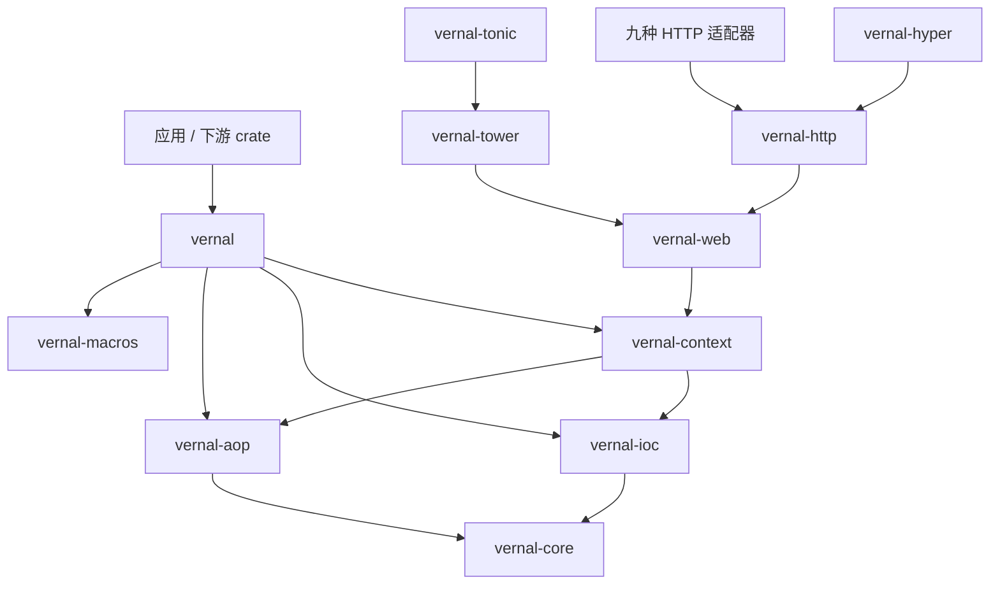
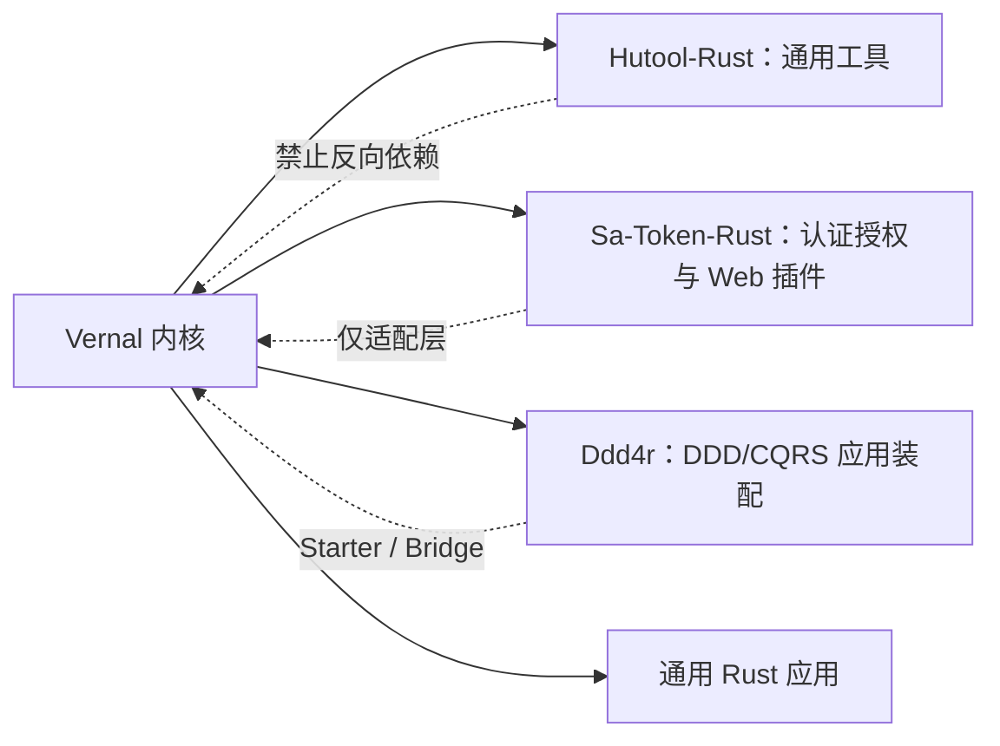

<a id="readme-top"></a>

# 句芒 · Vernal

**Vernal Framework**

**句芒是面向 Rust 生态的轻量级 IoC、AOP 与应用上下文框架。**

> **Vernal — Let components grow.**<br>
> **Grow components. Weave capabilities.**

[English](./README.md) | [简体中文](./README.zh-CN.md)

Vernal 是 **句芒** 的英文品牌。句芒在中国古代文化中与春天、草木和万物生发相联系。
这个名字不是装饰性的神话标签，而是框架模型的表达：组件从明确的依赖中生长，
能力围绕稳定合同交织，应用上下文管理它们完整的生命周期。

```text
应用组件
    │ 组件定义 + 依赖 + 拦截器
    ▼
┌──────────────────────────────────────────────────────────┐
│ 句芒 · Vernal Framework                                  │
│ IoC 内核        构建、解析、作用域、图校验                │
│ AOP 内核        匹配、组合、执行拦截器                    │
│ Context         启动、生命周期、事件、关闭                │
│ Web             Web / HTTP / 十个 Adapter                │
└──────────────────────────────────────────────────────────┘
    │ 显式端口与 Web 框架原生类型
    ▼
Hutool-Rust · Sa-Token-Rust · Ddd4r · 通用 Rust 应用
```

> **项目状态**：实验阶段。Phase 1 IoC 已实现，Tokio-first 的 Phase 2 AOP
> 内核也已提供可调用的 `Around + Next` 链；宏、应用上下文和框架适配器仍是
> 骨架。当前尚未发布。

## 1. 愿景

Vernal 希望为 Rust 生态补齐小型基础库与完整 Web 框架之间可复用的应用基础：

- 类型驱动、可直接管理 Tokio 与框架原生对象的 IoC 内核；
- 可独立使用的 AOP 内核，负责有序、可组合的调用拦截；
- 组合 IoC、AOP、生命周期、事件和配置，但不吞并底层内核的应用上下文；
- 生成普通 Rust 代码、不隐藏反射运行时的过程宏；
- 框架中立的 Web/HTTP 合同，以及面向选定十种 HTTP/RPC 框架和下游生态的薄适配
  crate。

Vernal 借鉴 Spring 已验证的核心概念，也吸收本地 `tx-di` 源码中有价值的实现思路，
但不会逐行翻译 JVM 动态代理模型。所有权、生命周期、trait 约束、显式错误和编译期
代码生成必须保持 Rust 原生。

## 2. 名称与高级寓意

### 2.1 中文品牌：句芒

**句芒**是项目的文化身份。古代典籍以句芒对应春令与草木生发，《吕氏春秋·孟春》
有“其帝太皞，其神句芒”的记载。这一意象与框架能力形成一组完整映射：

| 文化意象 | 框架寓意 |
|:---|:---|
| 春来万物苏醒 | Context 发现定义并启动组件 |
| 根系输送养分 | 依赖显式声明并按方向解析 |
| 枝干各自生长 | IoC、AOP、适配器和消费方保持模块化 |
| 藤蔓彼此交织 | 横切能力围绕调用链有序组合 |
| 四时运行有序 | 组件遵循确定的启动和关闭生命周期 |

### 2.2 英文品牌：Vernal

`Vernal` 是“春天的、春季的、带来新生的”这一含义的英语单词，不是句芒的拼音。
中英文品牌共同表达同一个理念：

> **句芒是文化灵魂，Vernal 是面向全球 Rust 生态的技术身份。**

神话意象只存在于品牌层。公共 API 将继续使用工程师能够直接理解的英文术语，
例如 `Container`、`Component`、`Scope`、`ApplicationContext`、
`Interceptor` 和 `Invocation`，不把生僻神话名词强加给使用者。

## 3. 架构边界

Vernal 遵守四条不可退化的规则：

1. **IoC 与 AOP 是独立内核。** 二者都可以脱离应用上下文和 Web 框架单独使用。
2. **Context 只负责组合，不负责吞并。** 生命周期、事件和配置依赖内核公开合同。
3. **所有适配器向内依赖。** Web 框架、Sa-Token-Rust、Hutool-Rust 和 Ddd4r
   都不能成为底层内核依赖。
4. **Tokio-first，但不建立全局 Service Locator。** Tokio 是官方异步运行时；
   Registry、组件身份和生命周期状态仍然显式且按 Context 隔离。

详细决策、主链、失败语义和验收标准参见：

- [架构设计（简体中文）](./docs/Vernal-Architecture.zh_CN.md)
- [Architecture](./docs/Vernal-Architecture.md)
- [Web 集成架构（简体中文）](./docs/Vernal-Web-Architecture.zh_CN.md)
- [Web integration architecture](./docs/Vernal-Web-Architecture.md)
- [tx-di 原始源码快照与来源记录](./third-party/tx-di/README.md)

## 4. Workspace

| Crate | 当前状态 | 目标职责 |
|:---|:---:|:---|
| `vernal` | 实验性 Facade | Facade、prelude 与 feature 组合 |
| `vernal-core` | 实验性 | Tokio-first 框架的公共合同 |
| `vernal-ioc` | Phase 1 已实现 | 定义、作用域、解析和依赖图校验 |
| `vernal-aop` | Phase 2 内核已实现 | Around/Next、切点、不可变计划和取消 |
| `vernal-context` | Phase 3 内核已实现 | 生命周期、回滚、逆序关闭和类型化事件 |
| `vernal-macros` | 骨架 | 薄过程宏入口 |
| `vernal-web` | 骨架 | 框架中立的 Context、请求 Scope、Handler 和错误合同 |
| `vernal-http` | 骨架 | HTTP 请求、响应、Body、流、取消和背压合同 |
| `vernal-tower` | 骨架 | Tower `Layer`/`Service` 公共底座 |
| `vernal-hyper` | 骨架 | Hyper HTTP 传输底座 |

目标集成集合记录在
[`web-integration-manifest.toml`](./web-integration-manifest.toml)。十个 Adapter
crate 已经存在并能参与编译，但当前只提供可检查的描述符，还没有实现上游中间件：

| 优先级 | 框架 | Vernal crate | 协议 | 状态 |
|:---:|:---|:---|:---|:---:|
| 1 | Axum | `vernal-axum` | HTTP + Tower | 骨架 |
| 2 | Actix Web | `vernal-actix-web` | HTTP | 骨架 |
| 3 | Rocket | `vernal-rocket` | HTTP | 骨架 |
| 4 | Warp | `vernal-warp` | HTTP | 骨架 |
| 5 | Salvo | `vernal-salvo` | HTTP | 骨架 |
| 6 | Poem | `vernal-poem` | HTTP | 骨架 |
| 7 | Ntex | `vernal-ntex` | HTTP | 骨架 |
| 8 | Gotham | `vernal-gotham` | HTTP | 骨架 |
| 9 | Tide | `vernal-tide` | HTTP | 骨架 |
| 10 | Tonic | `vernal-tonic` | RPC Streaming + Tower | 骨架 |

这里的“十种”是基于本地源码集成并集和当前 registry 可用性形成的版本化覆盖优先级，
不是对全世界 Rust 框架热度的绝对排名。Tonic 明确属于 RPC 集成；Tower 和 Hyper
属于公共底座，不冒充应用层 Web 框架。

目标依赖方向：



## 5. IoC 快速开始

```rust
use std::{error::Error, sync::Arc};
use vernal_ioc::{ComponentDefinition, RegistryBuilder};

type AnyError = Box<dyn Error + Send + Sync + 'static>;

struct Config {
    name: &'static str,
}

struct Service {
    config: Arc<Config>,
}

fn main() -> Result<(), AnyError> {
    let mut registry = RegistryBuilder::new();
    registry.register(ComponentDefinition::singleton::<Config, _>(|_| Config {
        name: "vernal",
    }))?;
    registry.register(
        ComponentDefinition::try_singleton::<Service, _>(
            |resolver| -> Result<Service, AnyError> {
                Ok(Service {
                    config: resolver.resolve::<Config>()?,
                })
            },
        )
        .depends_on::<Config>(),
    )?;

    let container = registry.build()?.container();
    let service = container.resolve::<Service>()?;
    assert_eq!(service.config.name, "vernal");
    Ok(())
}
```

工厂只能解析定义中显式声明的依赖。Registry 在创建 `Container` 前完成图校验；
Singleton 状态属于具体 Container，而不是进程级全局 Store。

任何满足 `Send + Sync + 'static` 的 Rust 值都可以成为组件，包括
`reqwest::Client`、数据库连接池、Tower Service、框架 State、Tokio 同步原语和
业务对象。具体框架依赖由注册它们的应用或集成 crate 持有。

## 6. 能力状态

| 能力 | 目标合同 | 状态 |
|:---|:---|:---:|
| 类型化组件定义 | 构造器注入与显式元数据 | Phase 1 |
| 作用域 | 每 Container Singleton 与每次解析 Transient | Phase 1 |
| 依赖图 | 确定性顺序及缺失、歧义、循环结构化诊断 | Phase 1 |
| Trait 绑定 | 不依赖字符串查找的命名、首选和多实现绑定 | 计划 |
| 拦截器链 | 有序 Around/Next、短路及结果/错误改写 | Phase 2 内核 |
| 切点 | 操作匹配并编译成不可变调用计划 | Phase 2 内核 |
| ApplicationContext | 串行生命周期、回滚、逆序关闭和 Context-local 类型化事件 | Phase 3 内核 |
| 事件 | Context 内部隔离的类型化事件发布 | 计划 |
| 异步集成 | Tokio 原生取消、deadline 与类型化调用上下文 | Phase 2 内核 |
| Web 上下文 | 请求 Context、请求 Scope、Handler 调用和错误映射 | 骨架 |
| HTTP | 请求/响应、Body 流、取消和背压 | 骨架 |
| Web 集成 | 能复用 Tower 时优先 Tower，必要时原生适配 | Adapter 骨架 |
| 诊断 | 可检查的依赖图与不泄露秘密的启动报告 | 计划 |

“Phase 1”和“Phase 2 内核”表示已有可调用实现与合同测试，但 API 仍处于实验
阶段；过程宏和编译失败矩阵完成前，Phase 2 不能宣布整体完成。“计划”表示当前
不存在可调用实现。任何标签都不代表稳定兼容或达到性能指标。

## 7. 生态定位



- **Hutool-Rust** 继续承担通用工具库职责，可以消费 Vernal 能力，但 Vernal
  不成为 Hutool-Rust 的子模块。
- **Sa-Token-Rust** 是唯一保留的安全集成目标，继续拥有认证、Session 和
  授权语义；Vernal 只提供组件生命周期与拦截编排，不重复建设安全内核。
- **Ddd4r** 可以使用 Vernal 装配领域服务、应用服务、策略和适配器，同时保留
  自己的 DDD/CQRS 语义。
- **Web 框架** 继续拥有路由、Request/Response 类型、传输限制和服务器生命周期。

## 8. 本地开发

前置条件：

- 声明的 MSRV：Rust `1.85.0` 或更高版本
- 支持 Edition 2024 与 Resolver 3 的 Cargo

本轮本地门禁使用 Rust `1.97.1` 执行；独立 MSRV CI 尚待建设，因此 1.85.0 基线
还不是已经完成发布验证的兼容性承诺。

已验证的 Workspace 命令：

```bash
cargo fmt --all -- --check
cargo check --workspace --all-targets
cargo clippy --workspace --all-targets -- -D warnings
cargo test --workspace
cargo doc --workspace --no-deps
```

公共合同仍在设计期间，Workspace 有意统一设置为 `publish = false`。当前没有
crates.io 安装命令，也没有稳定 API 承诺。

## 9. 路线图

| 阶段 | 交付物 | 退出证据 |
|:---|:---|:---|
| Phase 0 | 品牌、架构和 Workspace 边界 | 文档与 Workspace 门禁通过 |
| Phase 1 | `vernal-core` + `vernal-ioc` 最小内核 | 依赖图、作用域和解析测试 |
| Phase 2 | `vernal-aop` + 宏 | 顺序、错误、异步和编译失败测试 |
| Phase 3 | `vernal-context` 生命周期和事件 | 启动、回滚和关闭测试 |
| Phase 4 | Web/HTTP 合同、Tower/Hyper 与十个 Adapter | 跨框架一致性测试套件 |
| Phase 5 | Hutool-Rust、Sa-Token-Rust 和 Ddd4r 桥接 | 由消费方拥有的集成示例 |
| Phase 6 | Preview 发布 | MSRV、SemVer、安全、docs.rs 和打包门禁 |

Phase 1 已通过 1,000 节点确定性规划、结构化图诊断、并发 Singleton、
双 Container 隔离、Transient、qualifier 和隐藏依赖拒绝测试。
Phase 2 AOP 内核现有 7 个 Tokio 测试，覆盖顺序进入/逆序退出、短路、成功结果
与错误改写、跨 `.await` 类型化上下文、取消/deadline、切点选择和 64 task
并发共享计划；宏生成与基准测试仍未完成。
Phase 3 内核现有 7 个测试，覆盖依赖顺序启动、逆序关闭、initialize/start
回滚、非法状态转换、幂等关闭、并发关闭串行化和 Context-local 类型化事件
隔离；AOP 计划聚合与更丰富诊断仍待实现。

## 10. 贡献与许可证

当前阶段以架构文档作为实现合同。新增代码必须先确定所属 crate、依赖方向、
失败语义和验收证据。不能仅仅为了让适配器更容易编写，就把 Web 框架依赖加入内核。

Vernal 使用 [MIT License](./LICENSE-MIT)。

---

**Vernal — Let components grow.**

[返回顶部](#readme-top)
