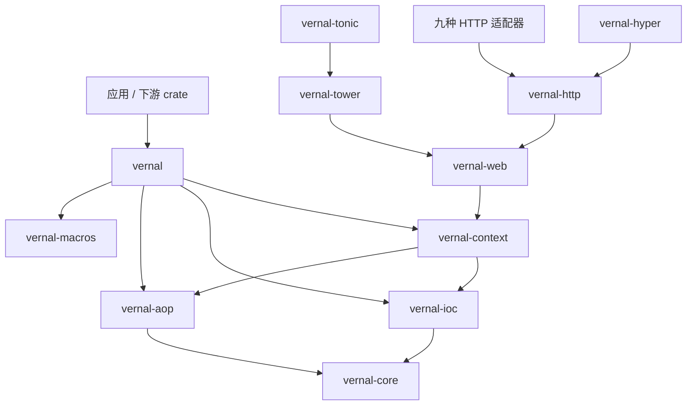
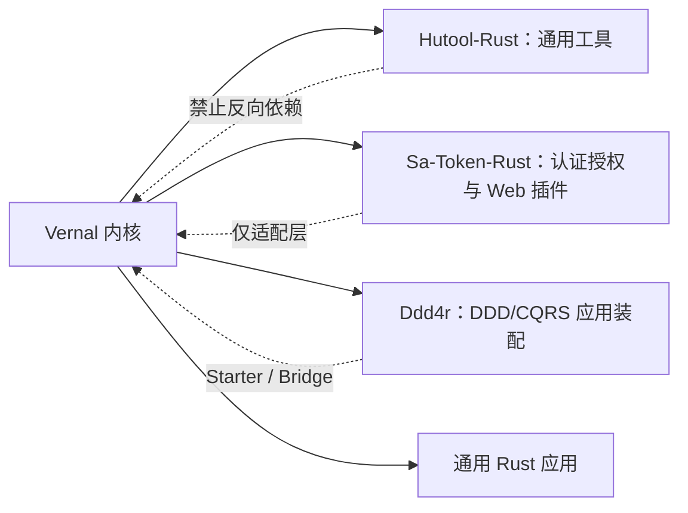

<a id="readme-top"></a>

# 句芒 · Vernal

**Vernal Framework**

**句芒是面向 Rust 生态的轻量级 IoC、AOP 与应用上下文框架。**

> **Vernal — Let components grow.**<br>
> **Grow components. Weave capabilities.**

[English](./README.md) | [简体中文](./README.zh-CN.md)

Vernal 是 **句芒** 的英文品牌。句芒在中国古代文化中与春天、草木和万物生发相联系。
这个名字不是装饰性的神话标签，而是框架模型的表达：组件从明确的依赖中生长，
能力围绕稳定合同交织，应用上下文管理它们完整的生命周期。

```text
应用组件
    │ 组件定义 + 依赖 + 拦截器
    ▼
┌──────────────────────────────────────────────────────────┐
│ 句芒 · Vernal Framework                                  │
│ IoC 内核        构建、解析、作用域、图校验                │
│ AOP 内核        匹配、组合、执行拦截器                    │
│ Context         启动、生命周期、事件、关闭                │
│ Web             Web / HTTP / 十个 Adapter                │
└──────────────────────────────────────────────────────────┘
    │ 显式端口与 Web 框架原生类型
    ▼
Hutool-Rust · Sa-Token-Rust · Ddd4r · 通用 Rust 应用
```

> **项目状态**：实验阶段。Phase 1 IoC、Tokio-first 的 Phase 2 AOP 内核、
> Phase 3 应用上下文，以及 Phase 4 Web/HTTP/Tower/Hyper 底座已有可调用实现
> 和合同测试；Axum、Actix Web、Rocket、Warp、Salvo、Poem、Ntex、Gotham、
> Tide 与 Tonic 十种适配器均已具备可运行实现，显式组件派生宏和 Context-local
> 异步 AOP 方法宏可调用但仍处实验阶段。当前尚未发布。

## 1. 愿景

Vernal 希望为 Rust 生态补齐小型基础库与完整 Web 框架之间可复用的应用基础：

- 类型驱动、可直接管理 Tokio 与框架原生对象的 IoC 内核；
- 可独立使用的 AOP 内核，负责有序、可组合的调用拦截；
- 组合 IoC、AOP、生命周期、事件和配置，但不吞并底层内核的应用上下文；
- 生成普通 Rust 代码、不隐藏反射运行时的过程宏；
- 框架中立的 Web/HTTP 合同，以及面向选定十种 HTTP/RPC 框架和下游生态的薄适配
  crate。

Vernal 借鉴 Spring 已验证的核心概念，也吸收本地 `tx-di` 源码中有价值的实现思路，
但不会逐行翻译 JVM 动态代理模型。所有权、生命周期、trait 约束、显式错误和编译期
代码生成必须保持 Rust 原生。

## 2. 名称与高级寓意

### 2.1 中文品牌：句芒

**句芒**是项目的文化身份。古代典籍以句芒对应春令与草木生发，《吕氏春秋·孟春》
有“其帝太皞，其神句芒”的记载。这一意象与框架能力形成一组完整映射：

| 文化意象 | 框架寓意 |
|:---|:---|
| 春来万物苏醒 | Context 发现定义并启动组件 |
| 根系输送养分 | 依赖显式声明并按方向解析 |
| 枝干各自生长 | IoC、AOP、适配器和消费方保持模块化 |
| 藤蔓彼此交织 | 横切能力围绕调用链有序组合 |
| 四时运行有序 | 组件遵循确定的启动和关闭生命周期 |

### 2.2 英文品牌：Vernal

`Vernal` 是“春天的、春季的、带来新生的”这一含义的英语单词，不是句芒的拼音。
中英文品牌共同表达同一个理念：

> **句芒是文化灵魂，Vernal 是面向全球 Rust 生态的技术身份。**

神话意象只存在于品牌层。公共 API 将继续使用工程师能够直接理解的英文术语，
例如 `Container`、`Component`、`Scope`、`ApplicationContext`、
`Interceptor` 和 `Invocation`，不把生僻神话名词强加给使用者。

## 3. 架构边界

Vernal 遵守四条不可退化的规则：

1. **IoC 与 AOP 是独立内核。** 二者都可以脱离应用上下文和 Web 框架单独使用。
2. **Context 只负责组合，不负责吞并。** 生命周期、事件和配置依赖内核公开合同。
3. **所有适配器向内依赖。** Web 框架、Sa-Token-Rust、Hutool-Rust 和 Ddd4r
   都不能成为底层内核依赖。
4. **Tokio-first，但不建立全局 Service Locator。** Tokio 是官方异步运行时；
   Registry、组件身份和生命周期状态仍然显式且按 Context 隔离。

详细决策、主链、失败语义和验收标准参见：

- [架构设计（简体中文）](./docs/Vernal-Architecture.zh_CN.md)
- [Architecture](./docs/Vernal-Architecture.md)
- [Web 集成架构（简体中文）](./docs/Vernal-Web-Architecture.zh_CN.md)
- [Web integration architecture](./docs/Vernal-Web-Architecture.md)
- [tx-di 原始源码快照与来源记录](./third-party/tx-di/README.md)

## 4. Workspace

| Crate | 当前状态 | 目标职责 |
|:---|:---:|:---|
| `vernal` | 实验性 Facade | Facade、prelude 与 feature 组合 |
| `vernal-core` | 实验性 | Tokio-first 框架的公共合同 |
| `vernal-ioc` | Phase 1/诊断内核已实现 | 定义、作用域、解析、依赖图和只读快照 |
| `vernal-aop` | Phase 2 内核已实现 | Send/Local Around/Next、切点、不可变计划和取消 |
| `vernal-context` | Phase 3/诊断内核已实现 | 生命周期、回滚、事件和脱敏启动报告 |
| `vernal-macros` | Phase 2 宏已实现 | 显式注入元数据与 Context-local 异步方法织入 |
| `vernal-web` | Phase 4 合同已实现 | 框架中立的 Context、请求 Scope、Handler 和错误合同 |
| `vernal-web-testkit` | Phase 4 绑定/生命周期合同已实现 | 十个 Adapter 共享 Context/Scope/组件绑定及成功、错误、Drop 清理断言 |
| `vernal-http` | Phase 4 合同已实现 | HTTP 请求、响应、Body、流、取消和背压合同 |
| `vernal-tower` | Phase 4 底座已实现 | Tower Context、请求 Scope、传播、AOP 与可配置原生错误恢复 |
| `vernal-hyper` | Phase 4 底座已实现 | Hyper 请求与 Body Frame 无损传输桥接 |

目标集成集合记录在
[`web-integration-manifest.toml`](./web-integration-manifest.toml)。十个 Adapter
crate 均已具备可运行的原生集成：

| 优先级 | 框架 | Vernal crate | 协议 | 状态 |
|:---:|:---|:---|:---|:---:|
| 1 | Axum | `vernal-axum` | HTTP + Tower | Phase 5 适配 + 严格 AOP 已实现 |
| 2 | Actix Web | `vernal-actix-web` | HTTP | Phase 5 适配 + 严格 Local-AOP 已实现 |
| 3 | Rocket | `vernal-rocket` | HTTP | Phase 5 适配 + 严格 AOP 已实现 |
| 4 | Warp | `vernal-warp` | HTTP | Phase 5 适配 + 严格 AOP 已实现 |
| 5 | Salvo | `vernal-salvo` | HTTP | Phase 5 适配 + 严格 AOP 已实现 |
| 6 | Poem | `vernal-poem` | HTTP | Phase 5 适配 + 严格 AOP 已实现 |
| 7 | Ntex | `vernal-ntex` | HTTP | Phase 5 适配 + 严格 Local-AOP 已实现 |
| 8 | Gotham | `vernal-gotham` | HTTP | Phase 5 适配 + 严格 AOP 已实现 |
| 9 | Tide | `vernal-tide` | HTTP | Phase 5 适配 + 严格 AOP 已实现 |
| 10 | Tonic | `vernal-tonic` | RPC Streaming + Tower | Phase 5 适配 + 严格 AOP 已实现 |

Axum 已提供原生 Router 装配、Context/组件/请求 Scope 提取器、匹配路由操作
身份和 fail-closed AOP 装配；Actix Web 已提供 App Data/Extension 提取器，以及
Scope 跟随响应 Body 的原生
`Transform`/`Service`。严格中间件在路由匹配后包裹具体 `Resource`，以低基数
资源模式建立操作身份，并通过 Local-AOP 链驱动完整的 `Rc`、非 `Send` Service
Future；缺少路由元数据或计划时 fail-closed，同时保留 Actix 原生错误。Rocket
已提供 Managed State、Request Guard、Body 感知 Fairing，以及包裹未修改 Route
Handler 的严格 Send-AOP；`routes![...]` 在 mount 前批量织入并保留路由元数据，
操作身份取自 Rocket 自有 URI 模板与真实方法，Success/Error/Forward Outcome
保持原生语义；Warp 已通过官方 Tower Service 边界提供原生 Extension Filter
和严格 Send-AOP。由于 Warp 不公开匹配后的模板，每个具体 Filter Service
显式接收完整低基数路由模式；真实方法与 owned 请求快照进入调用计划，缺少模式
或计划时 fail-closed，策略失败映射成 Warp 原生响应且不执行 Filter；
Salvo 已提供原生 Hoop、类型化 Depot 访问、Frame/Trailer 保真的 Body 释放，
以及覆盖完整 Handler 链的严格 Send-AOP。操作身份取自 Salvo 匹配后的低基数
路径和真实 HTTP 方法，请求上下文携带 owned 快照；缺少元数据或计划时
fail-closed，原生响应保持不变，借用型 Handler Future 通过
`BorrowedInvocationTarget` 执行而不克隆框架对象；
Poem 已提供原生 `Middleware`/`Endpoint` 组合、类型化
Context/组件/Scope/RequestContext 提取器、Body 绑定释放，以及覆盖完整
Endpoint Future 的严格 Around AOP；操作身份取自 Poem 匹配后的低基数
`PathPattern`，缺少元数据或计划时 fail-closed，并保留 Poem 原生错误。Ntex
已提供原生 `Middleware`/`Service`、App State/Extension 提取器和
`MessageBody` 绑定请求 Scope。由于 Ntex 公共请求 API 不暴露匹配后的
`ResourceDef`，严格中间件必须包裹具体 `web::resource(...)`，并显式接收相同的
低基数完整路径模式；HTTP 方法取自真实请求，完整 Worker-local Service Future
通过 `BorrowedLocalInvocationTarget` 执行。缺少计划时 fail-closed，请求不会
被克隆，Ntex 原生 Service 错误仍保持原生语义；Gotham 已提供原生
`StateData`、类型安全 State 扩展、Pipeline Middleware、Frame/Trailer
保真的 Body 释放，以及覆盖完整 Pipeline Chain 的严格 Send-AOP。具体 Pipeline
显式接收完整低基数路由模式，owned 请求元数据跨异步链传播；缺少模式或计划时
fail-closed，原生 `HandlerError` 的状态码与错误源保持不变；Tide 已提供原生
`Middleware`、类型化 Request Extension
访问、响应 Reader 绑定的 Scope 释放，以及覆盖完整 Middleware/Endpoint 链的
严格 Send-AOP。Tide 只暴露路由参数值而不暴露匹配模板，因此严格中间件显式
接收同一条低基数完整路径模式，结合真实方法并携带跨 HTTP 模型的 owned 快照；
缺少模式或计划时 fail-closed，原生响应通过 `BorrowedInvocationTarget` 保持；
Tonic 已提供 Context Interceptor、
类型化 Request 扩展、精确 Service/Method 操作身份、稳定 `Status` 映射和
fail-closed AOP Tower Layer。

这里的“十种”是基于本地源码集成并集和当前 registry 可用性形成的版本化覆盖优先级，
不是对全世界 Rust 框架热度的绝对排名。Tonic 明确属于 RPC 集成；Tower 和 Hyper
属于公共底座，不冒充应用层 Web 框架。

目标依赖方向：



## 5. IoC 快速开始

```rust
use std::{error::Error, sync::Arc};
use vernal_ioc::{ComponentDefinition, RegistryBuilder};

type AnyError = Box<dyn Error + Send + Sync + 'static>;

struct Config {
    name: &'static str,
}

struct Service {
    config: Arc<Config>,
}

fn main() -> Result<(), AnyError> {
    let mut registry = RegistryBuilder::new();
    registry.register(ComponentDefinition::singleton::<Config, _>(|_| Config {
        name: "vernal",
    }))?;
    registry.register(
        ComponentDefinition::try_singleton::<Service, _>(
            |resolver| -> Result<Service, AnyError> {
                Ok(Service {
                    config: resolver.resolve::<Config>()?,
                })
            },
        )
        .depends_on::<Config>(),
    )?;

    let container = registry.build()?.container();
    let service = container.resolve::<Service>()?;
    assert_eq!(service.config.name, "vernal");
    Ok(())
}
```

工厂只能解析定义中显式声明的依赖。Registry 在创建 `Container` 前完成图校验；
Singleton 状态属于具体 Container，而不是进程级全局 Store。

任何满足 `Send + Sync + 'static` 的 Rust 值都可以成为组件，包括
`reqwest::Client`、数据库连接池、Tower Service、框架 State、Tokio 同步原语和
业务对象。具体框架依赖由注册它们的应用或集成 crate 持有。

Trait Object 通过显式、类型安全的绑定进入同一依赖图：

```rust
use vernal_ioc::{Component, TraitBinding};

registry.register_bundle(
    [EmailSender::definition()],
    [TraitBinding::new::<dyn MessageSender, EmailSender, _>(
        |sender| sender,
    ).primary()],
)?;
```

`Arc<dyn MessageSender>` 字段由 Component 宏注入唯一或 Primary 实现，
`#[component(qualifier = "email")]` 选择命名实现，
`Vec<Arc<dyn MessageSender>>` 注入全部实现。绑定仍指向原始组件实例，不建立
第二套 Store；模块定义与绑定通过 `register_bundle` 原子提交。

已冻结 Registry 和运行中的 Context 都提供拥有自身数据的只读诊断快照：

```rust
let registry_snapshot = context.container().registry().snapshot();
let startup_report = context.startup_report().await;
let json = serde_json::to_string(&startup_report)?;
```

`RegistrySnapshot` 复用真实构建计划，不重复执行拓扑算法；`StartupReport` 记录
版本、MSRV、Scope/依赖摘要、AOP 计划槽位和生命周期耗时。失败报告只保存组件名、
阶段和成功/失败分类，不序列化底层业务错误正文。请求 Scope 的运行期清理失败
只追加去重后的静态代码 `web.request-scope.cleanup-failed`；响应已被 Drop、
无法再返回原生错误时也能留下 Context-local 诊断证据。Scope 清理由取消安全的
Tokio 协调任务负责：某个等待者被丢弃或等待超时都不会遗弃关闭钩子。作为应用
内建组件注册的 `ScopeCleanupPolicy` 默认让应用拥有的 Scope 最多等待 30 秒；
等待超时后协调器仍在后台继续完成清理。受管任务执行或停机失败同样只追加
`context.managed-task.shutdown-failed`，任务错误正文只存在于调用方显式取得的
错误链。

## 6. 能力状态

| 能力 | 目标合同 | 状态 |
|:---|:---|:---:|
| 类型化组件定义 | 构造器注入与显式元数据 | Phase 1 |
| 作用域 | Singleton、Transient、类型化自定义 ScopeContext、取消安全清理与 IoC 驱动的 WebRequestScope | Phase 1.2/4 内核 |
| 依赖图 | 确定性顺序及缺失、歧义、循环结构化诊断 | Phase 1 |
| Trait 绑定 | 不依赖字符串查找的命名、Primary 和多实现绑定 | Phase 1.1 内核 |
| 拦截器链 | 有序 Around/Next、短路及结果/错误改写 | Phase 2 内核 |
| 切点 | 操作匹配并编译成不可变调用计划 | Phase 2 内核 |
| ApplicationContext | 串行生命周期、回滚、逆序关闭和 Context-local 类型化事件 | Phase 3 内核 |
| 受管 Tokio 任务 | Context 持有任务句柄、失败取消、优雅等待、有界 abort 与共享停机结果 | Phase 3 内核 |
| 事件 | Context 内部隔离的类型化事件发布 | Phase 3 内核 |
| 异步集成 | Tokio 原生取消、deadline 与类型化调用上下文 | Phase 2 内核 |
| Web 上下文 | 请求 Context、请求 Scope、Handler 调用和错误映射 | Phase 4 合同 |
| HTTP | 请求/响应、Body Frame/Trailer、显式限量收集、取消和背压 | Phase 4 合同 |
| Web 集成底座 | Tower Context/Scope Layer 与 Hyper 流式桥接 | Phase 4 底座 |
| 跨框架合同 | 同 Scope 组件身份及成功、策略错误、响应 Drop 清理 | Phase 4 公共合同 |
| 框架适配器 | 能复用 Tower 时优先 Tower，必要时原生适配 | Phase 5 适配已实现 |
| 诊断 | 可序列化 Registry/Context 快照与脱敏运行期清理告警 | Phase 3/4 诊断内核 |

“Phase 1”和“Phase 2 内核”表示已有可调用实现与合同测试，但 API 仍处于实验
阶段。任何标签都不代表稳定兼容或达到性能指标；未使用 Definition 的可靠运行时
追踪和 Adapter 自动探测仍待后续实现。

## 7. 生态定位



- **Hutool-Rust** 继续承担通用工具库职责，可以消费 Vernal 能力，但 Vernal
  不成为 Hutool-Rust 的子模块。
- **Sa-Token-Rust** 是唯一保留的安全集成目标，继续拥有认证、Session 和
  授权语义；Vernal 只提供组件生命周期与拦截编排，不重复建设安全内核。由
  Sa-Token-Rust 持有的 `sa-token-vernal` 已实现 `HttpRequestSnapshot` 适配、
  `SecurityPrincipal` 投影及跨 Tokio Future 的请求级 `SaTokenContext`；
  `SaTokenComponents` 将调用方原始 Manager、Bridge 与操作授权策略原子注册，
  Advisor 在 Handler 前认证并执行角色/权限 all/any 规则，以及 Sa-Token
  全局/前缀通配符语义，以稳定 401/403 短路。
- **Ddd4r** 通过消费方持有的 `ddd4r-vernal` 直接注册原生 `Registry` 和
  `DefaultCommandBus`，并以隔离快照进入 Ddd4r 自己的 Tokio task-local
  `ContextScope`；聚合、事件、CQRS、Repository、Outbox 和事务语义仍归 Ddd4r。
- **Web 框架** 继续拥有路由、Request/Response 类型、传输限制和服务器生命周期。

## 8. 本地开发

前置条件：

- 声明的 MSRV：Rust `1.85.0` 或更高版本
- 支持 Edition 2024 与 Resolver 3 的 Cargo

本轮本地门禁使用 Rust `1.97.1` 执行，并已显式通过
`cargo +1.85.0 check --workspace --all-targets`。独立 MSRV CI 尚待建设，因此
这项本地结果仍不是发布级兼容性承诺。

已验证的 Workspace 命令：

```bash
cargo fmt --all -- --check
cargo check --workspace --all-targets
cargo clippy --workspace --all-targets -- -D warnings
cargo test --workspace
cargo doc --workspace --no-deps
```

公共合同仍在设计期间，Workspace 有意统一设置为 `publish = false`。当前没有
crates.io 安装命令，也没有稳定 API 承诺。

## 9. 路线图

| 阶段 | 交付物 | 退出证据 |
|:---|:---|:---|
| Phase 0 | 品牌、架构和 Workspace 边界 | 文档与 Workspace 门禁通过 |
| Phase 1 | `vernal-core` + `vernal-ioc` 最小内核 | 依赖图、作用域和解析测试 |
| Phase 2 | `vernal-aop` + 宏 | 顺序、错误、异步和编译失败测试 |
| Phase 3 | `vernal-context` 生命周期和事件 | 启动、回滚和关闭测试 |
| Phase 4 | Web/HTTP 合同、Tower/Hyper 与十个 Adapter | 跨框架一致性测试套件 |
| Phase 5 | Hutool-Rust、Sa-Token-Rust 和 Ddd4r 桥接 | 由消费方拥有的集成示例 |
| Phase 6 | Preview 发布 | MSRV、SemVer、安全、docs.rs 和打包门禁 |

Phase 5 正在进行：Sa-Token-Rust 已远端集成 `sa-token-vernal` 认证与操作授权
AOP Bridge；Hutool-Rust
本地持有经过测试的 `hutool-vernal`；Ddd4r 本地已实现 `ddd4r-vernal`，其真实
Tokio 测试、Clippy 和文档构建已在独立依赖图通过。Ddd4r 全 Workspace 门禁仍被
既有、当前不可获取的 `rbatis-r2dbc` Git Revision 阻断，不能据此宣称全仓通过。

Phase 1/1.1/1.2 已通过 33 个 IoC 合同测试，覆盖 1,000 节点确定性规划、结构化图
诊断、并发 Singleton、双 Container 隔离、Transient、原生对象、Trait 命名/
Primary/全部实现、Trait 图环、跨定义/绑定原子模块注册，以及稳定 Registry
序列化快照。9 项自定义 Scope 合同进一步覆盖同 Scope 并发一次构造、兄弟
隔离、父子生命周期方向、Container 所有权、取消传播、失败后继续逆序清理，以及
关闭等待已开始工厂、等待者取消安全、有界等待后后台完成、钩子间 panic 隔离。
Phase 2 AOP 内核现有 9 个 Send 合同测试，覆盖顺序进入/逆序退出、短路、成功结果
与错误改写、跨 `.await` 类型化上下文、取消/deadline、切点选择和 64 task
并发共享计划、借用型非静态目标与计划目录合并；另有 5 个 Local-AOP 测试覆盖
非 `Send` 返回值、顺序、短路、取消、计划目录和借用型本地目标。性能基准仍未
完成。宏前端另有 5 个运行时合同测试（包含类型驱动自定义 Scope）和 4 个
compile-fail 用例。
Phase 3 内核现有 19 个测试，覆盖依赖顺序启动、逆序关闭、initialize/start
回滚、非法状态转换、幂等关闭、并发关闭串行化和 Context-local 类型化事件
隔离、高层构建器八类内建资源注入、应用 Scope 取消树、任务错误/panic 传播、
取消安全的共享任务停机、超时 abort、任务先于组件 stop 的顺序，以及成功/失败
启动报告的只读性、序列化和业务错误正文脱敏。

Phase 4 已把 `WebRequestScope` 收敛为 IoC `ScopeContext` 的 Web 门面，十个
Adapter 的组件提取器均在当前请求 Scope 内解析 Singleton、Transient 或请求级
组件。`vernal-web-testkit::WebAdapterContract` 已被十个 Adapter 共同调用，
验证原生 Context、Scope 所有权、Scope 身份、Open/取消状态及二次解析的
组件 `Arc` 身份。`ScopeCloseProbe` 与 `ScopeRejectingInterceptor` 还让十个
Adapter 共同验证正常 Body 完成、策略短路和响应 Body Drop 后由 Adapter 自身
关闭真实 Scope，testkit 不参与清理。流式错误、断连、释放超时、Security 集成
和完整失败矩阵仍按架构清单继续补齐。

## 10. 贡献与许可证

当前阶段以架构文档作为实现合同。新增代码必须先确定所属 crate、依赖方向、
失败语义和验收证据。不能仅仅为了让适配器更容易编写，就把 Web 框架依赖加入内核。

Vernal 使用 [MIT License](./LICENSE-MIT)。

---

**Vernal — Let components grow.**

[返回顶部](#readme-top)
