# 句芒 · Vernal Framework Architecture

> **Purpose:** Define Vernal's brand semantics, system boundaries, IoC/AOP/
> ApplicationContext contracts, crate dependency rules, web and ecosystem
> integration strategy, and the refactoring boundary for ideas adopted from
> `tx-di`.
>
> **Architecture version:** 0.1.0<br>
> **Applicable code:** `0.0.0-dev` Phase 1–4 callable foundations<br>
> **Status:** Draft, awaiting architecture review<br>
> **Last updated:** 2026-07-25

## 1. Document control and status

### 1.1 Readers

| Reader | Primary sections | Expected outcome |
|:---|:---|:---|
| Vernal maintainers | 5–10, 14–17 | Kernel boundaries, contracts, delivery gates |
| Web adapter authors | 4, 11, 14 | Request context and middleware boundaries |
| Hutool-Rust / Sa-Token-Rust / Ddd4r maintainers | 4, 12 | Integration ownership and dependency rules |
| Test and security reviewers | 13–16 | Failure, security, and acceptance evidence |

### 1.2 Status labels

| Label | Meaning |
|:---|:---|
| `[Confirmed]` | Verified from the workspace, reviewed source, or current commands |
| `[Skeleton]` | Crate and dependency boundary exists; public behavior does not |
| `[Target]` | Proposed contract requiring review and implementation |
| `[Experimental]` | Requires a prototype or benchmark before commitment |
| `[Non-goal]` | Explicitly outside Vernal's responsibility |

### 1.3 Current state

- `[Confirmed]` The manifest declares Edition 2024, resolver 3, and MSRV
  1.85.0. The workspace passes `cargo +1.85.0 check --workspace --all-targets`
  locally; automated MSRV CI remains a target.
- `[Confirmed]` Six kernel/composition crates and fifteen web-related crates
  exist; four web foundation crates expose callable behavior and
  `vernal-web-testkit` provides a shared request-binding contract.
- `[Confirmed]` Every crate is `publish = false`; no crates.io or stable API
  claim is made.
- `[Confirmed]` `vernal-core` and `vernal-beans` provide an explicit registry,
  deterministic graph planning, isolated containers, singleton/transient
  scopes, named/primary/all Trait bindings, and structured failures.
- `[Confirmed]` `vernal-aop` provides object-safe async Send and Local
  Around/Next execution planes, operation pointcuts, immutable plans, typed
  extensions, cancellation, and deadlines.
- `[Confirmed]` `vernal-context` provides a serialized Tokio lifecycle state
  machine, dependency-order initialize/start, cancellation, rollback,
  reverse idempotent shutdown, and context-local typed events.
  `VernalApplicationBuilder` registers the Tokio handle, application
  cancellation token, event bus, and precompiled AOP plan catalog before
  dependency-graph freezing.
- `[Confirmed]` `vernal-web`, `vernal-http`, `vernal-tower`, and
  `vernal-hyper` provide request scope, standard HTTP body frames/trailers,
  Tower lifecycle layers, and a real Hyper transport bridge.
  `WebRequestScope` delegates to the IoC `ScopeContext`, so component
  extractors cannot bypass request scope with unscoped resolution.
- `[Confirmed]` `vernal-axum` provides native Router assembly and typed
  Context, component, and request-scope extractors; `vernal-actix-web` provides
  native Transform/Service middleware, body-bound Scope cleanup, matched
  resource operation identity, and strict Local-AOP;
  `vernal-rocket` provides managed state, request guards, a body-aware fairing,
  route-template operation identity, and fail-closed strict Send-AOP over
  native Handler Outcomes; `vernal-warp` provides native extension filters, a Tower Service
  body scope, explicit route-pattern identity, and fail-closed strict
  Send-AOP; `vernal-salvo` provides a native Hoop, typed Depot access,
  frame/trailer-preserving body scope, matched-path operation identity, and
  fail-closed strict Send-AOP over borrowed Handler resources; `vernal-poem` provides native
  Middleware/Endpoint composition, typed extractors, body-bound Scope cleanup,
  matched-route operation identity, and fail-closed strict Around AOP;
  `vernal-ntex` provides native Middleware/Service composition,
  App State/Extension extractors, body-bound Scope cleanup, explicit
  resource-pattern operation identity, and fail-closed strict Local-AOP over
  borrowed worker-local targets;
  `vernal-gotham` provides StateData, type-safe State access, Pipeline
  middleware, frame/trailer-preserving body cleanup, explicit route-pattern
  identity, and fail-closed strict Send-AOP; `vernal-tide` provides
  native Middleware, typed Request Extension access, reader-bound Scope
  cleanup, explicit route-pattern identity, and fail-closed strict Send-AOP
  over borrowed `Next`; `vernal-tonic` provides a Context interceptor, typed Request
  extensions, `Status` mapping, and Tower composition.
- `[Confirmed]` `vernal-macros` provides `#[derive(Component)]` for explicit
  `Arc<T>`, `Arc<dyn Trait>`, `Vec<Arc<dyn Trait>>`, and `Option<Arc<T>>`
  constructor injection, Singleton/Transient scope, default fields, and field
  qualifiers, with runtime and compile-fail tests. The default path uses
  neither linkme nor global auto-registration.
- `[Confirmed]` the separate `vernal-discovery` frontend lets opted-in
  `#[component(discover = "group")]` types submit definition factories to a
  read-only linkme slice. Applications explicitly select groups and atomically
  install deterministic batches into their own Registry; six runtime contracts
  and two compile-fail cases cover isolation, rollback, and diagnostics.
- `[Confirmed]` `ComponentProvider<T>` and `TraitProvider<dyn Trait>` provide
  graph-constrained deferred resolution for concrete types and trait bindings,
  including per-call transient construction, required/optional targets,
  qualifiers, and explicit scopes. They share the originating Container's
  caches without arbitrary type lookup or a global Service Locator.
- `[Confirmed]` `#[derive(ConfigurationProperties)]` binds required, optional,
  defaulted, renamed, and nested fields from a Context-local Environment and
  registers the result through the normal IoC graph.
  `ApplicationContext::refresh()` fails fast while warming these singletons;
  runtime and compile-fail tests verify injection and redacted failures.
- `[Confirmed]` verbatim tx-di references now live under each crate's
  read-only `upstream/tx-di/` evidence directory instead of appearing as
  uncompiled parallel Store/App/global-registry implementations in production
  `src/`.
- `[Confirmed]` `#[component(aop)]` and `#[intercept]` connect context-local
  invocation plans, cancellation, and async component methods through
  Arc-owned, shared-reference, and exclusive-reference receivers. Missing
  plans, cancellation, and return-type mismatches remain structured errors,
  without a global instance map or unsafe lifetime extension.
- `[Confirmed]` the method macro supports `self: Arc<Self>`, `&self`,
  `&mut self`, type/lifetime/const generic async implementation methods, and
  async Trait methods with default bodies. Every path keeps the same
  context-local Operation and type-erasure boundary without unsafe lifetime
  extension.
- `[Confirmed]` `vernal-aop` provides a reproducible Tokio invocation-plan
  benchmark for direct async, empty-plan, one-, and four-interceptor paths.
  Criterion is pinned to MSRV-compatible 0.7 and plan compilation is excluded
  from the timed path.
- `[Confirmed]` `#[intercept]` projects owned arguments, borrowed-method
  value/mutable arguments, shared-reference targets, and successful outputs
  into four named transport contracts. Trybuild covers all four failures plus
  a passing associated-output case instead of relying on boxed-future or Any
  cast diagnostics.
- `[Target]` remaining consumer ecosystem bridges, cross-machine performance
  thresholds, macro API stability, and later production gates remain.

## 2. Brand meaning and architecture thesis

### 2.1 Dual brand

| Dimension | Content |
|:---|:---|
| Chinese brand | **句芒** |
| English brand | **Vernal** |
| Formal name | **Vernal Framework** |
| English description | **Vernal is a lightweight IoC, AOP and application context framework for Rust.** |
| Chinese description | **句芒是面向 Rust 生态的轻量级 IoC、AOP 与应用上下文框架。** |
| Brand line | **Vernal — Let components grow.** |
| Capability line | **Grow components. Weave capabilities.** |

句芒 evokes spring and the growth of living things; Vernal means “of or
relating to spring.” The metaphor is constrained by engineering rules:

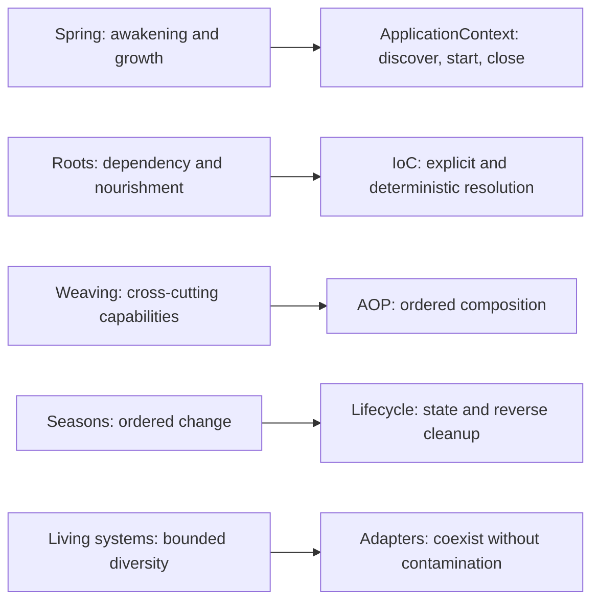

### 2.2 Architecture in one sentence

**Vernal is a Rust-native framework composed of independent IoC and AOP
kernels plus an ApplicationContext that coordinates them; thin macros and
adapters connect the kernels to web frameworks and downstream ecosystems.**

### 2.3 Metaphor translated into rules

| Meaning | Engineering rule | Prohibited shortcut |
|:---|:---|:---|
| Growth, not fabrication | Build components from explicit dependencies | Arbitrary runtime string reflection |
| Weaving, not intrusion | Compose cross-cutting behavior around Invocation | Mutate business types to simulate AOP |
| Ordered seasons | Start in dependency order, stop in reverse | Unordered startup and abandoned tasks |
| Bounded diversity | Separate kernels, context, adapters, consumers | Put web/auth/ORM utilities into core |
| Renewal | Roll back failures; isolate and rebuild contexts | Unclearable process-global registries |

## 3. Drivers, constraints, and non-goals

### 3.1 Drivers

| ID | Driver | Priority | Architecture response |
|:---|:---|:---:|:---|
| D-001 | Any Rust project can use IoC or AOP independently | P0 | Mutually independent kernels |
| D-002 | Integrate Axum, Actix Web, Salvo, and Poem | P0 | Tower-first, native when needed |
| D-003 | Enable Hutool-Rust, Sa-Token-Rust, and Ddd4r | P0 | Consumer-owned bridges/starters |
| D-004 | Reuse proven `tx-di` ideas | P1 | Migration ledger and contract tests |
| D-005 | Remain Rust-native and diagnosable | P0 | Explicit types, errors, state, graph reports |
| D-006 | Use ecosystem standards without dependency pollution | P0 | Tokio-first; concrete web/ORM/config dependencies stay in integrations |

### 3.2 Hard constraints

1. `vernal-beans` and `vernal-aop` do not depend on each other.
2. `vernal-core`, `vernal-aop`, and `vernal-context` may use Tokio and
   `tokio-util` task, synchronization, time, and cancellation primitives, but
   do not depend on concrete web, ORM, authentication, or configuration
   implementations.
3. Adapters point inward; kernels never depend on adapters.
4. Missing components, cycles, interception rejection, and shutdown failure
   return structured errors instead of panicking.
5. Contexts are instance-isolated; parallel contexts cannot overwrite one
   another.
6. “Zero cost,” “zero allocation,” and “Spring compatible” require measured,
   explicitly scoped evidence.

### 3.3 Non-goals

- `[Non-goal]` Reproduce Java reflection, CGLIB, or the complete historical
  BeanFactory API.
- `[Non-goal]` Build a router, HTTP server, ORM, authentication system, or
  distributed configuration product.
- `[Non-goal]` Make domain code depend on one framework's Request/Response.
- `[Non-goal]` Hot-swap arbitrary Rust types at runtime.
- `[Non-goal]` Ship a full “automatic configuration for everything” platform
  before a stable 1.0 kernel.

## 4. System context and ownership

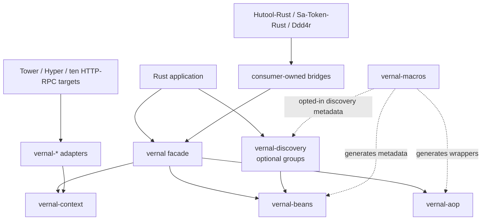

| Vernal owns | Vernal does not own | Owner |
|:---|:---|:---|
| Definitions, bindings, scopes, resolution | Domain rules | Application / Ddd4r |
| Interception contract, order, invocation chain | Authentication semantics | Sa-Token-Rust |
| Context lifecycle and local events | Routing, body, transport limits | Web framework |
| Framework integration ports | General utility algorithms | Hutool-Rust |
| Startup diagnostics and dependency graph | Deployment/config-center products | Infrastructure |

## 5. Source evidence and tx-di boundary

### 5.1 Reviewed evidence

| Project | Reviewed source | Confirmed finding |
|:---|:---|:---|
| `tx-di` | core component, registry, store, scope, topology, lifecycle, AOP, config, and intercept macro files | Typed metadata, construction, lifecycle, and interception exist; configuration remains coupled to global TOML and panic |
| `Sa-Token-Rust` | Router flow, adapter contracts, core config builder, and ten Web/RPC plugin families | One auth flow is reused through framework ports; typed builders need stable external property inputs |
| `Ddd4r` | Root manifest and implementation plan | Target stack needs a request-context bridge while retaining DDD/CQRS ownership |
| `Hutool-Rust` | AOP, Reqwest client, and `hutool-setting` Profile/SettingLoader | Profiles, variable expansion, and parsed settings can feed an adapter without coupling file formats to Context |
| `RBatis` | `Intercept`, `Action`, `ResultType`, `apply_before`, `apply_after`, and `RBatis` interceptor storage | Mutable input/result interception and explicit short circuit are useful; runtime-mutated global engine chains and name downcasts are not a general AOP kernel |

This is a local source snapshot from 2026-07-25, not evidence that any consumer
already integrates Vernal.

### 5.2 Adopted ideas

| tx-di mechanism | Vernal decision | Target crate |
|:---|:---|:---|
| Explicit `Component::Deps` | Retain describable constructor dependencies; redesign the stable contract | `vernal-beans` |
| Link-time component metadata | Implemented as explicitly selected groups with deterministic, atomic per-Registry installation | `vernal-discovery` / `vernal-macros` |
| `TypeId` plus erased store | Keep typed entrypoints and constrain erasure | `vernal-beans` |
| Kahn topological ordering | Rebuild as a deterministic, testable planner | `vernal-beans` |
| `debug_registry()` log table | Upgrade to serializable read-only snapshots that reuse the frozen plan | `vernal-beans` / `vernal-context` |
| Singleton / Prototype | Implemented as Singleton / Transient / typed Scope SPI | `vernal-beans` |
| Lifecycle hooks | Move to a Context-owned state machine | `vernal-context` |
| Dot-path configuration lookup | Context-local PropertySource precedence, profiles, placeholders, and typed lookup; format loading stays in adapters | `vernal-context` |
| Forward before / reverse after | Preserve stack order through a true Around chain | `vernal-aop` |
| Generated interception wrapper | Keep compile-time generation; remove hard-coded paths and panic | `vernal-macros` |

### 5.3 Mandatory redesigns

| Current tx-di design | Risk | Vernal response |
|:---|:---|:---|
| Core mixes config, tracing, utilities, and shared errors | Unrelated concerns expand the kernel | Keep Tokio foundations; move config formats, logging implementations, and utilities outward |
| `AppAllConfig` hard-wires global TOML, executable-relative defaults, and panic | Multi-context conflicts and caller-controlled failure are impossible | `ApplicationEnvironment` accepts explicit PropertySource objects and returns structured errors |
| Global `HashMap<usize, Arc<InterceptorChain>>` | Address reuse, cleanup, locking, context isolation | Chain owned by wrapper/definition/context |
| Macro panics on missing chain or rejected before | Failure cannot compose | Structured caller-visible errors |
| Every argument becomes a Debug string | Secret leakage, allocation, lost type | No values by default; explicit redacted opt-in |
| `after` changes only a result description | Not true Around semantics | Introduce `Next`/continuation |
| Lifecycle owns Tokio tasks without one state machine | Cancellation and rollback semantics scatter | Tokio-native context with one lifecycle state machine |
| Global link-time registry is the only entrypoint | Weak isolation and dynamic assembly | Explicit `RegistryBuilder` baseline |

### 5.4 RBatis interceptor lessons

| RBatis mechanism | Vernal decision |
|:---|:---|
| `Action::Next` / `Action::Return` | Preserve explicit short circuit through consuming `Next`; returning without `next.run` is the type-safe Return action |
| Mutable SQL, arguments, and typed `ResultType` | Keep domain-specific mutation in RBatis; expose typed `InvocationContext` plus full result/error transformation instead of one universal mutable argument vector |
| Executor and operation kind in the hook contract | Model stable operation identity explicitly and compile reusable operation/component/method pointcuts |
| Interceptor `name()` and `Any` downcast lookup | Use IoC component identity and explicit Advisor registration; runtime interception is not a service locator |
| Mutable `SyncVec` on every cloned engine | Freeze Advisors into immutable per-Context catalogs before serving traffic |
| Separate forward `before` and forward `after` loops | Retain true Around nesting so lower order enters first and exits last |

## 6. Architecture decisions

| ADR | Decision | Rationale | Rejected | Reversal condition |
|:---|:---|:---|:---|:---|
| ADR-001 | Publish IoC and AOP independently | Maximum foundational reuse | One behavioral mega-core | An unavoidable circular contract appears |
| ADR-002 | Context composes kernels | Keep kernels clean | Put lifecycle/config/events in IoC | Composition cannot stay type-safe |
| ADR-003 | Explicit registry is authoritative | Isolation and testability | Process-global registry | Global model proves safe and unloadable |
| ADR-004 | Around/Next interception | Express before/after/error/short-circuit | before/after only | Equivalent lower-cost model is proven |
| ADR-005 | Tower-first integration | Reuse a shared Rust service abstraction | Duplicate each pipeline | A framework cannot preserve semantics |
| ADR-006 | Separate adapters and bridges | Isolate dependency/version churn | All framework features in facade | Stable ecosystem ABI emerges |
| ADR-007 | Tokio-first runtime | Reuse the server ecosystem's tasks, synchronization, cancellation, and time | Custom runtime abstraction or multi-executor parity | Tokio stops being the target ecosystem standard |

## 7. Layers and crate dependencies

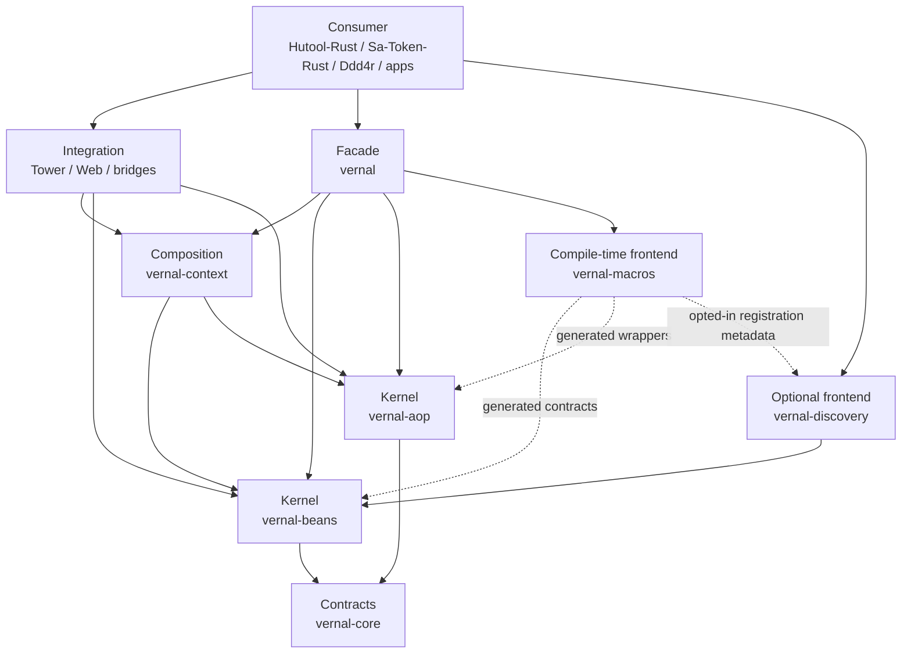

Forbidden directions:

```text
core ─X→ ioc / aop / context / web
ioc  ─X→ aop / context / concrete web / ORM
aop  ─X→ ioc / context / concrete web / ORM
context ─X→ concrete web framework
ioc / context ─X→ discovery
adapter A ─X→ adapter B
```

## 8. IoC kernel

### 8.1 Model

| Concept | Target responsibility |
|:---|:---|
| `ComponentKey` | Context-local identity: `TypeId` plus optional qualifier |
| `TraitKey` | Trait `TypeId` plus optional qualifier used for binding selection |
| `TraitBinding` | Type-safe upcast from the same concrete component `Arc` to `Arc<dyn Trait>` |
| `ComponentDefinition` | Constructor, dependencies, scope, order, lifecycle metadata |
| `RegistryBuilder` | Explicitly register definitions, then freeze |
| `GraphPlanner` | Validate missing/ambiguous/cyclic dependencies; create deterministic plan |
| `Container` | Resolve components and own instance/scope state |
| `Scope` | Define caching and construction semantics |
| `Resolver` | Restricted construction-time resolution view |

### 8.2 Build flow

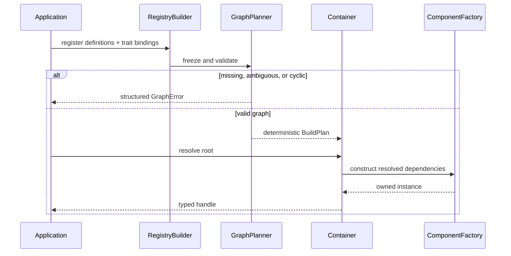

### 8.2.1 Optional link-time discovery frontend

`vernal-discovery` adopts tx-di's useful link-time metadata collection without
adopting its global auto-registration:

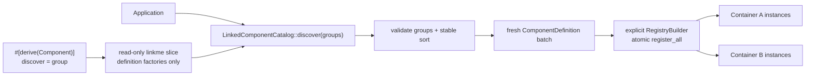

The default derive remains explicit and does not reference the discovery
crate. Opted-in components submit only `group`, a
`module_path!()::Type` declaration name, and a definition function. The
application must request every group by name. Empty, invalid, unknown, or
duplicate declarations fail closed. Selection is sorted by `(group, name)` so
linker order cannot alter Registry order. Installation reuses
`RegistryBuilder::register_all`, so an existing or intra-batch component-key
conflict commits nothing.

The static slice owns no component, Container, Scope, cache, resolver, or
runtime. One Catalog can materialize fresh definitions for multiple
applications, whose Singleton identities remain isolated. High-level Context
assembly stays explicit through
`VernalApplicationBuilder::register_all(catalog.component_definitions())`.
Consumer bridges remain explicit `ApplicationModule` transactions because
their bindings, policies, lifecycle hooks, and external objects are richer than
a component-only discovery entry.

### 8.3 Scopes

The kernel implements three construction policies:

- `Singleton`: one concurrently initialized instance per Container;
- `Transient`: a new instance for every resolution;
- `Scope::Custom(ScopeKey)`: one instance per full `ComponentKey` in an
  explicitly entered, type-identified `ScopeContext`.

Applications declare a custom component with
`ComponentDefinition::scoped::<T, ScopeMarker, _>(...)` or
`#[component(scope = ScopeMarker)]`, enter it through
`Container::open_scope::<ScopeMarker>()`, and resolve it with `resolve_in`.
Request, task, tenant, batch, or security semantics remain consumer-owned
marker types; no HTTP type enters `vernal-beans`.

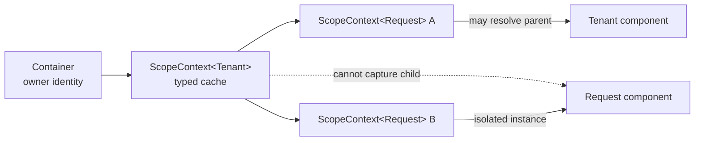

Each Scope is bound to the Container that created it, so a Context cannot carry
instances across application containers. Child resolution can see parent
scopes, while construction of a parent-scoped component is restricted to that
parent node. Singleton construction receives no custom Scope at all, preventing
a long-lived singleton from capturing a request/task instance.

The Scope lifecycle contract is explicit:

- per-component `OnceLock` caches either the first result or first error under
  concurrent resolution;
- close first rejects new resolution and cancels the Tokio cancellation token;
- close waits for synchronous factories that already started;
- asynchronous close hooks execute in reverse registration order, all hooks run
  even after an error, and the first error is returned;
- cache clearing and `Closed` transition still complete after hook failure;
- the first closer starts one Tokio coordinator task; repeated and concurrent
  callers subscribe to the same final result;
- cancelling a caller or reaching `close_with_timeout` only stops that waiter,
  while the coordinator continues releasing resources;
- each hook runs in a child task, so a hook panic is reported as a structured
  close-task error and does not skip the remaining hooks.

`ApplicationContext::open_scope` derives the Scope cancellation token from the
application cancellation tree. Scope owners still call `close().await` so
resource cleanup is observable rather than delegated to `Drop`. The high-level
builder registers `ScopeCleanupPolicy` as a native application component.
Application-owned Web scopes inherit its 30-second default bound or an explicit
bounded/unbounded policy. A timeout is an observation result, not cancellation
of the underlying cleanup.

### 8.4 Type-safe optional dependencies and deferred providers

When construction needs zero or one dependency, a component uses Rust-native
`Option<Arc<T>>` or `Option<Arc<dyn Trait>>`. Optionality comes directly from
the field type, and the derive emits matching `resolve_optional*` and
`depends_on_optional*` calls without another attribute switch:

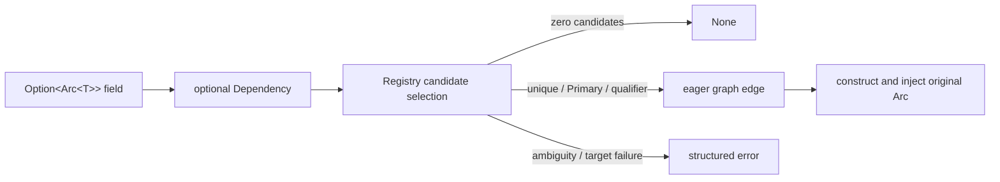

This model adopts only the “target may be absent” intent from tx-di
`try_inject`; it does not copy the behavior of converting every injection
error through `.ok()`. An existing candidate remains part of topological
ordering. Only a missing root candidate becomes `None`; ambiguity,
construction, downcast, trait projection, and scope failures remain visible.
Field qualifiers work for both concrete and trait Options.
`#[component(optional)]` remains specific to deferred providers so the type
and an attribute cannot become competing sources of truth.

When a target must be deferred until use, constructed as a transient per call,
or resolved in the caller's current request scope,
Vernal has two single-purpose Rust-native providers:

- `ComponentProvider<T>` defers a concrete component;
- `TraitProvider<dyn Trait>` defers a trait-port projection through
  `TraitBinding`.

Neither is a public alias for `Container` or a Service Locator that can query
arbitrary types. A component definition explicitly declares the matching
concrete/trait provider dependency and optional/qualified variant. The derive
macro emits the same Resolver call and dependency metadata from the field type.

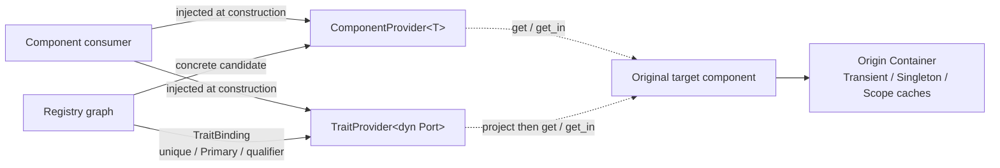

The contract is intentionally narrower than Spring's `ObjectProvider`:

- required providers reject zero candidates during graph construction, and
  both required and optional providers reject ambiguous candidates;
- optional converts only a missing root target to `None`; construction,
  downcast, and scope errors remain visible;
- a provider edge validates its candidate but does not become an eager
  topological edge, so the target is constructed only by `get`/`get_in` and a
  cycle made solely resolvable by deferred access can be broken;
- scoped targets require the caller's current `ScopeContext`, preventing a
  singleton from capturing request state;
- the provider shares the originating Container's caches, resolution tracker,
  and scope-owner identity, and rejects a scope from another Container;
- calling a provider before its consumer factory returns produces
  `ProviderUsedDuringConstruction` instead of re-entering the same singleton
  `OnceLock`;
- `TraitProvider` reuses direct `Arc<dyn Trait>` selection for a unique,
  primary, or qualified binding; optional permits no matching binding but does
  not suppress ambiguity;
- the providers are separate because stable Rust cannot safely specialize one
  generic implementation for both concrete `Any` downcasts and unsized trait
  projection; separate public types make resolution semantics explicit;
- eager `Vec<Arc<dyn Trait>>` injection remains responsible for obtaining all
  trait implementations rather than hiding a dynamic query behind a provider.

This retains useful on-demand component access while rejecting tx-di-style
broad stores and global registries. Runtime contracts cover eager Option
absence/presence, ambiguity, construction failure, and trait
primary/qualifier projection, plus Provider transients, optional targets,
scopes, cross-container rejection, construction-time re-entry rejection,
deferred cycles, and macro generation.

### 8.5 Tokio and framework-native components

Vernal does not require ecosystem objects to be wrapped in framework-specific
bean types. Any `Send + Sync + 'static` value can be registered directly,
including Tokio synchronization primitives and task handles, HTTP clients,
database pools, message clients, Tower services, framework state, and
application services.

Being usable as a component does not make its crate a kernel dependency. The
application or a `vernal-*` adapter imports the concrete framework and supplies
the `ComponentDefinition`; IoC sees only Rust types, factories, dependencies,
and scopes.

Prebuilt native objects can be added with
`ComponentDefinition::shared_value` or `ComponentDefinition::shared_arc`
without introducing wrapper types. `shared_arc` resolves the original
`Arc<T>`, not an `Arc<Arc<T>>`. Such values are shared by all containers
created from the same registry; use factory-based
`ComponentDefinition::singleton` when each container needs an isolated
instance.

Vernal is explicitly Tokio-first. Kernel crates may depend on Tokio directly
when tasks, asynchronous synchronization, time, or cancellation require it;
the framework will not invent a second runtime SPI. The IoC contract tests
register a native `tokio::runtime::Handle` and use it to run a real Tokio task.

### 8.6 Named, primary, and multiple Trait bindings

Trait bindings join the existing immutable Registry and graph rather than
enabling tx-di's former parallel Store:

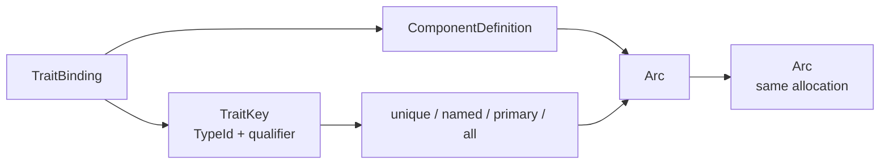

- `TraitBinding::new::<dyn T, C, _>` is checked by the Rust compiler.
- Unqualified single-value injection requires one candidate or exactly one
  primary candidate.
- A qualifier selects one named binding; duplicate names fail during
  registration.
- `resolve_all_traits` and `Vec<Arc<dyn T>>` preserve binding registration
  order and return an empty collection for zero implementations.
- Trait dependencies become real edges to their concrete targets and
  participate in missing-target, cycle, and startup-order validation.
- `register_bundle` preflights definitions and bindings together and leaves no
  partial module on failure.
- The Component derive emits the same restricted Resolver calls and explicit
  metadata for `Arc<dyn T>`, `Option<Arc<T>>`, `Option<Arc<dyn T>>`, field
  qualifiers, and `Vec<Arc<dyn T>>`.

### 8.7 Failure contract

| Error | Retry | Required diagnostic |
|:---|:---:|:---|
| Duplicate definition | No | Both origins and key |
| Missing dependency | No | Full dependency path |
| Ambiguous binding | No | Candidates and qualifiers |
| Cycle | No | Short readable cycle |
| Construction failure | Source-dependent | Component, phase, source chain |
| Closed scope | No | Scope identity and close reason |

## 9. AOP kernel

### 9.1 Two API levels

The AOP kernel serves:

1. a typed generic API for library authors and static composition;
2. a controlled type-erased heterogeneous chain for Context and macros.

Both must share ordering, short-circuit, error, and context propagation
semantics.

### 9.2 Invocation contract

`Operation` deliberately separates stable runtime identity from immutable
declaration metadata. Identity is only `component + method`, allowing a Web,
RPC, macro, or direct caller to locate the same precompiled plan without
rebuilding metadata on every request. `OperationMetadata` carries validated,
sorted, and deduplicated tags plus an optional qualifier. Duplicate
declarations with the same identity and metadata coalesce; the same identity
with different metadata fails application construction with
`OperationMetadataConflictError`.

After lookup, the plan projects its authoritative declared `Operation` onto
the invocation while retaining the invocation ID, typed context extensions,
deadline, and cancellation token. Interceptors and the target therefore see
the same immutable declaration metadata on both Send and Local execution
planes. Argument values are not captured by default. Explicit capture must
support field-level redaction. Business errors retain their source rather than
becoming strings.

Reusable pointcuts are values rather than strings interpreted on every call.
`AnyPointcut`, `OperationPointcut`, `ComponentPointcut`, and
`MethodPointcut` provide identity dimensions; `TagPointcut` and
`QualifierPointcut` match declaration metadata. `PointcutExt` composes any
built-in, custom, or closure pointcut with typed AND/OR/NOT objects.
Composition short-circuits during plan compilation; the resulting runtime plan
contains no pointcut branch or tag lookup.

### 9.3 Around flow

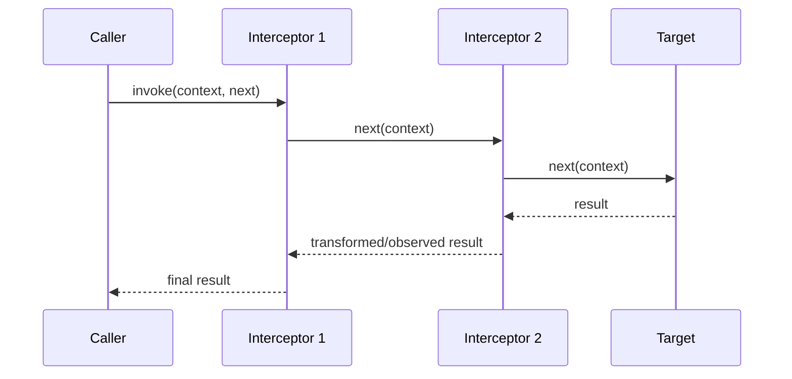

Lower `order` enters first and exits last. Equal order preserves registration
order. Pointcuts compile into immutable `InvocationPlan` values during
high-level application construction; context refresh consumes the frozen
catalog.

### 9.4 IoC-managed interceptors

Vernal supports both directly constructed `Advisor` values and `Interceptor`
components managed by the application Container. A managed advisor is
registered explicitly with `advisor_component` and resolved from the same
final Container that is transferred into `ApplicationContext`:

1. a deferred `InvocationPlanCatalog` first enters the graph as a native Rust
   object;
2. the final Container constructs interceptors and injects their Tokio,
   Environment, or business dependencies;
3. direct and component advisors retain one shared registration order;
4. pointcut compilation seals the catalog exactly once, and existing clones
   observe the final plans;
5. runtime plans retain `Arc<dyn Interceptor>` and never use the Container as a
   service locator.

Resolution failure aborts application construction before a Context is
published. This creates no bootstrap store, duplicates no singleton, and uses
no process-global instance-pointer map. `LocalInterceptor` objects also satisfy
`Send + Sync`; only call futures, targets, and values may be `!Send`, so Local
advisors support the same component resolution and one-time sealing model.
Component advisors must be singleton-scoped. Transient or custom scopes fail
application construction with a structured error, preventing a precompiled
plan from silently promoting a short-lived component to application lifetime.

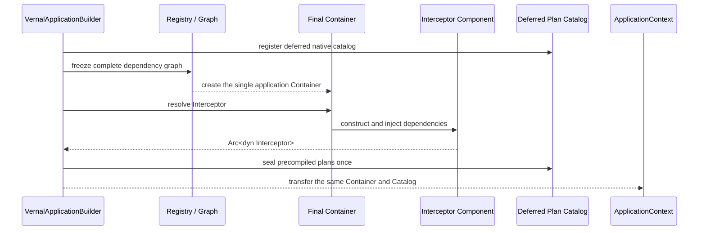

### 9.5 Two execution planes, one semantic model

Rust web frameworks do not agree that every Service future is `Send`. Vernal
therefore exposes two explicit execution planes instead of weakening either
contract:

| Plane | Interceptor chain | Target and future | Erased value |
|:---|:---|:---|:---|
| Thread-safe | `Interceptor` / `Next` / `InvocationPlan` | `Arc` target and `Send` future | `Box<dyn Any + Send + Sync>` |
| Worker-local | `LocalInterceptor` / `LocalNext` / `LocalInvocationPlan` | `Rc` target and non-`Send` future | `Box<dyn Any>` |

Both planes share `Operation`, `Invocation`, pointcut semantics, deterministic
ordering, short-circuit behavior, Tokio cancellation/deadline handling, and
request-context snapshots. Local interceptor declarations remain `Send +
Sync`, so `LocalInvocationPlanCatalog` is still a native ApplicationContext
component and its counts appear separately in startup diagnostics. A consumer
that needs both planes deliberately implements and registers both contracts;
Vernal never pretends that an arbitrary Send interceptor automatically
supports a local target.

Static Send closures remain `InvocationTarget`; a Send framework Future that
borrows call-local resources implements `BorrowedInvocationTarget`. Its Future
lifetime is tied to exclusive `&mut self` and cannot escape
`InvocationPlan::invoke_borrowed`, so Salvo retains normal `Interceptor`
contracts without cloning `Request`, `Depot`, `Response`, or `FlowCtrl`; Tide
uses the same contract to keep its borrowed router `Next` inside one plan call,
while Gotham keeps its one-shot Pipeline Chain and owned State inside the same
exclusive target lifetime. Rocket likewise keeps Request, one-shot Data, and
the lifetime-bound native Outcome inside one wrapped Route Handler call.

Static local closure targets remain `LocalInvocationTarget`. A framework
Service that borrows worker-local state for only one call instead implements
the object-safe `BorrowedLocalInvocationTarget`; its returned Future lifetime
is tied to `&self` and cannot escape `LocalInvocationPlan::invoke_borrowed`.
This keeps Ntex's `ServiceCtx` inside the current Pipeline call without
requiring `Send`, `Sync`, `'static`, cloning, or unsafe lifetime extension.

### 9.6 No instance-pointer map

Vernal does not use `self as *const Self as usize` as durable identity:

- static composition uses `Advised<T>` owning target and chain;
- context components keep plans in immutable definitions;
- web adapters obtain plans from the context and pass request-scoped
  extensions into Invocation.

Ownership and cleanup therefore follow the actual wrapper/context lifecycle.

### 9.7 Method macro safety contract

The weaving frontend exposes three receivers across two target-ownership
contracts:

1. `#[component(aop)]` requires explicit `Arc<InvocationPlanCatalog>` and
   `Arc<CancellationToken>` fields.
2. An intercepted method is `async fn` with `self: Arc<Self>`, shared `&self`,
   or exclusive `&mut self`.
3. The Arc path requires owned arguments and produces a `'static`
   `InvocationTarget`; either reference path accepts owned or borrowed
   arguments and uses `invoke_borrowed`.
4. The Arc path transfers arguments through a one-shot
   `Mutex<Option<Tuple>>`; the borrowed path stores one
   `InvocationFuture<'a>` in `BorrowedInvocationFutureTarget`. Neither path
   requires business values to implement `Clone`.
5. Both paths return `Result<T, InvocationError>`. Missing plans, repeated
   target advancement, cancellation, and return-type
   mismatches are structured errors rather than panics.
6. `#[intercept(tags = [...], qualifier = "...")]` emits one hidden,
   type-associated Operation descriptor. `operation!(Type::method)` retrieves
   that descriptor for explicit application/module assembly, so identity and
   metadata are not repeated.
7. Type, lifetime, and const generic parameters remain on the original method.
   All monomorphizations share that method's Operation identity; the business
   future still satisfies `Send`, and successful values still satisfy
   `Any + Send + Sync + 'static`.
8. Trait methods with default bodies reuse the same code generator. The macro
   adds `Self: AopComponent` only to the method rather than making the business
   Trait inherit a framework supertrait. Its hidden descriptor has
   `Self: Sized`, and `operation!(<Impl as Trait>::method)` provides explicit
   UFCS disambiguation. Abstract Trait methods are rejected because they have
   no final business target; weave the concrete impl instead.
9. Without an explicit `component`, a Trait default method creates an
   implementor-specific Operation from the final `Self` type. An explicit
   component lets implementations share one logical port identity. This is
   statically dispatched default-method weaving, not a promise of
   `dyn Trait` invocation for native `async fn in trait`; Rust's current dyn
   compatibility rules still require weaving the concrete impl before exposing
   a Trait Binding, or using an explicitly object-safe Future signature.

The owned receiver path produces a safe `'static` future. Both reference paths
bind their receiver, reference arguments, and business future to the current
method `.await`; neither fabricates `'static` nor clones the service.
`&mut self` requires a unique reference and is therefore intended for
transient or explicitly uniquely owned values. Singleton state shared through
`Arc<T>` should model mutation with locks, atomics, or channels.
`Next` remains a one-shot continuation, so repeated advancement returns
`TargetAlreadyInvoked` instead of silently repeating side effects.
The descriptor frontend statically validates tags and qualifier, while
`OperationMetadata` validates the generated declaration again as an invariant.
No global AOP descriptor inventory, AOP link-time scanner, or process-wide
mutable operation registration is introduced. Pointcuts still compile only
after the application explicitly accepts the descriptor. The separate,
component-only discovery frontend does not collect Operations or Advisors.

The macro also writes unavoidable transport capabilities into the final
method's `where` clause. Owned `self: Arc<Self>` arguments use
`OwnedInvocationArgument`; by-value and `&mut T` arguments on borrowed methods
use `BorrowedInvocationArgument`; shared `&T` targets use
`SharedInvocationArgument`; and successful values or associated outputs use
`InvocationOutput`. Blanket implementations map these names to the underlying
Send, Sync, Any, and lifetime requirements.

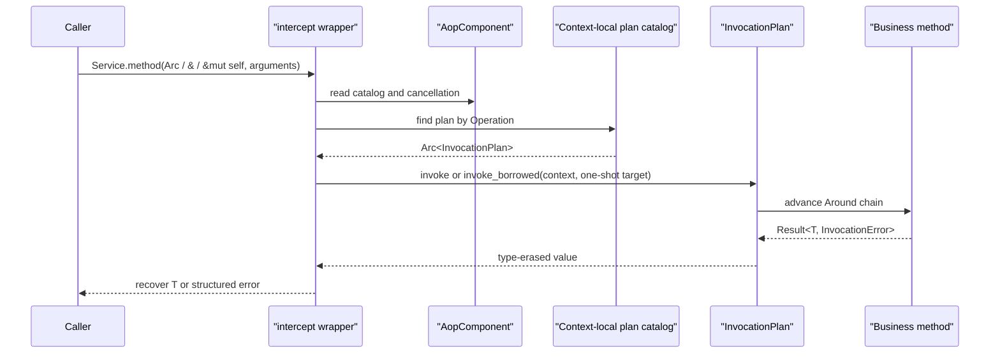

### 9.8 Tokio hot-path performance baseline

`crates/vernal-aop/benches/invocation_plan.rs` calls the production
`InvocationPlan::invoke` path; it does not duplicate or simplify the AOP
implementation. Pointcut matching, Advisor sorting, and plan compilation happen
before timing, while the fixture reuses the Invocation and target. Every
iteration still performs operation validation, declared-operation view
creation, cancellation `select!`, boxed-future dynamic dispatch, type-erased
return allocation, and `u64` downcast.

The first local evidence was recorded on 2026-07-25 with an Apple M4 Pro,
macOS 26.5, the release profile, 50 samples, and a three-second measurement
window:

| Path | Median estimate | 95% estimate interval | Interpretation |
|:---|---:|---:|:---|
| Direct async | 2.55 ns | 2.44–2.66 ns | Minimal compiler baseline on the same Tokio executor |
| Empty plan | 336 ns | 315–355 ns | Fixed Vernal per-invocation execution cost |
| One pass-through interceptor | 476 ns | 424–543 ns | Fixed cost plus one Around/Next node |
| Four pass-through interceptors | 727 ns | 661–814 ns | Fixed cost plus four Around/Next nodes |

Reproduce with:

```bash
cargo bench -p vernal-aop --bench invocation_plan -- \
  --sample-size 50 --measurement-time 3 --warm-up-time 1
```

This closes the absence-of-measurement risk, but it is neither a cross-machine
SLA nor evidence for a zero-cost claim. The direct async path is only a few
nanoseconds, so ratios are misleading; report absolute deltas and chain-length
scaling, and separate framework scheduling from real authentication, logging,
network, or storage work. Future optimization must preserve cancellation,
deadline, short circuit, error replacement, and Send/Local semantic contracts.

## 10. ApplicationContext and lifecycle

The context composes registry, container, AOP plans, ordered property sources,
profiles, build-time conditional modules, local typed events, rollback,
reverse cleanup, and read-only diagnostics. It directly uses Tokio tasks,
synchronization, time, cancellation, and signals. Configuration formats, web
servers, and external configuration centers remain adapters whose results can
implement `PropertySource` or be registered as ordinary components.

Before graph freezing, `VernalApplicationBuilder` automatically registers
eleven framework-native components:

| Built-in component | Lifecycle responsibility |
|:---|:---|
| `tokio::runtime::Handle` | Spawn work on the application runtime |
| `CancellationToken` | One application cancellation tree |
| `ManagedTaskSupervisor` | Own task handles and propagate task failures |
| `TaskShutdownPolicy` | Bound graceful wait and post-abort settlement |
| `LifecycleExecutionPolicy` | Bound initialize/start/stop and post-abort settlement |
| `SystemShutdownSignalListener` | Observe cross-platform Tokio process signals |
| `ApplicationEnvironment` | Freeze source precedence, profiles, and typed property semantics |
| `EventBus` | Context-local typed publication and per-listener Tokio broadcast receivers |
| `ScopeCleanupPolicy` | Bound application-owned Web scope cleanup waits |
| `InvocationPlanCatalog` | Immutable Send-AOP invocation plans |
| `LocalInvocationPlanCatalog` | Immutable worker-local AOP invocation plans |

`ApplicationEnvironment` adopts the reusable center of Spring Environment
without importing Java's configuration ecosystem or tx-di's global TOML:

- `add_first` and `add_last` make precedence explicit;
- `PropertySource` is format-neutral, so TOML, YAML, Hutool `.setting`,
  process-environment, and Nacos loaders remain adapters;
- active profiles replace defaults; otherwise `default` and explicit default
  profiles apply;
- `property`, `get`, and `require` support `${key:default}`, nested defaults,
  cross-source references, and Rust `FromStr` conversion;
- missing/invalid values, duplicate sources, read failures, cycles, and depth
  limits are structured `EnvironmentError` values, never normal-flow panics;
- `EnvironmentSnapshot` serializes only source names and profiles, not
  property keys or values;
- the Context and IoC components share one `Arc<ApplicationEnvironment>`, with
  no state shared across application contexts.

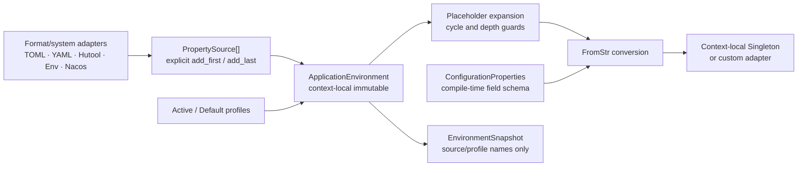

#### Type-safe configuration objects

`ConfigurationProperties` preserves tx-di's useful “bind one complete typed
configuration object” experience without inheriting its global TOML tree,
Serde-format ownership, or panic-based factory:

- `#[derive(ConfigurationProperties)]` generates exact field reads from a
  declared prefix; it does not enumerate a PropertySource or build a second
  process-global configuration tree;
- ordinary `T: FromStr` fields are required, `Option<T>` fields are optional,
  `default` supports `Default` or an explicit Rust expression, and `nested`
  composes the parent and field prefix;
- `rename` and `rename_all = "kebab-case"` adapt external naming without
  adding relaxed, ambiguous key matching to the runtime;
- `component_definition()` declares `ApplicationEnvironment` as a real graph
  dependency and constructs one Container-local Singleton through the normal
  restricted Resolver;
- standalone `Container` use binds on first resolution, while
  `ApplicationContext::refresh()` warms every singleton and therefore validates
  configuration before entering `Refreshed`;
- `VernalApplicationBuilder`, `ApplicationModuleRegistrar`, and
  `ConditionalComponentModule` expose the same
  `configuration_properties::<T>()` registration contract;
- `ConfigurationPropertiesError` reports type, field, and key while keeping
  values out of `Display` and `Debug`.

This schema-driven design is deliberate: `PropertySource` remains a secure
point-lookup port and need not reveal all keys. Hutool-Rust keeps ownership of
`.setting` loading and flattening. Sa-Token-Rust can derive an intermediate
properties object where fields implement `FromStr`, while its existing custom
binder remains appropriate when values must be translated through a
domain-specific builder or enum parser.

Hutool-Rust may convert `Profile`/`SettingLoader` output into a
`MapPropertySource`; a Sa-Token-Rust bridge may read its keys and then construct
`SaTokenConfigBuilder`. Vernal knows neither consumer type.

### Explicit application modules

`ApplicationModule` is the public assembly SPI for application-owned starters
and ecosystem bridges. Its `configure` method writes only to an isolated
`ApplicationModuleRegistrar`, which can collect component definitions, Trait
bindings, lifecycle registrations, managed event listeners, application runners,
scheduled tasks,
Send/Local advisors, AOP operations,
property sources, active/default profiles, and explicit
`ConditionalComponentModule` values.

`VernalApplicationBuilder::register_module` treats those contributions as one
named transaction:

1. validate the static module identity and reject a previously committed name;
2. run module configuration in the isolated registrar;
3. validate every nested conditional identity against both the application and
   the current module batch;
4. apply environment contributions to a cloned
   `ApplicationEnvironmentBuilder`;
5. validate and commit definitions plus bindings through the atomic IoC
   `register_bundle`;
6. only after every preflight succeeds, move lifecycle, event listener, runner,
   scheduled-task,
   AOP, operation,
   Environment, and conditional contributions into the real application
   builder.

A failed configuration, duplicate/invalid conditional identity, duplicate
property source, invalid profile, or Definition/Binding conflict leaves no
module prefix behind and does not reserve the module name, so a corrected
module may be retried. Nested conditions are evaluated later against the same
final Environment that includes their outer module's sources and profiles.
Declaration order is preserved. Modules are explicit link-time Rust
composition—not classpath scanning, global inventory tables, or a reverse
dependency from Vernal into Hutool-Rust, Sa-Token-Rust, Ddd4r, or a web
framework.

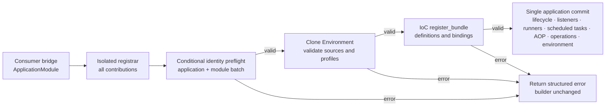

### Conditional component assembly

`vernal-context` evaluates conditions because it owns both the frozen
Environment and application assembly; `vernal-beans` remains a format-neutral
container and never depends on Profile or property semantics.

- `ComponentCondition` is the extension contract and receives only the frozen
  `ApplicationEnvironment`;
- `ProfileCondition` supports any/all/none effective-profile matching;
- `PropertyCondition` supports present/missing/equal/not-equal and explicit
  match-if-missing semantics after placeholder resolution;
- `PredicateCondition` adapts a custom, thread-safe closure without exposing
  captured data to diagnostics;
- `ConditionalComponentModule` atomically groups definitions, Trait bindings,
  lifecycle registrations, event listener declarations, application runner
  declarations, and scheduled-task declarations under one condition;
- evaluation happens once, in module registration order, after Environment
  freeze and before graph planning;
- a false condition omits the entire module. An unconditional component that
  still requires an omitted component therefore produces the ordinary
  `GraphError::MissingDependency` instead of a silent fallback;
- `ConditionEvaluationSnapshot` records only static module/condition names,
  match state, component type identifiers, and declaration counts. Property
  keys, expected values, resolved values, and source errors are excluded;
- condition failures stop the build. Normal `Display`/`Debug` output is
  redacted, while an explicit `Error::source` walk retains the root cause.

This is not Spring Boot classpath scanning or automatic configuration
discovery. Applications and ecosystem adapters explicitly register modules,
which keeps feature ownership, dependency cost, and replacement rules visible
in Rust code.

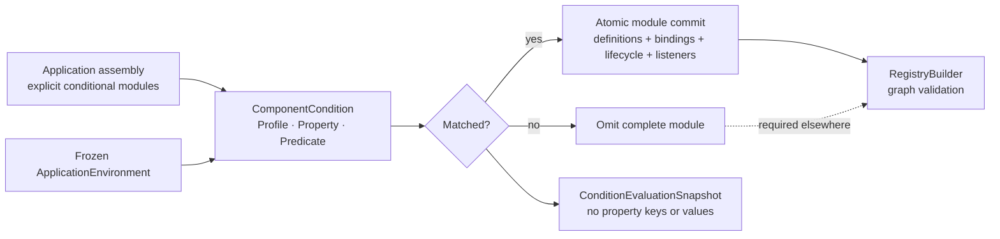

Components declare them with ordinary `depends_on::<T>()` metadata, and the
context plus container receive the same `Arc<T>` instances. The lower-level
`Registry -> ApplicationContextBuilder` path remains available for library
composition that does not want runtime capture or built-in registration.

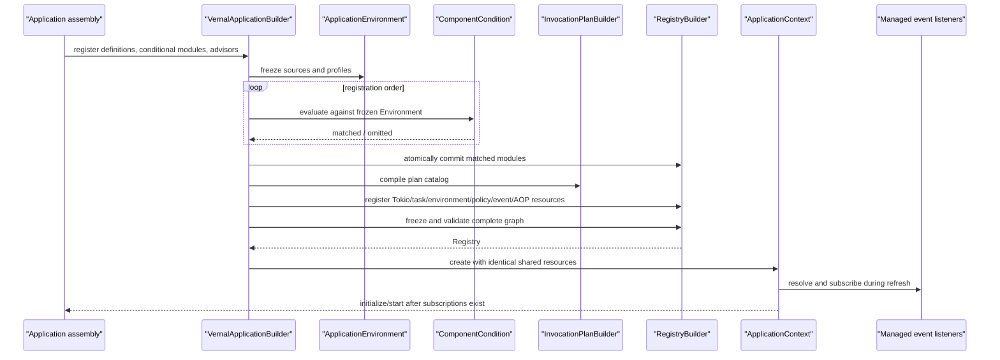

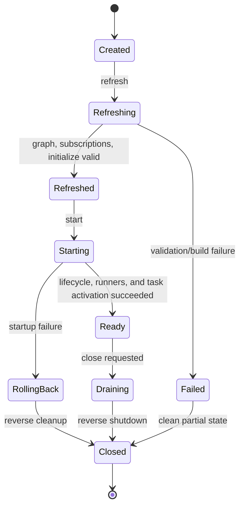

Lifecycle order:

```text
register → freeze → validate graph and pointcuts
→ construct singletons → resolve/subscribe listeners → initialize
→ commit Refreshed → publish ApplicationRefreshedEvent
→ start lifecycle components → run application runners in dependency order
→ activate scheduled tasks in dependency order
→ commit Ready → publish ApplicationReadyEvent
→ cancel and drain managed tasks → reverse stop → release scopes
```

Failures record completed steps and roll back only successful components.
`close()` is idempotent.

### IoC-managed application event listeners

`EventBus` remains a small, Context-local typed publisher. Listener ownership is
composed by `vernal-context` instead of being embedded in IoC or AOP:

- `ApplicationEventListener<E>` is implemented by an ordinary Rust component;
- the component must be Singleton because its `Arc<L>` is retained by a
  Context-level task; Transient and custom Scope definitions are rejected;
- `VernalApplicationBuilder`, `ApplicationModuleRegistrar`, and
  `ConditionalComponentModule` expose the same typed listener declaration;
- `refresh()` warms all singletons, resolves listener components in dependency
  plan order, awaits every `EventBus::subscribe::<E>()`, and only then runs
  lifecycle `initialize()`;
- each declaration receives its own Tokio broadcast receiver, so multiple
  listeners observe the same `Arc<E>` without cloning the event body;
- delivery between independent listeners is concurrent and has no global
  ordering guarantee; one listener processes its own events serially;
- a handler error or `RecvError::Lagged` returns `EventListenerError` from the
  managed task. The supervisor records the first failure, stops accepting work,
  and cancels the application rather than silently losing a security or domain
  event;
- cancellation wins in the listener `select!`; Context close then drains or
  aborts the task under `TaskShutdownPolicy`.

The Context itself emits two deliberately small lifecycle facts:

- `ApplicationRefreshedEvent` follows the successful `Refreshed` state commit,
  after singleton warm-up, all subscriptions, and lifecycle initialization;
- `ApplicationReadyEvent` follows the successful `Ready` state commit, after
  every required lifecycle component starts and every application runner
  succeeds, and every scheduled task is accepted by the task supervisor;
- publication is asynchronous queueing, not a startup completion barrier.
  Independent listeners have no cross-listener completion order, and handler
  failures follow the managed-task cancellation path;
- a failed refresh/start emits no corresponding fact;
- no `ApplicationClosedEvent` exists: publishing after task drain has no
  consumers, while publishing before cancellation cannot guarantee delivery.
  A close result and `ContextState::Closed` remain the truthful shutdown
  contract.

```mermaid
sequenceDiagram
    participant App as "Application assembly"
    participant Context as "ApplicationStartupCoordinator"
    participant IoC as "Container"
    participant Bus as "EventBus"
    participant Tasks as "ManagedTaskSupervisor"
    participant Lifecycle as "Lifecycle component"
    participant Runner as "ApplicationRunner"
    participant Scheduled as "ScheduledTask"

    App->>Context: refresh()
    Context->>IoC: warm up Singletons
    loop dependency-plan listener order
        Context->>IoC: resolve Arc&lt;Listener&gt;
        Context->>Bus: subscribe&lt;Event&gt;().await
        Context->>Tasks: spawn listener consumer
    end
    Context->>Lifecycle: initialize()
    Context->>Context: commit Refreshed
    Context->>Bus: publish(ApplicationRefreshedEvent)
    Context->>Lifecycle: start()
    loop dependency-plan runner order
        Context->>Runner: run(child cancellation)
    end
    loop dependency-plan scheduled-task order
        Context->>Scheduled: resolve plan and activate
        Scheduled->>Tasks: spawn fixed-delay / fixed-rate loop
    end
    Context->>Context: commit Ready
    Context->>Bus: publish(ApplicationReadyEvent)
    Bus-->>Tasks: Arc&lt;typed event&gt;
    Tasks->>IoC: listener.on_event(event)
    alt handler error or lag
        Tasks->>Tasks: retain first structured failure
        Tasks-->>Context: cancel application
    else application close
        Context->>Tasks: cancel, drain, bounded abort
    end
```

This closes gaps observed in the source projects without copying their
ownership flaws: tx_di callbacks detach Tokio tasks and expose lifecycle
callbacks around global application state; Sa-Token-Rust snapshots
subsystem-owned security listeners; Hutool-Rust utilities keep local listener
collections; and Ddd4r exposes replaceable event publisher ports. Their domain
event models stay in the consumer libraries. Vernal generalizes only
Context-state facts, component resolution, typed in-process delivery, task
ownership, and failure semantics.

### IoC-managed application runners

`ApplicationRunner` represents finite startup work after infrastructure has
started but before the application claims readiness:

- the implementation is an ordinary IoC Singleton and may inject framework
  resources or consumer-owned services;
- direct, qualified, `ApplicationModuleRegistrar`, and
  `ConditionalComponentModule` declarations produce the same managed plan;
- runners are sorted by the frozen component dependency plan and execute
  sequentially. Registration order does not override dependencies;
- each invocation receives a child of the application cancellation token and
  runs in an isolated Tokio task under
  `LifecycleExecutionPolicy::start_timeout()` plus the abort settlement budget;
- an error, panic, timeout, or cancellation stops later runners, records a
  redacted startup observation, cancels the application, drains managed tasks,
  and reverse-stops initialized lifecycle components;
- `ApplicationRunnerFailure` keeps ordinary `Display`/`Debug` free of the
  business error body while an explicit `Error::source` walk retains the root
  cause;
- a runner owns no long-lived task. Workers, schedulers, configuration watches,
  and consumers must be registered with `ManagedTaskSupervisor`.

Sa-Token-Rust can use a runner to warm authorization state, Ddd4r to verify or
recover projection checkpoints, and Hutool-Rust integration modules to preload
resources. Vernal owns ordering, cancellation, budget, diagnostics, and
rollback—not those domain algorithms.

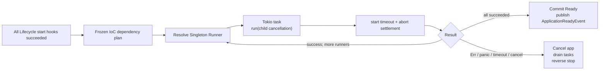

### IoC-managed scheduled tasks

`ScheduledTask` represents in-process periodic work for the lifetime of an
application. It closes the ownership gap in tx_di plugins that spawn nested
Tokio tasks, lose child handles, swallow loop failures, and distribute shutdown
policy, without turning Vernal into a job platform:

- the implementation is an ordinary IoC Singleton and may inject framework
  resources or consumer services;
- `TaskSchedule` provides validated non-zero fixed-delay and fixed-rate plans
  with an optional initial delay. Cron, time zones, persistence, distributed
  election, compensation, and job scripting stay outside Vernal;
- fixed delay waits after completion; fixed rate follows one time line and
  uses Tokio `MissedTickBehavior::Skip` instead of burst catch-up;
- one task executes serially without re-entry, while different task components
  may run concurrently after deterministic dependency-plan activation;
- direct, qualified, application-module, and conditional-module declarations
  share Definition, Singleton, duplicate, and dependency-order validation;
- Context activates tasks after all runners succeed and before committing
  `Ready`. Activation proves supervision, not a successful first tick;
- execution errors, panic, or unexpected cancellation are retained by
  `ManagedTaskSupervisor` and cancel the application; normal close reuses
  `TaskShutdownPolicy` graceful wait and bounded abort;
- `ScheduledTaskFailure` redacts default output while preserving the explicit
  `Error::source` chain.

Work required for readiness remains an `ApplicationRunner`. Sa-Token-Rust
session cleanup, Ddd4r Outbox/projection polling, and Hutool-Rust cache
maintenance may use this contract, while their algorithms, transactions,
retries, and job data remain consumer-owned.

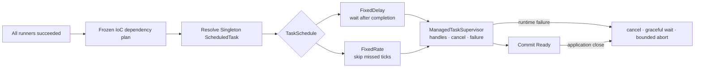

### Application lifecycle ownership

`ApplicationContext` is a public facade rather than the owner of a temporary
caller Future. `ApplicationStartupCoordinator` runs refresh/initialize/start
inside a Tokio task, while a second observer task always consumes its Join
result. Cancelling a waiter only drops the one-shot result receiver; the phase
still commits success or performs reverse rollback after failure, panic, or
application cancellation.

```mermaid
flowchart LR
    Caller["refresh / start caller"] --> Receiver["One-shot result receiver"]
    Caller -.->|"cancel wait"| Dropped["Drop receiver only"]
    Startup["ApplicationStartupCoordinator"] --> Operation["Tokio phase task"]
    Startup --> Observer["Tokio observer task"]
    Operation --> Hooks["initialize / start hooks / application runners"]
    Hooks --> Budget["LifecycleExecutionPolicy budget"]
    Budget -->|"success"| Commit["Commit Refreshed / Ready"]
    Budget -->|"Err / panic / timeout / app cancellation"| Rollback["Cancel app + reverse stop"]
    Operation --> Observer
    Observer --> Receiver
    Dropped -.->|"does not affect"| Operation
```

Each user initialize/start hook also runs in an isolated child task, so panic
becomes a component-and-phase `ContextError::Lifecycle` instead of terminating
the coordinator. `LifecycleExecutionPolicy` gives initialize, start, and stop
independent execution budgets plus a post-abort settlement budget. A timeout
first requests Tokio abort, consumes the `JoinHandle` within the settlement
budget, emits a redacted warning code, and then performs or continues reverse
cleanup. Components enter the shared stack before initialize, leaving rollback
with an explicit owner.

Tokio abort is cooperative. Lifecycle hooks must stay asynchronous and yield;
blocking work belongs in a component-owned `spawn_blocking` task with its own
cancellation/settlement contract. Vernal reports whether an aborted hook
settled, but cannot claim thread-level forced termination. This retains tx-di's
readable explicit phases and bounded shutdown intent without copying its global
App, implicit task ownership, or an unobserved timed-out `JoinHandle`.

`ApplicationContext::close()` starts and observes shutdown, while one
Context-local Tokio coordinator owns the component stack and the actual
release flow. Cancelling a caller Future therefore does not cancel resource
release. Concurrent and later callers subscribe to the same cloneable result
and never execute `stop` twice.

```mermaid
sequenceDiagram
    participant Caller as "First close caller"
    participant Coordinator as "Close coordinator"
    participant Tasks as "ManagedTaskSupervisor"
    participant Components as "Reverse component stack"
    participant Later as "Later caller"
    Caller->>Coordinator: Start unique Tokio close task
    Caller--xCaller: Waiting Future is cancelled
    Coordinator->>Tasks: Cancel + drain / abort
    Coordinator->>Components: Run isolated stop hooks
    Note over Coordinator,Components: A panicking hook becomes an error; later hooks continue
    Coordinator->>Coordinator: Publish Closed and shared result
    Later->>Coordinator: close()
    Coordinator-->>Later: Return the same result
```

`run_until_cancelled()` is the minimal service run-loop boundary.
`run_until_shutdown_signal()` adds a race between the same application token
and `SystemShutdownSignalListener`: Ctrl-C, Unix SIGTERM/SIGHUP, and Windows
console events enter one close coordinator. A received signal is first
published as a typed `ApplicationShutdownSignal` event, then cancellation is
broadcast immediately. Signal registration and stream failures become
`ContextError::ShutdownSignal`; Vernal still cancels and closes conservatively
instead of panicking or leaving a running application without supervision.
The listener is one of eleven framework-native IoC components, not a global
runtime or process-wide Context.

```mermaid
flowchart LR
    Managed["Managed task failure"] --> Cancel["Application CancellationToken"]
    Host["Embedded host cancellation"] --> Cancel
    OS["Ctrl-C / SIGTERM / SIGHUP / Windows"] --> Listener["SystemShutdownSignalListener"]
    Listener --> Event["Publish ApplicationShutdownSignal"]
    Event --> Cancel
    Cancel --> Close["Unique close coordinator"]
    Close --> Drain["Drain tasks + reverse stop"]
```

### Managed Tokio task ownership

`ManagedTaskSupervisor` is the Context-owned boundary for long-running workers,
message consumers, configuration watchers, and utility schedulers such as a
Hutool-Rust Cron driver. It does not implement those products; it owns their
Tokio task lifecycle.

```mermaid
flowchart LR
    Component["IoC component"] -->|"spawn(static name, Future)"| Supervisor["ManagedTaskSupervisor"]
    Supervisor --> Runtime["Tokio Handle"]
    Runtime --> Task["User task"]
    Task -->|"Ok"| Completed["Remove from active table"]
    Task -->|"Err / panic / unexpected cancel"| Failure["Store first structured failure"]
    Failure --> Cancel["Cancel application token"]
    Context["ApplicationContext.close"] --> Cancel
    Cancel --> Grace["Graceful wait"]
    Grace -->|"timeout"| Abort["Abort remaining tasks"]
    Grace -->|"settled"| Stop["Reverse component stop"]
    Abort --> Stop
```

The first failure stops new task admission and cancels the application.
Shutdown is itself cancellation-safe: one Tokio coordinator owns the two-stage
wait, while all callers subscribe to one result. The default policy waits 30
seconds after cancellation, aborts remaining tasks, then allows one second for
their observers to settle. Task names are static low-cardinality strings.
Diagnostics record only `context.managed-task.shutdown-failed`; raw error text
stays in the explicit `ManagedTaskError` chain.

## 11. Web, HTTP, and framework integration

Vernal reuses Spring's separation of responsibilities, not its JVM product
names. Rust web frameworks generally expose async handlers, while streaming is
a capability of HTTP bodies, RPC calls, SSE, and WebSocket connections rather
than a separate application model.

| Layer | Vernal crate | Contract | Boundary |
|:---|:---|:---|:---|
| Web application | `vernal-web` | Request context, request scope, handler invocation, extraction, validation, error mapping | No transport or framework types |
| HTTP protocol | `vernal-http` | Request, response, body frames, streaming, cancellation, backpressure | Uses Rust `Future`/`Stream`; owns no runtime |
| Conformance | `vernal-web-testkit` | Shared Context/IoC binding plus success, policy-error, and response-drop scope cleanup assertions | Adapter development dependency only; absent from runtime graphs |

```mermaid
flowchart TD
    Core["Invocation / ApplicationContext"]
    Web["vernal-web common contracts"]
    Http["vernal-http protocol contracts"]
    Tower["vernal-tower"]
    Hyper["vernal-hyper"]
    Testkit["vernal-web-testkit"]
    HttpAdapters["Nine HTTP framework adapters"]
    Tonic["vernal-tonic RPC adapter"]

    Web --> Core
    Http --> Web
    Tower --> Web
    Hyper --> Http
    Testkit -. verifies .-> Web
    HttpAdapters --> Http
    HttpAdapters --> Tower
    Tonic --> Tower
```

The versioned coverage set is owned by
[`web-integration-manifest.toml`](../web-integration-manifest.toml):

| Priority | Framework | Crate | Protocol/capabilities | Target mechanism |
|:---:|:---|:---|:---|:---|
| 1 | Axum | `vernal-axum` | HTTP, body streaming, Tower | Tower Layer, Service, extractor/context bridge |
| 2 | Actix Web | `vernal-actix-web` | HTTP, body streaming, strict Local-AOP | Transform/Service middleware, app data, matched resource pattern |
| 3 | Rocket | `vernal-rocket` | HTTP request/response, optional streaming, strict AOP | Fairing, request guard, wrapped Route Handler |
| 4 | Warp | `vernal-warp` | HTTP, body streaming, strict AOP | Filter composition, explicit route pattern, Tower Service |
| 5 | Salvo | `vernal-salvo` | HTTP, body streaming, strict AOP | Handler, Hoop, matched path, borrowed Send target |
| 6 | Poem | `vernal-poem` | HTTP, body streaming, strict AOP | Middleware, Endpoint, request data |
| 7 | Ntex | `vernal-ntex` | Network HTTP, body streaming, strict Local-AOP | Service/middleware, explicit resource pattern, borrowed worker-local target |
| 8 | Gotham | `vernal-gotham` | HTTP request/response, strict AOP | State middleware, explicit route pattern, borrowed Pipeline Chain |
| 9 | Tide | `vernal-tide` | HTTP, body streaming, strict AOP | Middleware, explicit route pattern, borrowed Next |
| 10 | Tonic | `vernal-tonic` | gRPC / RPC streaming | Tower Service, interceptor, extensions |

Tower and Hyper are foundations and do not consume two slots in the ten-target
set. Tonic is explicitly RPC rather than an HTTP router. The selection is a
versioned coverage priority derived from the reviewed local integration
superset and current registry presence, not an objective universal popularity
ranking.

The workspace has fifteen web-related crates: `vernal-web`, `vernal-http`,
Tower/Hyper, `vernal-web-testkit`, and ten adapters. The four runtime
foundations provide callable
request-scope, HTTP frame/trailer, metadata/cancellation propagation, Tower
lifecycle, AOP invocation, configurable native error recovery, and Hyper
transport behavior. The shared testkit now makes all ten adapters verify that
their native Context, scope, and extracted component share one IoC
`ScopeContext`. Its observation-only probe also verifies adapter-owned cleanup
after normal body completion, policy short-circuit, and response-body drop.
Axum adds native
Router assembly and typed extractors;
Actix Web adds App Data/Extensions, body-aware middleware, and strict Around
interception for its `Rc`-based non-`Send` services through Vernal Local-AOP.
Strict middleware wraps a concrete Resource after matching, uses the
low-cardinality resource pattern as operation identity, fail-closes missing
metadata/plans, and preserves native Actix errors. Rocket adds managed state,
request guards, a body-aware fairing, owned request snapshots, and fail-closed
strict Send-AOP over unmodified Route handlers while preserving
Success/Error/Forward Outcomes; Warp adds extension
filters, an official Tower Service lifecycle, owned request snapshots, and
fail-closed strict Send-AOP for a concrete Filter Service using an explicit
low-cardinality route pattern; Salvo adds a Hoop, typed
Depot access, frame/trailer-preserving body lifecycle, matched-path operation
identity, owned request snapshots, and fail-closed strict Send-AOP over its
complete borrowed Handler chain; Poem adds
Middleware/Endpoint, request-extension extractors, body lifecycle integration,
and strict Around AOP using matched low-cardinality `PathPattern` metadata;
Ntex adds native Middleware/Service, App State/Extensions, typed extractors,
response-body lifecycle integration, and strict Local-AOP over the complete
borrowed `ServiceCtx` future. Because Ntex does not expose matched
`ResourceDef` metadata publicly, middleware wraps a concrete resource and
receives the same full low-cardinality path pattern explicitly; missing plans
fail closed, the request is never cloned, and native Service errors are
preserved. Gotham adds native
  StateData, type-safe State access, Pipeline middleware, a frame/trailer body
  lifecycle, owned request snapshots, and fail-closed strict Send-AOP over the
  complete borrowed Pipeline Chain using an explicit low-cardinality route
  pattern; Tide adds native Middleware, typed Request Extension access,
  reader-bound Scope cleanup, owned cross-model request snapshots, and
  fail-closed strict Send-AOP over a borrowed `Next` with an explicit
  low-cardinality route pattern; Tonic adds native Request/Metadata/Status and
  Tower integration.
The detailed contract is
[Vernal Web Architecture](./Vernal-Web-Architecture.md).

## 12. Consumer integrations

### 12.1 Hutool-Rust

Hutool-Rust remains a utility library. Its Reqwest-based HTTP client
interceptors may use `vernal-aop`, but Hutool-Rust must not own server
ApplicationContext or become a Vernal kernel dependency.

The local Hutool-Rust checkout now contains a consumer-owned, unpublished
`hutool-vernal` bridge. Consumer commit `14ce41a` pins Vernal revision
`d6b1f04` and atomically registers Hutool `HttpConfig` and the Tokio/Reqwest
`HttpClient` as a named
`ApplicationModule` of container-local singletons, exposes explicit URL/SSRF
policy selection, and keeps the configuration edge visible to Vernal graph
validation. `HutoolApplicationModule` can compose that HTTP graph, multiple
immutable Setting sources, and active/default profiles as one consumer-owned
transaction. `HutoolSettingPropertySource` additionally loads a real Hutool
Profile/Setting document, freezes it as a Vernal PropertySource, maps named
groups to dotted keys, and rejects flattened collisions atomically.

Five bridge tests prove singleton resolution, duplicate module rejection,
local-target rejection before network I/O, full HTTP/Setting/Profile assembly,
and rollback plus same-name retry after a Definition conflict. The consumer
bridge is committed and pushed in the Hutool-Rust repository.

### 12.2 Sa-Token-Rust

Sa-Token-Rust is the only retained security integration target. Vernal will
register its manager/runtime graph as explicit components, compose its shared
authentication flow as framework middleware or interceptors, and propagate the
result through request scope. Token, session, role, permission, cookie, and
401/403 semantics remain owned by Sa-Token-Rust.

`sa-token-vernal` is now implemented in the Sa-Token-Rust repository as a
consumer-owned, unpublished bridge. It pins a verified Vernal Git revision,
adapts `HttpRequestSnapshot` to `SaRequest`, projects authenticated roles into
`SecurityPrincipal`, and runs downstream futures inside request-level
`SaTokenContext`. `SaTokenComponents` is the named `sa-token.security`
`ApplicationModule`. It preserves the caller's exact `Arc<SaTokenManager>`,
bridge, and policy identities, then atomically installs those definitions plus
matching Send and Local authentication/authorization Advisors. Duplicate module
names or component definitions reject the complete transaction without leaking
partial plans. `VernalSaTokenInterceptor` authenticates, then enforces
operation-scoped all/any role and permission requirements, including Sa-Token
global and prefix wildcard semantics, across the complete Tokio invocation
future. Anonymous protected calls return 401, authenticated but insufficient
calls return 403, and backend failures remain internal 500 errors. Axum, Poem,
and Tonic adapters translate these `WebFailure` values into native HTTP/gRPC
failures. `PathAuthConfig` remains the sole source of path login policy. Its
existing ten plugin families remain input evidence for the Vernal adapter
matrix, not code that Vernal silently vendors.

`VernalSaTokenConfigBinder` now maps an immutable `ApplicationEnvironment` to
Sa-Token's native `SaTokenConfigBuilder`. It supports the builder's stable
scalar and enum settings, preserves Sa-Token defaults for missing keys, and
redacts invalid values. Storage, listeners, manager creation, and runtime
installation remain explicit Sa-Token concerns. Twelve bridge tests, including
module and definition rollback contracts, and two configuration binding tests
pass together in the target crate.

Vernal independently tests its side of this integration contract without a
dependency on Sa-Token-Rust. `SecurityContractInterceptor` proves authenticated
principal projection and redacted anonymous 401/authenticated 403 failures
through both Send and Local AOP. Axum and Actix Web expose that principal to
their native success handlers. The nine HTTP adapter suites translate
authenticated denial into native HTTP 403, with Tonic using gRPC
`PermissionDenied(7)`.
This evidence is process-local; a live-socket test and rebuilding the
consumer-owned bridge against the latest Vernal revision remain separate
cross-repository gates.

### 12.3 Ddd4r

Ddd4r now owns an unpublished, consumer-side `ddd4r-vernal` bridge pinned to a
verified Vernal Git revision. It atomically installs the caller's native
`Registry` and `DefaultCommandBus` while preserving their exact `Arc`
identities, producing an explicit
`Registry + DefaultCommandBus -> VernalDdd4rBridge` graph.

At each asynchronous entry point, the bridge creates an isolated shallow
registry snapshot and enters Ddd4r's own Tokio task-local `ContextScope`.
Request identities, tenants, transactions, and repository overrides remain
visible across `.await` without leaking after scope exit. Vernal composes
services and cross-cutting contracts; Ddd4r retains aggregates, domain events,
CQRS, repositories, outbox, and transaction semantics, and `ddd4r-core` does
not depend on Vernal.

```mermaid
flowchart LR
    Components["Ddd4rComponents"] --> VC["Vernal Context"]
    VC --> Registry["Ddd4r Registry"]
    VC --> Bus["DefaultCommandBus"]
    Registry --> Bridge["VernalDdd4rBridge"]
    Bus --> Bridge
    Bridge -->|"snapshot per async entry"| Scope["Tokio ContextScope"]
    Scope --> Domain["Repository / Event / Runtime facades"]
```

A real Tokio test in an isolated dependency graph proves native `Arc` identity,
task-local resolution after `yield_now().await`, request-service cleanup after
scope exit, and atomic duplicate-bundle rejection. Clippy with `-D warnings`
and Rustdoc also pass for the target crate. Full Ddd4r workspace verification
remains blocked by a pre-existing, currently unavailable `rbatis-r2dbc` Git
revision; this is neither reported as a bridge failure nor as a passing
workspace gate.

## 13. Security, privacy, and global state

| Risk | Default policy | Acceptance |
|:---|:---|:---|
| Sensitive invocation arguments | Do not capture values by default | Redaction and opt-in tests |
| Faulty interceptor blocks a chain | Deadline, cancellation, error boundary | Timeout/cancellation tests |
| Cross-context leakage | No process-global mutable authority | Parallel isolation tests |
| Macro exposes private fields | Generate minimum metadata | trybuild and token snapshots |
| Feature supply-chain growth | Independent adapters, minimal defaults | cargo tree / deny |
| Unsafe in workspace | `unsafe_code = "forbid"` | Compile/Clippy gate |

The unsafe rule covers Vernal-owned source, not the entire third-party graph.

## 14. Errors, reliability, and diagnostics

| Category | Examples | Caller action |
|:---|:---|:---|
| Definition | Duplicate, invalid qualifier | Fix registration |
| Condition | Invalid module, evaluation failure | Fix explicit assembly or inspect source |
| Graph | Missing, ambiguous, cyclic | Fix dependency relation |
| Resolution | Constructor failure, closed scope | Inspect source or stop use |
| Interception | Rejection, pointcut, chain failure | Follow business error contract |
| Lifecycle | Init/start/close failure | Roll back or report degraded |
| Adapter | Conversion or missing context | Return stable native error |

A context refresh now produces a serializable, read-only, redacted report
containing version/features, PropertySource/profile names, conditional module
outcomes, definition and scope counts, graph summary, pointcut matches,
lifecycle timing/failures, adapter state, warnings, and unused definitions.

```mermaid
flowchart LR
    Registry["Registry<br/>definitions + bindings + BuildPlan"]
    Catalog["InvocationPlanCatalog"]
    Environment["ApplicationEnvironment<br/>source names + profiles"]
    Conditions["Condition evaluations<br/>module/type/match only"]
    Static["Static diagnostics<br/>features / adapters / external / warnings"]
    Lifecycle["Context state machine<br/>warm-up / resolve / init / start / stop"]
    Snapshot["RegistrySnapshot<br/>owned read-only value"]
    Report["StartupReport<br/>owned redacted value"]
    Output["Serde serializer<br/>logs / admin endpoints / tests"]

    Registry -->|"reuse validated order"| Snapshot
    Snapshot --> Report
    Catalog -->|"plan and interceptor slot counts"| Report
    Environment -->|"EnvironmentSnapshot<br/>no keys or values"| Report
    Conditions -->|"no property keys/values/errors"| Report
    Static --> Report
    Lifecycle -->|"phase, outcome, microseconds"| Report
    Report --> Output
```

The implemented contract is:

- `Registry::snapshot()` follows the real dependency-first build order without
  rerunning graph planning or exposing factories, upcast closures, instances,
  or addresses.
- `ApplicationContext::startup_report().await` returns an owned clone that
  later start/close operations cannot mutate.
- `EnvironmentSnapshot` contains only PropertySource names and profiles;
  property keys, values, and resolved placeholder results never enter
  `StartupReport`.
- `ConditionEvaluationSnapshot` includes matched and omitted modules but never
  condition property keys, expected/resolved values, or evaluation errors.
- warm-up, component resolution, initialize, start, and stop record stable
  phases, subjects, outcomes, and microsecond durations.
- raw error chains remain available through `ContextError::source`; the report
  type has no `error_message` field.
- features and warnings use static names/codes; adapters and external
  dependencies accept only a name and fixed `DiagnosticState`, not connection
  strings, tokens, or arbitrary error details.
- `ApplicationContext::record_runtime_warning` adds a static code to the
  context-local report with stable sorting and deduplication. An application-
  bound `WebRequestScope` uses it to retain
  `web.request-scope.cleanup-failed` when asynchronous close hooks fail,
  including body-drop paths that can no longer return a response error.
- unused definitions come from successful resolution records isolated to each
  Container. Failed resolution does not count as usage, and output follows the
  validated build order rather than graph-indegree heuristics. Adapter
  auto-discovery is still delegated to future integration-crate wiring;
  applications can register current states explicitly.

## 15. Verification and acceptance

| Level | Required evidence |
|:---|:---|
| Static | Crate direction, Tokio feature budget, and no concrete Web/ORM implementation in generic kernels |
| Unit | Graph, qualifier, ordering, scope, state machine |
| Property | Deterministic planning and cycle detection for arbitrary graphs |
| Compile | Macro diagnostics, bounds, lifetimes, generics |
| Concurrency | Once-only singleton, context isolation, close races |
| Contract | Typed and dynamic AOP have identical semantics |
| Web conformance | Equivalent policy result across frameworks |
| Consumer integration | No reverse dependency from bridges |
| Benchmark | Measured resolution, chain depth, startup graph only |

Phase 1 minimum acceptance:

1. Deterministically plan a 1,000-node DAG.
2. Missing, ambiguous, and cycle errors contain readable paths.
3. Parallel containers do not share singleton instances.
4. `cargo tree` proves no concrete web or ORM framework in `vernal-beans`;
   Tokio is allowed when needed.
5. Normal failures use `Result`, not panic.

As of 2026-07-25, all five items have local evidence: 55 IoC contract tests
cover a 1,000-node graph, missing/ambiguous/cycle paths, singleton isolation
across two concurrent containers, transient creation, qualifiers, hidden
dependency rejection, native-value registration, a real task spawned through
an injected Tokio handle, eager Option dependencies, concrete/trait Providers,
named/primary/all Trait bindings, empty sets, missing targets, Trait cycles,
naming conflicts, batch atomicity, and deterministic Registry serialization
without factories or instance addresses, plus per-Container
successful-resolution tracking and deterministic unused definition snapshots
that do not count failed Scope resolution as usage.
Nine of those tests cover typed custom scopes: concurrent once-only
construction, sibling isolation, safe parent/child visibility, Container
ownership, cancellation, reverse cleanup with failure continuation, and close
waiting for a factory already in flight, cancellation-safe waiters, timeout
with background completion, and hook-panic isolation.
`register_all` atomically installs definition-only batches; `register_bundle`
atomically commits definitions and bindings together. Ordinary singleton and
transient resolution remains synchronous; the custom Scope lifecycle uses
Tokio synchronization and cancellation directly for observable async cleanup.

The Phase 2 AOP kernel additionally has eleven Send contract tests for
ordered entry/reverse exit, short circuit, result/error transformation, typed
context across `.await`, cancellation/deadline, pointcut filtering, and
64-task concurrent reuse, borrowed non-static targets, plus deduplicated
plan-catalog compilation and one-time catalog sealing. Six Local-AOP tests
cover non-`Send` values,
ordering, short circuit, cancellation, plan catalogs, and borrowed local
targets. Four pointcut-algebra contracts additionally cover exact operation,
component, and method matching; typed AND/OR/NOT composition; closure
interoperability; and branch short-circuiting. Six operation-metadata contracts
cover validation and deduplication, identity/declaration separation, tag and
qualifier pointcuts, Send/Local plan projection, and fail-closed declaration
conflicts. The macro frontend runtime contracts cover Arc-owned, shared
`&self`, and exclusive `&mut self` invocation; type/lifetime/const generics
through owned and borrowed targets; static tag/qualifier descriptor projection;
and a type-driven custom Scope. Its compile-fail matrix covers invalid
component fields, invalid collection qualifiers, non-async methods, bare value
receivers, invalid operation metadata, and malformed descriptor paths. Phase 2
has a callable loop. Runtime and compile contracts now cover Trait default
methods, pure Trait boundaries, UFCS descriptors, abstract-method rejection,
and rejection of invocation on a non-AOP implementor. The generic transport
matrix adds named failures for non-Send owned inputs, non-Sync shared targets,
non-Send mutable targets, and non-Send/Sync outputs, plus a passing associated
output case. Tokio benchmarks are also implemented; macro API stability,
cross-machine thresholds, and release guarantees remain open.

The Phase 3 kernel has eighty-one contract tests for dependency-order
startup, reverse shutdown, initialize/start rollback, invalid transitions,
idempotent close, concurrent close serialization, and context-local typed
event isolation, IoC-managed listener ownership/failure, and truthful
Refreshed/Ready facts after state commit, plus dependency-ordered application
runners, direct/qualified/module/conditional assembly, short-circuit, timeout,
panic isolation, redaction, and rollback, plus validated fixed-delay/fixed-rate
schedules, non-overlapping execution, missed-tick skipping, dependency-plan
activation diagnostics, supervised failure/panic cancellation,
module/condition/qualifier assembly, and shutdown, plus
runtime-unavailable diagnostics, same-instance injection
of the eleven built-in resources, application-owned Scope cancellation,
task failure/panic propagation, cancellation-safe shared task shutdown,
timeout abort, task-before-component stop ordering, cancelled close-waiter
recovery, cancelled refresh/start waiter rollback, pre-start application
cancellation, failure-driven `run_until_cancelled()` shutdown, bounded
initialize/start timeout rollback, stop-timeout continuation, typed OS-signal
publication, application cancellation winning the signal race, stop-hook
panic isolation, PropertySource precedence, profiles, typed conversion, nested
placeholders, cycle/source failures, and owned/redacted serialization of
successful and failed startup reports without environment keys or values,
plus derived configuration properties covering required/optional/defaulted,
renamed and nested fields, placeholder expansion, same-instance IoC injection,
and redacted binding failures,
live unused-definition snapshots backed by actual Container resolution,
plus Send/Local IoC-managed interceptor injection, stable ordering shared by
direct and component advisors, fail-closed missing-interceptor resolution,
rejection of non-singleton advisor scopes,
Profile/Property/custom condition selection, atomic definition/lifecycle
inclusion, fail-closed graph validation, and redacted condition failures,
plus explicit application-module installation, stable contribution ordering,
full-stack success, configuration/environment/definition rollback, redacted
failure chains, identity validation, duplicate rejection, and retry after a
failed atomic preflight, plus nested conditional modules that read the same
staged Environment and roll back the outer module on invalid or duplicate
condition identities.

All ten Phase 4 adapters now share request-binding, normal-body-completion,
policy-short-circuit, response-body-drop, and upstream-stream-error evidence.
The failure tests retain each framework's native standard `http-body`, byte
`Stream`, Tokio `AsyncRead`, Futures IO `AsyncRead`, or Ntex byte representation
and prove that native wrappers close the scope before restoring the transport
error. `ScopeCleanupTimeoutFixture` then drives a real bounded policy and
controllable hanging close hook through every native response wrapper. Each
adapter returns the structured timeout, records only the redacted warning,
continues the single background close, and reaches `Closed` exactly once after
release. All ten adapters additionally consume one native frame, chunk, or byte
without polling the terminal boundary and then drop the response consumer.
This deterministic framework-boundary disconnect wakes the pre-started cleanup
task through `DropGuard` and closes the still-open scope. The shared testkit
never closes the scope itself; live-socket disconnect E2E remains open.

## 16. Delivery roadmap

| Phase | Deliverable | Exit evidence |
|:---|:---|:---|
| 0 | Brand, bilingual README, architecture, buildable skeleton | Docs and Cargo gates pass |
| 1 | Core + IoC minimum loop | Registry, graph, scope, resolution tests |
| 2 | AOP + macros | Around, order, pointcut, trybuild tests |
| 3 | ApplicationContext | Lifecycle, events, rollback, shutdown tests |
| 4 | Web/HTTP contracts, Tower/Hyper, and ten adapters | Cross-framework conformance |
| 5 | Three ecosystem bridges | Consumer examples and dependency checks |
| 6 | Preview release | MSRV, SemVer, security, packaging, docs |

No phase is complete merely because a crate exists or `cargo check` is green.

## 17. Risks and open decisions

| ID | Risk / open decision | Impact | Validation |
|:---|:---|:---|:---|
| R-001 | Object-safe async Around allocation has a first local baseline but no cross-machine regression threshold | AOP performance | Track CI trends and set an absolute budget on stable hardware |
| R-002 | Four named generic transport diagnostics are covered; future receivers or Local method macros may alter the boundary | Usability | Lock owned/shared/mutable/output and associated-type contracts with trybuild |
| R-003 | Cross-platform link-time registration | Portability | Linux/macOS/Windows CI |
| R-004 | Request-scope cancellation differences | Resource safety | Cross-framework failure tests |
| R-005 | Spring terminology overwhelms Rust API style | Maintenance | API review and Rust guidelines |
| R-006 | Premature zero-cost claims | Trust | Direct, empty-plan, and dynamic-chain absolute costs are reported; continue prohibiting zero-cost claims |

## 18. Definition of architecture done

- [x] IoC and AOP can be depended on, built, and used independently.
- [x] Tokio usage and feature budgets are explicit; Context does not leak
  configuration formats or concrete web/ORM types into generic kernels.
- [x] ApplicationEnvironment is context-local, keeps format/consumer types in
  adapters, and exposes a snapshot without property keys or values.
- [x] Typed configuration objects bind through an explicit field schema,
  become ordinary Context-local IoC singletons, and keep values out of errors.
- [x] Conditional modules evaluate once against the frozen Environment and
  atomically include definitions, Trait bindings, lifecycle, listeners,
  runners, and scheduled-task registrations.
- [ ] Graph, interception, and lifecycle include success/failure/rollback tests.
- [ ] No pointer-address chain map, normal-flow panic, or hidden cross-context state.
- [ ] Web adapters pass one conformance suite while preserving native semantics.
- [x] Hutool-Rust, Sa-Token-Rust, and Ddd4r boundaries are proven by consumer examples.
- [ ] English and Chinese docs share commands, crate names, status, and diagrams.
- [ ] SemVer, MSRV, security policy, and registry verification precede release.

---

**Document version:** 0.1.0<br>
**Last updated:** 2026-07-25<br>
**Status:** Draft, awaiting architecture review
