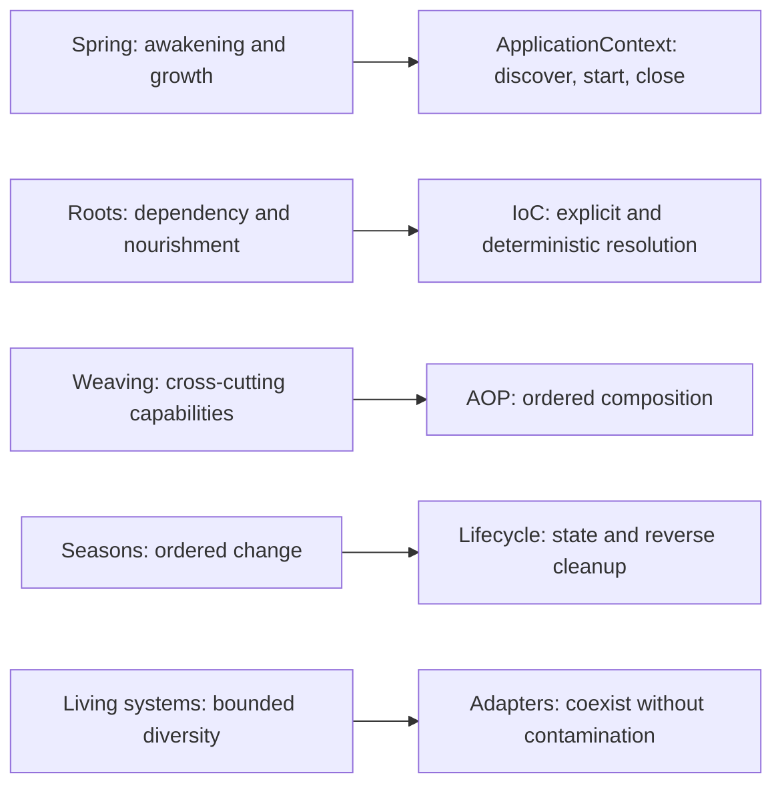
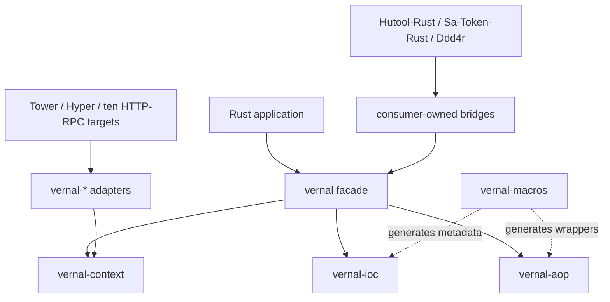
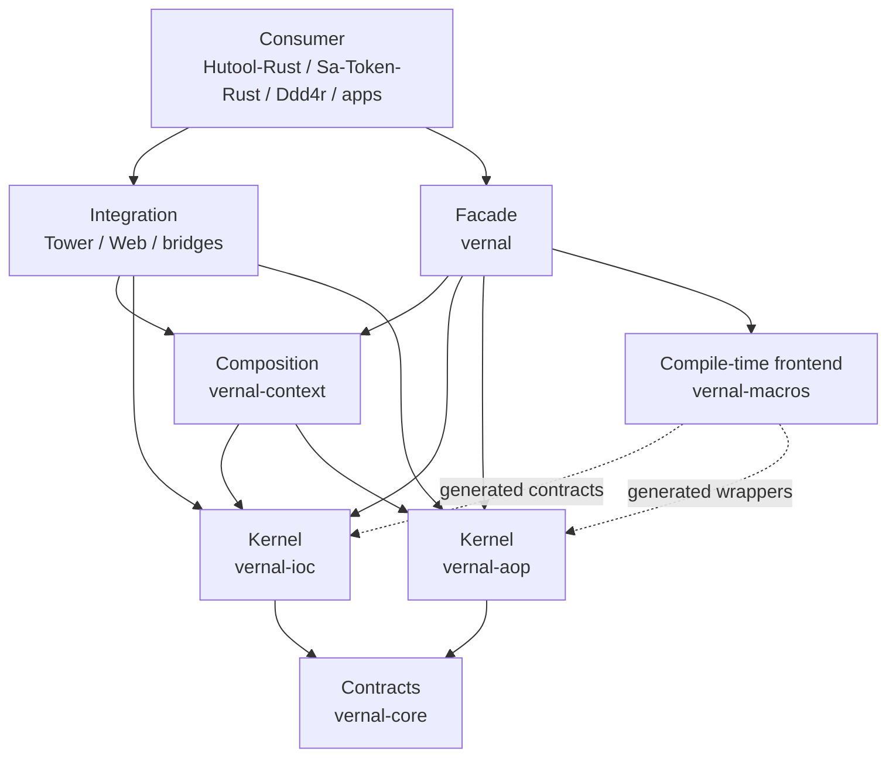
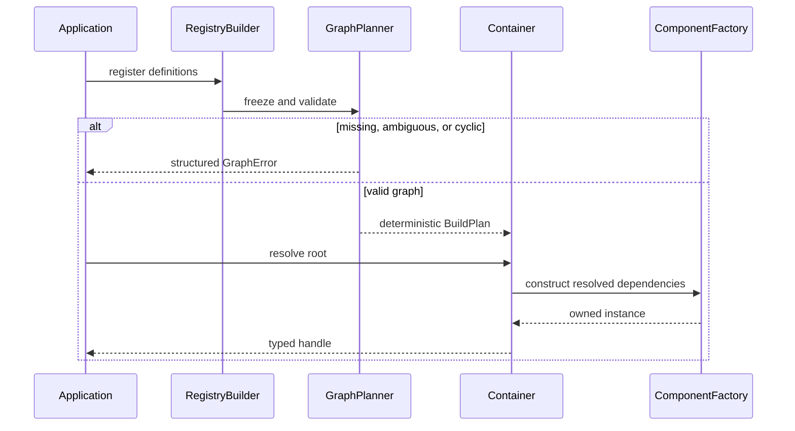
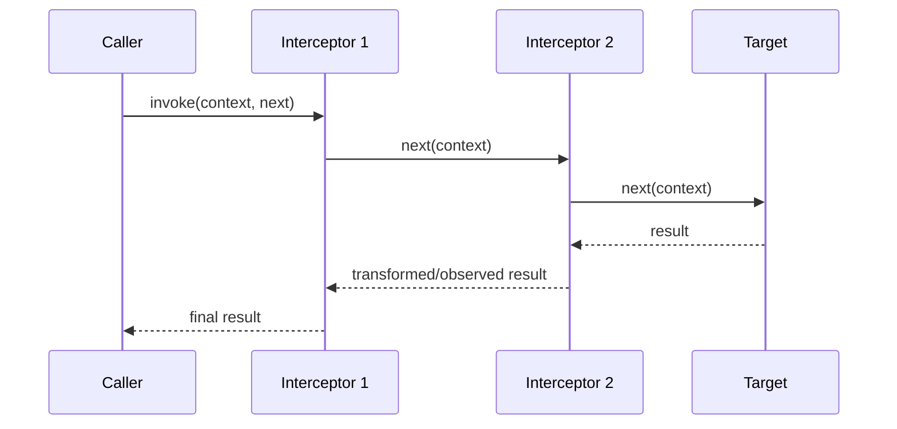
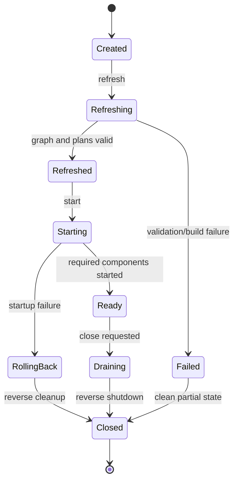
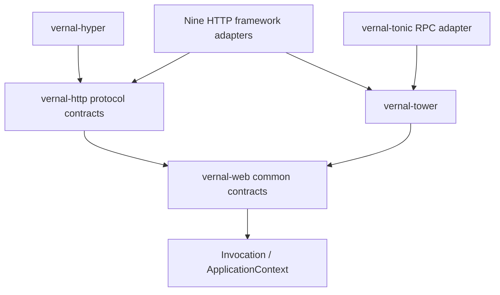
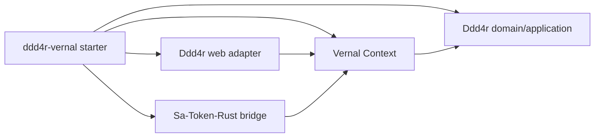

# 句芒 · Vernal Framework Architecture

> **Purpose:** Define Vernal's brand semantics, system boundaries, IoC/AOP/
> ApplicationContext contracts, crate dependency rules, web and ecosystem
> integration strategy, and the refactoring boundary for ideas adopted from
> `tx-di`.
>
> **Architecture version:** 0.1.0<br>
> **Applicable code:** `0.0.0-dev` Phase 1 IoC + Phase 2 AOP kernel<br>
> **Status:** Draft, awaiting architecture review<br>
> **Last updated:** 2026-07-24

## 1. Document control and status

### 1.1 Readers

| Reader | Primary sections | Expected outcome |
|:---|:---|:---|
| Vernal maintainers | 5–10, 14–17 | Kernel boundaries, contracts, delivery gates |
| Web adapter authors | 4, 11, 14 | Request context and middleware boundaries |
| Hutool-Rust / Sa-Token-Rust / Ddd4r maintainers | 4, 12 | Integration ownership and dependency rules |
| Test and security reviewers | 13–16 | Failure, security, and acceptance evidence |

### 1.2 Status labels

| Label | Meaning |
|:---|:---|
| `[Confirmed]` | Verified from the workspace, reviewed source, or current commands |
| `[Skeleton]` | Crate and dependency boundary exists; public behavior does not |
| `[Target]` | Proposed contract requiring review and implementation |
| `[Experimental]` | Requires a prototype or benchmark before commitment |
| `[Non-goal]` | Explicitly outside Vernal's responsibility |

### 1.3 Current state

- `[Confirmed]` The manifest declares Edition 2024, resolver 3, and MSRV
  1.85.0. Current local gates use Rust 1.97.1; MSRV CI remains a target.
- `[Confirmed]` Six kernel/composition skeleton crates and fourteen
  web-related skeleton crates exist.
- `[Confirmed]` Every crate is `publish = false`; no crates.io or stable API
  claim is made.
- `[Confirmed]` `vernal-core` and `vernal-ioc` provide an explicit registry,
  deterministic graph planning, isolated containers, singleton/transient
  scopes, and structured failures.
- `[Confirmed]` `vernal-aop` provides object-safe async Around/Next,
  operation pointcuts, immutable plans, typed extensions, cancellation, and
  deadlines.
- `[Confirmed]` `vernal-context` provides a serialized Tokio lifecycle state
  machine, dependency-order initialize/start, cancellation, rollback,
  reverse idempotent shutdown, and context-local typed events.
- `[Skeleton]` Macros and web adapters still validate crate boundaries only.
- `[Target]` Phase 2 macros, Context AOP-plan aggregation, and Phases 4–6 remain.

## 2. Brand meaning and architecture thesis

### 2.1 Dual brand

| Dimension | Content |
|:---|:---|
| Chinese brand | **句芒** |
| English brand | **Vernal** |
| Formal name | **Vernal Framework** |
| English description | **Vernal is a lightweight IoC, AOP and application context framework for Rust.** |
| Chinese description | **句芒是面向 Rust 生态的轻量级 IoC、AOP 与应用上下文框架。** |
| Brand line | **Vernal — Let components grow.** |
| Capability line | **Grow components. Weave capabilities.** |

句芒 evokes spring and the growth of living things; Vernal means “of or
relating to spring.” The metaphor is constrained by engineering rules:



### 2.2 Architecture in one sentence

**Vernal is a Rust-native framework composed of independent IoC and AOP
kernels plus an ApplicationContext that coordinates them; thin macros and
adapters connect the kernels to web frameworks and downstream ecosystems.**

### 2.3 Metaphor translated into rules

| Meaning | Engineering rule | Prohibited shortcut |
|:---|:---|:---|
| Growth, not fabrication | Build components from explicit dependencies | Arbitrary runtime string reflection |
| Weaving, not intrusion | Compose cross-cutting behavior around Invocation | Mutate business types to simulate AOP |
| Ordered seasons | Start in dependency order, stop in reverse | Unordered startup and abandoned tasks |
| Bounded diversity | Separate kernels, context, adapters, consumers | Put web/auth/ORM utilities into core |
| Renewal | Roll back failures; isolate and rebuild contexts | Unclearable process-global registries |

## 3. Drivers, constraints, and non-goals

### 3.1 Drivers

| ID | Driver | Priority | Architecture response |
|:---|:---|:---:|:---|
| D-001 | Any Rust project can use IoC or AOP independently | P0 | Mutually independent kernels |
| D-002 | Integrate Axum, Actix Web, Salvo, and Poem | P0 | Tower-first, native when needed |
| D-003 | Enable Hutool-Rust, Sa-Token-Rust, and Ddd4r | P0 | Consumer-owned bridges/starters |
| D-004 | Reuse proven `tx-di` ideas | P1 | Migration ledger and contract tests |
| D-005 | Remain Rust-native and diagnosable | P0 | Explicit types, errors, state, graph reports |
| D-006 | Use ecosystem standards without dependency pollution | P0 | Tokio-first; concrete web/ORM/config dependencies stay in integrations |

### 3.2 Hard constraints

1. `vernal-ioc` and `vernal-aop` do not depend on each other.
2. `vernal-core`, `vernal-aop`, and `vernal-context` may use Tokio and
   `tokio-util` task, synchronization, time, and cancellation primitives, but
   do not depend on concrete web, ORM, authentication, or configuration
   implementations.
3. Adapters point inward; kernels never depend on adapters.
4. Missing components, cycles, interception rejection, and shutdown failure
   return structured errors instead of panicking.
5. Contexts are instance-isolated; parallel contexts cannot overwrite one
   another.
6. “Zero cost,” “zero allocation,” and “Spring compatible” require measured,
   explicitly scoped evidence.

### 3.3 Non-goals

- `[Non-goal]` Reproduce Java reflection, CGLIB, or the complete historical
  BeanFactory API.
- `[Non-goal]` Build a router, HTTP server, ORM, authentication system, or
  distributed configuration product.
- `[Non-goal]` Make domain code depend on one framework's Request/Response.
- `[Non-goal]` Hot-swap arbitrary Rust types at runtime.
- `[Non-goal]` Ship a full “automatic configuration for everything” platform
  before a stable 1.0 kernel.

## 4. System context and ownership



| Vernal owns | Vernal does not own | Owner |
|:---|:---|:---|
| Definitions, bindings, scopes, resolution | Domain rules | Application / Ddd4r |
| Interception contract, order, invocation chain | Authentication semantics | Sa-Token-Rust |
| Context lifecycle and local events | Routing, body, transport limits | Web framework |
| Framework integration ports | General utility algorithms | Hutool-Rust |
| Startup diagnostics and dependency graph | Deployment/config-center products | Infrastructure |

## 5. Source evidence and tx-di boundary

### 5.1 Reviewed evidence

| Project | Reviewed source | Confirmed finding |
|:---|:---|:---|
| `tx-di` | core component, registry, store, scope, topology, lifecycle, AOP, and intercept macro files | Typed metadata, topological construction, scopes, lifecycle, and interceptor chains exist |
| `Sa-Token-Rust` | Router flow, adapter contracts, and ten Web/RPC plugin families | One auth flow is reused through framework request/response ports |
| `Ddd4r` | Root manifest and implementation plan | Target stack needs a request-context bridge while retaining DDD/CQRS ownership |
| `Hutool-Rust` | AOP symbols and Reqwest-based HTTP client contracts | Utility/client interception is reusable evidence, but it does not provide server framework integration |

This is a local source snapshot from 2026-07-24, not evidence that any consumer
already integrates Vernal.

### 5.2 Adopted ideas

| tx-di mechanism | Vernal decision | Target crate |
|:---|:---|:---|
| Explicit `Component::Deps` | Retain describable constructor dependencies; redesign the stable contract | `vernal-ioc` |
| Link-time component metadata | Evaluate as an optional registration frontend | macros / optional adapter |
| `TypeId` plus erased store | Keep typed entrypoints and constrain erasure | `vernal-ioc` |
| Kahn topological ordering | Rebuild as a deterministic, testable planner | `vernal-ioc` |
| Singleton / Prototype | Evolve to Singleton / Transient / Scope SPI | `vernal-ioc` |
| Lifecycle hooks | Move to a Context-owned state machine | `vernal-context` |
| Forward before / reverse after | Preserve stack order through a true Around chain | `vernal-aop` |
| Generated interception wrapper | Keep compile-time generation; remove hard-coded paths and panic | `vernal-macros` |

### 5.3 Mandatory redesigns

| Current tx-di design | Risk | Vernal response |
|:---|:---|:---|
| Core mixes config, tracing, utilities, and shared errors | Unrelated concerns expand the kernel | Keep Tokio foundations; move config formats, logging implementations, and utilities outward |
| Global `HashMap<usize, Arc<InterceptorChain>>` | Address reuse, cleanup, locking, context isolation | Chain owned by wrapper/definition/context |
| Macro panics on missing chain or rejected before | Failure cannot compose | Structured caller-visible errors |
| Every argument becomes a Debug string | Secret leakage, allocation, lost type | No values by default; explicit redacted opt-in |
| `after` changes only a result description | Not true Around semantics | Introduce `Next`/continuation |
| Lifecycle owns Tokio tasks without one state machine | Cancellation and rollback semantics scatter | Tokio-native context with one lifecycle state machine |
| Global link-time registry is the only entrypoint | Weak isolation and dynamic assembly | Explicit `RegistryBuilder` baseline |

## 6. Architecture decisions

| ADR | Decision | Rationale | Rejected | Reversal condition |
|:---|:---|:---|:---|:---|
| ADR-001 | Publish IoC and AOP independently | Maximum foundational reuse | One behavioral mega-core | An unavoidable circular contract appears |
| ADR-002 | Context composes kernels | Keep kernels clean | Put lifecycle/config/events in IoC | Composition cannot stay type-safe |
| ADR-003 | Explicit registry is authoritative | Isolation and testability | Process-global registry | Global model proves safe and unloadable |
| ADR-004 | Around/Next interception | Express before/after/error/short-circuit | before/after only | Equivalent lower-cost model is proven |
| ADR-005 | Tower-first integration | Reuse a shared Rust service abstraction | Duplicate each pipeline | A framework cannot preserve semantics |
| ADR-006 | Separate adapters and bridges | Isolate dependency/version churn | All framework features in facade | Stable ecosystem ABI emerges |
| ADR-007 | Tokio-first runtime | Reuse the server ecosystem's tasks, synchronization, cancellation, and time | Custom runtime abstraction or multi-executor parity | Tokio stops being the target ecosystem standard |

## 7. Layers and crate dependencies



Forbidden directions:

```text
core ─X→ ioc / aop / context / web
ioc  ─X→ aop / context / concrete web / ORM
aop  ─X→ ioc / context / concrete web / ORM
context ─X→ concrete web framework
adapter A ─X→ adapter B
```

## 8. IoC kernel

### 8.1 Model

| Concept | Target responsibility |
|:---|:---|
| `ComponentKey` | Context-local identity: `TypeId` plus optional qualifier |
| `ComponentDefinition` | Constructor, dependencies, scope, order, lifecycle metadata |
| `RegistryBuilder` | Explicitly register definitions, then freeze |
| `GraphPlanner` | Validate missing/ambiguous/cyclic dependencies; create deterministic plan |
| `Container` | Resolve components and own instance/scope state |
| `Scope` | Define caching and construction semantics |
| `Resolver` | Restricted construction-time resolution view |

### 8.2 Build flow



Phase 1 implements only per-container `Singleton` and per-resolution
`Transient`. Request/task/tenant scopes arrive through a later Scope SPI and do
not introduce HTTP concepts into the kernel.

### 8.3 Tokio and framework-native components

Vernal does not require ecosystem objects to be wrapped in framework-specific
bean types. Any `Send + Sync + 'static` value can be registered directly,
including Tokio synchronization primitives and task handles, HTTP clients,
database pools, message clients, Tower services, framework state, and
application services.

Being usable as a component does not make its crate a kernel dependency. The
application or a `vernal-*` adapter imports the concrete framework and supplies
the `ComponentDefinition`; IoC sees only Rust types, factories, dependencies,
and scopes.

### 8.4 Failure contract

| Error | Retry | Required diagnostic |
|:---|:---:|:---|
| Duplicate definition | No | Both origins and key |
| Missing dependency | No | Full dependency path |
| Ambiguous binding | No | Candidates and qualifiers |
| Cycle | No | Short readable cycle |
| Construction failure | Source-dependent | Component, phase, source chain |
| Closed scope | No | Scope identity and close reason |

## 9. AOP kernel

### 9.1 Two API levels

The AOP kernel serves:

1. a typed generic API for library authors and static composition;
2. a controlled type-erased heterogeneous chain for Context and macros.

Both must share ordering, short-circuit, error, and context propagation
semantics.

### 9.2 Invocation contract

Target metadata includes method identity, declaring type, tags/qualifier,
read-only context extensions, deadline, cancellation, and nesting depth.
Argument values are not captured by default. Explicit capture must support
field-level redaction. Business errors retain their source rather than becoming
strings.

### 9.3 Around flow



Lower `order` enters first and exits last. Equal order preserves registration
order. Pointcuts compile into immutable `InvocationPlan` values during context
refresh.

### 9.4 No instance-pointer map

Vernal does not use `self as *const Self as usize` as durable identity:

- static composition uses `Advised<T>` owning target and chain;
- context components keep plans in immutable definitions;
- web adapters obtain plans from the context and pass request-scoped
  extensions into Invocation.

Ownership and cleanup therefore follow the actual wrapper/context lifecycle.

## 10. ApplicationContext and lifecycle

The context composes registry, container, AOP plans, local typed events,
rollback, reverse cleanup, and read-only diagnostics. It directly uses Tokio
tasks, synchronization, time, cancellation, and signals. Configuration
formats, web servers, and external configuration centers remain adapters whose
native objects may still be registered as ordinary components.



Lifecycle order:

```text
register → freeze → validate graph and pointcuts
→ construct singletons → initialize → start → Ready
→ drain → reverse stop → release scopes
```

Failures record completed steps and roll back only successful components.
`close()` is idempotent.

## 11. Web, HTTP, and framework integration

Vernal reuses Spring's separation of responsibilities, not its JVM product
names. Rust web frameworks generally expose async handlers, while streaming is
a capability of HTTP bodies, RPC calls, SSE, and WebSocket connections rather
than a separate application model.

| Layer | Vernal crate | Contract | Boundary |
|:---|:---|:---|:---|
| Web application | `vernal-web` | Request context, request scope, handler invocation, extraction, validation, error mapping | No transport or framework types |
| HTTP protocol | `vernal-http` | Request, response, body frames, streaming, cancellation, backpressure | Uses Rust `Future`/`Stream`; owns no runtime |



The versioned coverage set is owned by
[`web-integration-manifest.toml`](../web-integration-manifest.toml):

| Priority | Framework | Crate | Protocol/capabilities | Target mechanism |
|:---:|:---|:---|:---|:---|
| 1 | Axum | `vernal-axum` | HTTP, body streaming, Tower | Tower Layer, Service, extractor/context bridge |
| 2 | Actix Web | `vernal-actix-web` | HTTP, body streaming | Transform/Service middleware and app data |
| 3 | Rocket | `vernal-rocket` | HTTP request/response, optional streaming | Fairing, request guard, managed state |
| 4 | Warp | `vernal-warp` | HTTP, body streaming | Filter composition and rejection mapping |
| 5 | Salvo | `vernal-salvo` | HTTP, body streaming | Handler, Hoop, Depot scope |
| 6 | Poem | `vernal-poem` | HTTP, body streaming | Middleware, Endpoint, request data |
| 7 | Ntex | `vernal-ntex` | Network HTTP, body streaming | Service/middleware and worker-local state |
| 8 | Gotham | `vernal-gotham` | HTTP request/response | State middleware and handler pipeline |
| 9 | Tide | `vernal-tide` | HTTP, body streaming | Middleware, request state, endpoint |
| 10 | Tonic | `vernal-tonic` | gRPC / RPC streaming | Tower Service, interceptor, extensions |

Tower and Hyper are foundations and do not consume two slots in the ten-target
set. Tonic is explicitly RPC rather than an HTTP router. The selection is a
versioned coverage priority derived from the reviewed local integration
superset and current registry presence, not an objective universal popularity
ranking.

The workspace has fourteen web-related skeleton crates: `vernal-web`,
`vernal-http`, Tower/Hyper, and ten adapters. They currently expose
compile-checked descriptors only; protocol contracts, upstream middleware,
extractors, and streaming bridges remain implementation work. The detailed contract is
[Vernal Web Architecture](./Vernal-Web-Architecture.md).

## 12. Consumer integrations

### 12.1 Hutool-Rust

Hutool-Rust remains a utility library. Its Reqwest-based HTTP client
interceptors may use `vernal-aop`, but Hutool-Rust must not own server
ApplicationContext or become a Vernal kernel dependency.

### 12.2 Sa-Token-Rust

Sa-Token-Rust is the only retained security integration target. Vernal will
register its manager/runtime graph as explicit components, compose its shared
authentication flow as framework middleware or interceptors, and propagate the
result through request scope. Token, session, role, permission, cookie, and
401/403 semantics remain owned by Sa-Token-Rust.

Its existing ten plugin families are input evidence for the Vernal adapter
matrix, not code that Vernal silently vendors.

### 12.3 Ddd4r

Ddd4r should own a `ddd4r-vernal` bridge or starter. Vernal composes services
and cross-cutting contracts; Ddd4r retains aggregates, domain events, CQRS,
repositories, outbox, and transaction semantics.



## 13. Security, privacy, and global state

| Risk | Default policy | Acceptance |
|:---|:---|:---|
| Sensitive invocation arguments | Do not capture values by default | Redaction and opt-in tests |
| Faulty interceptor blocks a chain | Deadline, cancellation, error boundary | Timeout/cancellation tests |
| Cross-context leakage | No process-global mutable authority | Parallel isolation tests |
| Macro exposes private fields | Generate minimum metadata | trybuild and token snapshots |
| Feature supply-chain growth | Independent adapters, minimal defaults | cargo tree / deny |
| Unsafe in workspace | `unsafe_code = "forbid"` | Compile/Clippy gate |

The unsafe rule covers Vernal-owned source, not the entire third-party graph.

## 14. Errors, reliability, and diagnostics

| Category | Examples | Caller action |
|:---|:---|:---|
| Definition | Duplicate, invalid qualifier | Fix registration |
| Graph | Missing, ambiguous, cyclic | Fix dependency relation |
| Resolution | Constructor failure, closed scope | Inspect source or stop use |
| Interception | Rejection, pointcut, chain failure | Follow business error contract |
| Lifecycle | Init/start/close failure | Roll back or report degraded |
| Adapter | Conversion or missing context | Return stable native error |

A context refresh produces a serializable, read-only, redacted report containing
version/features, definition and scope counts, graph summary, pointcut matches,
lifecycle timing/failures, adapter state, warnings, and unused definitions.

## 15. Verification and acceptance

| Level | Required evidence |
|:---|:---|
| Static | Crate direction, Tokio feature budget, and no concrete Web/ORM implementation in generic kernels |
| Unit | Graph, qualifier, ordering, scope, state machine |
| Property | Deterministic planning and cycle detection for arbitrary graphs |
| Compile | Macro diagnostics, bounds, lifetimes, generics |
| Concurrency | Once-only singleton, context isolation, close races |
| Contract | Typed and dynamic AOP have identical semantics |
| Web conformance | Equivalent policy result across frameworks |
| Consumer integration | No reverse dependency from bridges |
| Benchmark | Measured resolution, chain depth, startup graph only |

Phase 1 minimum acceptance:

1. Deterministically plan a 1,000-node DAG.
2. Missing, ambiguous, and cycle errors contain readable paths.
3. Parallel containers do not share singleton instances.
4. `cargo tree` proves no concrete web or ORM framework in `vernal-ioc`;
   Tokio is allowed when needed.
5. Normal failures use `Result`, not panic.

As of 2026-07-24, all five items have local evidence: nine IoC contract tests
cover a 1,000-node graph, missing/ambiguous/cycle paths, singleton isolation
across two concurrent containers, transient creation, qualifiers, and hidden
dependency rejection. `cargo tree -p vernal-ioc` currently contains only
`vernal-core`, but that is not a rule forbidding future Tokio use.

The Phase 2 AOP kernel additionally has seven Tokio contract tests for
ordered entry/reverse exit, short circuit, result/error transformation, typed
context across `.await`, cancellation/deadline, pointcut filtering, and
64-task concurrent reuse. Phase 2 remains incomplete until macro trybuild
coverage is present.

The Phase 3 kernel has seven contract tests for dependency-order
startup, reverse shutdown, initialize/start rollback, invalid transitions,
idempotent close, concurrent close serialization, and context-local typed
event isolation.

## 16. Delivery roadmap

| Phase | Deliverable | Exit evidence |
|:---|:---|:---|
| 0 | Brand, bilingual README, architecture, buildable skeleton | Docs and Cargo gates pass |
| 1 | Core + IoC minimum loop | Registry, graph, scope, resolution tests |
| 2 | AOP + macros | Around, order, pointcut, trybuild tests |
| 3 | ApplicationContext | Lifecycle, events, rollback, shutdown tests |
| 4 | Web/HTTP contracts, Tower/Hyper, and ten adapters | Cross-framework conformance |
| 5 | Three ecosystem bridges | Consumer examples and dependency checks |
| 6 | Preview release | MSRV, SemVer, security, packaging, docs |

No phase is complete merely because a crate exists or `cargo check` is green.

## 17. Risks and open decisions

| ID | Risk / open decision | Impact | Validation |
|:---|:---|:---|:---|
| R-001 | Object-safe async Around allocation cost | AOP performance | Benchmark the implemented boxed-future path |
| R-002 | Macro support for impl/trait/async methods | Usability | trybuild matrix |
| R-003 | Cross-platform link-time registration | Portability | Linux/macOS/Windows CI |
| R-004 | Request-scope cancellation differences | Resource safety | Cross-framework failure tests |
| R-005 | Spring terminology overwhelms Rust API style | Maintenance | API review and Rust guidelines |
| R-006 | Premature zero-cost claims | Trust | Measure static and dynamic paths separately |

## 18. Definition of architecture done

- [x] IoC and AOP can be depended on, built, and used independently.
- [ ] Tokio usage and feature budgets are explicit; Context does not leak
  configuration formats or concrete web/ORM types into generic kernels.
- [ ] Graph, interception, and lifecycle include success/failure/rollback tests.
- [ ] No pointer-address chain map, normal-flow panic, or hidden cross-context state.
- [ ] Web adapters pass one conformance suite while preserving native semantics.
- [ ] Hutool-Rust, Sa-Token-Rust, and Ddd4r boundaries are proven by consumer examples.
- [ ] English and Chinese docs share commands, crate names, status, and diagrams.
- [ ] SemVer, MSRV, security policy, and registry verification precede release.

---

**Document version:** 0.1.0<br>
**Last updated:** 2026-07-24<br>
**Status:** Draft, awaiting architecture review
