# 句芒 · Vernal Framework 架构设计

> **文档目的**：定义 Vernal 的品牌寓意、系统边界、IoC/AOP/ApplicationContext
> 核心合同、crate 依赖方向、Web 与生态集成方式，以及从 `tx-di` 吸收能力时必须
> 遵守的重构边界。
>
> **架构版本**：0.1.0<br>
> **适用代码版本**：`0.0.0-dev` Phase 1–4 可调用底座<br>
> **文档状态**：草案，待架构评审<br>
> **最后更新**：2026-07-25

## 1. 文档控制与状态

### 1.1 读者

| 读者 | 重点章节 | 预期获得 |
|:---|:---|:---|
| Vernal 维护者 | 5–10、14–17 | 内核边界、合同和实施门禁 |
| Web 适配器作者 | 4、11、14 | 请求上下文、Layer/Middleware 边界 |
| Hutool-Rust / Sa-Token-Rust / Ddd4r 维护者 | 4、12 | 集成责任和禁止反向依赖 |
| 测试与安全评审 | 13–16 | 失败、安全和验收证据 |

### 1.2 状态标签

| 标签 | 定义 |
|:---|:---|
| `[已确认]` | 已由当前 Workspace、被调研源码或本轮命令验证 |
| `[骨架]` | crate 与依赖方向已存在，但没有公共能力实现 |
| `[设计目标]` | 本文批准后才能进入实现的目标合同 |
| `[实验性]` | 需要 POC 或基准验证，不能作为稳定承诺 |
| `[非目标]` | 明确不由 Vernal 承担 |

### 1.3 当前真实状态

- `[已确认]` 根 Workspace manifest 声明 Edition 2024、Resolver 3、MSRV 1.85.0；
  本地 `cargo +1.85.0 check --workspace --all-targets` 已通过，自动化 MSRV CI
  仍是目标态。
- `[已确认]` 已创建六个内核/组合层 crate 与十五个 Web 相关 crate，其中四个
  Web 底座 crate 已提供可调用行为，`vernal-web-testkit` 已提供跨框架共享
  请求绑定合同。
- `[已确认]` 所有 crate 设置 `publish = false`，没有 crates.io 或稳定 API 声明。
- `[已确认]` `vernal-core` 与 `vernal-ioc` 已提供显式 Registry、确定性图规划、
  Container 隔离、Singleton/Transient、Trait 命名/Primary/全部实现绑定和结构化错误。
- `[已确认]` `vernal-aop` 已提供对象安全的异步 Send/Local 两套 Around/Next
  执行平面、操作切点、不可变计划、类型化扩展、取消和 deadline。
- `[已确认]` `vernal-context` 已提供串行 Tokio 生命周期状态机、依赖顺序
  initialize/start、取消、失败回滚、逆序幂等关闭和 Context-local 类型化事件；
  `VernalApplicationBuilder` 已在依赖图冻结前自动注册 Tokio Handle、应用取消
  令牌、事件总线和预编译 AOP 计划目录。
- `[已确认]` `vernal-web`、`vernal-http`、`vernal-tower` 与
  `vernal-hyper` 已提供请求 Scope、标准 HTTP Body Frame/Trailer、Tower
  生命周期 Layer 和真实 Hyper 传输桥接。`WebRequestScope` 直接复用 IoC
  `ScopeContext`，组件提取器不会绕过请求作用域回退到无作用域解析。
- `[已确认]` `vernal-axum` 已提供原生 Router 装配与类型化 Context、组件、
  请求 Scope 提取器；`vernal-actix-web` 已提供原生 Transform/Service 中间件和
  Body 绑定 Scope 释放、匹配资源操作身份与严格 Local-AOP；`vernal-rocket`
  已提供 Managed State、Request Guard、Body 感知 Fairing、路由模板操作身份，
  以及覆盖原生 Handler Outcome 的 fail-closed 严格 Send-AOP；
  `vernal-warp` 已提供原生 Extension Filter、Tower
  Service Body Scope、显式路由模式身份与 fail-closed 严格 Send-AOP；
  `vernal-salvo` 已提供原生 Hoop、类型化 Depot、
  Frame/Trailer 保真的 Body Scope、匹配路径操作身份，以及覆盖借用型 Handler
  资源的 fail-closed 严格 Send-AOP；`vernal-poem` 已提供原生
  Middleware/Endpoint、类型化提取器、Body 绑定 Scope 释放、匹配路由操作
  身份与 fail-closed 严格 Around AOP；`vernal-ntex`
  已提供原生 Middleware/Service、App State/Extension 提取器、Body 绑定 Scope
  释放、显式资源模式操作身份，以及覆盖借用型 Worker-local 目标的 fail-closed
  严格 Local-AOP；`vernal-gotham` 已提供 StateData、类型安全 State 访问、
  Pipeline Middleware、Frame/Trailer 保真的 Body 释放、显式路由模式身份与
  fail-closed 严格 Send-AOP；`vernal-tide` 已提供原生
  Middleware、类型化 Request Extension 访问、Reader 绑定 Scope 释放、显式
  路由模式身份，以及覆盖借用型 `Next` 的 fail-closed 严格 Send-AOP；
  `vernal-tonic` 已提供 Context Interceptor、类型化 Request 扩展、`Status`
  映射与 Tower 组合。
- `[已确认]` `vernal-macros` 已提供显式 `Arc<T>`、`Arc<dyn Trait>` 和
  `Vec<Arc<dyn Trait>>` 构造注入的 `#[derive(Component)]`，支持
  Singleton/Transient、default 与字段 qualifier，并通过运行时和 compile-fail
  合同测试；它不使用 linkme 或全局自动注册。
- `[已确认]` tx-di 原文参考已从正式 `src/` 移到各 crate 的只读
  `upstream/tx-di/` 证据目录；生产源码不再同时摆放未编译的 Store/App/全局注册表。
- `[已确认]` `#[component(aop)]` 与 `#[intercept]` 已把 Context-local
  `InvocationPlanCatalog`、取消令牌和 Arc-owned/共享借用异步组件方法连接起来；
  无全局实例 Map 或 unsafe 生命周期扩展，计划缺失、取消和返回类型不匹配均通过
  结构化错误返回。
- `[设计目标]` Trait/泛型/可变方法签名、剩余消费方生态桥接、性能基准与后续生产门禁
  仍需实现和验收。

## 2. 品牌寓意与架构主张

### 2.1 双品牌

| 维度 | 内容 |
|:---|:---|
| 中文品牌 | **句芒** |
| 英文品牌 | **Vernal** |
| 正式名称 | **Vernal Framework** |
| 英文介绍 | **Vernal is a lightweight IoC, AOP and application context framework for Rust.** |
| 中文介绍 | **句芒是面向 Rust 生态的轻量级 IoC、AOP 与应用上下文框架。** |
| 品牌口号 | **Vernal — Let components grow.** |
| 能力口号 | **Grow components. Weave capabilities.** |

句芒对应春令与草木生发，Vernal 表达“春天的、带来新生的”。品牌寓意必须落实为
架构约束，而不是停留在命名层：

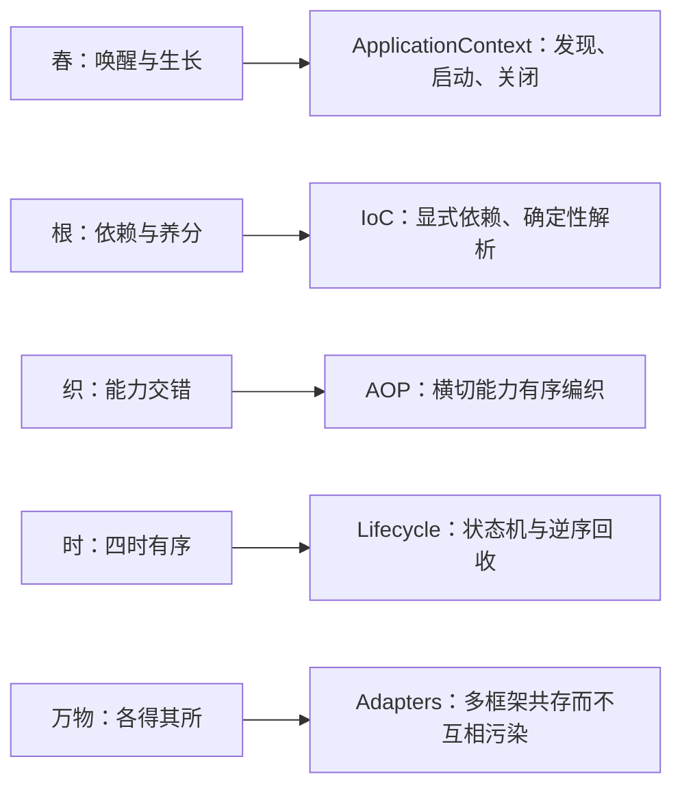

### 2.2 一句话架构

**Vernal 是由独立 IoC 内核、独立 AOP 内核和负责组合二者的 ApplicationContext
构成的 Rust 原生框架，通过薄宏与薄适配器为 Web 框架及下游项目提供组件装配、
横切能力和生命周期管理。**

### 2.3 高级寓意对应的工程规则

| 寓意 | 工程规则 | 禁止做法 |
|:---|:---|:---|
| 生长而非制造 | 组件从显式依赖构造 | 运行时字符串反射创建任意对象 |
| 编织而非侵入 | 横切能力通过 Invocation 合同组合 | 修改业务类型内部状态实现 AOP |
| 四时有序 | 启动按依赖顺序、关闭按逆序 | 无序启动和进程退出时遗留任务 |
| 万物各有边界 | 内核、Context、Adapter、Consumer 分层 | 将 Web、鉴权、ORM 塞入核心 |
| 春生可复始 | 失败可回滚、Context 可隔离重建 | 不可清理的进程级全局注册表 |

## 3. 架构驱动、约束与非目标

### 3.1 架构驱动

| ID | 驱动 | 优先级 | 架构响应 |
|:---|:---|:---:|:---|
| D-001 | IoC 与 AOP 可被任何 Rust 项目独立使用 | P0 | 两个内核互不依赖 |
| D-002 | 支持 Axum、Actix Web、Salvo、Poem 等框架 | P0 | Tower 优先、必要时原生适配 |
| D-003 | 为 Hutool-Rust、Sa-Token-Rust、Ddd4r 提供基础能力 | P0 | 消费方拥有 Bridge/Starter |
| D-004 | 吸收 `tx-di` 已验证思路 | P1 | 建立能力迁移台账与合同测试 |
| D-005 | 保持 Rust 原生和可诊断 | P0 | 显式类型、错误、状态和图报告 |
| D-006 | 采用 Rust 生态事实标准并控制依赖污染 | P0 | Tokio-first；具体 Web/ORM/配置依赖留在集成层 |

### 3.2 硬约束

1. `vernal-ioc` 不依赖 `vernal-aop`，`vernal-aop` 不依赖 `vernal-ioc`。
2. `vernal-core`、`vernal-aop` 和 `vernal-context` 可以使用 Tokio 及
   `tokio-util` 的任务、同步、时间与取消原语；不得反向依赖具体 Web、ORM、
   鉴权或配置实现。
3. 适配器只依赖公共合同，内核不能反向依赖适配器。
4. 正常的缺失组件、循环依赖、拦截拒绝和关闭失败必须返回结构化错误，不得 panic。
5. Context 必须是实例隔离的；并行测试或同进程多 Context 不能互相覆盖。
6. “零成本”“零分配”和“兼容 Spring”都必须有明确口径和证据，不能作为宣传先行。

### 3.3 非目标

- `[非目标]` 复制 Java 反射、CGLIB、BeanFactory 全部历史 API。
- `[非目标]` 自建 Web 路由、HTTP Server、ORM、鉴权或分布式配置中心。
- `[非目标]` 让领域代码依赖某一个 Web 框架的 Request/Response 类型。
- `[非目标]` 承诺运行时热替换任意 Rust 类型。
- `[非目标]` 在 1.0 前提供类似 Spring 全家桶的“所有能力自动配置”。

## 4. 系统上下文与责任边界

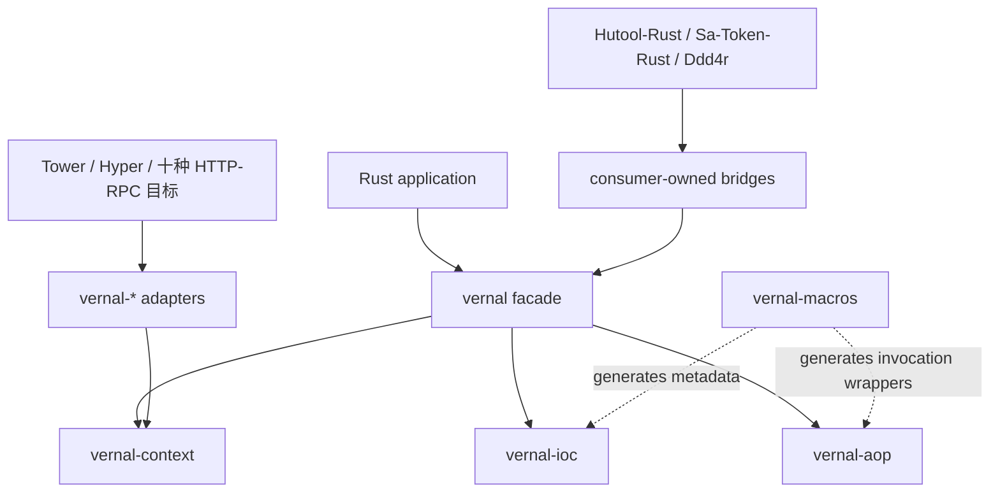

| Vernal 负责 | Vernal 不负责 | 责任方 |
|:---|:---|:---|
| 组件定义、绑定、作用域、解析 | 业务对象的领域规则 | 业务项目 / Ddd4r |
| 拦截器合同、顺序和调用链 | 认证与授权算法 | Sa-Token-Rust |
| Context 生命周期与事件 | HTTP 路由、Body、网络限制 | Web 框架 |
| 框架集成端口 | 通用字符串、集合、加密工具 | Hutool-Rust |
| 启动诊断与依赖图 | 部署平台、服务发现、配置中心产品 | 下游基础设施 |

## 5. 源码调研与 tx-di 整合边界

### 5.1 本轮证据

| 项目 | 已检查源码 | 已确认结论 |
|:---|:---|:---|
| `tx-di` | `tx-di-core/src/{component,registry,store,scope,topology,lifecycle,aop,config}.rs`、`tx-di-macros/src/intercept_macro.rs` | 类型元数据、拓扑、作用域、生命周期、拦截链和点路径配置已形成实现；配置仍绑定全局 TOML 与 panic |
| `Sa-Token-Rust` | Router 流程、Adapter 合同、`sa-token-core/src/config.rs` 与十类 Web/RPC plugin | 同一鉴权流通过框架端口复用；强类型 Builder 需要稳定的外部属性输入 |
| `Ddd4r` | 根 manifest 与实施计划 | 需要 request context bridge，同时保留 DDD/CQRS 责任 |
| `Hutool-Rust` | AOP、Reqwest HTTP Client、`hutool-setting` 的 `Profile`/`SettingLoader` | Profile、变量展开和配置文件解析可作为 PropertySource Adapter，文件格式不进入 Context |

以上是 2026-07-25 的本地源码快照，不等于这些项目当前分支已经对 Vernal 完成集成。

### 5.2 可吸收能力

| tx-di 机制 | Vernal 决策 | 目标 crate |
|:---|:---|:---|
| `Component::Deps` 显式依赖 | 保留“构造依赖可描述”思想，重新定义稳定合同 | `vernal-ioc` |
| 链接期组件元数据 | 作为可选注册后端评估，不写死到内核 | `vernal-macros` / 可选 adapter |
| `TypeId` + 类型擦除 Store | 保留类型安全入口，限制擦除边界 | `vernal-ioc` |
| Kahn 拓扑排序与循环诊断 | 重写为确定性、可测试的 Graph Planner | `vernal-ioc` |
| `debug_registry()` 日志表格 | 升级为复用冻结计划、可 Serde 序列化的只读快照 | `vernal-ioc` / `vernal-context` |
| Singleton / Prototype | 已实现为 Singleton / Transient / 类型化 Scope SPI | `vernal-ioc` |
| 生命周期钩子 | 抽离为 Context 管理的状态机 | `vernal-context` |
| 点分配置读取 | 升级为 Context-local PropertySource 优先级、Profile、占位符和类型化读取；格式加载留给 Adapter | `vernal-context` |
| 正序 `before`、逆序 `after` | 保留栈式顺序语义，升级为真正 Around 链 | `vernal-aop` |
| `#[intercept]` 生成包装代码 | 保留编译期生成方向，移除硬编码 crate 与 panic | `vernal-macros` |

### 5.3 必须重构的部分

| tx-di 当前设计 | 风险 | Vernal 处理 |
|:---|:---|:---|
| `tx-di-core` 混合配置、tracing、公共工具和统一错误 | 无关能力扩大内核边界 | 保留 Tokio 基础能力；配置格式、日志实现和工具能力下沉 |
| `AppAllConfig` 绑定全局 TOML、默认可执行文件路径与 panic | 多 Context 冲突，库无法选择来源和失败策略 | `ApplicationEnvironment` 只接收显式 PropertySource，全部失败结构化返回 |
| 全局 `HashMap<usize, Arc<InterceptorChain>>` | 地址复用、清理、锁竞争、Context 隔离风险 | 链随 Wrapper/Definition/Context 所有，不用裸地址做身份 |
| 宏在链缺失或 before 失败时 panic | 业务失败不可组合 | 返回调用者声明的结构化错误 |
| 参数统一 `Debug` 字符串化 | 敏感信息泄漏、分配和类型丢失 | 元数据默认不采集值；值捕获显式 opt-in 并支持脱敏 |
| `after` 只修改 `CallResult` 描述 | 不能实现真正 Around/返回值变换 | 引入 `Next`/Continuation 语义 |
| 生命周期与 Tokio task 固定绑定且缺少统一状态机 | 任务取消和回滚语义分散 | Context 采用 Tokio 原生任务、取消和时间能力，并统一管理状态机 |
| 全局链接期 Registry 是唯一入口 | 测试隔离和动态组装受限 | 显式 `RegistryBuilder` 为基线，编译期收集为可选前端 |

## 6. 关键架构决策

| ADR | 决策 | 理由 | 被拒绝方案 | 反转条件 |
|:---|:---|:---|:---|:---|
| ADR-001 | IoC 与 AOP 独立发布 | 最大化底层复用 | 单一 `vernal-core` 包含全部行为 | 出现不可避免的循环合同 |
| ADR-002 | Context 负责组合 | 保持内核纯净 | IoC 内置生命周期、配置和事件 | 组合层无法提供类型安全 |
| ADR-003 | 显式 Registry 是权威 | 实例隔离、可测试 | 进程级全局 Registry | 可证明全局方案安全且可卸载 |
| ADR-004 | AOP 使用 Around/Next | 完整表达前后、异常和短路 | 只有 before/after 回调 | 基准证明无法接受且有等价替代 |
| ADR-005 | Tower 优先集成 | 多个 Web 框架共享抽象 | 每个框架复制整条业务链 | 框架语义无法由 Tower 保真表达 |
| ADR-006 | 适配器与 Bridge 独立 crate | 隔离依赖与版本变化 | 所有框架 feature 堆进 facade | Cargo 生态出现更可靠的稳定 ABI |
| ADR-007 | Tokio-first 运行时 | 直接复用 Rust 服务端生态的任务、同步、取消和时间能力 | 自建抽象 Runtime 或同时兼容多个 executor | Tokio 不再是目标生态事实标准 |

## 7. 总体分层与 crate 依赖

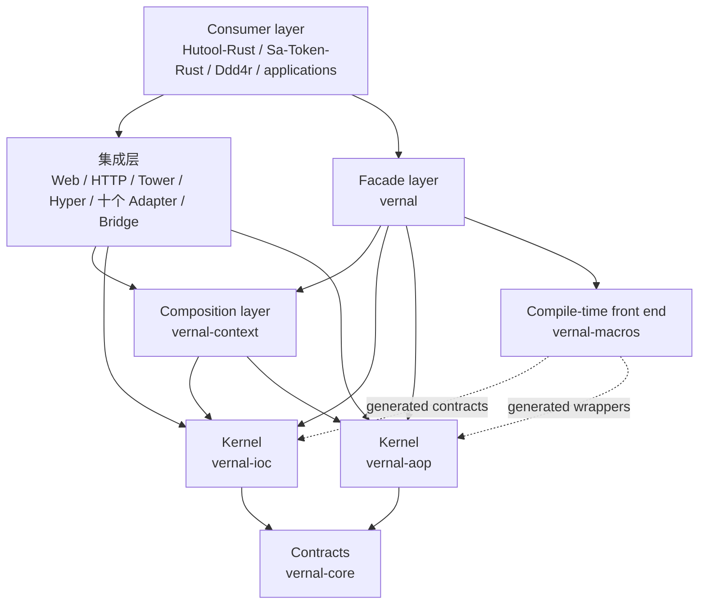

禁止的依赖方向：

```text
core ─X→ ioc / aop / context / web
ioc  ─X→ aop / context / concrete web / ORM
aop  ─X→ ioc / context / concrete web / ORM
context ─X→ concrete web framework
adapter A ─X→ adapter B
```

## 8. IoC 内核设计

### 8.1 核心模型

| 概念 | 目标职责 |
|:---|:---|
| `ComponentKey` | `TypeId` 与可选 qualifier 构成的稳定 Context 内身份 |
| `TraitKey` | Trait `TypeId` 与可选 qualifier 构成的绑定选择身份 |
| `TraitBinding` | 把具体组件的同一个 `Arc` 类型安全提升为 `Arc<dyn Trait>` |
| `ComponentDefinition` | 构造器、依赖、作用域、顺序、生命周期元数据 |
| `RegistryBuilder` | 显式注册 Definition，构建后冻结 |
| `GraphPlanner` | 校验缺失依赖、歧义和循环，生成确定性计划 |
| `Container` | 按计划解析组件，拥有实例和 Scope 状态 |
| `Scope` | 控制实例缓存与创建语义 |
| `Resolver` | 为构造器提供受限解析视图，禁止任意全局访问 |

### 8.2 构建主链

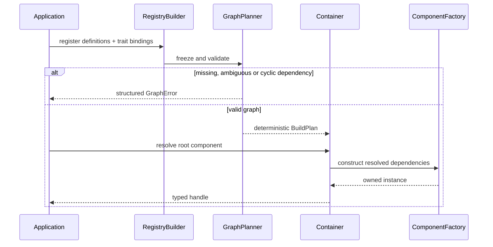

### 8.3 作用域

IoC 内核现已实现三种构造策略：

- `Singleton`：每个 Container 一份，并发下只初始化一次；
- `Transient`：每次解析创建新实例。
- `Scope::Custom(ScopeKey)`：在显式进入、由类型标识的 `ScopeContext` 中，按完整
  `ComponentKey` 缓存一份实例。

应用可以使用 `ComponentDefinition::scoped::<T, ScopeMarker, _>(...)` 或
`#[component(scope = ScopeMarker)]` 声明自定义作用域，通过
`Container::open_scope::<ScopeMarker>()` 进入，再用 `resolve_in` 解析。Request、
Task、Tenant、Batch 或安全会话等含义仍由消费方标记类型表达，不把 HTTP 类型放入
`vernal-ioc`。

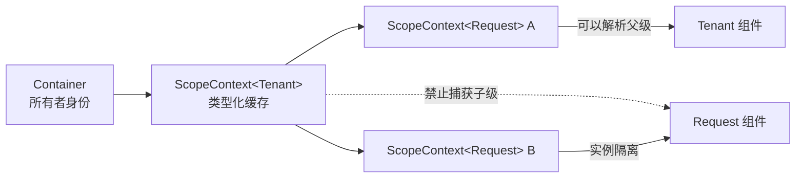

每个 Scope 都绑定创建它的 Container，不能跨应用容器携带实例。子 Scope 解析可以
读取父 Scope；构造父 Scope 组件时只暴露父节点，不能反向捕获更短生命周期的子组件。
Singleton 构造完全不接收自定义 Scope，从根源上避免第一次在 Request/Task 中解析的
单例永久持有短生命周期对象。

Scope 生命周期合同是显式的：

- 每组件 `OnceLock` 在并发解析下缓存第一次成功或失败结果；
- 关闭先拒绝新解析，并取消 Tokio `CancellationToken`；
- 已经开始的同步工厂执行完毕后才进入资源释放；
- 异步关闭钩子按注册逆序执行，即使某个失败也继续执行其余钩子，并返回第一个错误；
- 钩子失败后仍清空缓存并进入 `Closed`；
- 第一个关闭者只启动一个 Tokio 协调任务，重复/并发调用者订阅同一个最终结果；
- 调用者被取消或 `close_with_timeout` 到期只会停止该等待者，不会取消后台释放；
- 每个钩子在独立子任务中执行，钩子 panic 会转换成结构化关闭任务错误，后续钩子
  仍继续执行。

`ApplicationContext::open_scope` 从应用取消树派生 Scope 令牌；Scope 所有者仍须显式
调用 `close().await`，让资源释放结果可观察，而不是把异步清理藏进 `Drop`。高层
建造器会把 `ScopeCleanupPolicy` 注册为应用原生组件；应用拥有的 Web Scope 默认
最多等待 30 秒，也可显式选择其他上限或无限等待。超时只是本次观察结果，不会取消
底层清理。

### 8.4 Tokio 与框架原生组件

Vernal 不要求把生态对象包装成专用 Bean 类型。任何满足
`Send + Sync + 'static` 的对象都可以直接注册，例如：

- `tokio::sync` 同步原语、任务句柄与取消相关对象；
- `reqwest::Client`、数据库连接池、消息客户端；
- Tower Service、Axum State、Actix `web::Data` 所承载的状态；
- Sa-Token-Rust 服务、Ddd4r 应用服务以及业务自定义对象。

“可作为组件”不等于“由内核直接依赖”。具体框架 crate 仍由应用或
`vernal-*` Adapter 引入并提供 `ComponentDefinition`；IoC 只看到 Rust 类型、
工厂、依赖和 Scope。这样既保留框架原生能力，也避免把所有生态版本耦合进核心。

对于已经由 Tokio 或第三方框架构造完成的对象，应用可以使用
`ComponentDefinition::shared_value` 或 `ComponentDefinition::shared_arc`
直接把原生值放入依赖图，不需要创建空壳包装类型。其中 `shared_arc` 在解析时
返回原来的 `Arc<T>`，不会形成 `Arc<Arc<T>>`。这种预构建对象由同一注册表创建
的所有 Container 共享；需要每个 Container 独立实例时，仍使用工厂式
`ComponentDefinition::singleton`。

Vernal 明确采用 Tokio-first：当任务、异步同步、时间或取消能力需要时，核心
crate 可以直接依赖 Tokio，不再人为抽象第二套 Runtime SPI。IoC 的类型注册机制
本身不要求生态对象实现 Vernal trait；当前合同测试已直接注册
`tokio::runtime::Handle` 并通过该句柄执行真实 Tokio task。

### 8.5 Trait 命名、Primary 与多实现绑定

Trait Binding 不启用 tx-di 旧 `Store`，而是进入现有不可变 Registry 与依赖图：

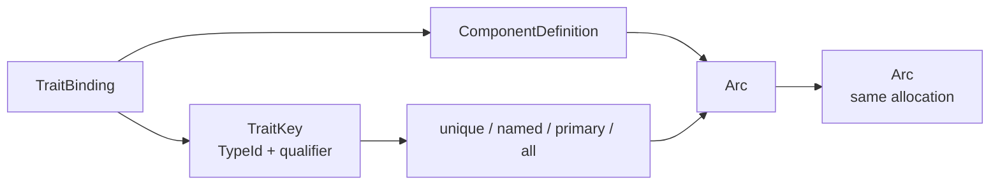

- `TraitBinding::new::<dyn T, C, _>` 的转换闭包由 Rust 编译器检查；
- 无限定符单值依赖要求唯一候选，或恰好一个 Primary；
- qualifier 精确选择一个命名绑定，同名绑定冲突在注册期拒绝；
- `resolve_all_traits` 与 `Vec<Arc<dyn T>>` 按绑定注册顺序返回全部实现，零实现
  返回空集合；
- Trait 依赖会转换为目标具体组件的真实图边，因此参与缺失目标、环和启动顺序校验；
- `register_bundle` 在修改 RegistryBuilder 前同时预检组件定义与绑定，任何冲突
  都不会留下部分模块；
- Component 宏对 `Arc<dyn T>`、字段 qualifier 和 `Vec<Arc<dyn T>>` 生成相同的
  Resolver 调用与显式依赖元数据。

### 8.6 解析失败合同

| 错误 | 是否可重试 | 诊断要求 |
|:---|:---:|:---|
| Definition 重复 | 否 | 两个来源位置与 key |
| 依赖缺失 | 否 | 完整依赖路径 |
| 多实现歧义 | 否 | 候选列表与 qualifier |
| 循环依赖 | 否 | 最短可读环路 |
| 构造失败 | 视 source | 组件、阶段和 source chain |
| Scope 已关闭 | 否 | Scope 身份和关闭原因 |

## 9. AOP 内核设计

### 9.1 双层 API

AOP 同时服务两类用户：

1. **类型化低层 API**：泛型输入、输出和错误，适合库作者和静态组合；
2. **异构运行链**：通过受控类型擦除组合不同拦截器，供 Context 与宏使用。

二者必须共享顺序、短路、错误和上下文传播语义，不能形成两套不兼容 AOP。

### 9.2 Invocation 合同

`Invocation` 的目标元数据包括：

- 稳定的方法标识和声明类型；
- 可选标签、qualifier、业务 operation；
- 只读 Context 扩展，如 trace、principal、tenant；
- 参数值默认不采集；显式启用时必须支持字段级脱敏；
- 调用 deadline、取消信号和嵌套深度；
- 业务错误作为原始 source 保留，不压缩成字符串。

### 9.3 Around 主链

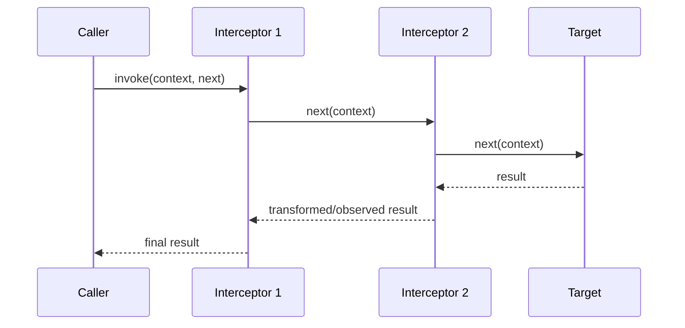

这天然形成“进入正序、退出逆序”的栈语义，并支持：

- 前置拒绝，不执行后续链；
- 观察或转换成功结果；
- 观察、映射或保留错误；
- 计时、追踪、事务、鉴权和审计；
- 嵌套调用与 Context 传播。

### 9.4 顺序规则

1. `order` 小的拦截器先进入、后退出；
2. 相同 `order` 按注册序稳定排序；
3. 宏声明顺序不能被 HashMap 遍历顺序改变；
4. 重复拦截器是否允许由 Definition 明确声明；
5. Pointcut 在高层应用构建阶段编译为不可变 `InvocationPlan`，Context refresh
   只消费已经冻结的目录。

### 9.5 IoC 管理的拦截器

Vernal 同时支持调用方直接构造的 `Advisor`，以及由应用 Container 管理的
`Interceptor` 组件。后者通过 `advisor_component` 显式登记，在依赖图冻结后由
最终 `ApplicationContext` 持有的同一个 Container 解析：

1. `InvocationPlanCatalog::deferred()` 先作为普通 Rust 原生对象进入依赖图；
2. Container 按组件定义构造拦截器并注入其 Tokio、Environment 或业务依赖；
3. 直接 Advisor 与组件 Advisor 按统一登记顺序进入计划建造器；
4. Pointcut 匹配完成后目录只允许封存一次，既有 Clone 同时看到最终计划；
5. 运行期计划直接持有 `Arc<dyn Interceptor>`，不再访问 Container。

拦截器解析失败会让应用构建 fail-closed，不会发布半初始化 Context。该过程不创建
bootstrap Store，不复制 Singleton，也不使用 tx-di 的进程级实例指针 Map。
组件 Advisor 必须声明为 Singleton；Transient 或自定义 Scope 在构建阶段通过
结构化错误被拒绝，避免预编译计划把短生命周期组件隐式提升为应用生命周期。
`LocalInterceptor` 对象本身同样满足 `Send + Sync`，只有调用 Future、目标和
返回值允许 `!Send`，因此 Local Advisor 也支持完全相同的组件化解析与一次封存。

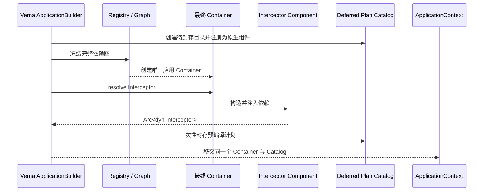

### 9.6 双执行平面、同一语义模型

Rust Web 框架并不保证所有 Service Future 都满足 `Send`。Vernal 不通过放宽
类型约束来伪装统一，而是明确提供两个执行平面：

| 执行平面 | 拦截链 | 目标与 Future | 擦除后的值 |
|:---|:---|:---|:---|
| 线程安全 | `Interceptor` / `Next` / `InvocationPlan` | `Arc` 目标、`Send` Future | `Box<dyn Any + Send + Sync>` |
| Worker 本地 | `LocalInterceptor` / `LocalNext` / `LocalInvocationPlan` | `Rc` 目标、非 `Send` Future | `Box<dyn Any>` |

两者共享 `Operation`、`Invocation`、Pointcut 语义、确定性顺序、短路、Tokio
取消/deadline 和请求上下文快照。Local 拦截器的声明对象仍满足 `Send + Sync`，
因此 `LocalInvocationPlanCatalog` 依然是 ApplicationContext 原生组件，启动
诊断会单独统计其计划与拦截器数量。消费方如需同时覆盖两类运行时，必须有意识地
实现并注册两份合同；Vernal 不会假设任意 Send 拦截器自动支持本地目标。

静态 Send 闭包目标继续使用 `InvocationTarget`；借用当前调用资源、但 Future
仍满足 Send 的框架目标实现 `BorrowedInvocationTarget`。其 Future 生命周期
绑定到独占 `&mut self`，不能逃逸 `InvocationPlan::invoke_borrowed`，因此 Salvo
仍使用普通 `Interceptor` 合同，无需克隆
`Request`、`Depot`、`Response` 或 `FlowCtrl`；Tide 使用同一合同，把借用自
Router 的 `Next` 限定在单次计划调用内；Gotham 则把一次性 Pipeline Chain 与
owned State 限定在同一个独占目标生命周期内；Rocket 同样把 Request、一次性
Data 与带请求生命周期的原生 Outcome 限定在单次包装 Route Handler 调用内。

静态本地闭包目标继续使用 `LocalInvocationTarget`。仅在单次调用中借用
Worker-local 状态的框架 Service 则实现对象安全的
`BorrowedLocalInvocationTarget`；其 Future 生命周期绑定到 `&self`，不能逃逸
`LocalInvocationPlan::invoke_borrowed`。因此 Ntex 的 `ServiceCtx` 始终留在
当前 Pipeline 调用内，无需附加 `Send`、`Sync`、`'static`、克隆或不安全的
生命周期扩展。

### 9.7 不采用实例指针 Map

Vernal 不使用 `self as *const Self as usize` 作为长期身份。目标方案按场景选择：

- 静态使用：`Advised<T>` 直接拥有目标与 `Arc<InterceptorChain>`；
- Context 组件：`InvocationPlanCatalog` 作为共享内建组件持有全部不可变计划；
- Web 请求：Adapter 从 Context 获取计划，并把 request-scoped 扩展传入 Invocation。

这样链的生命周期与所有者一致，无需全局清理，也不会因为地址复用关联到错误实例。

### 9.8 方法宏安全合同

第一版方法织入提供两套明确的 Rust 所有权合同：

1. 组件使用 `#[component(aop)]`，并显式持有
   `Arc<InvocationPlanCatalog>` 与 `Arc<CancellationToken>`；
2. 被拦截方法必须是 `async fn`，接收器可以是 `self: Arc<Self>` 或普通 `&self`；
3. Arc 路径要求 owned 参数并生成 `'static` `InvocationTarget`；共享借用路径允许
   owned 或引用参数，并使用 `invoke_borrowed`；
4. Arc 路径通过一次性 `Mutex<Option<Tuple>>` 转交参数；借用路径使用
   `BorrowedInvocationFutureTarget` 保存唯一 `InvocationFuture<'a>`，两者都不要求
   业务值实现 `Clone`；
5. 两条路径都返回 `Result<T, InvocationError>`；计划缺失、重复推进目标、取消和
   返回类型不匹配均返回结构化错误，不使用 panic。

owned 接收器路径安全产生 `'static` Future；`&self` 路径把接收器、引用参数和
业务 Future 一起约束在当前方法 `.await`，既不伪造 `'static`，也不克隆服务对象。
`Next` 按合同只能推进一次；若自定义拦截器重复调用，宏生成的目标会返回
`TargetAlreadyInvoked`，避免悄悄重复执行业务副作用。

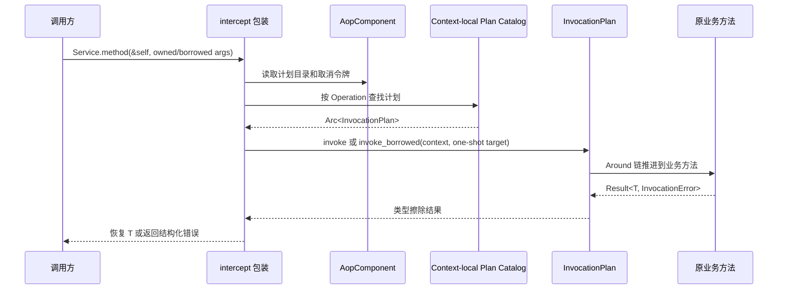

## 10. ApplicationContext 与生命周期

### 10.1 Context 职责

`vernal-context` 只负责：

- 聚合 Registry、Container 与 AOP Plan；
- 冻结 Context-local PropertySource 顺序与 Profile；
- 在依赖图规划前评估显式条件组件模块；
- 执行 refresh、初始化、启动、就绪、排空和关闭；
- 发布 Context 内类型化事件；
- 协调失败回滚与逆序资源释放；
- 提供只读诊断快照。

Context 直接使用 Tokio 任务、同步、时间、取消与 signal 能力。配置格式加载、
Web server 和外部配置中心仍属于独立适配器；它们可以把结果实现为
`PropertySource` 或注册为普通组件。

高层 `VernalApplicationBuilder` 在依赖图冻结前自动注册以下 Rust 原生对象：

| 内建组件 | 生命周期与用途 |
|:---|:---|
| `tokio::runtime::Handle` | 绑定当前应用 Runtime，供后台组件派生 task |
| `CancellationToken` | Context 关闭时统一取消，由组件监听或派生子令牌 |
| `ManagedTaskSupervisor` | 持有后台任务句柄并传播任务失败 |
| `TaskShutdownPolicy` | 约束优雅等待与 abort 后收口时间 |
| `LifecycleExecutionPolicy` | 约束 initialize/start/stop 与 abort 后收口时间 |
| `SystemShutdownSignalListener` | 监听跨平台 Tokio 进程关闭信号 |
| `ApplicationEnvironment` | 冻结属性来源优先级、Profile 与类型化解析语义 |
| `EventBus` | 每个 Context 独占的类型化广播事件 |
| `ScopeCleanupPolicy` | 约束应用拥有的 Web Scope 清理等待 |
| `InvocationPlanCatalog` | 构建阶段生成的只读 Send-AOP 计划目录 |
| `LocalInvocationPlanCatalog` | 构建阶段生成的只读 Worker-local AOP 计划目录 |

业务组件通过普通 `depends_on::<T>()` 声明这些依赖，构造器通过 `Resolver`
解析。Context 与组件持有的是同一组 `Arc<T>`，因此关闭取消、事件发布和计划
查找不会产生两套状态。低层 `Registry → ApplicationContextBuilder` 入口继续
保留，用于不希望隐式捕获 Runtime 或自动注册内建资源的库级组合。

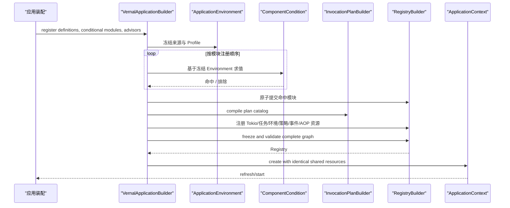

### 10.2 应用环境

`ApplicationEnvironment` 是第十一个框架原生组件。它吸收 Spring Environment
可复用的核心语义，同时拒绝复制 Java 配置生态或 tx-di 的全局 TOML：

- `ApplicationEnvironmentBuilder::add_first/add_last` 显式声明来源优先级；
- `PropertySource` 是格式中立端口，TOML、YAML、Hutool `.setting`、进程环境和
  Nacos 等实现留在 Adapter；
- Active Profile 非空时覆盖默认 Profile；没有 Active Profile 时使用
  `default` 及应用显式添加的默认集合；
- `property/get/require` 支持 `${key:default}`、嵌套默认值、跨来源引用和
  `FromStr` 类型转换；
- 缺失、类型错误、非法键、重复来源、来源读取失败、循环占位符和递归超限均返回
  `EnvironmentError`，正常控制流不 panic；
- `EnvironmentSnapshot` 只序列化来源名和 Profile，不枚举属性键和值；
- Environment 与 Context、IoC 组件持有同一 `Arc`，同进程多个 Context 完全隔离。

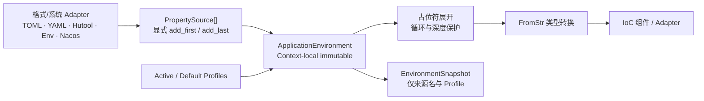

Hutool-Rust 可以把 `Profile/SettingLoader` 的结果转换成
`MapPropertySource`；Sa-Token-Rust Bridge 可以从 Environment 读取所需键，再
构造自身 `SaTokenConfigBuilder`。Vernal 不认识 Hutool 文件对象或 Sa-Token
配置类型，从而保持消费方拥有集成。

### 10.3 显式应用模块

`ApplicationModule` 是面向应用自有 Starter 与生态 Bridge 的公共装配 SPI。
模块的 `configure` 只写入隔离的 `ApplicationModuleRegistrar`，可统一暂存组件
Definition、Trait Binding、生命周期登记、Send/Local Advisor、AOP Operation、
PropertySource、Active/Default Profile 和显式 `ConditionalComponentModule`。

`VernalApplicationBuilder::register_module` 把这些贡献作为一个具名事务处理：

1. 校验静态模块身份，并拒绝已经成功提交的同名模块；
2. 在隔离 Registrar 中执行模块配置；
3. 在应用已有名称和当前模块批次两个范围内预检全部内嵌条件模块身份；
4. 把环境贡献应用到克隆的 `ApplicationEnvironmentBuilder` 完成预检；
5. 通过 IoC 原子 `register_bundle` 校验并提交 Definition 与 Binding；
6. 全部预检成功后，才把生命周期、AOP、Operation、Environment 和条件贡献一次
   移入真实应用建造器。

配置失败、条件身份非法/重复、PropertySource 重名、Profile 非法或
Definition/Binding 冲突都不会留下模块前缀，也不会占用模块名，修正后的模块可以
重试。内嵌条件会在后续构建阶段读取包含外层模块来源与 Profile 的同一份最终
Environment。全部声明顺序保持稳定。模块属于显式 Rust 链接期装配，不是
classpath 扫描、全局清单，也不会让 Vernal 反向依赖 Hutool-Rust、
Sa-Token-Rust、Ddd4r 或具体 Web 框架。

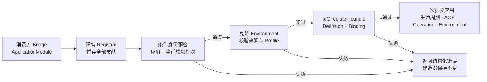

### 10.4 条件组件装配

条件判断位于 `vernal-context`，因为 Context 同时拥有冻结后的 Environment 与
应用装配流程；纯 `vernal-ioc` 不认识 Profile、属性键或配置格式。

- `ComponentCondition` 是扩展合同，只接收冻结后的
  `ApplicationEnvironment`；
- `ProfileCondition` 支持有效 Profile 的 any/all/none 判断；
- `PropertyCondition` 支持存在、缺失、相等、不相等和显式
  match-if-missing，并比较占位符展开后的值；
- `PredicateCondition` 把线程安全闭包适配成自定义条件，但诊断不会序列化闭包
  捕获的数据；
- `ConditionalComponentModule` 把 Definition、Trait Binding 与生命周期登记
  绑定为一个原子装配单元；
- Environment 冻结后按模块注册顺序求值一次，依赖图规划前只提交命中模块；
- 未命中模块整体排除；若无条件组件仍依赖其中对象，GraphPlanner 继续返回
  `GraphError::MissingDependency`，不会静默回退；
- `ConditionEvaluationSnapshot` 只记录静态模块名、条件类型、命中状态、组件类型
  标识和声明数量，不记录属性键、期望值、解析值或来源错误；
- 条件失败会终止构建。常规 `Display/Debug` 脱敏，显式遍历
  `Error::source` 仍可取得根因。

这不是 Spring Boot 的 classpath 扫描或自动配置发现。应用和生态 Adapter 必须
显式登记模块，让 feature 所有权、依赖成本与替换规则始终在 Rust 代码中可见。

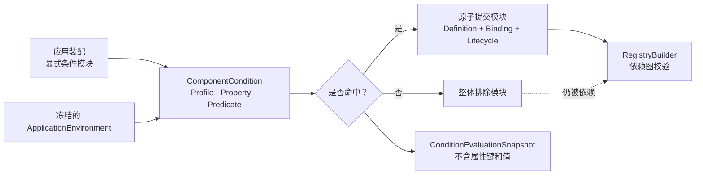

### 10.5 状态机

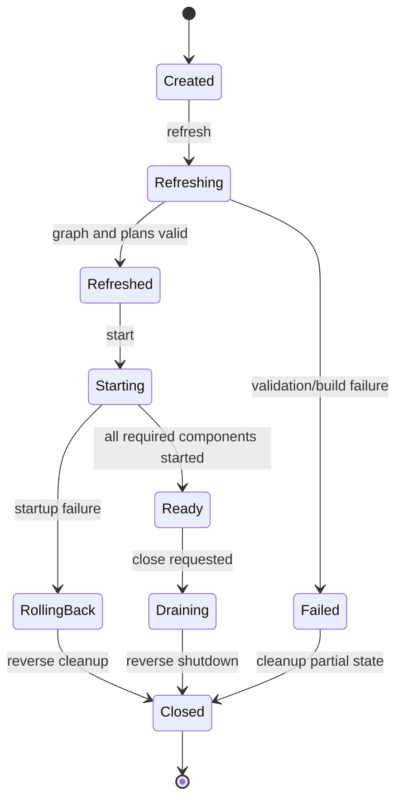

### 10.6 生命周期顺序

```text
register
  → freeze
  → validate graph and pointcuts
  → construct singleton components
  → initialize in dependency order
  → start in dependency order
  → publish Ready
  → cancel and drain managed tasks
  → stop in reverse dependency order
  → release scopes
```

任何阶段失败都要记录已完成步骤，只回滚已经成功的组件。关闭必须幂等；多次
`close()` 返回相同终态，不重复执行不可重入副作用。

### 10.7 Context 生命周期所有权

`ApplicationContext` 是公开门面，不让某个临时调用者 Future 直接拥有生命周期。
`ApplicationStartupCoordinator` 在独立 Tokio task 中执行 refresh/initialize/
start，并由第二个观察任务消费 Join 结果。调用方取消等待只会丢弃一次性结果
接收端；阶段任务仍会成功提交状态，或在失败/panic/应用取消时逆序回滚。

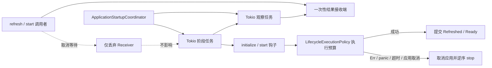

每个用户 initialize/start 钩子还会在独立子任务中执行，因此 panic 会变成携带
组件名与阶段的 `ContextError::Lifecycle`，而不是击穿协调器。
`LifecycleExecutionPolicy` 分别约束 initialize、start、stop，并提供 abort 后的
收口预算。阶段超时会先请求 Tokio abort，在预算内消费 `JoinHandle`，写入脱敏
告警，再执行或继续逆序回滚。组件在 initialize 前先进入共享组件栈，确保 panic、
超时或等待者取消后仍有明确所有者执行 stop。

Tokio abort 属于协作式终止：生命周期钩子必须保持异步并定期让出执行权；阻塞工作
应由组件放入自有 `spawn_blocking` 任务，并定义自己的取消与收口合同。Vernal 会
报告 abort 后任务是否按时收口，但不会虚构线程级强制终止能力。这里保留 tx-di
清晰的显式阶段和有界停机意图，同时不复制其全局 App、隐式任务所有权或未被观察
的超时 `JoinHandle`。

`ApplicationContext::close()` 只负责启动并等待关闭，组件栈与实际释放流程由
Context-local 的唯一 Tokio 协调对象持有。这样调用方取消 Future 不会等价于取消
资源释放；后续和并发调用者订阅同一个可克隆 `Result`，不会再次执行 `stop`。

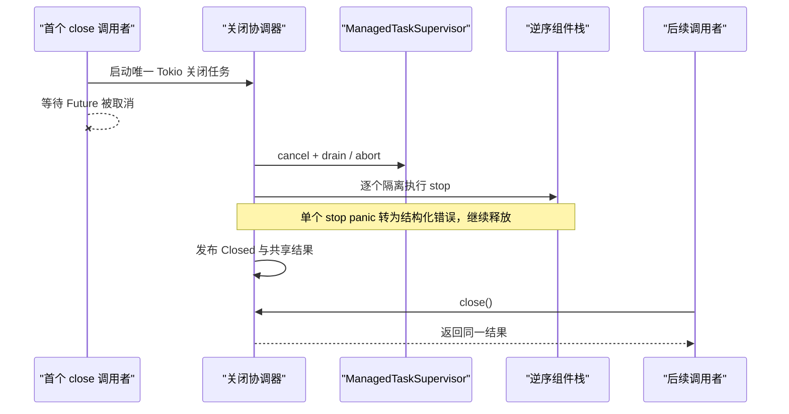

`run_until_cancelled()` 是服务主循环的最小等待入口；
`run_until_shutdown_signal()` 在同一应用令牌与
`SystemShutdownSignalListener` 之间竞速，让 Ctrl-C、Unix SIGTERM/SIGHUP 和
Windows 控制台事件进入同一个关闭协调器。收到信号后先发布类型化
`ApplicationShutdownSignal` 事件，再立即广播取消。信号注册或 stream 异常会
变成 `ContextError::ShutdownSignal`；Vernal 仍执行保守取消与关闭，不 panic，
也不会让失去监督的应用继续运行。监听器作为十一类框架原生 IoC 组件之一，不建立
全局 Runtime 或进程级 Context。

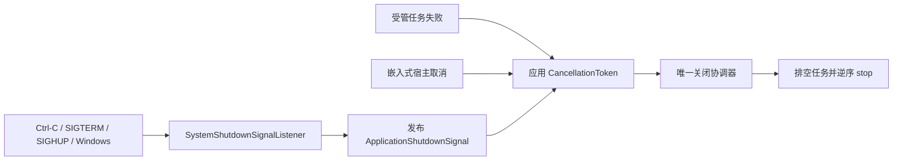

### 10.8 受管 Tokio 任务

`ManagedTaskSupervisor` 是 Context 对长期 Worker、消息消费、配置监听和
Hutool-Rust Cron 驱动任务的所有权边界。它不实现这些业务或工具能力，只管理其
Tokio task 生命周期。

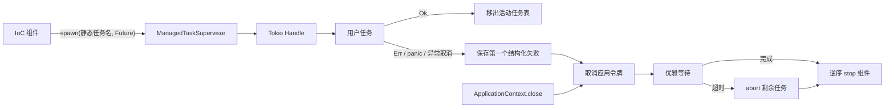

第一个任务失败会停止接收新任务并取消应用。停机自身也必须取消安全：唯一 Tokio
协调任务负责两阶段等待，所有调用者订阅同一结果。默认在取消后优雅等待 30 秒，
再 abort 剩余任务，并给观察器 1 秒完成收口。任务名只能使用低基数静态字符串；
诊断只记录 `context.managed-task.shutdown-failed`，原始错误正文只存在于显式
`ManagedTaskError` 错误链。

## 11. Web、HTTP 与框架集成

Vernal 借鉴 Spring 的职责分离，不复制 JVM 产品命名。Rust Web 框架通常直接提供
异步 Handler；Streaming 是 HTTP Body、RPC、SSE 和 WebSocket 的能力，而不是
另一套应用编程模型。

| 层次 | Vernal crate | 合同 | 边界 |
|:---|:---|:---|:---|
| Web 应用 | `vernal-web` | Request Context、请求 Scope、Handler 调用、提取、校验、错误映射 | 不包含传输层或框架类型 |
| HTTP 协议 | `vernal-http` | Request、Response、Body Frame、Streaming、取消、背压 | 使用 Rust `Future`/`Stream`，不拥有 Runtime |
| 合同测试 | `vernal-web-testkit` | 统一验证 Context/IoC 绑定及成功、策略错误、响应 Drop 后的 Scope 清理 | 仅作为 Adapter 开发依赖，不进入运行时依赖图 |

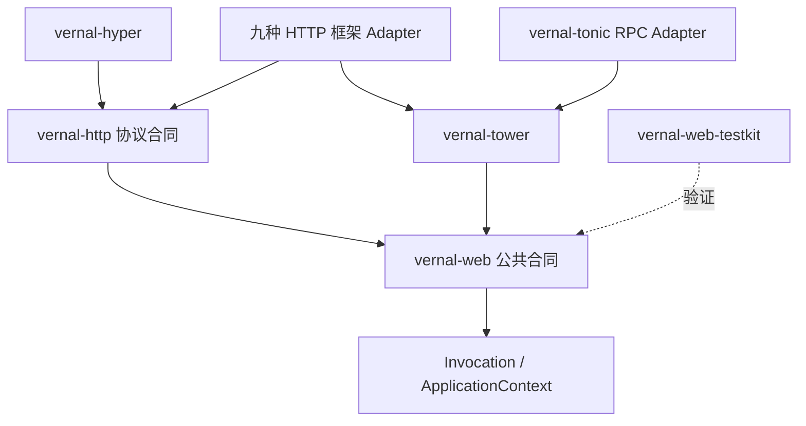

版本化覆盖集合由
[`web-integration-manifest.toml`](../web-integration-manifest.toml) 维护：

| 优先级 | 框架 | Crate | 协议/能力 | 目标机制 |
|:---:|:---|:---|:---|:---|
| 1 | Axum | `vernal-axum` | HTTP、Body Streaming、Tower | Tower Layer、Service、Extractor/Context Bridge |
| 2 | Actix Web | `vernal-actix-web` | HTTP、Body Streaming、严格 Local-AOP | Transform/Service Middleware、App Data、匹配资源模式 |
| 3 | Rocket | `vernal-rocket` | HTTP 请求/响应、可选 Streaming、严格 AOP | Fairing、Request Guard、包装 Route Handler |
| 4 | Warp | `vernal-warp` | HTTP、Body Streaming、严格 AOP | Filter 组合、显式路由模式、Tower Service |
| 5 | Salvo | `vernal-salvo` | HTTP、Body Streaming、严格 AOP | Handler、Hoop、匹配路径、借用型 Send 目标 |
| 6 | Poem | `vernal-poem` | HTTP、Body Streaming、严格 AOP | Middleware、Endpoint、Request Data |
| 7 | Ntex | `vernal-ntex` | Network HTTP、Body Streaming、严格 Local-AOP | Service/Middleware、显式资源模式、借用型 Worker-local 目标 |
| 8 | Gotham | `vernal-gotham` | HTTP 请求/响应、严格 AOP | State Middleware、显式路由模式、借用型 Pipeline Chain |
| 9 | Tide | `vernal-tide` | HTTP、Body Streaming、严格 AOP | Middleware、显式路由模式、借用型 Next |
| 10 | Tonic | `vernal-tonic` | gRPC / RPC Streaming | Tower Service、Interceptor、Extensions |

Tower 与 Hyper 是公共底座，不占十种目标名额；Tonic 明确属于 RPC，而不是 HTTP Router。
该集合是根据本地源码集成并集和当前 registry 可用性形成的版本化覆盖优先级，不是
对全世界 Rust 框架热度的绝对排名。

当前 Workspace 包含十五个 Web 相关 crate：`vernal-web`、`vernal-http`、
Tower/Hyper、`vernal-web-testkit` 和十个 Adapter。四个运行时底座已提供可调用的请求 Scope、HTTP
Frame/Trailer、元数据/取消传播、Tower 生命周期、AOP 调用链、可配置原生错误
恢复和 Hyper 传输能力；共享 testkit 已让十个 Adapter 使用同一请求绑定合同，
验证原生提取器暴露的 Context、Scope 和组件来自同一 IoC `ScopeContext`，并用
只观察、不清理的 Probe 验证正常 Body 完成、策略短路与响应 Body Drop 后均由
Adapter 自身关闭 Scope。
Axum 已增加原生 Router 装配与类型化提取器，Actix Web 已增加 App Data/Extensions
与原生 Body 感知 Middleware，并通过 Vernal Local-AOP 为基于 `Rc`、不要求
`Send` 的 Service 提供严格 Around。严格中间件在匹配后包裹具体 Resource，
以低基数资源模式作为操作身份，缺少元数据或计划时 fail-closed，并保留 Actix
原生错误。
Rocket 已增加 Managed State、Request Guard、Body 感知 Fairing、owned 请求
快照，以及覆盖未修改 Route Handler、保持 Success/Error/Forward Outcome 的
fail-closed 严格 Send-AOP，
Warp 已增加 Extension Filter、官方 Tower Service 生命周期、owned 请求快照，
以及基于显式低基数路由模式、覆盖具体 Filter Service 的 fail-closed 严格
Send-AOP。Salvo 已增加
Hoop、Depot、Frame/Trailer 保真的 Body 生命周期、匹配路径操作身份、owned
请求快照，以及覆盖完整借用型 Handler 链的 fail-closed 严格 Send-AOP。Poem 已增加
Middleware/Endpoint、Request Extension 提取器、Body 生命周期集成，以及基于
匹配后低基数 `PathPattern` 的严格 Around AOP。Ntex
已增加原生 Middleware/Service、App State/Extension、类型化提取器、响应 Body
生命周期，以及覆盖完整借用型 `ServiceCtx` Future 的严格 Local-AOP。由于 Ntex
不公开匹配后的 `ResourceDef` 元数据，中间件需要包裹具体资源并显式接收同一条
低基数完整路径模式；缺少计划时 fail-closed，请求不会被克隆，原生 Service
错误保持原有语义。Gotham 已增加原生 StateData、类型安全 State 访问、Pipeline
  Middleware、Frame/Trailer Body 生命周期、owned 请求快照，以及基于显式低
  基数路由模式、覆盖完整借用型 Pipeline Chain 的 fail-closed 严格 Send-AOP。
  Tide 已增加原生 Middleware、
  类型化 Request Extension 访问、Reader 绑定 Scope 释放、跨模型 owned 请求
  快照，以及基于显式低基数路由模式、覆盖借用型 `Next` 的 fail-closed 严格
  Send-AOP。Tonic 已增加原生 Request/Metadata/Status 与 Tower 集成。详细合同见
  [Vernal Web 集成架构](./Vernal-Web-Architecture.zh_CN.md)。

## 12. Hutool-Rust、Sa-Token-Rust 与 Ddd4r 集成

### 12.1 Hutool-Rust

Hutool-Rust 继续承担通用工具库职责。其基于 Reqwest 的 HTTP Client Interceptor
可以使用 `vernal-aop`，但 Hutool-Rust 不拥有服务端 ApplicationContext，也不能
成为 Vernal 内核依赖。

本地 Hutool-Rust checkout 现已提供消费方持有、暂不发布的 `hutool-vernal`，
消费方提交 `14ce41a` 固定到 Vernal Revision `d6b1f04`。它把 Hutool
`HttpConfig` 与基于 Tokio/Reqwest 的 `HttpClient` 注册为具名
`ApplicationModule` 中的
Container-local Singleton，显式选择 URL/SSRF 策略，并让配置依赖进入 Vernal
图校验。`HutoolApplicationModule` 还能把该 HTTP 图、多份不可变 Setting 来源和
Active/Default Profile 组织成一个消费方事务。
`HutoolSettingPropertySource` 还会真实加载 Hutool Profile/Setting 文档，将其
冻结成 Vernal PropertySource，把命名分组转换为点分键，并原子拒绝扁平化冲突。
现有 5 个 Bridge 测试证明 Singleton 解析、重复模块拒绝、网络 I/O 前拒绝本地
目标、HTTP/Setting/Profile 全能力装配，以及 Definition 冲突后的完整回滚与同名
重试。
该消费方 Bridge 已提交并推送到 Hutool-Rust 仓库。

### 12.2 Sa-Token-Rust

Sa-Token-Rust 是唯一保留的安全集成目标。Vernal 将其 Manager/Runtime 图
注册为显式组件，把共享鉴权流组合为各框架 Middleware 或 Interceptor，并通过
Request Scope 传播鉴权结果。Token、Session、Role、Permission、Cookie 以及
401/403 语义继续由 Sa-Token-Rust 拥有。

Sa-Token-Rust 仓库现已实现消费方持有、暂不发布的 `sa-token-vernal`。它固定到
已经验证的 Vernal Git Revision，把 `HttpRequestSnapshot` 适配为 `SaRequest`，
将已认证角色投影为 `SecurityPrincipal`，并让下游 Future 运行在请求级
`SaTokenContext` 中。`SaTokenComponents` 是具名 `sa-token.security`
`ApplicationModule`，保留调用方传入的原始 `Arc<SaTokenManager>`、Bridge 与
Policy 身份，并把这些定义以及 Send/Local 两类认证授权 Advisor 作为一个事务
安装。模块名或组件定义冲突时完整拒绝，不泄漏残缺调用计划。
`VernalSaTokenInterceptor` 先认证，再在
完整 Tokio 调用 Future 上执行按 Operation 声明的角色/权限 all/any 规则，并
保留 Sa-Token 全局与前缀通配符语义：匿名访问受保护操作返回 401，已认证但权限
不足返回 403，权限后端失败保持内部 500。Axum/Poem/Tonic Adapter 将这些
`WebFailure` 转为原生 HTTP/gRPC 失败响应。路径登录策略仍由
`PathAuthConfig` 唯一定义。现有十类 Plugin 仍是 Vernal Adapter 矩阵的输入
证据，不表示 Vernal 会静默复制或内嵌这些源码。

`VernalSaTokenConfigBinder` 现已把不可变 `ApplicationEnvironment` 映射到
Sa-Token 原生 `SaTokenConfigBuilder`，覆盖 Builder 已公开的稳定标量与枚举设置；
缺失键继续采用 Sa-Token 默认值，非法值错误保持脱敏。Storage、Listener、Manager
创建和 Runtime 安装仍由 Sa-Token 显式负责。目标 crate 的 12 个 Bridge 测试
（包括模块与定义冲突回滚合同）和 2 个配置绑定测试已一起通过。

### 12.3 Ddd4r

Ddd4r 仓库现已提供消费方持有、暂不发布的 `ddd4r-vernal` Bridge。它固定到
已验证的 Vernal Git Revision，将调用方创建的原生 `Registry` 和
`DefaultCommandBus` 以原始 `Arc` 身份原子装入 Vernal，并生成显式
`Registry + DefaultCommandBus -> VernalDdd4rBridge` 依赖关系。

Bridge 在每个异步入口创建应用 Registry 的隔离浅快照，再复用 Ddd4r 自己的
Tokio task-local `ContextScope`。请求级身份、租户、事务和 Repository 覆盖可写入
该快照，跨 `.await` 保持可见，作用域结束后不泄漏。Vernal 只负责装配与横切合同；
聚合、领域事件、CQRS、Repository、Outbox 和事务边界继续由 Ddd4r 定义，
`ddd4r-core` 不反向依赖 Vernal。

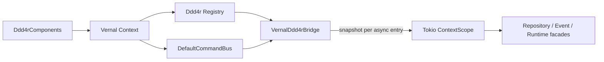

独立依赖图的真实 Tokio 测试已证明：两个原生对象保留 `Arc` 身份，应用服务跨
`yield_now().await` 可从 task-local Context 解析，请求级服务在作用域退出后不可见，
重复组件包被原子拒绝；目标 crate 的 Clippy `-D warnings` 和 Rustdoc 同时通过。
Ddd4r 全 Workspace 验证仍被既有、当前不可获取的 `rbatis-r2dbc` Git Revision
阻断，这一外部依赖问题不等同于 Bridge 编译失败，也不算全仓门禁通过。

## 13. 安全、隐私与全局状态

| 风险 | 默认策略 | 验收 |
|:---|:---|:---|
| Invocation 记录敏感参数 | 默认不捕获参数值 | 脱敏与 opt-in 测试 |
| 恶意或故障拦截器阻断链 | deadline、取消和错误边界 | timeout/cancellation 测试 |
| 多 Context 数据串扰 | 无进程级可变权威状态 | 并行隔离测试 |
| 宏泄露内部字段 | 只生成必要元数据 | trybuild 与 token snapshot |
| 供应链 feature 膨胀 | Adapter 独立、默认最小 feature | cargo tree / deny |
| unsafe 引入 | Workspace `unsafe_code = "forbid"` | Clippy/compile gate |

Vernal 不保证第三方依赖完全无 unsafe；`forbid` 只约束 Workspace 自有源码。

## 14. 错误、可靠性与诊断

### 14.1 错误分类

| 分类 | 示例 | 调用方动作 |
|:---|:---|:---|
| Definition | 重复、无效 qualifier | 修正注册 |
| Condition | 模块非法、条件评估失败 | 修正显式装配或检查 source |
| Graph | 缺失、歧义、循环 | 修正组件关系 |
| Resolution | 构造器失败、Scope 关闭 | 检查 source 或停止使用 |
| Interception | 拒绝、Pointcut、调用链失败 | 按业务错误合同处理 |
| Lifecycle | 初始化、启动、关闭失败 | 回滚或报告 degraded |
| Adapter | 框架转换或 Context 缺失 | 返回框架原生稳定错误 |

### 14.2 启动报告

Context refresh 现已产生可序列化、只读且脱敏的诊断快照：

- Vernal 版本、MSRV 与启用 feature；
- PropertySource 名称与 Active/Default/Effective Profile；
- 条件模块的静态名称、条件类型与命中/排除状态；
- Definition 数量、Scope 数量与依赖图摘要；
- 匹配的 Pointcut 和拦截器数量；
- 生命周期阶段、耗时和失败组件；
- Adapter 与外部依赖状态；
- 警告、废弃项和未使用 Definition。

```mermaid
flowchart LR
    Registry["Registry<br/>definitions + bindings + BuildPlan"]
    Catalog["InvocationPlanCatalog"]
    Environment["ApplicationEnvironment<br/>来源名 + Profile"]
    Conditions["条件评估<br/>仅模块/类型/命中状态"]
    Static["静态诊断配置<br/>feature / adapter / external / warning"]
    Lifecycle["Context 状态机<br/>warm-up / resolve / init / start / stop"]
    Snapshot["RegistrySnapshot<br/>只读值对象"]
    Report["StartupReport<br/>只读脱敏值对象"]
    Output["Serde Serializer<br/>日志 / 管理端点 / 测试"]

    Registry -->|"复用已验证顺序"| Snapshot
    Snapshot --> Report
    Catalog -->|"plan 与 interceptor slot 计数"| Report
    Environment -->|"EnvironmentSnapshot<br/>不含属性键和值"| Report
    Conditions -->|"不含属性键/值/错误"| Report
    Static --> Report
    Lifecycle -->|"阶段、结果、微秒耗时"| Report
    Report --> Output
```

当前实现合同：

- `Registry::snapshot()` 按真实依赖优先构建顺序生成 `RegistrySnapshot`，不会重新
  运行拓扑算法，也不会暴露工厂、upcast 闭包、实例或地址；
- `ApplicationContext::startup_report().await` 返回拥有自身数据的克隆快照，后续
  start/close 不会反向修改已经取得的报告；
- `EnvironmentSnapshot` 只包含 PropertySource 名称和 Profile；属性键、值及
  占位符解析结果均不会进入 `StartupReport`；
- `ConditionEvaluationSnapshot` 同时保留命中与排除模块，但不包含条件属性键、
  期望值、解析值或评估错误；
- warm-up、组件解析、initialize、start 和 stop 均记录稳定阶段、组件名、
  成功/失败与微秒耗时；
- 原始错误链只通过 `ContextError::source` 返回，`StartupReport` 类型中不存在
  `error_message` 字段；
- feature 和告警只接受静态名称/代码；Adapter 与外部依赖只接受名称和固定
  `DiagnosticState`，不接收连接串、令牌或任意错误详情；
- `ApplicationContext::record_runtime_warning` 将静态代码按确定顺序去重写入当前
  Context。应用绑定的 `WebRequestScope` 在异步关闭钩子失败时统一记录
  `web.request-scope.cleanup-failed`；即使 Body 已被 Drop、无法回传响应错误，
  运维快照仍能看到脱敏证据；
- 未使用 Definition 由每个 Container 的成功解析记录生成；失败解析不计入使用，
  结果按已验证构建顺序稳定输出，不使用“没有入边”等启发式判断。Adapter 自动
  探测仍留给各集成 crate 后续接入，当前由应用显式登记。

## 15. 测试与架构验收

| 层级 | 必须验证 |
|:---|:---|
| 静态 | crate 依赖方向、Tokio feature 预算、禁止具体 Web/ORM 实现进入通用内核 |
| 单元 | 图算法、qualifier、顺序、Scope、状态机 |
| 属性测试 | 任意 DAG 的确定性拓扑和循环识别 |
| 编译测试 | 宏诊断、trait bounds、生命周期和泛型 |
| 并发测试 | Singleton 一次构造、Context 隔离、关闭竞态 |
| 契约测试 | Typed AOP 与 Dyn AOP 顺序/错误语义一致 |
| Web 一致性 | 相同策略在多个框架得到等价结果 |
| 消费方集成 | Hutool-Rust、Sa-Token-Rust、Ddd4r 示例不产生反向依赖 |
| 基准 | 解析热路径、调用链层数、启动图规模；只报告实测 |

Phase 1 最低验收：

1. 1,000 节点无环图可以确定性规划；
2. 缺失、歧义和循环错误包含可读路径；
3. 两个并行 Container 的 Singleton 不共享；
4. `cargo tree` 证明 `vernal-ioc` 不包含具体 Web 或 ORM 框架；允许按需使用 Tokio；
5. 所有失败通过 `Result` 返回，不依赖 panic。

截至 2026-07-25，上述五项已有本地证据：36 个 IoC 合同测试覆盖 1,000 节点图、
缺失/歧义/循环路径、两个并行 Container 的 Singleton 隔离、Transient、
qualifier、隐藏依赖拒绝、原生值注册、Tokio Handle 真实 task，以及 Trait
命名/Primary/全部实现、空集合、目标缺失、Trait 图环、命名冲突、批量原子性，
不含工厂与实例地址的确定性 Registry 序列化快照，并覆盖每 Container 成功解析
追踪、确定性未使用定义快照，以及失败 Scope 解析不被误记为使用。
其中 9 项验证类型化自定义 Scope 的并发一次构造、兄弟隔离、安全父子可见性、
Container 所有权、取消传播、失败后继续逆序清理、关闭等待已开始工厂、等待者
取消安全、超时后后台完成，以及关闭钩子 panic 隔离。
普通 Singleton/Transient 解析仍为同步热路径；自定义 Scope 生命周期直接使用
Tokio 同步与取消能力完成可观察的异步清理。
`register_all` 原子注册纯组件批次；`register_bundle` 同时原子提交定义与绑定。

Phase 2 AOP 内核另有 11 个 Send 合同测试，覆盖顺序进入/逆序退出、短路、结果/
错误改写、跨 `.await` 类型化上下文、取消/deadline、切点过滤和 64 task 并发
复用、借用型非静态目标、重复 Operation 合并的计划目录编译与一次封存；另有 6 个
Local-AOP 测试覆盖非 `Send` 返回值、顺序、短路、取消、计划目录和借用型本地
目标。宏前端另有 5 个运行时测试，覆盖
Singleton Component 注入、Transient 构造、Trait Object 注入、Arc-owned 与
共享借用接收器的 Context-local 方法织入及类型驱动自定义 Scope，并有 4 个
compile-fail 用例覆盖非法组件字段、非法集合 qualifier、非异步方法和可变接收器。
Phase 2 已具备可调用闭环，但 Trait/泛型方法、诊断矩阵、性能基准和稳定性承诺
仍未完成。

Phase 3 内核另有 55 个合同测试，覆盖依赖顺序启动、逆序关闭、initialize/start
回滚、非法转换、幂等关闭、并发关闭串行化、Context-local 类型化事件隔离，
高层构建器的 Runtime 缺失诊断、十一类内建组件同实例注入、应用 Scope 取消树、
任务错误/panic 传播、取消安全共享停机、超时 abort、任务先于组件 stop 的顺序、
关闭等待者取消后继续完成组件释放、refresh/start 等待者取消后继续失败回滚、
start 前应用取消、任务失败驱动 `run_until_cancelled()` 进入 `Closed`、stop
钩子 panic 隔离、initialize/start 超时回滚、stop 超时后继续逆序释放，以及
类型化 OS 信号发布、应用取消优先结束信号等待，PropertySource 优先级、
Profile、类型转换、嵌套占位符、循环/来源失败，以及成功/失败启动报告的只读
快照、Serde 序列化、环境属性值隔离与业务错误正文脱敏，并覆盖
由真实 Container 解析记录驱动的动态未使用定义快照、Send/Local IoC 管理
拦截器依赖注入、直接/组件 Advisor 稳定统一顺序、缺失拦截器 fail-closed 和
非 Singleton Advisor 作用域拒绝，以及
Profile/Property/自定义条件选择、条件 Definition/Lifecycle 原子进退、依赖图
fail-closed 与条件错误脱敏，并覆盖显式 ApplicationModule 安装、贡献顺序、
全能力成功装配、配置/Environment/Definition 失败原子回滚、错误脱敏、身份校验、
重复拒绝及预检失败后的同名重试，并验证内嵌条件模块读取同一暂存 Environment，
条件身份非法或重复时整个外层模块回滚。

## 16. 实施路线

| 阶段 | 交付 | 退出条件 |
|:---|:---|:---|
| Phase 0 | 品牌、双语 README、架构、可构建骨架 | 文档、fmt、check、clippy、test、doc 通过 |
| Phase 1 | Core + IoC 最小闭环 | 注册、图、Scope、解析与错误测试通过 |
| Phase 2 | AOP + Macros | Around、顺序、Pointcut、trybuild 通过 |
| Phase 3 | ApplicationContext | 生命周期、事件、回滚、关闭通过 |
| Phase 4 | Web/HTTP 合同、Tower/Hyper 与十个 Adapter | 跨框架契约矩阵通过 |
| Phase 5 | 三类生态 Bridge | 消费方示例和依赖边界通过 |
| Phase 6 | Preview 发布 | MSRV、SemVer、审计、打包和文档发布通过 |

任何 Phase 都不能仅凭“crate 存在”或“cargo check 通过”宣布能力完成。

## 17. 风险与待确认

| ID | 风险 / 待确认 | 影响 | 验证计划 |
|:---|:---|:---|:---|
| R-001 | 对象安全异步 Around 的分配成本 | AOP 性能 | 对已实现的 boxed-future 路径做 benchmark |
| R-002 | proc-macro 对 Trait、泛型与可变方法的覆盖 | 可用性 | trybuild 矩阵 |
| R-003 | 编译期自动注册的跨平台链接行为 | 可移植性 | Linux/macOS/Windows CI |
| R-004 | Request Scope 在不同 Web 框架中的取消/释放差异 | 资源安全 | 跨框架异常链测试 |
| R-005 | 过度追求 Spring 命名导致非 Rust API | 长期维护 | API review 与 Rust API Guidelines |
| R-006 | 过早承诺零开销 | 品牌可信度 | 对静态/动态路径分别测量 |

## 18. 架构完成定义

- [x] IoC 与 AOP 能分别独立依赖、构建和使用；
- [x] Tokio 使用范围和 feature 预算明确，Context 不向通用内核泄漏配置格式或
  具体 Web/ORM 类型；
- [x] ApplicationEnvironment 保持 Context 隔离，配置格式与消费方类型留在
  Adapter，并提供不含属性键和值的诊断快照；
- [x] 条件模块只对冻结 Environment 求值一次，并原子包含 Definition、Trait
  Binding 与生命周期登记；
- [ ] 组件图、拦截链和生命周期都有成功、失败与回滚测试；
- [ ] 无指针地址全局链、无正常控制流 panic、无隐式跨 Context 状态；
- [ ] Web Adapter 通过统一合同套件，并保留各框架原生语义；
- [x] Hutool-Rust、Sa-Token-Rust 和 Ddd4r 的责任边界由消费方示例证明；
- [ ] 中英文 README、架构、命令、crate 名和状态保持一致；
- [ ] 发布前补齐 SemVer、MSRV、Security Policy 和 crates.io 验证。

---

**文档版本**：0.1.0<br>
**最后更新**：2026-07-25<br>
**文档状态**：草案，待架构评审
