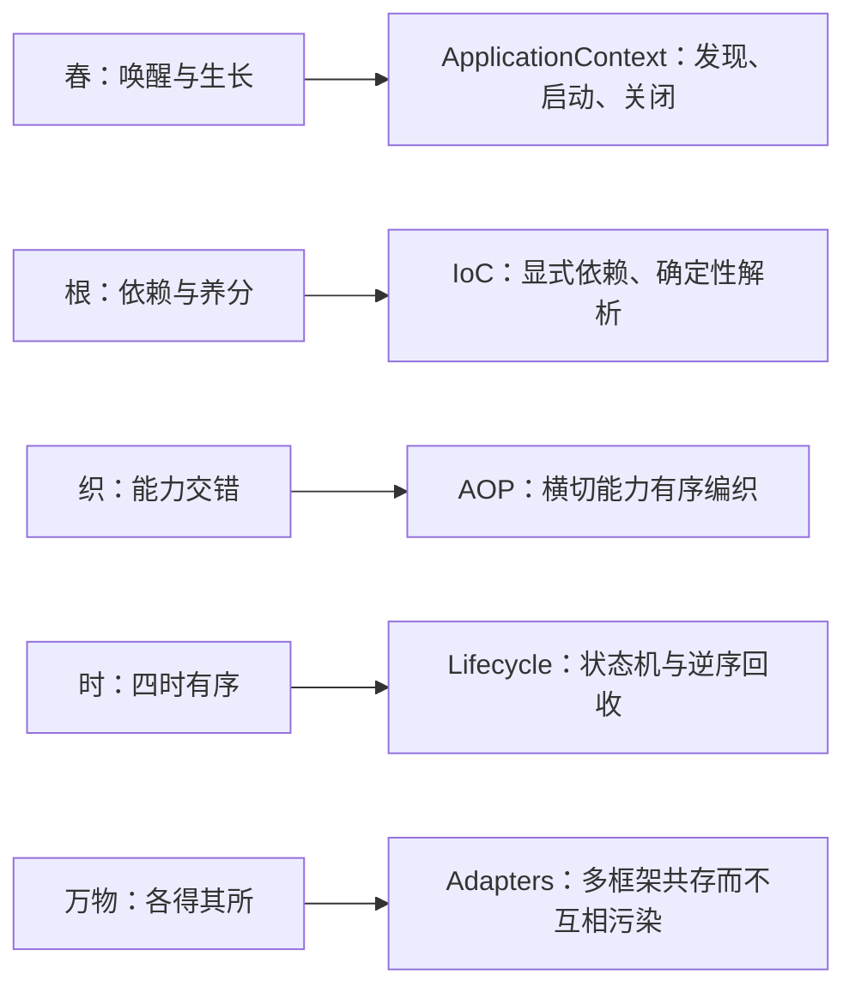
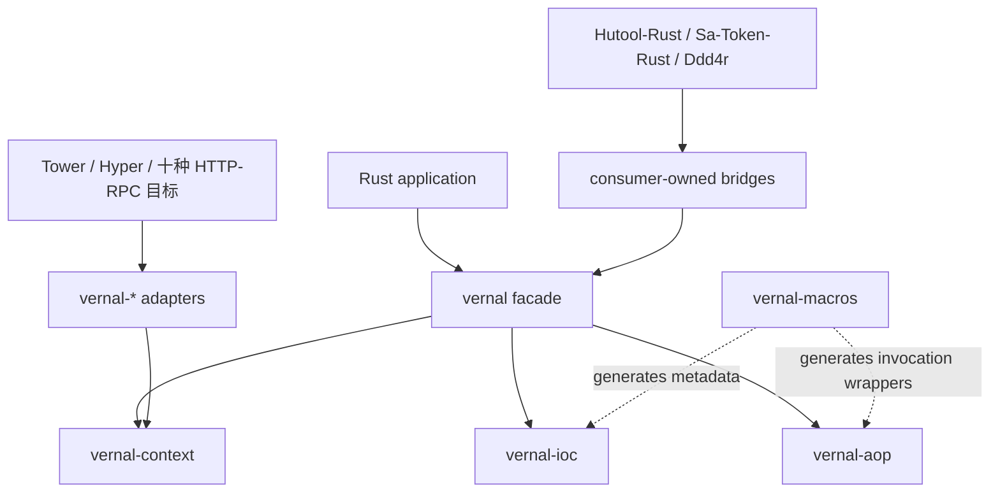
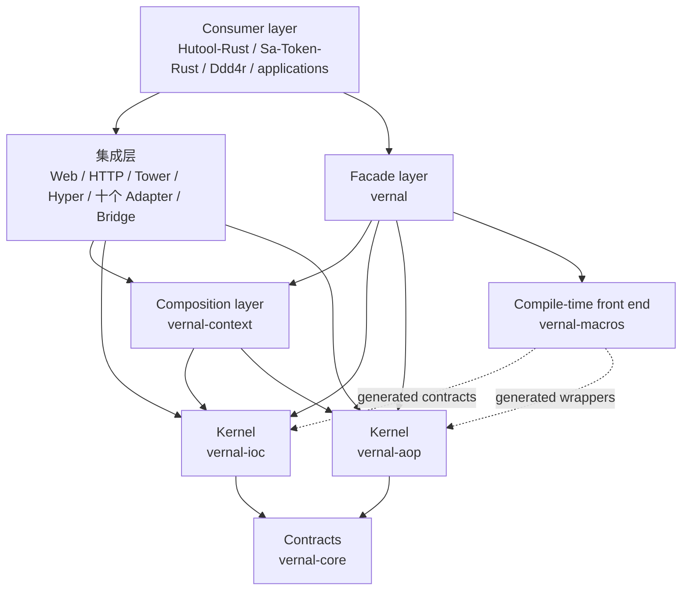
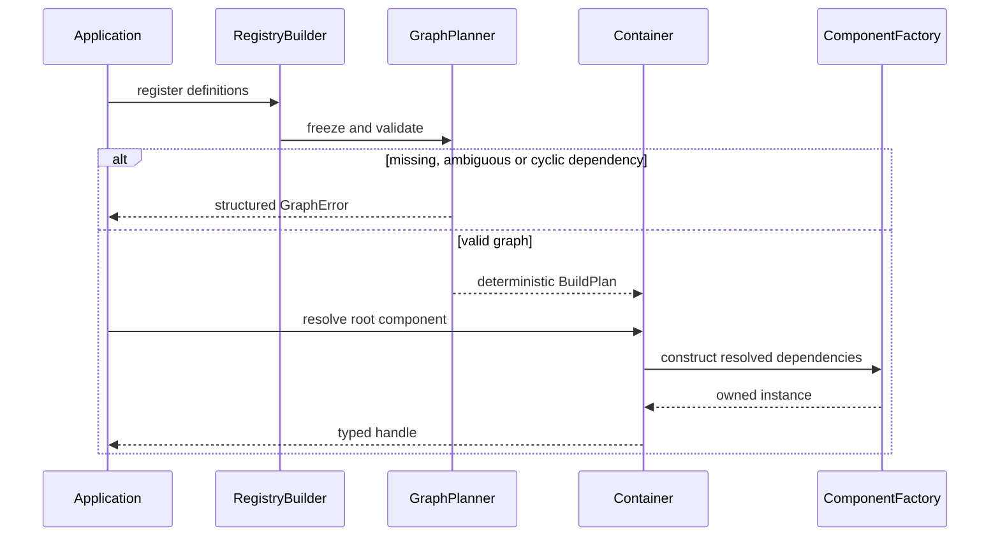
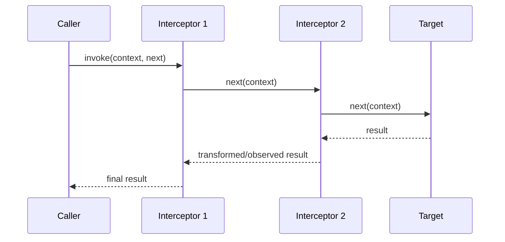
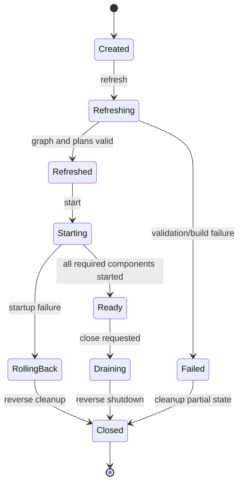
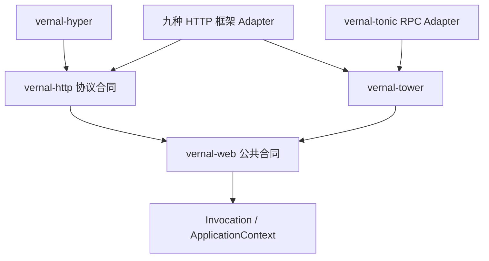
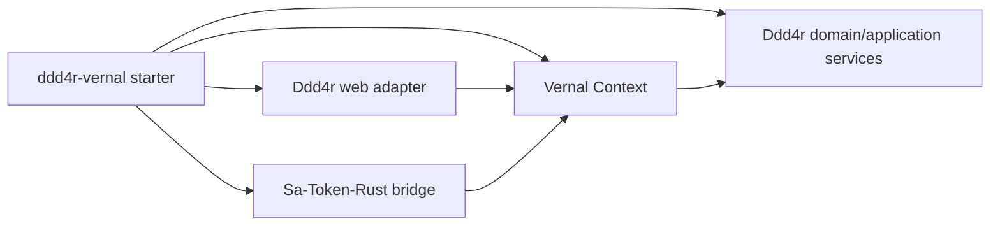

# 句芒 · Vernal Framework 架构设计

> **文档目的**：定义 Vernal 的品牌寓意、系统边界、IoC/AOP/ApplicationContext
> 核心合同、crate 依赖方向、Web 与生态集成方式，以及从 `tx-di` 吸收能力时必须
> 遵守的重构边界。
>
> **架构版本**：0.1.0<br>
> **适用代码版本**：`0.0.0-dev` Phase 1–4 可调用底座<br>
> **文档状态**：草案，待架构评审<br>
> **最后更新**：2026-07-24

## 1. 文档控制与状态

### 1.1 读者

| 读者 | 重点章节 | 预期获得 |
|:---|:---|:---|
| Vernal 维护者 | 5–10、14–17 | 内核边界、合同和实施门禁 |
| Web 适配器作者 | 4、11、14 | 请求上下文、Layer/Middleware 边界 |
| Hutool-Rust / Sa-Token-Rust / Ddd4r 维护者 | 4、12 | 集成责任和禁止反向依赖 |
| 测试与安全评审 | 13–16 | 失败、安全和验收证据 |

### 1.2 状态标签

| 标签 | 定义 |
|:---|:---|
| `[已确认]` | 已由当前 Workspace、被调研源码或本轮命令验证 |
| `[骨架]` | crate 与依赖方向已存在，但没有公共能力实现 |
| `[设计目标]` | 本文批准后才能进入实现的目标合同 |
| `[实验性]` | 需要 POC 或基准验证，不能作为稳定承诺 |
| `[非目标]` | 明确不由 Vernal 承担 |

### 1.3 当前真实状态

- `[已确认]` 根 Workspace manifest 声明 Edition 2024、Resolver 3、MSRV 1.85.0；
  本地 `cargo +1.85.0 check --workspace --all-targets` 已通过，自动化 MSRV CI
  仍是目标态。
- `[已确认]` 已创建六个内核/组合层 crate 与十四个 Web 相关 crate，其中四个
  Web 底座 crate 已提供可调用行为。
- `[已确认]` 所有 crate 设置 `publish = false`，没有 crates.io 或稳定 API 声明。
- `[已确认]` `vernal-core` 与 `vernal-ioc` 已提供显式 Registry、确定性图规划、
  Container 隔离、Singleton/Transient 和结构化错误。
- `[已确认]` `vernal-aop` 已提供对象安全的异步 Around/Next、操作切点、
  不可变计划、类型化扩展、取消和 deadline。
- `[已确认]` `vernal-context` 已提供串行 Tokio 生命周期状态机、依赖顺序
  initialize/start、取消、失败回滚、逆序幂等关闭和 Context-local 类型化事件。
- `[已确认]` `vernal-web`、`vernal-http`、`vernal-tower` 与
  `vernal-hyper` 已提供请求 Scope、标准 HTTP Body Frame/Trailer、Tower
  生命周期 Layer 和真实 Hyper 传输桥接。
- `[已确认]` `vernal-axum` 已提供原生 Router 装配与类型化 Context、组件、
  请求 Scope 提取器；`vernal-actix-web` 已提供原生 Transform/Service 中间件和
  Body 绑定 Scope 释放；`vernal-tonic` 已提供 Context Interceptor、类型化
  Request 扩展、`Status` 映射与 Tower 组合。
- `[骨架]` 宏及其余七个框架 Adapter 仍只验证 crate 边界与依赖方向。
- `[设计目标]` Phase 2 宏、Context AOP 计划聚合、框架 Adapter 与后续生产
  门禁仍需实现和验收。

## 2. 品牌寓意与架构主张

### 2.1 双品牌

| 维度 | 内容 |
|:---|:---|
| 中文品牌 | **句芒** |
| 英文品牌 | **Vernal** |
| 正式名称 | **Vernal Framework** |
| 英文介绍 | **Vernal is a lightweight IoC, AOP and application context framework for Rust.** |
| 中文介绍 | **句芒是面向 Rust 生态的轻量级 IoC、AOP 与应用上下文框架。** |
| 品牌口号 | **Vernal — Let components grow.** |
| 能力口号 | **Grow components. Weave capabilities.** |

句芒对应春令与草木生发，Vernal 表达“春天的、带来新生的”。品牌寓意必须落实为
架构约束，而不是停留在命名层：



### 2.2 一句话架构

**Vernal 是由独立 IoC 内核、独立 AOP 内核和负责组合二者的 ApplicationContext
构成的 Rust 原生框架，通过薄宏与薄适配器为 Web 框架及下游项目提供组件装配、
横切能力和生命周期管理。**

### 2.3 高级寓意对应的工程规则

| 寓意 | 工程规则 | 禁止做法 |
|:---|:---|:---|
| 生长而非制造 | 组件从显式依赖构造 | 运行时字符串反射创建任意对象 |
| 编织而非侵入 | 横切能力通过 Invocation 合同组合 | 修改业务类型内部状态实现 AOP |
| 四时有序 | 启动按依赖顺序、关闭按逆序 | 无序启动和进程退出时遗留任务 |
| 万物各有边界 | 内核、Context、Adapter、Consumer 分层 | 将 Web、鉴权、ORM 塞入核心 |
| 春生可复始 | 失败可回滚、Context 可隔离重建 | 不可清理的进程级全局注册表 |

## 3. 架构驱动、约束与非目标

### 3.1 架构驱动

| ID | 驱动 | 优先级 | 架构响应 |
|:---|:---|:---:|:---|
| D-001 | IoC 与 AOP 可被任何 Rust 项目独立使用 | P0 | 两个内核互不依赖 |
| D-002 | 支持 Axum、Actix Web、Salvo、Poem 等框架 | P0 | Tower 优先、必要时原生适配 |
| D-003 | 为 Hutool-Rust、Sa-Token-Rust、Ddd4r 提供基础能力 | P0 | 消费方拥有 Bridge/Starter |
| D-004 | 吸收 `tx-di` 已验证思路 | P1 | 建立能力迁移台账与合同测试 |
| D-005 | 保持 Rust 原生和可诊断 | P0 | 显式类型、错误、状态和图报告 |
| D-006 | 采用 Rust 生态事实标准并控制依赖污染 | P0 | Tokio-first；具体 Web/ORM/配置依赖留在集成层 |

### 3.2 硬约束

1. `vernal-ioc` 不依赖 `vernal-aop`，`vernal-aop` 不依赖 `vernal-ioc`。
2. `vernal-core`、`vernal-aop` 和 `vernal-context` 可以使用 Tokio 及
   `tokio-util` 的任务、同步、时间与取消原语；不得反向依赖具体 Web、ORM、
   鉴权或配置实现。
3. 适配器只依赖公共合同，内核不能反向依赖适配器。
4. 正常的缺失组件、循环依赖、拦截拒绝和关闭失败必须返回结构化错误，不得 panic。
5. Context 必须是实例隔离的；并行测试或同进程多 Context 不能互相覆盖。
6. “零成本”“零分配”和“兼容 Spring”都必须有明确口径和证据，不能作为宣传先行。

### 3.3 非目标

- `[非目标]` 复制 Java 反射、CGLIB、BeanFactory 全部历史 API。
- `[非目标]` 自建 Web 路由、HTTP Server、ORM、鉴权或分布式配置中心。
- `[非目标]` 让领域代码依赖某一个 Web 框架的 Request/Response 类型。
- `[非目标]` 承诺运行时热替换任意 Rust 类型。
- `[非目标]` 在 1.0 前提供类似 Spring 全家桶的“所有能力自动配置”。

## 4. 系统上下文与责任边界



| Vernal 负责 | Vernal 不负责 | 责任方 |
|:---|:---|:---|
| 组件定义、绑定、作用域、解析 | 业务对象的领域规则 | 业务项目 / Ddd4r |
| 拦截器合同、顺序和调用链 | 认证与授权算法 | Sa-Token-Rust |
| Context 生命周期与事件 | HTTP 路由、Body、网络限制 | Web 框架 |
| 框架集成端口 | 通用字符串、集合、加密工具 | Hutool-Rust |
| 启动诊断与依赖图 | 部署平台、服务发现、配置中心产品 | 下游基础设施 |

## 5. 源码调研与 tx-di 整合边界

### 5.1 本轮证据

| 项目 | 已检查源码 | 已确认结论 |
|:---|:---|:---|
| `tx-di` | `tx-di-core/src/{component,registry,store,scope,topology,lifecycle,aop}.rs`、`tx-di-macros/src/intercept_macro.rs` | 类型元数据、拓扑、作用域、生命周期和拦截链已形成实现 |
| `Sa-Token-Rust` | Router 流程、Adapter 合同与十类 Web/RPC plugin | 同一鉴权流通过框架 Request/Response 端口复用 |
| `Ddd4r` | 根 manifest 与实施计划 | 需要 request context bridge，同时保留 DDD/CQRS 责任 |
| `Hutool-Rust` | AOP 符号与基于 Reqwest 的 HTTP Client 合同 | 工具/客户端拦截可作为参考，但不构成服务端框架集成 |

以上是 2026-07-24 的本地源码快照，不等于这些项目当前分支已经对 Vernal 完成集成。

### 5.2 可吸收能力

| tx-di 机制 | Vernal 决策 | 目标 crate |
|:---|:---|:---|
| `Component::Deps` 显式依赖 | 保留“构造依赖可描述”思想，重新定义稳定合同 | `vernal-ioc` |
| 链接期组件元数据 | 作为可选注册后端评估，不写死到内核 | `vernal-macros` / 可选 adapter |
| `TypeId` + 类型擦除 Store | 保留类型安全入口，限制擦除边界 | `vernal-ioc` |
| Kahn 拓扑排序与循环诊断 | 重写为确定性、可测试的 Graph Planner | `vernal-ioc` |
| Singleton / Prototype | 演进为 Singleton / Transient / Scope SPI | `vernal-ioc` |
| 生命周期钩子 | 抽离为 Context 管理的状态机 | `vernal-context` |
| 正序 `before`、逆序 `after` | 保留栈式顺序语义，升级为真正 Around 链 | `vernal-aop` |
| `#[intercept]` 生成包装代码 | 保留编译期生成方向，移除硬编码 crate 与 panic | `vernal-macros` |

### 5.3 必须重构的部分

| tx-di 当前设计 | 风险 | Vernal 处理 |
|:---|:---|:---|
| `tx-di-core` 混合配置、tracing、公共工具和统一错误 | 无关能力扩大内核边界 | 保留 Tokio 基础能力；配置格式、日志实现和工具能力下沉 |
| 全局 `HashMap<usize, Arc<InterceptorChain>>` | 地址复用、清理、锁竞争、Context 隔离风险 | 链随 Wrapper/Definition/Context 所有，不用裸地址做身份 |
| 宏在链缺失或 before 失败时 panic | 业务失败不可组合 | 返回调用者声明的结构化错误 |
| 参数统一 `Debug` 字符串化 | 敏感信息泄漏、分配和类型丢失 | 元数据默认不采集值；值捕获显式 opt-in 并支持脱敏 |
| `after` 只修改 `CallResult` 描述 | 不能实现真正 Around/返回值变换 | 引入 `Next`/Continuation 语义 |
| 生命周期与 Tokio task 固定绑定且缺少统一状态机 | 任务取消和回滚语义分散 | Context 采用 Tokio 原生任务、取消和时间能力，并统一管理状态机 |
| 全局链接期 Registry 是唯一入口 | 测试隔离和动态组装受限 | 显式 `RegistryBuilder` 为基线，编译期收集为可选前端 |

## 6. 关键架构决策

| ADR | 决策 | 理由 | 被拒绝方案 | 反转条件 |
|:---|:---|:---|:---|:---|
| ADR-001 | IoC 与 AOP 独立发布 | 最大化底层复用 | 单一 `vernal-core` 包含全部行为 | 出现不可避免的循环合同 |
| ADR-002 | Context 负责组合 | 保持内核纯净 | IoC 内置生命周期、配置和事件 | 组合层无法提供类型安全 |
| ADR-003 | 显式 Registry 是权威 | 实例隔离、可测试 | 进程级全局 Registry | 可证明全局方案安全且可卸载 |
| ADR-004 | AOP 使用 Around/Next | 完整表达前后、异常和短路 | 只有 before/after 回调 | 基准证明无法接受且有等价替代 |
| ADR-005 | Tower 优先集成 | 多个 Web 框架共享抽象 | 每个框架复制整条业务链 | 框架语义无法由 Tower 保真表达 |
| ADR-006 | 适配器与 Bridge 独立 crate | 隔离依赖与版本变化 | 所有框架 feature 堆进 facade | Cargo 生态出现更可靠的稳定 ABI |
| ADR-007 | Tokio-first 运行时 | 直接复用 Rust 服务端生态的任务、同步、取消和时间能力 | 自建抽象 Runtime 或同时兼容多个 executor | Tokio 不再是目标生态事实标准 |

## 7. 总体分层与 crate 依赖



禁止的依赖方向：

```text
core ─X→ ioc / aop / context / web
ioc  ─X→ aop / context / concrete web / ORM
aop  ─X→ ioc / context / concrete web / ORM
context ─X→ concrete web framework
adapter A ─X→ adapter B
```

## 8. IoC 内核设计

### 8.1 核心模型

| 概念 | 目标职责 |
|:---|:---|
| `ComponentKey` | `TypeId` 与可选 qualifier 构成的稳定 Context 内身份 |
| `ComponentDefinition` | 构造器、依赖、作用域、顺序、生命周期元数据 |
| `RegistryBuilder` | 显式注册 Definition，构建后冻结 |
| `GraphPlanner` | 校验缺失依赖、歧义和循环，生成确定性计划 |
| `Container` | 按计划解析组件，拥有实例和 Scope 状态 |
| `Scope` | 控制实例缓存与创建语义 |
| `Resolver` | 为构造器提供受限解析视图，禁止任意全局访问 |

### 8.2 构建主链



### 8.3 作用域

Phase 1 只实现：

- `Singleton`：每个 Container 一份，线程安全缓存；
- `Transient`：每次解析创建新实例。

`Request`、`Task`、`Tenant` 等 Scope 通过 Scope SPI 在后续阶段加入，不把 HTTP 概念
放入 IoC Core。自定义 Scope 必须定义缓存所有者、进入/退出方式、并发保证和清理失败语义。

### 8.4 Tokio 与框架原生组件

Vernal 不要求把生态对象包装成专用 Bean 类型。任何满足
`Send + Sync + 'static` 的对象都可以直接注册，例如：

- `tokio::sync` 同步原语、任务句柄与取消相关对象；
- `reqwest::Client`、数据库连接池、消息客户端；
- Tower Service、Axum State、Actix `web::Data` 所承载的状态；
- Sa-Token-Rust 服务、Ddd4r 应用服务以及业务自定义对象。

“可作为组件”不等于“由内核直接依赖”。具体框架 crate 仍由应用或
`vernal-*` Adapter 引入并提供 `ComponentDefinition`；IoC 只看到 Rust 类型、
工厂、依赖和 Scope。这样既保留框架原生能力，也避免把所有生态版本耦合进核心。

### 8.5 解析失败合同

| 错误 | 是否可重试 | 诊断要求 |
|:---|:---:|:---|
| Definition 重复 | 否 | 两个来源位置与 key |
| 依赖缺失 | 否 | 完整依赖路径 |
| 多实现歧义 | 否 | 候选列表与 qualifier |
| 循环依赖 | 否 | 最短可读环路 |
| 构造失败 | 视 source | 组件、阶段和 source chain |
| Scope 已关闭 | 否 | Scope 身份和关闭原因 |

## 9. AOP 内核设计

### 9.1 双层 API

AOP 同时服务两类用户：

1. **类型化低层 API**：泛型输入、输出和错误，适合库作者和静态组合；
2. **异构运行链**：通过受控类型擦除组合不同拦截器，供 Context 与宏使用。

二者必须共享顺序、短路、错误和上下文传播语义，不能形成两套不兼容 AOP。

### 9.2 Invocation 合同

`Invocation` 的目标元数据包括：

- 稳定的方法标识和声明类型；
- 可选标签、qualifier、业务 operation；
-只读 Context 扩展，如 trace、principal、tenant；
- 参数值默认不采集；显式启用时必须支持字段级脱敏；
- 调用 deadline、取消信号和嵌套深度；
- 业务错误作为原始 source 保留，不压缩成字符串。

### 9.3 Around 主链



这天然形成“进入正序、退出逆序”的栈语义，并支持：

- 前置拒绝，不执行后续链；
- 观察或转换成功结果；
- 观察、映射或保留错误；
- 计时、追踪、事务、鉴权和审计；
- 嵌套调用与 Context 传播。

### 9.4 顺序规则

1. `order` 小的拦截器先进入、后退出；
2. 相同 `order` 按注册序稳定排序；
3. 宏声明顺序不能被 HashMap 遍历顺序改变；
4. 重复拦截器是否允许由 Definition 明确声明；
5. Pointcut 在 Context refresh 阶段编译为不可变 `InvocationPlan`。

### 9.5 不采用实例指针 Map

Vernal 不使用 `self as *const Self as usize` 作为长期身份。目标方案按场景选择：

- 静态使用：`Advised<T>` 直接拥有目标与 `Arc<InterceptorChain>`；
- Context 组件：不可变 `ComponentDefinition` 持有 `InvocationPlan`；
- Web 请求：Adapter 从 Context 获取计划，并把 request-scoped 扩展传入 Invocation。

这样链的生命周期与所有者一致，无需全局清理，也不会因为地址复用关联到错误实例。

## 10. ApplicationContext 与生命周期

### 10.1 Context 职责

`vernal-context` 只负责：

- 聚合 Registry、Container 与 AOP Plan；
- 执行 refresh、初始化、启动、就绪、排空和关闭；
- 发布 Context 内类型化事件；
- 协调失败回滚与逆序资源释放；
- 提供只读诊断快照。

Context 直接使用 Tokio 任务、同步、时间、取消与 signal 能力。配置格式加载、
Web server 和外部配置中心仍属于独立适配器；应用可以把它们产生的原生对象注册
为普通组件。

### 10.2 状态机



### 10.3 生命周期顺序

```text
register
  → freeze
  → validate graph and pointcuts
  → construct singleton components
  → initialize in dependency order
  → start in dependency order
  → publish Ready
  → drain
  → stop in reverse dependency order
  → release scopes
```

任何阶段失败都要记录已完成步骤，只回滚已经成功的组件。关闭必须幂等；多次
`close()` 返回相同终态，不重复执行不可重入副作用。

## 11. Web、HTTP 与框架集成

Vernal 借鉴 Spring 的职责分离，不复制 JVM 产品命名。Rust Web 框架通常直接提供
异步 Handler；Streaming 是 HTTP Body、RPC、SSE 和 WebSocket 的能力，而不是
另一套应用编程模型。

| 层次 | Vernal crate | 合同 | 边界 |
|:---|:---|:---|:---|
| Web 应用 | `vernal-web` | Request Context、请求 Scope、Handler 调用、提取、校验、错误映射 | 不包含传输层或框架类型 |
| HTTP 协议 | `vernal-http` | Request、Response、Body Frame、Streaming、取消、背压 | 使用 Rust `Future`/`Stream`，不拥有 Runtime |



版本化覆盖集合由
[`web-integration-manifest.toml`](../web-integration-manifest.toml) 维护：

| 优先级 | 框架 | Crate | 协议/能力 | 目标机制 |
|:---:|:---|:---|:---|:---|
| 1 | Axum | `vernal-axum` | HTTP、Body Streaming、Tower | Tower Layer、Service、Extractor/Context Bridge |
| 2 | Actix Web | `vernal-actix-web` | HTTP、Body Streaming | Transform/Service Middleware、App Data |
| 3 | Rocket | `vernal-rocket` | HTTP 请求/响应、可选 Streaming | Fairing、Request Guard、Managed State |
| 4 | Warp | `vernal-warp` | HTTP、Body Streaming | Filter 组合与 Rejection 映射 |
| 5 | Salvo | `vernal-salvo` | HTTP、Body Streaming | Handler、Hoop、Depot Scope |
| 6 | Poem | `vernal-poem` | HTTP、Body Streaming | Middleware、Endpoint、Request Data |
| 7 | Ntex | `vernal-ntex` | Network HTTP、Body Streaming | Service/Middleware、Worker-local State |
| 8 | Gotham | `vernal-gotham` | HTTP 请求/响应 | State Middleware 与 Handler Pipeline |
| 9 | Tide | `vernal-tide` | HTTP、Body Streaming | Middleware、Request State、Endpoint |
| 10 | Tonic | `vernal-tonic` | gRPC / RPC Streaming | Tower Service、Interceptor、Extensions |

Tower 与 Hyper 是公共底座，不占十种目标名额；Tonic 明确属于 RPC，而不是 HTTP Router。
该集合是根据本地源码集成并集和当前 registry 可用性形成的版本化覆盖优先级，不是
对全世界 Rust 框架热度的绝对排名。

当前 Workspace 包含十四个 Web 相关 crate：`vernal-web`、`vernal-http`、
Tower/Hyper 和十个 Adapter。四个底座已提供可调用的请求 Scope、HTTP
Frame/Trailer、取消、Tower 生命周期和 Hyper 传输能力；Axum 已增加原生 Router
装配与类型化提取器，Actix Web 已增加 App Data/Extensions 与原生 Body 感知
Middleware，Tonic 已增加原生 Request/Metadata/Status 与 Tower 集成，其余七个
上游框架 Adapter 仍是可编译描述符。详细合同见
[Vernal Web 集成架构](./Vernal-Web-Architecture.zh_CN.md)。

## 12. Hutool-Rust、Sa-Token-Rust 与 Ddd4r 集成

### 12.1 Hutool-Rust

Hutool-Rust 继续承担通用工具库职责。其基于 Reqwest 的 HTTP Client Interceptor
可以使用 `vernal-aop`，但 Hutool-Rust 不拥有服务端 ApplicationContext，也不能
成为 Vernal 内核依赖。

### 12.2 Sa-Token-Rust

Sa-Token-Rust 是唯一保留的安全集成目标。Vernal 将其 Manager/Runtime 图
注册为显式组件，把共享鉴权流组合为各框架 Middleware 或 Interceptor，并通过
Request Scope 传播鉴权结果。Token、Session、Role、Permission、Cookie 以及
401/403 语义继续由 Sa-Token-Rust 拥有。

Sa-Token-Rust 现有十类 Plugin 是 Vernal Adapter 矩阵的输入证据，不表示 Vernal
会静默复制或内嵌这些源码。

### 12.3 Ddd4r

推荐由 Ddd4r 提供 `ddd4r-vernal` Bridge 或 Starter。Vernal 只负责装配与横切合同；
聚合、领域事件、CQRS、Repository、Outbox 和事务边界继续由 Ddd4r 定义。



## 13. 安全、隐私与全局状态

| 风险 | 默认策略 | 验收 |
|:---|:---|:---|
| Invocation 记录敏感参数 | 默认不捕获参数值 | 脱敏与 opt-in 测试 |
| 恶意或故障拦截器阻断链 | deadline、取消和错误边界 | timeout/cancellation 测试 |
| 多 Context 数据串扰 | 无进程级可变权威状态 | 并行隔离测试 |
| 宏泄露内部字段 | 只生成必要元数据 | trybuild 与 token snapshot |
| 供应链 feature 膨胀 | Adapter 独立、默认最小 feature | cargo tree / deny |
| unsafe 引入 | Workspace `unsafe_code = "forbid"` | Clippy/compile gate |

Vernal 不保证第三方依赖完全无 unsafe；`forbid` 只约束 Workspace 自有源码。

## 14. 错误、可靠性与诊断

### 14.1 错误分类

| 分类 | 示例 | 调用方动作 |
|:---|:---|:---|
| Definition | 重复、无效 qualifier | 修正注册 |
| Graph | 缺失、歧义、循环 | 修正组件关系 |
| Resolution | 构造器失败、Scope 关闭 | 检查 source 或停止使用 |
| Interception | 拒绝、Pointcut、调用链失败 | 按业务错误合同处理 |
| Lifecycle | 初始化、启动、关闭失败 | 回滚或报告 degraded |
| Adapter | 框架转换或 Context 缺失 | 返回框架原生稳定错误 |

### 14.2 启动报告

Context refresh 应产生可序列化、只读且脱敏的诊断快照：

- Vernal 版本、MSRV 与启用 feature；
- Definition 数量、Scope 数量与依赖图摘要；
- 匹配的 Pointcut 和拦截器数量；
- 生命周期阶段、耗时和失败组件；
- Adapter 与外部依赖状态；
- 警告、废弃项和未使用 Definition。

## 15. 测试与架构验收

| 层级 | 必须验证 |
|:---|:---|
| 静态 | crate 依赖方向、Tokio feature 预算、禁止具体 Web/ORM 实现进入通用内核 |
| 单元 | 图算法、qualifier、顺序、Scope、状态机 |
| 属性测试 | 任意 DAG 的确定性拓扑和循环识别 |
| 编译测试 | 宏诊断、trait bounds、生命周期和泛型 |
| 并发测试 | Singleton 一次构造、Context 隔离、关闭竞态 |
| 契约测试 | Typed AOP 与 Dyn AOP 顺序/错误语义一致 |
| Web 一致性 | 相同策略在多个框架得到等价结果 |
| 消费方集成 | Hutool-Rust、Sa-Token-Rust、Ddd4r 示例不产生反向依赖 |
| 基准 | 解析热路径、调用链层数、启动图规模；只报告实测 |

Phase 1 最低验收：

1. 1,000 节点无环图可以确定性规划；
2. 缺失、歧义和循环错误包含可读路径；
3. 两个并行 Container 的 Singleton 不共享；
4. `cargo tree` 证明 `vernal-ioc` 不包含具体 Web 或 ORM 框架；允许按需使用 Tokio；
5. 所有失败通过 `Result` 返回，不依赖 panic。

截至 2026-07-24，上述五项已有本地证据：9 个 IoC 合同测试覆盖 1,000 节点图、
缺失/歧义/循环路径、两个并行 Container 的 Singleton 隔离、Transient、
qualifier 与隐藏依赖拒绝；当前 `cargo tree -p vernal-ioc` 仅包含 `vernal-core`，
但这不是禁止后续引入 Tokio 的约束。

Phase 2 AOP 内核另有 7 个 Tokio 合同测试，覆盖顺序进入/逆序退出、短路、结果/
错误改写、跨 `.await` 类型化上下文、取消/deadline、切点过滤和 64 task 并发
复用；过程宏的 trybuild 覆盖完成前，Phase 2 仍不能宣布整体完成。

Phase 3 内核另有 7 个合同测试，覆盖依赖顺序启动、逆序关闭、initialize/start
回滚、非法转换、幂等关闭、并发关闭串行化和 Context-local 类型化事件隔离。

## 16. 实施路线

| 阶段 | 交付 | 退出条件 |
|:---|:---|:---|
| Phase 0 | 品牌、双语 README、架构、可构建骨架 | 文档、fmt、check、clippy、test、doc 通过 |
| Phase 1 | Core + IoC 最小闭环 | 注册、图、Scope、解析与错误测试通过 |
| Phase 2 | AOP + Macros | Around、顺序、Pointcut、trybuild 通过 |
| Phase 3 | ApplicationContext | 生命周期、事件、回滚、关闭通过 |
| Phase 4 | Web/HTTP 合同、Tower/Hyper 与十个 Adapter | 跨框架契约矩阵通过 |
| Phase 5 | 三类生态 Bridge | 消费方示例和依赖边界通过 |
| Phase 6 | Preview 发布 | MSRV、SemVer、审计、打包和文档发布通过 |

任何 Phase 都不能仅凭“crate 存在”或“cargo check 通过”宣布能力完成。

## 17. 风险与待确认

| ID | 风险 / 待确认 | 影响 | 验证计划 |
|:---|:---|:---|:---|
| R-001 | 对象安全异步 Around 的分配成本 | AOP 性能 | 对已实现的 boxed-future 路径做 benchmark |
| R-002 | proc-macro 对 impl method、trait method 和 async 的覆盖 | 可用性 | trybuild 矩阵 |
| R-003 | 编译期自动注册的跨平台链接行为 | 可移植性 | Linux/macOS/Windows CI |
| R-004 | Request Scope 在不同 Web 框架中的取消/释放差异 | 资源安全 | 跨框架异常链测试 |
| R-005 | 过度追求 Spring 命名导致非 Rust API | 长期维护 | API review 与 Rust API Guidelines |
| R-006 | 过早承诺零开销 | 品牌可信度 | 对静态/动态路径分别测量 |

## 18. 架构完成定义

- [x] IoC 与 AOP 能分别独立依赖、构建和使用；
- [ ] Tokio 使用范围和 feature 预算明确，Context 不向通用内核泄漏配置格式或
  具体 Web/ORM 类型；
- [ ] 组件图、拦截链和生命周期都有成功、失败与回滚测试；
- [ ] 无指针地址全局链、无正常控制流 panic、无隐式跨 Context 状态；
- [ ] Web Adapter 通过统一合同套件，并保留各框架原生语义；
- [ ] Hutool-Rust、Sa-Token-Rust 和 Ddd4r 的责任边界由消费方示例证明；
- [ ] 中英文 README、架构、命令、crate 名和状态保持一致；
- [ ] 发布前补齐 SemVer、MSRV、Security Policy 和 crates.io 验证。

---

**文档版本**：0.1.0<br>
**最后更新**：2026-07-24<br>
**文档状态**：草案，待架构评审
