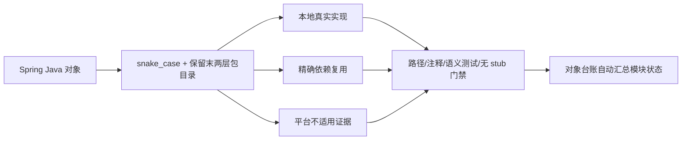

<!-- migration-doc: authority=support canonical=迁移验收规范.md -->

> 迁移文档治理：本文级别为 **support**。正文中的历史统计或完成标记不得单独作为验收结论；以 [迁移验收规范.md](迁移验收规范.md) 和自动审计报告为准。

# Vernal 目标架构

> 版本：0.1 | 日期：2026-07-26 | 状态：规划中

## 一、设计目标

对齐 Spring Framework 6.x 的模块化架构，为 Rust 生态提供完整的 IoC / AOP / DI / 应用上下文框架。

## 二、Spring → Vernal 模块映射

### 核心内核层

| Spring 模块 | Vernal 模块 | 职责 | 状态 |
|---|---|---|---|
| `spring-core` | `vernal-core` | 基础契约：错误体系、类型标识、排序、快照 trait | 🔄 充实中 |
| `spring-beans` | `vernal-beans` | IoC 内核：组件定义、注册表、容器、依赖解析、作用域 | ⚠️ 对象审计未完成 |
| `spring-aop` | `vernal-aop` | AOP 内核：统一 Advice/Interceptor、Advisor、自动代理 | ⚠️ 对象审计未完成 |
| `spring-context` | `vernal-context` | 应用上下文：生命周期、事件总线、配置属性、条件装配 | ✅ 完备 |
| `spring-context-indexer` | `vernal-discovery` | 编译期组件发现（linkme 分布式切片） | ✅ 完备 |
| `spring-expression` | `vernal-expression` | 表达式语言（条件表达式、配置表达式） | ❌ 规划中 |

### 数据与事务层

| Spring 模块 | Vernal 模块 | 职责 | 状态 |
|---|---|---|---|
| `spring-jdbc` | `vernal-db` | 数据库抽象（JdbcTemplate 等价物） | ❌ 规划中 |
| `spring-tx` | `vernal-tx` | 事务抽象（声明式事务） | ❌ 规划中 |
| `spring-orm` | `vernal-orm` | ORM 集成（rbatis 桥接） | ❌ 规划中 |
| `spring-r2dbc` | `vernal-r2dbc` | 响应式数据库访问 | ❌ 规划中 |
| `spring-oxm` | — | 不需要（Rust 用 serde） | N/A |

### Web 与通信层

| Spring 模块 | Vernal 模块 | 职责 | 状态 |
|---|---|---|---|
| `spring-web` | `vernal-web` | Web 契约：请求上下文、安全主体、错误映射 | ✅ 完备 |
| `spring-webmvc` | 10 个 adapter | 框架适配：Axum/Actix/Rocket/Warp/Salvo/Poem/Ntex/Gotham/Tide/Tonic | ✅ 完备 |
| `spring-webflux` | — | 不需要单独 crate（Rust async-first 天然支持） | N/A |
| `spring-websocket` | `vernal-websocket` | WebSocket 协议支持 | ❌ 规划中 |
| `spring-messaging` | `vernal-messaging` | 消息架构（消息通道、STOMP 等价物） | ❌ 规划中 |
| `spring-jms` | `vernal-messaging` | 合入 messaging 统一 | N/A |

### 横切关注点层

| Spring 模块 | Vernal 模块 | 职责 | 状态 |
|---|---|---|---|
| `spring-aspects` | `vernal-aspects` | 内建切面：@Transactional / @Async / @Cacheable | ❌ 规划中 |
| `spring-test` | `vernal-test` | 测试框架：Context 测试、Mock 组件 | ❌ 规划中 |
| `spring-jcl` | — | 不需要（Rust 用 tracing） | N/A |
| `spring-instrument` | — | 不需要（Rust 无运行时 instrumentation） | N/A |
| `spring-context-support` | 桥接层 | hutool-vernal 覆盖缓存/文件/调度 | ✅ 部分 |

### Rust 独有模块

| Vernal 模块 | 说明 | 状态 |
|---|---|---|
| `vernal-macros` | 过程宏：Component derive、ConfigurationProperties derive、ErrorCode derive | ✅ 完备 |
| `vernal-http` | HTTP 协议契约（请求/响应/体帧） | ✅ 完备 |
| `vernal-tower` | Tower Layer/Service 集成 | ✅ 完备 |
| `vernal-hyper` | Hyper 传输桥接 | ✅ 完备 |
| `vernal-web-testkit` | Web adapter 一致性测试工具 | ✅ 完备 |

### 统一门面

| Vernal 模块 | 说明 | 状态 |
|---|---|---|
| `vernal` | 统一门面 crate，re-exports 所有内核 | ✅ 完备 |

## 三、目标目录结构

### 迁移进入目标架构的门禁



模块存在可调用能力不等于 Spring 对象迁移完成。目标态状态必须来自
[`migration-manifest.toml`](migration-manifest.toml) 与 `migration-audit/` 报告，
不能由架构文档手写“完备”。

```
vernal/
├── crates/
│   ├── vernal-core              // 对标 spring-core
│   ├── vernal-beans             // 对标 spring-beans（原 vernal-ioc）
│   ├── vernal-aop               // 对标 spring-aop
│   ├── vernal-context           // 对标 spring-context
│   ├── vernal-discovery         // 对标 spring-context-indexer
│   ├── vernal-expression        // 对标 spring-expression
│   ├── vernal-aspects           // 对标 spring-aspects
│   ├── vernal-tx                // 对标 spring-tx
│   ├── vernal-db                // 对标 spring-jdbc
│   ├── vernal-messaging         // 对标 spring-messaging
│   ├── vernal-websocket         // 对标 spring-websocket
│   ├── vernal-test              // 对标 spring-test
│   ├── vernal-macros            // 过程宏（Rust 独有）
│   ├── vernal                   // 统一门面
│   │
│   ├── vernal-web               // Web 契约
│   ├── vernal-http              // HTTP 协议契约
│   ├── vernal-tower             // Tower 集成
│   ├── vernal-hyper             // Hyper 桥接
│   │
│   ├── vernal-axum              // adapter
│   ├── vernal-actix-web         // adapter
│   ├── vernal-rocket            // adapter
│   ├── vernal-warp              // adapter
│   ├── vernal-salvo             // adapter
│   ├── vernal-poem              // adapter
│   ├── vernal-ntex              // adapter
│   ├── vernal-gotham            // adapter
│   ├── vernal-tide              // adapter
│   ├── vernal-tonic             // adapter
│   │
│   └── vernal-web-testkit       // 测试工具
```

## 四、依赖方向（不可违反）

```
vernal-core ← vernal-beans ← vernal-context ← vernal
                ↑                ↑
           vernal-aop            │
                ↑                │
                └────────────────┘

vernal-core ← vernal-expression
vernal-core ← vernal-aspects
vernal-core ← vernal-tx
vernal-core ← vernal-db
vernal-core ← vernal-messaging
vernal-core ← vernal-websocket
vernal-core ← vernal-test
```

### 禁止的依赖方向

- `vernal-core` 不得依赖 `vernal-beans`、`vernal-aop`、`vernal-context`
- `vernal-beans` 不得依赖 `vernal-aop`、`vernal-context`
- `vernal-aop` 不得依赖 `vernal-beans`、`vernal-context`
- `vernal-context` 不得依赖任何具体 Web 框架
- 任何 adapter 不得依赖另一个 adapter

## 五、实施优先级

| 优先级 | 模块 | 工作内容 |
|--------|------|---------|
| **P0** | `vernal-core` 充实 | 下沉排序契约、类型标识、限定符、作用域标识、快照 trait |
| **P1** | `vernal-aspects` | @Transactional / @Async / @Cacheable 内建切面 |
| **P1** | `vernal-tx` | 事务抽象 trait + 声明式事务支持 |
| **P2** | `vernal-expression` | 条件表达式、配置表达式 |
| **P2** | `vernal-test` | Context 测试、Mock 组件、测试工具 |
| **P3** | `vernal-db` | 数据库抽象（可桥接 hutool-db） |
| **P3** | `vernal-messaging` | 消息通道架构 |
| **P3** | `vernal-websocket` | WebSocket 协议支持 |

## 六、命名规范

| 项目 | 规范 |
|------|------|
| crate 名 | `vernal-{module}`（kebab-case） |
| Rust 模块 | `vernal_{module}`（snake_case） |
| 门面别名 | `vernal::beans`（对齐 `spring-beans`） |
| 兼容别名 | `vernal::ioc`（向后兼容） |
