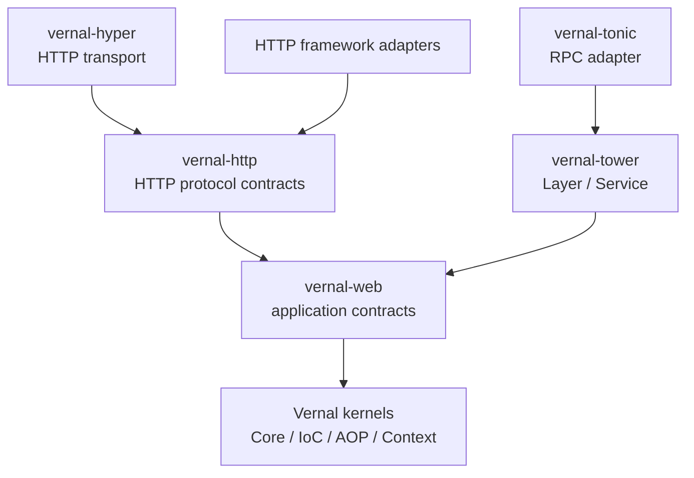
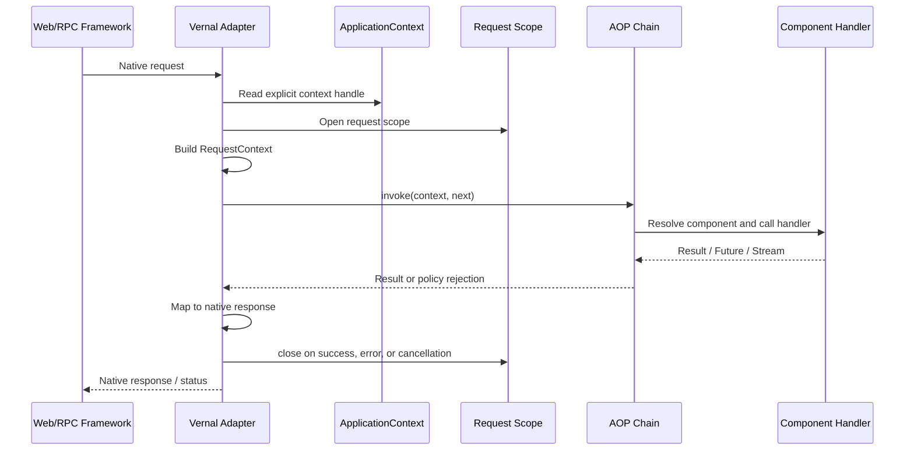
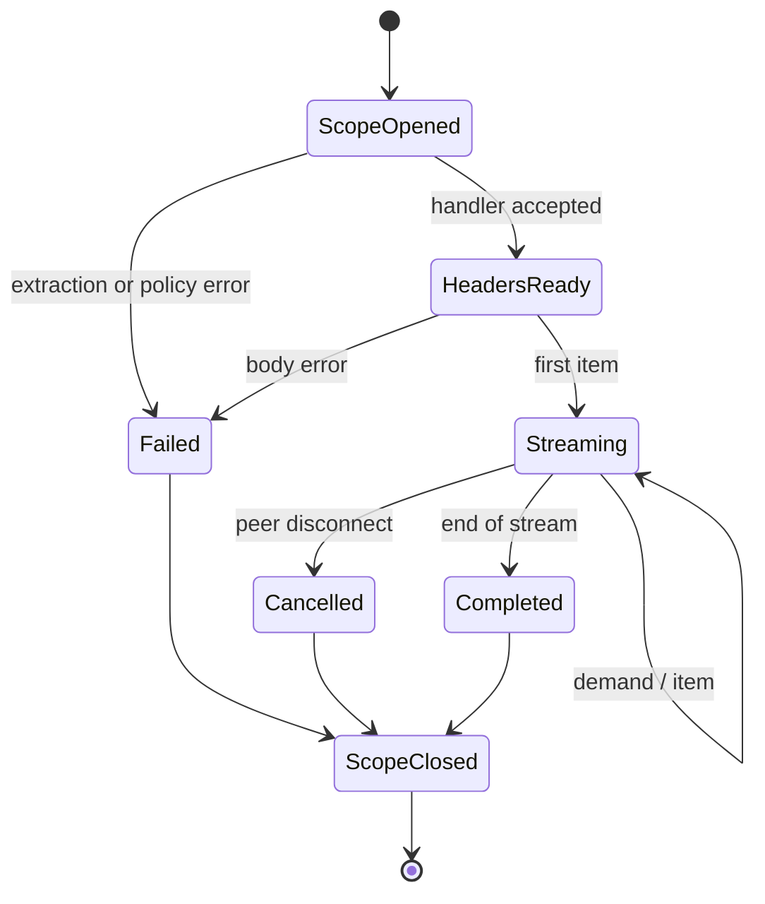
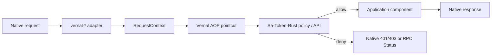

# 句芒 · Vernal Web Integration Architecture

> **Vernal Framework**  
> **Grow components. Weave capabilities.**

**Status:** Architecture draft  
**Baseline:** 2026-07-24  
**Scope:** `vernal-web`, `vernal-http`, Tower/Hyper foundations, and ten adapters

[简体中文](./Vernal-Web-Architecture.zh_CN.md) | [Back to README](../README.md)

## 1. Current facts

The workspace contains fourteen web-related skeleton crates:

- two shared contracts: `vernal-web` and `vernal-http`;
- two foundations: `vernal-tower` and `vernal-hyper`;
- ten adapters: Axum, Actix Web, Rocket, Warp, Salvo, Poem, Ntex, Gotham,
  Tide, and Tonic.

Their sources currently expose static `IntegrationDescriptor` values only. No
adapter yet depends on its upstream framework or implements runnable
middleware, layers, extractors, guards, or interceptors.

The versioned selection is recorded in
[`web-integration-manifest.toml`](../web-integration-manifest.toml).

## 2. Goals and non-goals

### 2.1 Goals

1. Reuse the same components, request scope, and AOP policies across web and RPC
   frameworks.
2. Preserve each framework's native router, request, response, middleware, and
   runtime semantics.
3. Confine framework-specific types to adapter crates.
4. Give Sa-Token-Rust a stable authentication context and native rejection path.
5. Let Hutool-Rust and Ddd4r consume Vernal without reverse dependencies.
6. Prove behavioral equivalence with one cross-framework contract suite.

### 2.2 Non-goals

- No Rust Servlet container.
- No Project Reactor clone or new async runtime.
- No replacement for native routing DSLs.
- No Tower, Hyper, Tokio, or web framework dependency in Vernal kernels.
- No reimplementation of Sa-Token-Rust authentication or authorization.
- No claim that the ten targets form a permanent worldwide popularity ranking.

## 3. Local source findings

| Source | Observed capability | Vernal adopts | Vernal rejects |
|:---|:---|:---|:---|
| tx-di | Axum extractor, request extensions, Tower Layer/Service, route and layer registration; Tonic dependency evidence | Context injection, Tower composition, adapter assembly concepts | Global containers, pointer identity, framework code in kernels |
| Sa-Token-Rust | Ten plugin families: Actix Web, Axum, Gotham, Ntex, Poem, Rocket, Salvo, Tide, Tonic, Warp | Coverage union and native security middleware seams | Copying the security kernel into Vernal |
| Hutool-Rust | Reqwest-based HTTP client and client interceptors | Injectable tools and outbound client capabilities | Treating a client wrapper as a server adapter |
| Ddd4r | Domain, application, and infrastructure boundaries | A Ddd4r-owned starter that wires services and ports | A Vernal kernel dependency on DDD implementations |

There is one retained security brand and integration target:
**Sa-Token-Rust**.

## 4. Web and protocol contracts



### 4.1 `vernal-web`

This crate defines framework-neutral application contracts only:

- `RequestContext`: request ID, route metadata, security principal, and
  extensions;
- `WebRequestScope`: request component cache, close hooks, and release state;
- `HandlerInvocation`: handler and method metadata plus resolved arguments;
- `ProblemDetails`: stable application error categories;
- `ContextCarrier`: context propagation across futures, streams, and tasks;
- `WebIntegration`: adapter capability and diagnostics metadata.

Its public API must not expose Axum, Actix Web, Tokio, or Hyper types.

### 4.2 `vernal-http`

This crate defines protocol contracts:

- HTTP request and response parts;
- finite and streaming request/response bodies;
- extraction, validation, and HTTP error mapping;
- cancellation propagation and scope cleanup;
- preservation of upstream backpressure;
- extension points for WebSocket and SSE.

Ordinary request/response and streaming are capabilities of the same HTTP
contract. Rust `Future` and `Stream` are used directly; Vernal does not create
a second reactive type system or own an async runtime.

## 5. Request execution



Constraints:

1. `ApplicationContext` is passed through app state, an extension, or explicit
   construction.
2. Adapters never guess the current context from process-global state.
3. Policy short-circuiting skips the handler but still closes an opened scope.
4. Around advice observes success, application errors, transport errors, and
   cancellation.
5. Native bodies and streams are not buffered merely to satisfy a common API.

## 6. Streaming and cancellation



- A finite HTTP response closes the request scope after its body completes.
- Streaming HTTP and Tonic keep the scope alive until stream completion,
  failure, or cancellation.
- An adapter bridges upstream backpressure; it must not hide it behind an
  unbounded queue.
- Cancellation cleanup is idempotent and cannot depend on async work in `Drop`.
- Resources requiring async release use explicit `scope.close().await`; the
  adapter owns the timeout policy.

## 7. Tower and Hyper foundations

### 7.1 `vernal-tower`

Target reusable facilities for Axum, Tonic, and other Tower services:

- `VernalLayer` injects the context handle;
- `RequestScopeLayer` opens and closes request scopes;
- `AopLayer` turns service calls into invocations;
- `ContextPropagationLayer` carries metadata and cancellation;
- configurable error mapping to `Service::Error`.

Layer ordering is contractual and tested:

```text
Trace -> Context -> RequestScope -> Security/AOP -> Handler -> ErrorMapping
```

### 7.2 `vernal-hyper`

This crate handles HTTP transport concerns only:

- lightweight bridges for Hyper requests and responses;
- body-frame and trailer fidelity;
- connection-close and request-cancellation signals;
- no application router and no place in the ten-framework count.

## 8. Ten framework adapters

| # | Framework | Crate | Protocol | Native integration seam | Current state |
|:--:|:---|:---|:---|:---|:---:|
| 1 | Axum | `vernal-axum` | HTTP + Tower | `Layer`, State/Extension, Extractor, IntoResponse | Skeleton |
| 2 | Actix Web | `vernal-actix-web` | HTTP | `Transform`/`Service`, App Data, Extractor, Responder | Skeleton |
| 3 | Rocket | `vernal-rocket` | HTTP | Fairing, Request Guard, Managed State, Responder | Skeleton |
| 4 | Warp | `vernal-warp` | HTTP | Filter, Rejection, Reply | Skeleton |
| 5 | Salvo | `vernal-salvo` | HTTP | Handler, Hoop, Depot, Writer | Skeleton |
| 6 | Poem | `vernal-poem` | HTTP | Middleware, Endpoint, Data, IntoResponse | Skeleton |
| 7 | Ntex | `vernal-ntex` | HTTP | Service/Middleware, App State, Extractor | Skeleton |
| 8 | Gotham | `vernal-gotham` | HTTP | State Middleware, Pipeline, Handler | Skeleton |
| 9 | Tide | `vernal-tide` | HTTP | Middleware, Request State, Response | Skeleton |
| 10 | Tonic | `vernal-tonic` | RPC Streaming + Tower | Layer, Interceptor, Extension, Status, Streaming | Skeleton |

### 8.1 Framework-specific constraints

- **Axum:** reuse `vernal-tower`; component extractors read router state or
  request extensions and never create a second container.
- **Actix Web:** context lives in app data; multi-worker singleton and request
  scope boundaries need explicit tests.
- **Rocket:** managed state owns the context, request guards resolve components,
  and fairings handle lifecycle or global request flow.
- **Warp:** composition filters inject context; policy denial becomes a typed
  rejection rather than panic.
- **Salvo:** hoops wrap the invocation, the depot carries request context, and
  handlers retain native signatures.
- **Poem:** middleware wraps endpoints, while data/extensions carry context.
- **Ntex:** preserve service-factory and worker lifecycles; do not silently
  share non-`Send` state across workers.
- **Gotham:** state carries request context and middleware pipelines bound scope.
- **Tide:** integrate through request state and middleware. Its current registry
  release remains beta, so it is a compatibility target rather than a first
  stable-release blocker.
- **Tonic:** unary and streaming calls use the Tower path; Vernal errors map to
  stable `Status` values without losing metadata or extensions.

## 9. Sa-Token-Rust integration

Sa-Token-Rust owns authentication, session, login state, and authorization
rules. Vernal resolves components, invokes pointcuts, and carries request
context.



The recommended ownership is a Sa-Token-Rust `sa-token-vernal` bridge:

- depend on `vernal-aop`, `vernal-web`, and selected adapters;
- place token, principal, and permission data in `RequestContext` extensions;
- expose authentication and authorization pointcuts/interceptors;
- preserve native web plugins for users who do not use Vernal.

Vernal never depends on Sa-Token-Rust.

## 10. Hutool-Rust and Ddd4r

- **Hutool-Rust:** HTTP clients, serializers, caches, and other tools can be
  registered as components. Outbound client interception is separate from
  server adapters.
- **Ddd4r:** a Ddd4r-owned `ddd4r-vernal` starter binds domain services,
  application services, repository ports, and transaction/audit interceptors.
- All ecosystem dependencies point from the consumer to Vernal.

## 11. Errors, security, and observability

| Failure point | Vernal category | Adapter responsibility |
|:---|:---|:---|
| Missing/closed context | Infrastructure | Stable 5xx/Status; never panic |
| Missing/ambiguous component | Resolution | Redacted dependency path and stable mapping |
| Extraction/validation | ClientInput | Native 4xx or rejection |
| Authentication/authorization | PolicyDenied | Sa-Token-Rust determines 401/403 semantics |
| Handler application error | Application | Invoke the user error mapper |
| Body/stream error | Transport | Preserve cancellation class and close scope |

Guardrails:

- never log tokens, cookies, authorization headers, or component secrets;
- no unbounded-cardinality raw paths or user IDs in trace/metric labels;
- diagnostics expose adapter, version, status, scope counts, and redacted errors;
- panic is not normal control flow for denial, resolution failure, or cancel;
- adapters keep native body limits and timeouts unless explicitly configured.

## 12. Cross-framework conformance

Every adapter must reuse a future `vernal-web-testkit` contract suite:

| Contract | Required coverage |
|:---|:---|
| Context | Explicit injection, missing, closed, parallel-app isolation |
| Scope | Per-request identity, nested reuse, close on success/error/cancel |
| IoC | Singleton, transient, qualifier, multi-binding, resolution errors |
| AOP | Ordering, short circuit, error, async, stream completion/cancel |
| HTTP | Headers, status, body, trailers, extensions, size limits |
| Security | Allow, unauthenticated, forbidden, policy error, redaction |
| Streaming | Backpressure, half-close, disconnect, cleanup timeout |
| Lifecycle | Startup, rollback, graceful shutdown, worker isolation |

An adapter is complete only when:

1. upstream dependencies and features are locked;
2. native Hello/DI/AOP/Security examples run;
3. the shared contract suite passes;
4. a version compatibility matrix is recorded;
5. `cargo tree` proves kernels have no framework dependency;
6. unsupported cases and measured performance boundaries are documented.

## 13. Delivery waves

| Wave | Scope | Exit evidence |
|:---|:---|:---|
| P0 | `vernal-web` and `vernal-http` contracts | No framework type leaks; contract tests pass |
| P1 | Tower, Hyper, Axum, Actix Web | Two middleware families pass one suite |
| P2 | Salvo, Poem, Rocket, Warp, Tonic | HTTP/RPC and finite/streaming matrix |
| P3 | Ntex, Gotham, Tide | Worker/state/compatibility risks tested and recorded |
| P4 | Sa-Token-Rust, Hutool-Rust, Ddd4r bridge examples | Consumer-owned dependencies; no kernel coupling |

Priorities can change with registry maintenance and downstream demand. Any
change updates the manifest, bilingual docs, and compatibility matrix together.

## 14. Definition of architecture done

- [ ] Web and HTTP contracts are implemented and independently tested.
- [ ] Tower/Hyper do not enter Core, IoC, AOP, or Context.
- [ ] All ten adapters use native extension points and no global context.
- [ ] Non-streaming, streaming, cancellation, and cleanup semantics have tests.
- [ ] Tonic is classified as RPC, not an HTTP router.
- [ ] Sa-Token-Rust is the sole retained security integration target.
- [ ] Hutool-Rust, Sa-Token-Rust, and Ddd4r names and boundaries match in both languages.
- [ ] Skeleton, runnable, contract-passing, and production-ready are never conflated.

---

**Vernal is a lightweight IoC, AOP and application context framework for Rust.**
