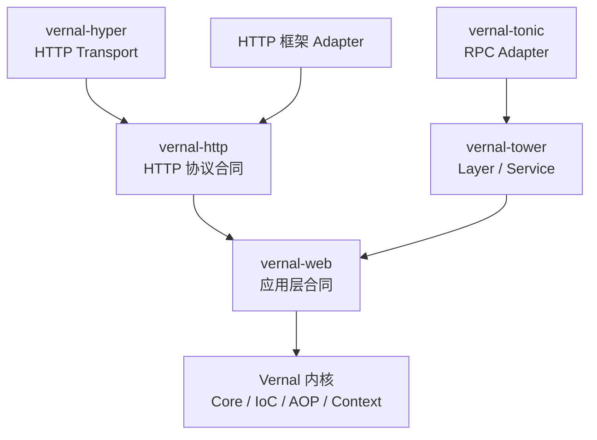
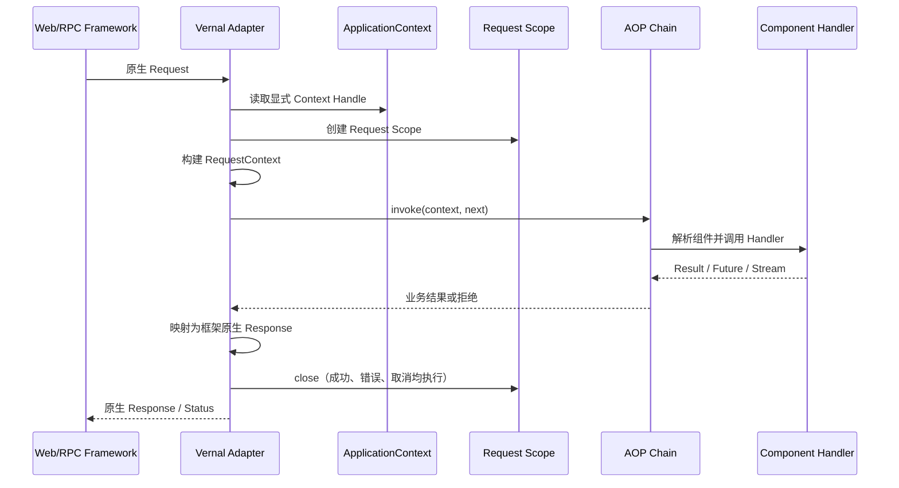
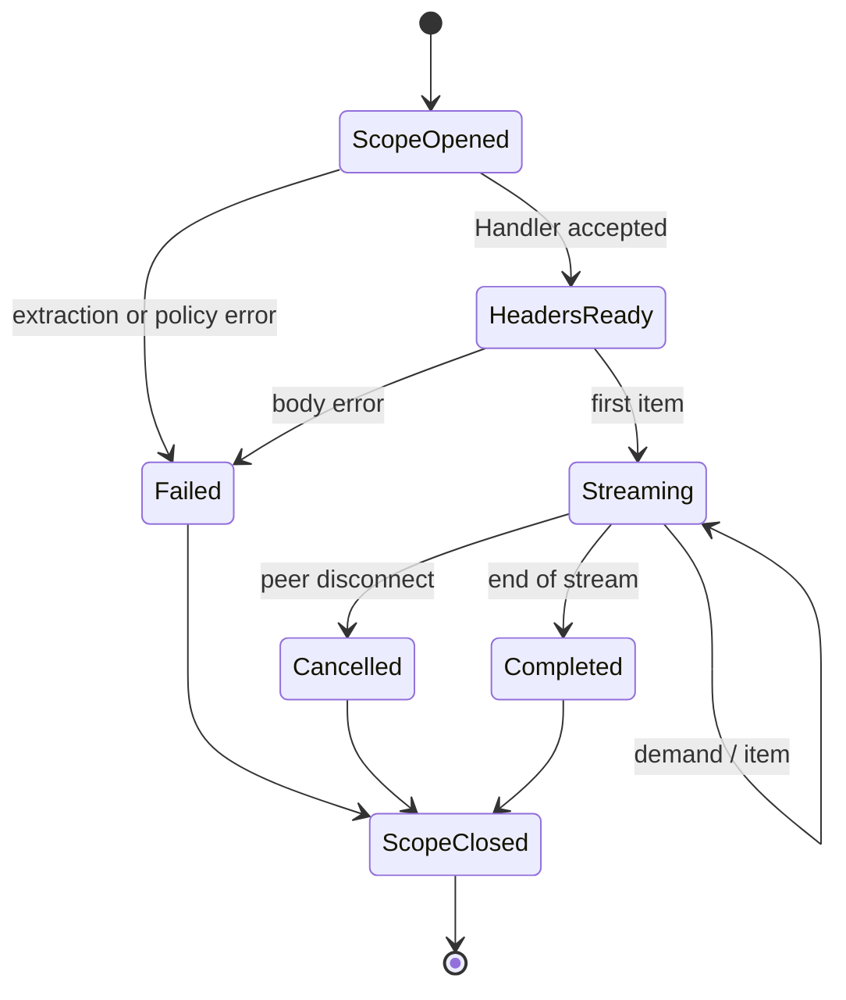
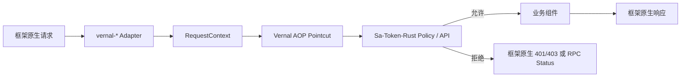

# 句芒 · Vernal Web 集成架构

> **Vernal Framework**  
> **Grow components. Weave capabilities.**

**文档状态**：架构草案  
**基线日期**：2026-07-24  
**适用范围**：`vernal-web`、`vernal-http`、Tower/Hyper 底座及十个框架适配器

[English](./Vernal-Web-Architecture.md) | [返回中文 README](../README.zh-CN.md)

## 1. 当前事实

当前 Workspace 包含十四个 Web 相关 crate：

- 两个公共合同：`vernal-web`、`vernal-http`；
- 两个底层能力：`vernal-tower`、`vernal-hyper`；
- 十个框架适配器：Axum、Actix Web、Rocket、Warp、Salvo、Poem、Ntex、
  Gotham、Tide、Tonic。

四个公共合同/底座 crate 已提供可调用能力：

- `vernal-web` 提供类型化请求上下文、请求 Scope、Invocation 桥接、安全主体载体
  与稳定问题详情；
- `vernal-http` 直接使用标准 `http`/`http-body` 类型，保留 Frame 和 Trailer，
  支持取消，并且只在调用方给出明确上限时缓冲；
- `vernal-tower` 注入 `ApplicationContext`，并在 Body 完成、Service 错误或请求
  Future 被丢弃时关闭 Scope；
- `vernal-hyper` 不缓冲地把 `Incoming` 转换为同一 Frame 流，并已通过真实
  TCP/HTTP 连接验证。

Axum 已引入 Axum 0.8，实现原生 Router 装配与类型化 Context、组件、请求 Scope
提取器；Actix Web 采用兼容 MSRV 的 4.11/actix-http 3.11 版本线，实现原生
Transform/Service Middleware、App Data/Extension 提取器和 Body 绑定 Scope
释放；Rocket 0.5.1 实现 Managed State、Request Guard，以及覆盖请求与响应的
Body 感知 Fairing；Warp 0.4.3 通过 `warp::ext` Filter 和官方 `warp::service`
Tower 边界实现 Context/组件/Scope 提取、完整 Body 生命周期，以及基于显式
路由模式的 fail-closed 严格 Send-AOP；Salvo 采用最后
一个兼容 Rust 1.85 的 0.85.0 版本，实现原生 Hoop、类型化 Depot 访问和
Frame/Trailer 保真的 Body Scope，以及覆盖完整 Handler 链的严格 Send-AOP；
Poem 采用与 MSRV 一致的 3.1.12 版本，
实现原生 Middleware/Endpoint、Request Extension 提取器和 Body 绑定 Scope
释放；Tonic 采用兼容 MSRV 的 0.12 版本线，实现 Context Interceptor、类型化
Request 扩展、`GrpcMethod` 路由元数据、稳定 `Status` 映射和 Tower 组合。
Ntex 采用兼容 Rust 1.85 的 2.18.0 版本线，实现原生 Middleware/Service、
App State/Extension 提取器与 `MessageBody` 绑定请求 Scope；严格 Local-AOP
路径使用显式资源模式和借用型 Worker-local 目标。Gotham 0.8
实现原生 StateData、类型安全 State 访问、Pipeline Middleware、
Frame/Trailer 保真的 Body 释放，以及基于显式路由模式、覆盖完整 Pipeline
Chain 的严格 Send-AOP。Tide 0.17.0-beta.1 已实现原生 Middleware、
类型化 Request Extension 访问，以及基于 Vernal Tokio 运行时的响应 Reader
绑定 Scope 释放和覆盖借用型 `Next` 的严格 Send-AOP。

版本化选择清单由
[`web-integration-manifest.toml`](../web-integration-manifest.toml) 维护。

## 2. 目标与非目标

### 2.1 目标

1. 让同一组件、请求作用域和 AOP 策略能在不同 Web/RPC 框架中复用。
2. 尊重各框架原生 Router、Request、Response、Middleware 和运行时语义。
3. 将框架特有类型限制在独立 Adapter crate 内，不向 IoC/AOP 内核泄漏。
4. 为 Sa-Token-Rust 提供统一认证上下文和框架原生拒绝响应的接入点。
5. 为 Hutool-Rust 与 Ddd4r 提供消费 Vernal 的稳定边界，而不制造反向依赖。
6. 以一套跨框架合同测试证明行为一致性。

### 2.2 非目标

- 不实现 Rust 版 Servlet 容器；
- 不复制 Project Reactor，也不发明另一套异步运行时；
- 不统一或替换各框架的路由 DSL；
- 不把具体 Web 框架实现放进通用内核；Tokio 是官方运行时，Tower/Hyper
  由对应基础集成 crate 持有；
- 不在 Vernal 中重新实现 Sa-Token-Rust 的认证与授权语义；
- 不承诺十个目标是永久或绝对的流行度排名。

## 3. 本地源码调研结论

| 来源 | 已观察能力 | Vernal 吸收内容 | 明确不继承 |
|:---|:---|:---|:---|
| tx-di | Axum 提取器、请求 Extension、Tower Layer/Service、路由与 Layer 注册；Tonic 依赖痕迹 | Context 注入、Tower 组合、Adapter 自动装配思路 | 全局容器、指针身份、框架代码进入核心 |
| Sa-Token-Rust | Actix Web、Axum、Gotham、Ntex、Poem、Rocket、Salvo、Tide、Tonic、Warp 十类插件家族 | 十类覆盖并集、认证策略与原生中间件衔接方式 | 将安全内核复制进 Vernal |
| Hutool-Rust | 基于 Reqwest 的 HTTP 客户端与客户端拦截器 | 作为可注入工具和出站客户端能力的消费方 | 把客户端封装误写成服务端框架 Adapter |
| Ddd4r | 领域、应用和基础设施边界 | 由 Ddd4r 持有 Starter/Bridge，装配领域服务与端口 | 让 Vernal 内核依赖 DDD 实现 |

安全框架只保留一个品牌和集成目标：**Sa-Token-Rust**。

## 4. Web 与协议合同



### 4.1 `vernal-web`

只定义框架中立的应用层合同：

- `RequestContext`：请求 ID、路由元数据、安全主体和扩展；
- `WebRequestScope`：请求级组件缓存、关闭钩子和释放状态；
- `HandlerInvocation`：Handler、方法元数据和已解析参数；
- `ProblemDetails`：稳定的应用错误分类；
- `ContextCarrier`：跨 Future、Stream 和任务边界传播上下文；
- `WebIntegration`：Adapter 能力和诊断描述。

它不能出现 Axum、Actix Web 或 Hyper 的公共类型；可以在任务、取消、deadline
和上下文传播合同中使用 Tokio 原生类型。

### 4.2 `vernal-http`

只定义 HTTP 协议合同：

- HTTP Request/Response Parts；
- 有限 Body 与流式请求/响应 Body；
- 提取、校验和 HTTP 错误映射；
- 取消传播与请求作用域清理；
- 上游背压的保留与适配；
- WebSocket 和 SSE 扩展点。

普通请求/响应与 Streaming 是同一 HTTP 合同的不同能力。Vernal 直接使用 Rust
`Future`/`Stream` 和 Tokio 运行时能力，不发明第二套响应式类型系统。

## 5. 请求执行主链



约束：

1. `ApplicationContext` 必须通过应用 State、Extension 或显式构造传入；
2. Adapter 不允许从进程全局变量猜测当前 Context；
3. `before` 阶段拒绝时，不执行 Handler，但已创建的 Scope 仍必须关闭；
4. `after`/Around 阶段应观察成功、业务错误、传输错误和取消；
5. 框架原生 Body/Stream 不能为了统一接口而被无条件缓冲。

## 6. 流式与取消语义



- 有限 HTTP 响应在 Body 完成后关闭 Request Scope。
- 流式 HTTP/Tonic 的 Scope 生命周期必须延伸到 Stream 完成、失败或取消。
- Adapter 只能桥接上游背压，不能通过无限队列伪造吞吐。
- 取消清理必须幂等，且不能依赖 `Drop` 中执行异步工作。
- 需要异步释放的组件由 Scope 显式 `close().await`，超时策略属于 Adapter 配置。

## 7. Tower 与 Hyper 底座

### 7.1 `vernal-tower`

已实现可被 Axum、Tonic 和其他 Tower 生态复用的能力：

- `VernalLayer`：向 Service 注入 Context Handle；
- `RequestScopeLayer`：在响应 Body 完成、Service 错误、取消或请求 Future
  被丢弃时关闭请求作用域；
- `AopLayer`：把 `RouteMetadata` 转换成预编译 `InvocationPlan`，统一执行安全、
  事务、审计和可观测性拦截器；
- `TowerRouteResolver`：允许上层 Adapter 使用原生路由信息生成低基数路由元数据；
- `TowerResponse<R>`：在类型擦除边界内保留原生响应和 Body，不读取、不缓冲，
  且只要求响应满足 `Send`；
- `AopServiceError<E>`：区分 Context/Scope/路由缺失、AOP 错误和可恢复的原生
  `Service::Error`。

缺少调用计划时默认 `Reject`，请求不会进入 Handler，避免 Sa-Token-Rust 等安全
切面因漏配而被静默绕过。只有明确无需切面的路由才能显式选择
`MissingPlanPolicy::Proceed`。拦截器短路时请求所有权不会交给下游；下游错误会先
经过完整 AOP 链，再恢复为原生 `Service::Error`。

仍待后续 Phase 4/Adapter 实现：

- `ContextPropagationLayer`：传播请求元数据和取消；
- 错误分类到 Tower `Service::Error` 的可配置映射。

Layer 顺序属于公共合同，必须在测试中固定：

```text
Trace -> Context -> RequestScope -> Security/AOP -> Handler -> ErrorMapping
```

### 7.2 `vernal-hyper`

已实现且只处理 HTTP 传输共性：

- Hyper Request/Response 与 Vernal 合同的轻量桥接；
- Body 帧和 Trailer 保真，并通过真实 Chunked 请求验证；
- 请求与 Body 共享的取消信号；
- 不提供应用 Router，也不计入十个应用框架。

## 8. 十类框架 Adapter

| # | 框架 | Crate | 协议 | 目标原生扩展点 | 当前状态 |
|:--:|:---|:---|:---|:---|:---:|
| 1 | Axum | `vernal-axum` | HTTP + Tower | `Layer`、State/Extension、Extractor、IntoResponse | Phase 5 适配已实现 |
| 2 | Actix Web | `vernal-actix-web` | HTTP | `Transform`/`Service`、App Data、Extractor、Responder | Adapter + 严格 Local-AOP 已实现 |
| 3 | Rocket | `vernal-rocket` | HTTP | Fairing、Request Guard、Managed State、Responder | Phase 5 适配已实现 |
| 4 | Warp | `vernal-warp` | HTTP | Filter、Rejection、Reply、Tower Service | Adapter + 严格 AOP 已实现 |
| 5 | Salvo | `vernal-salvo` | HTTP | Handler、Hoop、Depot、Writer | Adapter + 严格 AOP 已实现 |
| 6 | Poem | `vernal-poem` | HTTP | Middleware、Endpoint、Data、IntoResponse | Adapter + 严格 AOP 已实现 |
| 7 | Ntex | `vernal-ntex` | HTTP | Service/Middleware、App State、Extractor | Adapter + 严格 Local-AOP 已实现 |
| 8 | Gotham | `vernal-gotham` | HTTP | State Middleware、Pipeline、Handler | Adapter + 严格 AOP 已实现 |
| 9 | Tide | `vernal-tide` | HTTP | Middleware、Request Extension、Response | Adapter + 严格 AOP 已实现 |
| 10 | Tonic | `vernal-tonic` | RPC Streaming + Tower | Layer、Interceptor、Extension、Status、Streaming | Phase 5 适配已实现 |

### 8.1 框架特定约束

- **Axum**：优先复用 `vernal-tower`；Vernal 组件提取器只读取 Router State 或
  Request Extension，不建立第二个容器。
- **Actix Web**：Context 属于 App Data；必须验证多 Worker 下 Singleton 与
  Request Scope 的边界。Actix Service 通常使用 `Rc` 与本地非 `Send` Future，
  因此严格中间件使用 Vernal 独立的
  `LocalInterceptor`/`LocalNext`/`LocalInvocationPlan` 合同。它在路由匹配后
  包裹具体 `web::resource(...)`，驱动完整 Service Future，以匹配资源模式作为
  低基数操作身份；缺少元数据或计划时 fail-closed，通过 `EitherBody` 映射 AOP
  失败，同时保留 Actix 原生 Service 错误。
- **Rocket**：Fairing 在 Ignite 阶段注册 Managed Context，在 Request 阶段建立
  Scope；Request Guard 负责解析 Context、组件与 Scope，Response Fairing
  包装原生 Body，直到读取结束或取消后才释放。Rocket 0.5 的公共 Body 只暴露
  `AsyncRead`，所以包装后成为 streamed body；字节、背压和错误保留，但原有
  “已知长度/可 Seek”分类无法通过公共 API 原样重建。
- **Warp**：用 `warp::ext` 组合 Filter 提取 Context、组件与 Scope，提取缺失
  映射为明确 Rejection，不能 panic。Warp 0.4 的公开 Reply 使用私有 Body
  类型，因此完整 Body Scope 必须通过官方 `warp::service(route)` 边界组合。
  `VernalWarpLayer` 提供纯生命周期路径；`VernalWarpAopLayer` 进一步把完整
  Filter Service 放进严格 Tower AOP，同时保留 Frame、Trailer、背压与取消。
  Warp 的公共 Service Request 不暴露匹配后的路由模板，因此一个严格 Layer
  包裹一个具体 Filter Service，并显式接收同一条完整低基数路由模式。真实 HTTP
  方法与 owned 请求快照通过 `RequestContext` 传播；空模式和缺失计划时
  fail-closed，策略失败映射成 Warp 原生响应且不执行 Filter，成功的原生响应
  保持状态、Header、Extension 与私有 Body。
- **Salvo**：Hoop 包裹调用链，Depot 类型化携带 Context、组件与请求 Scope；
  Handler 保持 Salvo 原生签名。`ResBody` 直接按 `http_body::Body` 包装，保留
  Data Frame、Trailer、上游错误与背压，并在完成或取消后关闭 Scope。0.85.0
  的严格模式启用零额外依赖的 `matched-path` feature，把匹配后的低基数模板与
  真实 HTTP 方法组成操作身份，传播 owned 元数据快照，并让严格 Send-AOP 覆盖
  完整 Handler 链。`BorrowedInvocationTarget` 把
  `Request`/`Depot`/`Response`/`FlowCtrl` 借用限定在一次计划 await 内，无需
  克隆；缺少元数据或计划时 fail-closed，策略失败映射为稳定响应，原生 Handler
  的状态、Header、Extension 与 Body 保持不变。0.85.0 是最后一个声明 Rust
  1.85 的 Salvo 版本；0.86 起要求 Rust 1.89。
- **Poem**：原生 Middleware 在 Route 匹配后包裹具体 Endpoint，Request
  Extension 传递 Context、组件、Scope 与 `RequestContext`。严格模式从低基数
  `PathPattern` 构建 `Operation(path_pattern, http_method)`，缺少元数据或计划
  时拒绝请求，Around 覆盖完整 Endpoint Future，并保留 Poem 原生错误；响应
  字节流保持错误和背压，Body 完成或取消后关闭 Scope。Poem 3 公共
  `into_bytes_stream()` 不暴露 Trailer，因此该适配器不能承诺
  Trailer 保真；需要 Frame/Trailer 保真的场景使用 `vernal-hyper`。
- **Ntex**：原生 Middleware/Service 将显式应用 Context 与请求 Scope 注入
  Extensions，提取器也可从 App State 读取共享 Context；原生 `MessageBody`
  Wrapper 让 Scope 持续到 EOF、上游错误或取消，并保留 Ntex Body Size 与背压。
  严格中间件必须包裹具体 `web::resource(...)`，并显式接收该资源的低基数完整
  路径模式，因为 Ntex 2 公共请求 API 不暴露匹配后的 `ResourceDef`；HTTP 方法
  仍取自真实请求。`BorrowedLocalInvocationTarget` 把完整 Service Future 的
  生命周期绑定到当前 `ServiceCtx`，借用不能逃逸
  `LocalInvocationPlan::invoke_borrowed`。缺少计划时 fail-closed，一次性请求
  不会被克隆，原生 Service 错误会被恢复。Vernal 启用 Ntex 的 Tokio 后端并
  固定 2.18.0，因为当前 3.x 已超过 Workspace 的 Rust 1.85 MSRV；Worker-local
  的非 `Send` 状态不会被隐式提升为跨 Worker Singleton。
- **Gotham**：原生 `StateData` Wrapper 携带显式应用 Context 与请求 Scope，
  类型化 State 扩展直接解析 IoC 组件，不建立 Service Locator；
  `Middleware`/`NewMiddleware` 将 Scope 绑定到 Gotham 的 `http-body` 1.0
  响应，保留 Data Frame、Trailer、Size Hint、上游错误、背压与取消。严格模式
  通过 `BorrowedInvocationTarget` 驱动完整 Pipeline Chain。Gotham State
  暴露 owned 标准 HTTP 元数据，但不暴露最终匹配模板，因此具体 Pipeline 显式
  接收同一条完整低基数路由模式；真实方法与 owned 请求快照通过
  `RequestContext` 传播。空模式和缺失计划时 fail-closed，策略失败映射成原生
  响应且不执行 Handler，原生 `HandlerError` 的状态码与错误源保持不变。为满足
  Gotham Pipeline 合同，中间件工厂仅对受同步保护的
  `Arc<ApplicationContext>` 持有端明确标记 unwind-safe，不放宽 Context 锁与
  线程安全要求。
- **Tide**：原生 Middleware 将显式应用 Context 与请求 Scope 注入 Request
  Extension，类型化请求扩展直接解析 IoC 组件，不建立 Service Locator；响应
  `AsyncBufRead` Wrapper 让 Scope 持续到 EOF、上游错误或取消，并保留字节、
  已知长度、错误和背压。Tide 公共 Body API 不暴露 HTTP Trailer，因此该适配器
  不能承诺 Trailer 保真。Tide 只暴露路由参数值而不暴露匹配模板，所以严格
  中间件安装在具体 Route 上并显式接收同一条低基数完整模式；它结合真实方法，
  把 `http-types` 元数据转换成 owned `http` 1.x 快照，并通过
  `BorrowedInvocationTarget` 驱动完整 Middleware/Endpoint 链。空模式或缺少
  计划时 fail-closed，原生响应的状态、Header、Extension 与 Body 保持不变。
  为了确定性执行异步 Scope 关闭，适配器要求存在活跃 Tokio Runtime。Tide
  0.17.0-beta.1 仍是 beta，Vernal 稳定发布前必须重新验证兼容面。
- **Tonic**：Unary 与 Streaming 都使用 Tower 路径；Vernal 错误映射为稳定
  `Status`，Metadata 与 Extension 保真。

## 9. Sa-Token-Rust 集成

Sa-Token-Rust 拥有认证、会话、登录状态和授权规则；Vernal 只负责找到组件、
执行切点并携带请求上下文。



Sa-Token-Rust 现已持有实验性的 `sa-token-vernal` Bridge：

- 依赖已经验证的 Vernal Git Revision，不产生内核反向依赖；
- 将 `HttpRequestSnapshot` 适配为 `SaRequest` 并复用 `run_auth_flow`；
- 把登录身份和角色投影到 `RequestContext::SecurityPrincipal`；
- 让下游 Future 运行在当前请求的 `SaTokenContext` 中；
- 由 `SaTokenComponents` 原子注册 Manager、Bridge、Policy 与认证/授权
  Advisor；`VernalSaTokenPointcut` 覆盖声明的操作，
  `VernalSaTokenInterceptor` 先认证，再执行 Operation 级角色/权限 all/any
  规则；
- 与 Axum/Poem 的 `Operation(path_template, http_method)`、Tonic 的
  `Operation(service_name, method_name)` 精确对齐，拒绝结果经 `WebFailure`
  映射为框架原生响应；
- 保留各 Web 插件的原生入口，允许用户不使用 Vernal。

Bridge 已实现认证和不可变 Operation 授权。角色精确匹配；权限保留 Sa-Token
精确、全局 `*` 与前缀通配符语义；声明了空要求时 fail-closed。匿名访问受保护
操作映射为 401，已认证但权限不足映射为 403，权限后端失败映射为不泄露来源的
内部 500。路径是否需要登录继续只由 Sa-Token-Rust 的 `PathAuthConfig` 决定。
Vernal 不反向依赖 Sa-Token-Rust。

## 10. Hutool-Rust 与 Ddd4r

- **Hutool-Rust**：其 HTTP 客户端、序列化、缓存或其他工具可以注册为组件；
  出站客户端拦截与服务端 Adapter 是两个独立问题。
- **Ddd4r**：由 `ddd4r-vernal` Starter/Bridge 绑定领域服务、应用服务、Repository
  Port 和事务/审计拦截器。当前 Bridge 已直接注册原生 Registry/CommandBus，
  并以隔离快照进入 Ddd4r 的 Tokio task-local `ContextScope`。
- 三方依赖方向始终是消费方指向 Vernal，Vernal 内核不感知具体业务生态。

## 11. 错误、安全与可观测性

| 失败点 | Vernal 分类 | Adapter 责任 |
|:---|:---|:---|
| Context 缺失/已关闭 | Infrastructure | 返回稳定 5xx/Status，不 panic |
| 组件缺失或歧义 | Resolution | 脱敏记录依赖路径，映射稳定错误 |
| 参数提取/校验失败 | ClientInput | 使用框架原生 4xx/Rejection |
| 认证/授权拒绝 | PolicyDenied | 由 Sa-Token-Rust 语义决定 401/403 |
| Handler 业务错误 | Application | 调用用户 ErrorMapper |
| Body/Stream 失败 | Transport | 保留取消/传输分类并关闭 Scope |

Guardrails：

- 默认日志不记录 Token、Cookie、Authorization Header 或组件 Secret；
- Trace/Metric 标签禁止使用无限基数的原始路径或用户 ID；
- 诊断报告只公开 Adapter、版本、状态、Scope 计数和脱敏错误；
- Panic 不作为拒绝、缺失组件或取消的正常控制流；
- Adapter 不修改框架默认 Body 限制与超时，除非用户显式配置。

## 12. 跨框架一致性测试

每个 Adapter 必须复用同一 `vernal-web-testkit` 合同套件（实现阶段新增）：

| 合同 | 必须覆盖 |
|:---|:---|
| Context | 显式注入、缺失、关闭后访问、并行 App 隔离 |
| Scope | 每请求唯一、嵌套解析复用、成功/错误/取消关闭 |
| IoC | Singleton、Transient、Qualifier、多实现与错误路径 |
| AOP | 顺序、短路、错误、异步、流结束和取消 |
| HTTP | Header、Status、Body、Trailer、扩展与大小限制 |
| Security | 允许、未登录、无权限、策略错误、敏感信息脱敏 |
| Streaming | 背压、半关闭、客户端断开、释放超时 |
| Lifecycle | App 启动、启动回滚、优雅关闭、Worker 隔离 |

“Adapter 完成”至少需要：

1. 上游依赖和 feature 已锁定；
2. 原生 Hello/DI/AOP/Security 示例可运行；
3. 合同测试全部通过；
4. 框架版本兼容矩阵已记录；
5. `cargo tree` 证明内核没有反向框架依赖；
6. 文档明确不支持项和性能实测边界。

## 13. 分阶段交付

| 批次 | 范围 | 退出证据 |
|:---|:---|:---|
| P0 | `vernal-web`、`vernal-http` 合同 | 无框架类型泄漏，合同单测通过 |
| P1 | Tower、Hyper、Axum、Actix Web | 两条不同中间件体系通过同一合同套件 |
| P2 | Salvo、Poem、Rocket、Warp、Tonic | HTTP/RPC、有限响应与流式矩阵通过 |
| P3 | Ntex、Gotham、Tide | Worker/State/兼容性风险被测试与记录 |
| P4 | Sa-Token-Rust、Hutool-Rust、Ddd4r Bridge 示例 | 消费方拥有依赖且无内核反向耦合 |

优先级可随 registry 活跃度、维护状态和下游需求调整；变更必须更新清单、双语文档
和兼容矩阵。

## 14. 架构完成定义

- [ ] Web 与 HTTP 公共合同已经实现并有独立测试；
- [ ] Tower/Hyper 底座不进入 Core、IoC、AOP 或 Context；
- [ ] 十个 Adapter 均使用框架原生扩展点，没有全局 Context；
- [ ] 非流式、流式、取消和 Scope 清理语义均被合同测试覆盖；
- [ ] Tonic 被明确作为 RPC，而不是 HTTP Router；
- [ ] Sa-Token-Rust 是唯一保留的安全集成目标；
- [x] Hutool-Rust、Sa-Token-Rust、Ddd4r 品牌和边界在中英文文档中一致；
- [ ] 骨架、可运行、合同通过、生产就绪四种状态从不混用。

---

**句芒是面向 Rust 生态的轻量级 IoC、AOP 与应用上下文框架。**
