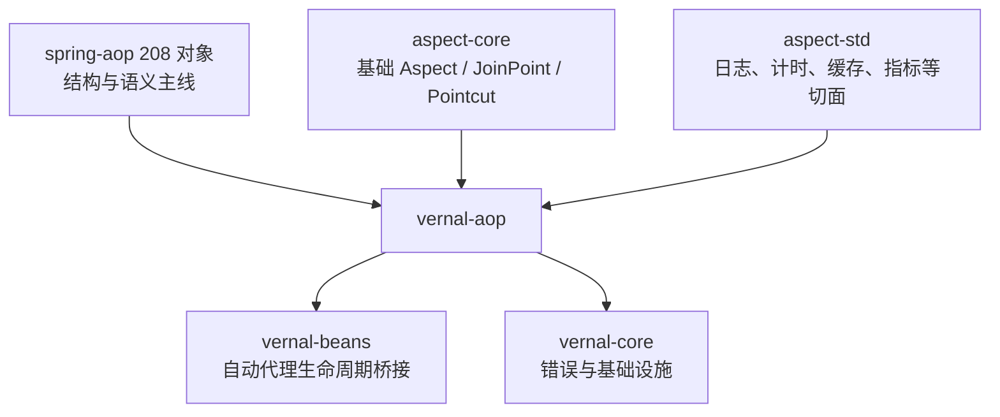

<!-- migration-doc: authority=support canonical=../迁移验收规范.md -->

> 迁移文档治理：本文级别为 **support**。正文中的历史统计或完成标记不得单独作为验收结论；以 [../迁移验收规范.md](../迁移验收规范.md) 和自动审计报告为准。
> [migration-manifest.toml](../migration-manifest.toml)为准。

# vernal-aop 依赖关系与复用边界



## 固定依赖证据

| 依赖 | 提交 | Cargo 证据 | 可复用精确符号 |
|---|---|---|---|
| `aspect-core` | `89beaa9057b3f2b73093fc31d3219420e0bb6182` | `crates/vernal-aop/Cargo.toml` | `Aspect`、`AspectError`、`JoinPoint`、`Location`、`ProceedingJoinPoint`、`pointcut::{Pointcut, Matcher, FunctionInfo, ...}` |
| `aspect-std` | 同上 | `crates/vernal-aop/Cargo.toml` | `LoggingAspect`、`TimingAspect`、`CachingAspect`、`MetricsAspect`、`RateLimitAspect`、`CircuitBreakerAspect`、`AuthorizationAspect`、`ValidationAspect` |

这些符号证明依赖中存在能力，不自动证明任何 Spring 对象已经 `DEPENDENCY_REUSED`。
对象级复用记录还必须包含 Java FQN、精确 Rust 符号和覆盖 Spring 语义的集成测试。

## 本地必须承担的职责

- AOP Alliance Advice/Interceptor 接口及其 Spring 适配器；
- Advisor、Pointcut、ClassFilter、MethodMatcher 的组合与排序；
- Invocation/`proceed` 链及成功、异常通知；
- `framework/autoproxy` 与 `vernal-beans` 生命周期桥接；
- Spring 非 JVM 专属的 support、scope 和 target-source 语义。

## 当前桥接缺口

`AspectRsAdapter` 仅执行 `before`，构造的是空函数名、空模块、空文件和零行号的
`JoinPoint`；目标返回后未执行有效 `after`/错误回调。该事实必须保持 `PARTIAL`，
直到真实上下文映射和成功/错误集成测试均完成。

---

<!-- restored-detail-from-head: dd20300d16a09200bd8a379ff14db1e2da99b67c -->

## 原详细文档（完整保留）

> 以下正文完整恢复自 Vernal 提交 `dd20300d16a09200bd8a379ff14db1e2da99b67c`。其中历史对象数量、完成状态、
> 路径算法和依赖替代结论如与本文顶部或自动对象台账冲突，以顶部当前结论和
> `docs/migration-audit/` 为准；其 API、设计背景、阶段拆解和测试说明继续保留。

# vernal-aop 依赖关系分析

> **版本**：v1.0（2026-07-30）
> **分析基准**：spring-aop 7.0.8 spring-aop.gradle vs vernal-aop Cargo.toml

---

## 一、spring-aop 依赖清单

| 依赖 | 类型 | 说明 |
|:---|:---|:---|
| `spring-beans` | api | BeanFactory、IoC 容器集成 |
| `spring-core` | api | 核心工具类、错误类型 |
| `jsr305` | compileOnly | @Nullable 等注解（AOP Alliance fork） |
| `commons-pool2` | optional | 对象池（TargetSource 池化） |
| `aspectjweaver` | optional | AspectJ 编译期织入 |
| `kotlinx-coroutines-reactor` | optional | Kotlin 协程支持 |

---

## 二、vernal-aop 当前依赖

| 依赖 | 说明 |
|:---|:---|
| `tokio` | 异步运行时（sync + time 特性） |
| `tokio-util` | CancellationToken |
| `tracing` | 结构化日志 |
| `vernal-core` | BoxError、PROJECT_STATUS |

---

## 三、依赖映射分析

### 3.1 直接依赖映射

| spring-aop 依赖 | vernal-aop 等价 | 状态 | 说明 |
|:---|:---|:---|:---|
| `spring-core` | `vernal-core` | ✅ 已正确 | 核心类型、错误系统 |
| `spring-beans` | `vernal-beans` | ⚠️ 间接依赖 | IoC 集成在 vernal-context 层处理 |
| `jsr305` | N/A | ✅ 无需 | Rust 有 `Option<T>` 内置空安全 |
| `commons-pool2` | N/A | ✅ 无需 | Tokio async 池化 |
| `aspectjweaver` | 内联代码 | ✅ 已迁移 | Pointcut DSL 已内联实现 |
| `kotlinx-coroutines-reactor` | `tokio` | ✅ 已正确 | Tokio 原生异步 |

### 3.2 隐式依赖分析

| 隐式依赖 | 来源 | vernal-aop 状态 |
|:---|:---|:---|
| `BeanFactory` 集成 | spring-beans | 不直接依赖，由 vernal-context 层桥接 |
| `TargetSource` 池化 | commons-pool2 | 不迁移，用 `InvocationTarget` 替代 |
| `@Nullable` 注解 | jsr305 | Rust `Option<T>` 内置 |
| AspectJ 表达式 | aspectjweaver | 已内联为 `parse_pointcut_expr()` |

---

## 四、依赖正确性评估

### ✅ 正确的依赖

1. **`vernal-core`** — 正确。vernal-aop 使用 `BoxError` 和 `PROJECT_STATUS`。
2. **`tokio`** — 正确。vernal-aop 大量使用 `tokio::sync::Mutex`、`tokio::sync::RwLock`、`tokio::time::sleep`、`tokio::select!`。
3. **`tokio-util`** — 正确。vernal-aop 使用 `CancellationToken`。
4. **`tracing`** — 正确。vernal-aop 的业务切面使用 `tracing::info!`、`tracing::debug!` 等。

### ⚠️ 关于 vernal-beans 依赖的深度分析

**spring-aop 依赖 spring-beans 的原因：**

spring-aop 依赖 spring-beans 主要用于以下场景：

| spring-beans 功能 | spring-aop 使用场景 | vernal 对等实现 |
|:---|:---|:---|
| `BeanFactory` | ProxyFactoryBean、AbstractAutoProxyCreator | vernal-context 层处理 |
| `BeanPostProcessor` | 自动代理创建 | vernal-macros 的 `#[derive(Component)]` |
| `InitializingBean` / `DisposableBean` | 代理生命周期管理 | vernal-context 层处理 |
| `BeanDefinition` | AOT 处理 | vernal-context-indexer |
| `PropertyValues` | 代理配置注入 | vernal-beans 层处理 |

**核心发现**：spring-aop 的核心接口（`Advice`、`Pointcut`、`Advisor`、`MethodMatcher` 等）**不依赖 spring-beans**。只有 `framework` 包（ProxyFactory、ProxyFactoryBean 等）和 `autoproxy` 包才深度依赖 spring-beans。

**vernal 架构设计决策**：

```
spring-aop 模块结构：
├── 核心接口（Advice/Pointcut/Advisor）      → 无 spring-beans 依赖
├── framework 包（ProxyFactory 等）          → 重度依赖 spring-beans
├── autoproxy 包（自动代理）                 → 重度依赖 spring-beans
└── support 包（工具类）                     → 轻度依赖 spring-beans

vernal-aop 架构：
├── 核心内核（Interceptor/Pointcut/Advisor） → 仅依赖 vernal-core ✅
├── 代理层（#[aspect] 宏）                  → 过程宏替代 CGLIB/JDK
├── IoC 集成层                              → vernal-context 处理
└── 自动代理层                              → vernal-macros 处理
```

**结论**：✅ **vernal-aop 不依赖 vernal-beans 是正确的设计决策**

原因：
1. spring-aop 的核心 AOP 接口（`Advice`、`Pointcut`、`Advisor`）**不使用 spring-beans**
2. spring-aop 依赖 spring-beans 主要是为了 **代理工厂** 和 **自动代理**，这些在 vernal 中由过程宏和 vernal-context 处理
3. vernal-aop 定位为 **纯 AOP 内核**，IoC 集成在更高层处理

### ❌ 缺失的依赖

1. **无** — 当前依赖配置正确。

---

## 五、依赖架构对比

```
spring-aop 依赖树：
├── spring-beans (api)        ← IoC 容器集成
├── spring-core (api)         ← 核心类型
├── jsr305 (compileOnly)      ← 注解
├── commons-pool2 (optional)  ← 对象池
├── aspectjweaver (optional)  ← AOP 织入
└── kotlinx-coroutines-reactor (optional) ← 协程

vernal-aop 依赖树：
├── vernal-core               ← 核心类型（BoxError, PROJECT_STATUS）
├── tokio                     ← 异步运行时（sync, time）
├── tokio-util                ← CancellationToken
└── tracing                   ← 结构化日志

差异说明：
- spring-beans → 不直接依赖（IoC 集成在 vernal-context 层）
- jsr305 → 不需要（Rust 内置空安全）
- commons-pool2 → 不需要（Tokio async 池化）
- aspectjweaver → 已内联（Pointcut DSL 已实现）
- kotlinx-coroutines-reactor → tokio（原生异步）
```

---

## 六、结论与建议

### 当前依赖配置：✅ 正确

vernal-aop 的依赖配置正确反映了 spring-aop 的语义：
- `vernal-core` 对应 `spring-core` ✅
- `tokio` + `tokio-util` 替代 `kotlinx-coroutines-reactor` ✅
- `tracing` 替代 SLF4J 日志 ✅
- `vernal-beans` 不直接依赖（IoC 集成在更高层）✅

### 未来演进建议

| 阶段 | 依赖变化 | 说明 |
|:---|:---|:---|
| S2（过程宏）| 新增 `proc-macro2`、`syn`、`quote` | `#[aspect]` / `#[advice]` 宏 |
| S3（业务切面）| 可选新增 `moka`、`governor`、`failsafe-rust` | 缓存/限流/熔断 |
| 集成层 | `vernal-beans` 依赖在 `vernal-context` 层 | IoC 集成 |

### 依赖治理建议

1. **保持 vernal-aop 的最小依赖原则** — 不引入不必要的依赖
2. **业务切面的外部依赖用 feature flag 控制** — 避免默认启用重量级依赖
3. **过程宏放在 `vernal-aop/src/advice/`** — 遵循 Spring 模块化注解分布原则
4. **IoC 集成在 vernal-context 层处理** — 保持 vernal-aop 的纯 AOP 内核定位
