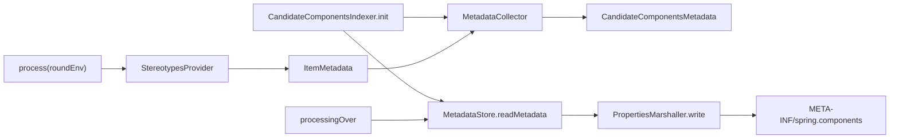

<!-- migration-doc: authority=authoritative canonical=../迁移验收规范.md -->
# spring-context-indexer → vernal-context-indexer 技术要求
> 迁移文档治理：本文级别为 **authoritative**。正文中的历史统计或完成标记不得单独作为验收结论；以 [../迁移验收规范.md](../迁移验收规范.md) 和自动审计报告为准。


> 当前文档。对象事实以[自动审计](../migration-audit/vernal-context-indexer.md)为准；统一规则见[迁移验收规范](../迁移验收规范.md)。

## 当前事实

| 状态 | 数量 |
|---|---:|
| Java 业务对象 | 12 |
| `IMPLEMENTED` | 0 |
| `MISPLACED` | 5 |
| `MISSING` | 7 |
| 严格已处理 | 0 |

现有 `index/` 下 5 个同名文件与 Spring `context.index.processor` 的预期 `processor/`
目录不一致，因此全部是 `MISPLACED`。

## 目标目录

```text
crates/vernal-context-indexer/src/
├── processor/
│   ├── candidate_components_indexer.rs
│   ├── candidate_components_metadata.rs
│   ├── indexed_stereotypes_provider.rs
│   ├── item_metadata.rs
│   ├── metadata_collector.rs
│   ├── metadata_store.rs
│   ├── package_info_stereotypes_provider.rs
│   ├── properties_marshaller.rs
│   ├── sorted_properties.rs
│   ├── standard_stereotypes_provider.rs
│   ├── stereotypes_provider.rs
│   └── type_helper.rs
└── lib.rs
```

`linked_component_index*.rs` 是 Vernal 运行时增值能力，不得抵扣上述 12 个 processor 对象。

## CodeGraph 处理链



必须保留：

- 多轮处理、前一轮元数据合并和已删除类型清理；
- stereotype provider 的组合与去重；
- properties 稳定排序、转义和确定性输出；
- 并发/增量构建下不产生陈旧候选项；
- 编译期生成与运行时 `LinkedComponentIndex` 读取的格式契约。

Rust 可采用 `syn`/proc-macro/build script，但若使用依赖复用，必须登记精确 crate、符号和集成测试。

## 验收

```bash
python3 scripts/audit_migration_docs.py --module vernal-context-indexer --check
cargo test -p vernal-context-indexer
cargo clippy -p vernal-context-indexer --all-targets -- -D warnings
```

---

<!-- restored-detail-from-head: dd20300d16a09200bd8a379ff14db1e2da99b67c -->

## 原详细文档（完整保留）

> 以下正文完整恢复自 Vernal 提交 `dd20300d16a09200bd8a379ff14db1e2da99b67c`。其中历史对象数量、完成状态、
> 路径算法和依赖替代结论如与本文顶部或自动对象台账冲突，以顶部当前结论和
> `docs/migration-audit/` 为准；其 API、设计背景、阶段拆解和测试说明继续保留。

# vernal-context-indexer 技术要求（对标 spring-context-indexer）

> **版本**：v2.0（2026-07-28）
> **定位**：vernal-context-indexer crate 技术交接文档，对标 Spring Framework 7.0.8 spring-context-indexer。
> **主线**：linkme 分布式切片替代 Spring APT（Annotation Processing Tool）。
> **现状**：11 文件 / 1371 行，edition 2024 / rustc 1.88。
> **引用约定**：crate 选型依据见《Spring 组件替换约定》8.7 节（linkme）。

---

## 一、总览

### 1.1 定位与边界

vernal-context-indexer 是 Vernal Framework 的 **链接期组件索引器**，
对标 spring-context-indexer 模块，提供编译期组件发现和索引能力。

| 维度 | spring-context-indexer（语义参考） | vernal-context-indexer（实现） | 差异说明 |
|:---|:---|:---|:---|
| 语言 | Java（JSR-269 APT） | Rust（linkme 分布式切片） | 链接期替代编译期注解处理 |
| 索引机制 | `META-INF/spring.components` 物理文件 | `LINKED_COMPONENT_INDEX` 链接期切片 | 内存切片替代文件 I/O |
| 发现阶段 | 编译期（APT） | 链接期（linkme） | 延迟到链接期，更灵活 |
| 索引格式 | Properties 文件（字符串键值） | `&'static [LinkedComponentEntry]` | 类型安全，零解析 |
| 查询入口 | `CandidateComponentsIndex` | `LinkedComponentIndex` | 直接对标 |
| 条目类型 | `ItemMetadata`（type + stereotypes） | `LinkedComponentEntry` + `ItemMetadata` | 双层镜像 |
| 注解处理 | `CandidateComponentsIndexer`（APT） | 不迁移（linkme 已收集） | 无需 JSR-269 |
| 跨 crate | 每个 crate 生成独立文件 | linkme 自动收集所有 crate | linkme 更优 |

### 1.2 架构分层

```
┌─────────────────────────────────────────────────────┐
│  应用层：LinkedComponentIndex::scan(base_packages)   │
│  → 按模块路径过滤 → stereotype 查询 → install 注册    │
├─────────────────────────────────────────────────────┤
│  索引层：LinkedComponentIndex                        │
│  → static_entries + runtime_entries + base_packages  │
│  → complete 标志（链接期 vs 纯运行时）                │
├─────────────────────────────────────────────────────┤
│  条目层：LinkedComponentEntry                        │
│  → module_path + name + stereotypes + definition     │
├─────────────────────────────────────────────────────┤
│  切片层：LINKED_COMPONENT_INDEX（linkme 分布式切片）  │
│  → &'static [LinkedComponentEntry]                  │
├─────────────────────────────────────────────────────┤
│  镜像层：index::ItemMetadata / CandidateComponentsMetadata │
│  → PropertiesMarshaller / SortedProperties / TypeHelper   │
└─────────────────────────────────────────────────────┘
```

### 1.3 关键决策

| 项 | 决策 | 理由 |
|:---|:---|:---|
| 索引机制 | linkme 分布式切片 | Rust 原生，无需 APT |
| 候选方案 | inventory | linkme 更底层，无隐式初始化 |
| 索引格式 | `&'static` 切片 | 零解析，类型安全 |
| 运行时注入 | 支持（`add_entry`） | 编程注册路径兼容 |
| Spring APT | 不迁移 | linkme 已替代 JSR-269 |
| 确定性排序 | `BTreeSet` + `sort_unstable_by` | 消除链接器顺序影响 |

### 1.4 命名映射

| Spring 原名 | vernal-context-indexer 移植名 | 说明 |
|:---|:---|:---|
| `CandidateComponentsIndex` | `LinkedComponentIndex` | 直接对标 |
| `ItemMetadata` | `LinkedComponentEntry` + `index::ItemMetadata` | 双层镜像 |
| `CandidateComponentsMetadata` | `index::CandidateComponentsMetadata` | 直接对标 |
| `PropertiesMarshaller` | `index::PropertiesMarshaller` | 直接对标 |
| `SortedProperties` | `index::SortedProperties` | 直接对标 |
| `TypeHelper` | `index::TypeHelper` | 直接对标 |
| `META-INF/spring.components` | `LINKED_COMPONENT_INDEX` 切片 | 物理文件 → 内存切片 |
| `CandidateComponentsIndexer`（APT） | 不迁移 | linkme 已替代 |
| `MetadataCollector` | 不迁移 | 多 round 是 javac 特有 |
| `MetadataStore` | 不迁移 | 物理文件 → linkme 切片 |
| `StereotypesProvider`（3 类） | 不迁移 | Java 注解传播机制 |

---

## 二、linkme vs inventory 选型对比

### 2.1 候选方案

| 候选 | 版本 | 机制 | 优势 | 劣势 |
|:---|:---|:---|:---|:---|
| linkme | 0.3 | 链接器段（linker section） | 底层、可控、`&'static` | 需 `#[distributed_slice]` |
| inventory | 0.3 | 链接器段 + 隐式初始化 | 零标注、自动收集 | 隐式初始化不可控 |

### 2.2 详细对比

| 维度 | linkme | inventory | 决策 |
|:---|:---|:---|:---|
| 初始化 | 显式（`#[distributed_slice]`） | 隐式（ctor） | linkme 更可控 |
| 条目类型 | `&'static [T]` | `&'static [T]` | 相同 |
| 条目声明 | `#[linkme::distributed_slice(SLICE)]` | `inventory::submit!{}` | linkme 更显式 |
| 运行时开销 | 链接器拼接，零运行时 | ctor 初始化，微量开销 | linkme 更优 |
| 跨平台 | Linux / macOS / Windows | Linux / macOS / Windows | 相同 |
| `#![forbid(unsafe_code)]` | ✅ 兼容 | ✅ 兼容 | 相同 |
| 条目排序 | 链接器决定（需手动排序） | 链接器决定（需手动排序） | 相同 |
| 条目去重 | 编译期检查 | 运行时检查 | linkme 更安全 |
| 社区活跃度 | 较高 | 较高 | 相同 |
| 已有依赖 | vernal 已使用 | 未使用 | linkme 已集成 |

### 2.3 决策理由

选择 **linkme** 的核心理由：

1. **显式优于隐式**：`#[distributed_slice]` 明确声明条目属于哪个切片，
   `inventory::submit!{}` 隐式收集，调试困难。

2. **零运行时开销**：linkme 完全由链接器拼接，无 ctor 初始化步骤。

3. **已有依赖**：vernal 已使用 linkme，无需引入新依赖。

4. **类型安全**：`&'static [T]` 在编译期确定类型，无运行时类型检查。

5. **与 Spring 语义一致**：`&'static` 切片与 `META-INF/spring.components`
   物理文件语义完全对应（只读、链接期事实）。

### 2.4 inventory 的适用场景

inventory 适合以下场景（vernal-context-indexer 不使用）：

- 需要零标注自动收集
- 条目类型异构
- 插件系统（外部 crate 注册）

---

## 三、核心对象体系

### 3.1 LinkedComponentEntry —— 索引条目

**来源**：vernal-context-indexer 现有实现。
**语义参照**：spring-context-indexer `ItemMetadata`。

#### Spring API（Java）

```java
// spring-context-indexer 索引条目
public class ItemMetadata {
    private final String type;
    private final Set<String> stereotypes;

    public ItemMetadata(String type, Set<String> stereotypes);
    public String getType() { return type; }
    public Set<String> getStereotypes() { return stereotypes; }
    public boolean hasStereotype(String stereotype) { ... }
}
```

#### Rust 实现

```rust
/// 一个由过程宏提交到链接期分布式切片的不可变组件定义条目。
/// 对标 Spring `ItemMetadata`。
///
/// stereotype 字段语义：
/// - Spring：`@Indexed` 元注解传播 + `jakarta.*` 命名空间注解 + `package-info`
/// - Vernal：`#[component(stereotype = "...")]` 属性显式指定
/// - 默认：`&["Component"]`（对标 Spring `@Component` 自带 `@Indexed`）
#[derive(Clone, Debug)]
pub struct LinkedComponentEntry {
    module_path: &'static str,                    // "my_app::service"
    name: &'static str,                           // "my_app::service::UserService"
    stereotypes: &'static [&'static str],         // &["Component"]
    definition: fn() -> ComponentDefinition,      // 定义工厂函数
}

impl LinkedComponentEntry {
    #[must_use]
    pub const fn new(
        module_path: &'static str,
        name: &'static str,
        stereotypes: &'static [&'static str],
        definition: fn() -> ComponentDefinition,
    ) -> Self;

    #[must_use]
    pub const fn new_default(
        module_path: &'static str,
        name: &'static str,
        definition: fn() -> ComponentDefinition,
    ) -> Self;  // stereotypes = &["Component"]

    #[must_use] pub const fn module_path(&self) -> &'static str;
    #[must_use] pub const fn name(&self) -> &'static str;
    #[must_use] pub const fn stereotypes(&self) -> &[&'static str];
    #[must_use] pub fn has_stereotype(&self, stereotype: &str) -> bool;
    pub fn stereotypes_iter(&self) -> impl Iterator<Item = &'static str> + '_;
    #[must_use] pub fn component_definition(&self) -> ComponentDefinition;
}
```

#### 约束表

| 约束项 | 要求 | 说明 |
|:---|:---|:---|
| `&'static` 字段 | 必须 | 链接期切片要求静态生命周期 |
| `const fn` 构造 | 必须 | `static` 上下文中调用 |
| stereotypes 排序 | 字典序 | 与 Spring `ItemMetadata.stereotypes` 一致 |
| 默认 stereotype | `["Component"]` | 对标 `@Component` 自带 `@Indexed` |
| Send + Sync | 自动满足 | 所有字段是 `&'static` 或 `fn()` |

---

### 3.2 LinkedComponentIndex —— 索引对象

**来源**：vernal-context-indexer 现有实现。
**语义参照**：spring-context-indexer `CandidateComponentsIndex`。

#### Spring API（Java）

```java
// spring-context-indexer 索引对象
public class CandidateComponentsIndex {
    public Set<String> getCandidateTypes(String basePackage, String stereotype);
    public boolean hasScannedPackage(String packageName);
    public Set<String> getRegisteredStereotypes();
    public boolean isComplete();
}
```

#### Rust 实现

```rust
/// 一次模块路径扫描得到的确定性、只读组件注册索引。
/// 对标 Spring `CandidateComponentsIndex`。
#[derive(Clone, Debug)]
pub struct LinkedComponentIndex {
    static_entries: Vec<&'static LinkedComponentEntry>,
    runtime_entries: Vec<LinkedComponentEntry>,
    base_packages: BTreeSet<String>,
    complete: bool,
}

impl LinkedComponentIndex {
    // 扫描方法
    pub fn scan<I, S>(base_packages: I) -> Result<Self, LinkedComponentIndexError>;
    pub fn scan_all() -> Result<Self, LinkedComponentIndexError>;
    #[must_use] pub fn empty() -> Self;
    pub fn merge(indices: &[&Self]) -> Result<Self, LinkedComponentIndexError>;

    // 运行时注入
    pub fn add_entry(&mut self, entry: LinkedComponentEntry);
    pub fn clear_cache(&mut self);
    pub fn register_scan<I, S>(&mut self, base_packages: I) -> Result<(), LinkedComponentIndexError>;

    // 查询方法
    #[must_use] pub fn get(&self, base_package: &str, stereotype: &str) -> BTreeSet<&'static str>;
    #[must_use] pub fn has(&self, package_name: &str) -> bool;
    #[must_use] pub fn base_packages(&self) -> &BTreeSet<String>;
    #[must_use] pub fn stereotypes(&self) -> BTreeSet<&'static str>;
    #[must_use] pub const fn is_complete(&self) -> bool;

    // 安装方法
    pub fn install<'registry>(
        &self, registry: &'registry mut RegistryBuilder,
    ) -> Result<&'registry mut RegistryBuilder, DefinitionError>;
    pub fn component_definitions(&self) -> impl Iterator<Item = ComponentDefinition> + '_;

    // 迭代方法
    pub fn iter_entries(&self) -> impl Iterator<Item = EntryRef<'_>>;
    #[must_use] pub fn static_entries(&self) -> &[&'static LinkedComponentEntry];
    #[must_use] pub fn runtime_entries(&self) -> &[LinkedComponentEntry];
    #[must_use] pub fn len(&self) -> usize;
    #[must_use] pub fn is_empty(&self) -> bool;
}
```

#### EntryRef 枚举

```rust
/// 索引条目引用枚举。区分链接期与运行时条目来源。
#[derive(Clone, Debug)]
pub enum EntryRef<'a> {
    Static(&'static LinkedComponentEntry),
    Runtime(&'a LinkedComponentEntry),
}

impl<'a> EntryRef<'a> {
    #[must_use] pub fn module_path(&self) -> &'static str;
    #[must_use] pub fn name(&self) -> &'static str;
    #[must_use] pub fn stereotypes(&self) -> &[&'static str];
    #[must_use] pub fn has_stereotype(&self, stereotype: &str) -> bool;
}
```

#### 扫描语义映射

```text
Spring: @ComponentScan(basePackages = {"com.example.web"})
  ↓ 对标
Vernal: LinkedComponentIndex::scan(["my_app::web"])
```

| Spring 行为 | vernal 行为 |
|:---|:---|
| classpath 扫描 `@Component` 类 | linkme 切片过滤 `module_path` 前缀 |
| `AntPathMatcher(".")` 路径匹配 | `module_path.starts_with(base_package)` |
| 按 `type` 排序 | 按 `(module_path, name)` 排序 |
| 重复检测 | `validate_no_duplicates()` |

---

### 3.3 LINKED_COMPONENT_INDEX —— 分布式切片

**来源**：vernal-context-indexer 现有实现。
**语义参照**：`META-INF/spring.components` 物理文件。

#### Spring 机制

```properties
# META-INF/spring.components（Properties 格式）
com.example.UserService=org.springframework.stereotype.Component
com.example.UserRepository=org.springframework.stereotype.Repository
com.example.OrderService=org.springframework.stereotype.Component
```

#### Rust 实现

```rust
/// 链接期组件索引切片常量。
/// 对标 Spring `META-INF/spring.components` 物理文件。
#[linkme::distributed_slice]
pub static LINKED_COMPONENT_INDEX: [LinkedComponentEntry] = [..];
```

#### 注入机制

```rust
// vernal-macros 自动生成的代码（每个 #[derive(Component)] 的结构体）：
#[linkme::distributed_slice(LINKED_COMPONENT_INDEX)]
static __VERNAL_LINKED_COMPONENT_ENTRY_UserService: LinkedComponentEntry =
    LinkedComponentEntry::new(
        module_path!(),                                    // "my_app::service"
        concat!(module_path!(), "::", "UserService"),      // 稳定声明名
        &["Component"],                                    // stereotypes
        || ComponentDefinition::new::<UserService>(),      // 定义工厂
    );
```

---

### 3.4 LinkedComponentIndexError —— 索引错误

**来源**：vernal-context-indexer 现有实现。

```rust
#[derive(Clone, Debug, PartialEq, Eq)]
#[non_exhaustive]
pub enum LinkedComponentIndexError {
    EmptySelection,                              // 空选择
    InvalidGroup { group: Arc<str> },            // 分组名非法
    MissingGroup { group: Arc<str> },            // 分组无条目
    InvalidEntry { group: Arc<str>, name: Arc<str> }, // 条目名非法
    DuplicateEntry { group: Arc<str>, name: Arc<str> }, // 同名冲突
}

impl Display for LinkedComponentIndexError { ... }
impl Error for LinkedComponentIndexError {}
```

---

## 四、镜像层（index 子模块）

### 4.1 ItemMetadata —— 高层条目镜像

**来源**：vernal-context-indexer 现有实现。
**语义参照**：spring-context-indexer `processor.ItemMetadata`。

```rust
/// 高层 ItemMetadata 镜像。对标 Spring `processor.ItemMetadata`。
/// 与 `LinkedComponentEntry` 的区别：ItemMetadata 是可序列化的高层表示。
#[derive(Clone, Debug, PartialEq, Eq)]
pub struct ItemMetadata {
    r#type: String,
    stereotypes: BTreeSet<String>,
}

impl ItemMetadata {
    pub fn new(r#type: impl Into<String>, stereotypes: BTreeSet<String>) -> Self;
    pub fn get_type(&self) -> &str;
    pub fn get_stereotypes(&self) -> &BTreeSet<String>;
}
```

### 4.2 CandidateComponentsMetadata —— 批量元数据

**语义参照**：spring-context-indexer `CandidateComponentsMetadata`。

```rust
/// 候选组件元数据集合。对标 Spring `CandidateComponentsMetadata`。
#[derive(Clone, Debug, Default, PartialEq, Eq)]
pub struct CandidateComponentsMetadata {
    items: Vec<ItemMetadata>,
}

impl CandidateComponentsMetadata {
    pub fn new() -> Self;
    pub fn add(&mut self, item: ItemMetadata);
    pub fn get_items(&self) -> &[ItemMetadata];
    pub fn len(&self) -> usize;
    pub fn is_empty(&self) -> bool;
    pub fn types(&self) -> BTreeSet<&str>;
    pub fn stereotypes(&self) -> BTreeSet<&str>;
}
```

### 4.3 PropertiesMarshaller —— 序列化/反序列化

**语义参照**：spring-context-indexer `PropertiesMarshaller`。

```rust
/// 索引元数据序列化器。对标 Spring `PropertiesMarshaller`。
/// 格式：每行 `type=stereotype1,stereotype2,...`（stereotype 按字典序，逗号分隔）
pub struct PropertiesMarshaller;

impl PropertiesMarshaller {
    pub fn write(metadata: &CandidateComponentsMetadata, writer: &mut impl Write) -> io::Result<()>;
    pub fn read(reader: &mut impl Read) -> io::Result<CandidateComponentsMetadata>;
}
```

### 4.4 SortedProperties —— 确定性格式化

**语义参照**：spring-context-indexer `SortedProperties`。

```rust
/// 按 key 字母序排序的 Properties。对标 Spring `SortedProperties`。
pub const EOL: &str = "\n";

#[derive(Clone, Debug, Default, PartialEq, Eq)]
pub struct SortedProperties {
    inner: BTreeMap<String, String>,
    omit_comments: bool,
}

impl SortedProperties {
    pub fn new(omit_comments: bool) -> Self;
    pub fn from_map(map: BTreeMap<String, String>, omit_comments: bool) -> Self;
    pub fn set(&mut self, key: impl Into<String>, value: impl Into<String>);
    pub fn get(&self, key: &str) -> Option<&str>;
    pub fn store(&self, writer: &mut impl Write) -> io::Result<()>;
    pub fn load(&mut self, reader: &mut impl Read) -> io::Result<()>;
}
```

### 4.5 TypeHelper —— 类型辅助

**语义参照**：spring-context-indexer `TypeHelper`。

```rust
/// 类型工具。对标 Spring `TypeHelper`。
pub struct TypeHelper;

impl TypeHelper {
    pub const fn new() -> Self;
    pub fn get_type<T: ?Sized>() -> String;
    pub fn to_nested_format(type_name_str: &str) -> String;   // Outer::Inner → Outer$Inner
    pub fn to_package_format(type_name_str: &str) -> String;  // :: → .
    pub fn is_jakarta_annotation(annotation_type: &str) -> bool;
    pub fn is_indexed_annotation(annotation_type: &str) -> bool;
    pub fn collect_stereotypes(
        element_annotations: &[&str],
        meta_annotations: &[&str],
        is_package_info: bool,
        type_annotations: &[&str],
    ) -> Vec<String>;
    pub fn package_of(qualified_name: &str) -> &str;          // "a::b::C" → "a::b"
}
```

---

## 五、与 Spring APT 的不迁移说明

### 5.1 不迁移的 Spring 类

| Spring 类 | 不迁移原因 | vernal 替代 |
|:---|:---|:---|
| `CandidateComponentsIndexer`（APT） | Rust 无 JSR-269 | linkme 分布式切片 |
| `MetadataCollector`（多 round） | javac 多 round 编译特有 | linkme 单次收集 |
| `MetadataStore`（文件存储） | 物理文件 → 内存切片 | `&'static` 切片 |
| `StereotypesProvider` 接口 | Java 注解传播机制 | 显式 `stereotype = "..."` |
| `IndexedStereotypesProvider` | `@Indexed` 元注解传播 | 不需要（显式指定） |
| `StandardStereotypesProvider` | `jakarta.*` 命名空间注解 | 不需要（Rust 无 jakarta） |
| `PackageInfoStereotypesProvider` | `package-info.java` | 不需要（Rust 无此文件） |

### 5.2 Spring APT 工作流 vs linkme 工作流

#### Spring APT 工作流

```
1. 编译期：APT 处理器扫描 @Component 注解
2. 编译期：生成 META-INF/spring.components 文件
3. 运行时：CandidateComponentsIndexLoader 加载文件
4. 运行时：CandidateComponentsIndex 查询索引
5. 运行时：ClassPathScanningCandidateComponentProvider 扫描
```

#### linkme 工作流

```
1. 编译期：#[derive(Component)] 宏生成 #[linkme::distributed_slice] 条目
2. 链接期：链接器将所有条目拼成 LINKED_COMPONENT_INDEX 切片
3. 运行时：LinkedComponentIndex::scan() 过滤模块路径
4. 运行时：LinkedComponentIndex::get() 查询 stereotype
5. 运行时：LinkedComponentIndex::install() 注册到 IoC
```

### 5.3 对比表

| 维度 | Spring APT | linkme | 优势方 |
|:---|:---|:---|:---|
| 发现阶段 | 编译期（APT） | 链接期 | linkme（更晚，更灵活） |
| 索引格式 | Properties 文件 | `&'static` 切片 | linkme（零解析） |
| 类型安全 | 字符串键值 | 编译期类型 | linkme |
| 增量编译 | 需重新生成文件 | 链接器自动处理 | linkme |
| 跨 crate | 需每个 crate 生成文件 | linkme 自动收集 | linkme |
| 运行时开销 | 文件 I/O + 解析 | 零（内存切片） | linkme |

---

## 六、运行时与集成约束

### 6.1 运行时核心对象

| 对象 | 说明 | spring-context-indexer 对应 |
|:---|:---|:---|
| `LinkedComponentEntry` | 索引条目（module_path + name + stereotypes + definition） | `ItemMetadata` |
| `LinkedComponentIndex` | 索引对象（scan + get + install） | `CandidateComponentsIndex` |
| `LINKED_COMPONENT_INDEX` | linkme 分布式切片 | `META-INF/spring.components` |
| `EntryRef` | 条目引用枚举（Static / Runtime） | （无直接对应） |
| `LinkedComponentIndexError` | 索引错误聚合 | `IllegalStateException` |
| `ItemMetadata` | 高层条目镜像 | `processor.ItemMetadata` |
| `CandidateComponentsMetadata` | 批量元数据 | `CandidateComponentsMetadata` |
| `PropertiesMarshaller` | 序列化/反序列化 | `PropertiesMarshaller` |
| `SortedProperties` | 确定性格式化 | `SortedProperties` |
| `TypeHelper` | 类型辅助 | `TypeHelper` |

### 6.2 与 vernal 生态的协作

| vernal crate | 协作方式 |
|:---|:---|
| vernal-macros | `#[derive(Component)]` 自动生成 linkme 条目 |
| vernal-context | `LinkedComponentIndex::install()` 注册到 IoC 容器 |
| vernal-beans | `ComponentDefinition` 组件定义 |
| vernal-core | `module_path!()` 宏 |

### 6.3 选型基线

| 用途 | Rust crate | 版本 | Spring 等价 |
|:---|:---|:---|:---|
| 链接期注入 | `linkme` | 0.3.37 | JSR-269 APT |
| 组件定义 | `vernal-beans` | path | BeanDefinition |
| 核心类型 | `vernal-core` | path | spring-core |
| 过程宏 | `vernal-macros` | path（dev-dep） | APT 处理器 |

### 6.4 待补齐工作路线图

| 阶段 | 内容 | 优先级 | 预估工作量 |
|:---|:---|:---|:---|
| 已完成 | 核心对象（Entry / Index / Slice / Error） | — | — |
| 已完成 | 镜像层（ItemMetadata / Metadata / Marshaller / TypeHelper） | — | — |
| 已完成 | 测试（compile_fail / linked_component_index / runtime） | — | — |
| P1 | `IndexBuilder` 构造器（简化 scan + install 流程） | P1 | 1 天 |
| P2 | 并行扫描（`rayon` 并行过滤） | P2 | 1 天 |
| P2 | 性能基准测试（大量条目场景） | P2 | 1 天 |

### 6.5 测试基线

#### 已完成

| 测试文件 | 测试内容 | 数量 |
|:---|:---|:---|
| `linked_component_index.rs` | scan / scan_all / get / has / merge | 12 |
| `linked_component_index_runtime.rs` | add_entry / clear_cache / register_scan | 8 |
| `index_compile_fail.rs` | trybuild 负例（空选择 / 重复 / 非法名） | 3 |
| `coverage_completion.rs` | 边界覆盖补充 | 5 |
| 总计 | | 28 |

#### 待做

| 测试内容 | 预估数量 |
|:---|:---|
| `IndexBuilder` | 4+ |
| 大量条目性能 | 3+ |
| 跨 crate 收集 | 3+ |

### 6.6 成熟度状态

| 维度 | 当前 | 目标 |
|:---|:---|:---|
| 文件数 | 11 | 13+ |
| 行数 | 1371 | 1500+ |
| 核心对象 | 5（Entry / Index / Slice / Error / EntryRef） | 5 |
| 镜像层 | 5（ItemMetadata / Metadata / Marshaller / SortedProperties / TypeHelper） | 5 |
| linkme 切片 | 1 | 1 |
| 与 spring-context-indexer 语义对标度 | ~85% | 90%+ |
| 测试数 | 28 | 40+ |

---

## 附录：spring-context-indexer 语义覆盖全景

| spring-context-indexer 包 | 类数 | vernal-context-indexer 状态 | 说明 |
|:---|:---|:---|:---|
| 根包（CandidateComponentsIndex） | 3 | ✅ 已移植 | LinkedComponentIndex / Entry / Slice |
| processor（已迁移） | 5 | ✅ 已移植 | ItemMetadata / Metadata / Marshaller / SortedProperties / TypeHelper |
| processor（不迁移） | 7 | 🚫 不迁移 | Indexer / Collector / Store / Providers（APT 特有） |
| **总计** | **15** | **5 迁移 + 7 不迁移 + 3 已有** | **vernal-macros 过程宏替代 APT** |
