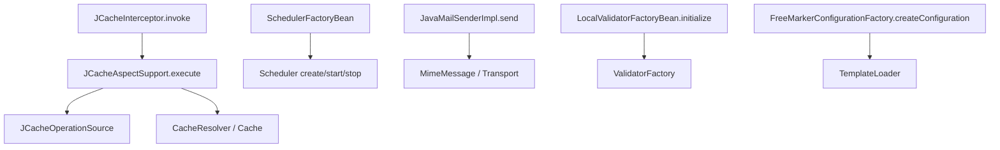

<!-- migration-doc: authority=authoritative canonical=../迁移验收规范.md -->
# spring-context-support → vernal-context-support 技术要求
> 迁移文档治理：本文级别为 **authoritative**。正文中的历史统计或完成标记不得单独作为验收结论；以 [../迁移验收规范.md](../迁移验收规范.md) 和自动审计报告为准。


> 当前文档。对象事实见[自动审计](../migration-audit/vernal-context-support.md)，统一规则见[迁移验收规范](../迁移验收规范.md)。

## 当前事实

| 状态 | 数量 |
|---|---:|
| Java 业务对象 | 78 |
| `IMPLEMENTED` | 0 |
| `MISPLACED` | 6 |
| `MISSING` | 39 |
| `UNVERIFIED` | 33 |
| 严格已处理 | 0 |

现有 cache、Quartz、mail 与 FreeMarker 风格对象只是候选实现；没有来源注释、路径或集成测试时仍未完成。

## 目标目录

```text
crates/vernal-context-support/src/
├── cache/
│   ├── caffeine/
│   └── transaction/
├── jcache/
│   ├── config/
│   └── interceptor/
├── mail/
│   └── javamail/
├── scheduling/
│   └── quartz/
└── ui/
    └── freemarker/
```

路径按包末两层，不按当前实现方便性：

- `cache/jcache/interceptor/JCacheInterceptor.java` → `jcache/interceptor/jcache_interceptor.rs`
- `scheduling/quartz/SchedulerFactoryBean.java` → `scheduling/quartz/scheduler_factory_bean.rs`
- `ui/freemarker/FreeMarkerConfigurationFactory.java` → `ui/freemarker/free_marker_configuration_factory.rs`

## 集成边界

- Caffeine → Rust cache backend（如 moka）可复用，但 Spring wrapper 对象仍须精确记录。
- JCache → Rust cache operation/advisor，不复制 Jakarta API；必须保留 key、resolver、exception cache、put/remove 时序。
- Quartz → Tokio scheduler/精确 scheduler 依赖；保留 trigger、job factory、context、lifecycle 和 data source 语义。
- JavaMail → lettre 等依赖；保留 message builder、sender、mime helper 与异常层次。
- FreeMarker → Tera 等依赖；保留 template loader、configuration factory 和资源解析契约。
- Jakarta Validation 对象若属于本模块基线，采用 Rust validator/serde 校验时仍逐对象登记精确复用。

## CodeGraph 关键链



CodeGraph 在 Vernal 中识别到 `SchedulerFactoryBean`、`JCacheAspectSupport` 和多个 cache adapter，
但也发现空清理逻辑、多对象同文件等证据，因此不能推断完整。

## 质量门禁

- 依赖复用必须记录 crate、版本/commit、上游符号和 Vernal 集成测试。
- 单文件单对象；现有 Quartz、mail、JCache 多公开对象文件必须拆分。
- cache 并发/错误，scheduler 关闭，mail transport 失败和 template 加载失败均须有测试。
- 禁止使用“生态已有”或“语义类似”标为完成。

## 验收

```bash
python3 scripts/audit_migration_docs.py --module vernal-context-support --check
cargo test -p vernal-context-support
cargo clippy -p vernal-context-support --all-targets -- -D warnings
```

---

<!-- restored-detail-from-head: dd20300d16a09200bd8a379ff14db1e2da99b67c -->

## 原详细文档（完整保留）

> 以下正文完整恢复自 Vernal 提交 `dd20300d16a09200bd8a379ff14db1e2da99b67c`。其中历史对象数量、完成状态、
> 路径算法和依赖替代结论如与本文顶部或自动对象台账冲突，以顶部当前结论和
> `docs/migration-audit/` 为准；其 API、设计背景、阶段拆解和测试说明继续保留。

# vernal-context-support 技术交接文档

> **对标**: Spring Framework `spring-context-support`（上下文支持层）
> **crate**: `vernal-context-support`
> **现状**: 68 文件 / ~4763 行 / 4 子模块
> **edition**: 2024 / rustc 1.88.0 / MSRV 1.88.0
> **状态**: experimental
> **最后更新**: 2026-07-28

---

## 一、定位

vernal-context-support 是 Vernal 框架的**上下文支持层**，对标 Spring Framework 的 `spring-context-support` 模块。
它提供外部生态能力的 Rust 适配：缓存抽象（Caffeine/JCache）、调度（Quartz）、邮件（JavaMail）、模板引擎（FreeMarker），
使上层应用能够以 Spring 一致的语义使用这些基础设施。

**设计原则**:

- 零 `unsafe`（`#![forbid(unsafe_code)]`）
- 所有公开 trait 必须是 dyn-compatible（object-safe）
- 所有公开类型必须满足 `Send + Sync + 'static`
- feature-gated 设计：核心 trait 默认可用，具体实现按 feature flag 启用
- 与 Spring API 的映射关系在文档和注释中保持一致

**与 Spring Context Support 的对应关系**:

| Spring Context Support 子系统 | vernal-context-support 子模块 | 状态 |
|---|---|---|
| `org.springframework.cache` | `cache` | 完成 |
| `org.springframework.cache.transaction` | `cache::transaction` | 完成 |
| `org.springframework.cache.caffeine` | `cache::caffeine` | 完成 |
| `org.springframework.cache.jcache` | `cache::jcache` | 完成 |
| `org.springframework.scheduling.quartz` | `scheduling::quartz` | 完成 |
| `org.springframework.mail` | `mail` | 完成 |
| `org.springframework.mail.javamail` | `mail::javamail` | 完成 |
| `org.springframework.ui.freemarker` | `ui::freemarker` | 完成 |

---

## 二、组件清单详细

### 2.1 缓存抽象

**对标**: `org.springframework.cache.Cache` / `CacheManager`

#### Spring API

```java
public interface Cache {
    String getName();
    Object getNativeCache();
    ValueWrapper get(Object key);
    void put(Object key, @Nullable Object value);
    void evict(Object key);
    void clear();
}

public interface CacheManager {
    @Nullable Cache getCache(String name);
    Collection<String> getCacheNames();
}
```

#### Rust 实现

```rust
// crates/vernal-cache/src/lib.rs（vernal-context-support 依赖 vernal-cache）
pub trait Cache: Send + Sync {
    fn name(&self) -> &str;
    fn native_cache(&self) -> &dyn Any where Self: Sized;
    fn get(&self, key: &dyn Any) -> Option<Arc<dyn ValueWrapper>>;
    fn put(&self, key: &dyn Any, value: Arc<dyn Any + Send + Sync>);
    fn evict(&self, key: &dyn Any);
    fn clear(&self);
    fn put_if_absent(&self, key: &dyn Any, value: Arc<dyn Any + Send + Sync>)
        -> Option<Arc<dyn ValueWrapper>>;
    fn evict_if_present(&self, key: &dyn Any) -> bool;
    fn invalidate(&self) -> bool;
}

pub trait CacheExt: Cache {
    fn get_typed<T: Any + Send + Sync>(&self, key: &dyn Any) -> Option<Arc<T>>;
    fn get_with_loader<T, F>(&self, key: &dyn Any, value_loader: F) -> CacheResult<Arc<T>>
    where T: Any + Send + Sync, F: FnOnce() -> CacheResult<T> + Send;
    fn retrieve(&self, key: &dyn Any)
        -> Pin<Box<dyn Future<Output = Option<Arc<dyn Any + Send + Sync>>> + Send>>;
    fn retrieve_with_loader<T, F, Fut>(&self, key: &dyn Any, value_loader: F)
        -> Pin<Box<dyn Future<Output = CacheResult<Arc<T>>> + Send>>
    where T: Any + Send + Sync, F: FnOnce() -> Fut + Send + 'static,
          Fut: Future<Output = CacheResult<T>> + Send + 'static;
}

pub trait CacheManager: Send + Sync {
    fn get_cache(&self, name: &str) -> Option<Arc<dyn Cache>>;
    fn cache_names(&self) -> Vec<String>;
    fn reset_caches(&self);
}

pub trait ValueWrapper: Send + Sync {
    fn get(&self) -> Option<Arc<dyn Any + Send + Sync>>;
}
```

#### 约束表

| 约束项 | 要求 | 当前状态 |
|---|---|---|
| dyn-compatible | `Cache` / `CacheManager` / `ValueWrapper` 均 object-safe | 满足 |
| Send + Sync | 所有 trait 和实现 | 满足 |
| 类型擦除 | key 使用 `&dyn Any`，value 使用 `Arc<dyn Any + Send + Sync>` | 满足 |
| 异步支持 | `CacheExt::retrieve` / `retrieve_with_loader` 返回 `Pin<Box<dyn Future>>` | 满足 |

#### 待补齐

- [ ] `ConcurrentMapCache`（基于 `dashmap` 的通用缓存实现）
- [ ] `NoOpCache`（空操作缓存，用于测试）

---

### 2.2 事务感知缓存装饰器

**对标**: `org.springframework.cache.transaction.TransactionAwareCacheDecorator` / `TransactionAwareCacheManagerProxy`

#### Spring API

```java
public class TransactionAwareCacheDecorator implements Cache {
    public TransactionAwareCacheDecorator(Cache targetCache);
    // put/evict/clear 延迟到 after-commit
    // get/putIfAbsent/evictIfPresent 立即执行
}

public class TransactionAwareCacheManagerProxy implements CacheManager {
    public TransactionAwareCacheManagerProxy(CacheManager targetCacheManager);
    // 返回包装后的事务感知 Cache
}
```

#### Rust 实现

```rust
// crates/vernal-context-support/src/cache/transaction/transaction_aware_cache_decorator.rs

pub enum TransactionStatus {
    NoTransaction,
    Active,
    Committed,
    RolledBack,
}

pub trait TransactionCallbackRegistrar: Send + Sync {
    fn after_commit(&self, callback: Box<dyn FnOnce() + Send + 'static>);
    fn after_completion(&self, callback: Box<dyn FnOnce(TransactionStatus) + Send + 'static>);
    fn status(&self) -> TransactionStatus;
}

pub struct ImmediateCallbackRegistrar;  // 无事务环境，立即执行

pub struct TransactionAwareCacheDecorator {
    target_cache: Arc<dyn Cache>,
    registrar: Arc<dyn TransactionCallbackRegistrar>,
    deferred_callbacks: Mutex<Vec<Box<dyn FnOnce() + Send>>>,
}

impl TransactionAwareCacheDecorator {
    pub fn new(target_cache: Arc<dyn Cache>) -> Self;
    pub fn with_registrar(target_cache: Arc<dyn Cache>,
                          registrar: Arc<dyn TransactionCallbackRegistrar>) -> Self;
    pub fn target_cache(&self) -> &Arc<dyn Cache>;
    pub fn execute_deferred(&self);   // 事务提交后调用
    pub fn discard_deferred(&self);   // 事务回滚后调用
}

impl Cache for TransactionAwareCacheDecorator { /* 委托 + 延迟写操作 */ }
impl CacheExt for TransactionAwareCacheDecorator { /* 委托 + 异步支持 */ }

// crates/vernal-context-support/src/cache/transaction/transaction_aware_cache_manager_proxy.rs

pub struct TransactionAwareCacheManagerProxy {
    target_cache_manager: Arc<dyn CacheManager>,
}

impl TransactionAwareCacheManagerProxy {
    pub fn new(target_cache_manager: Arc<dyn CacheManager>) -> Self;
    pub fn target_cache_manager(&self) -> &Arc<dyn CacheManager>;
}

impl CacheManager for TransactionAwareCacheManagerProxy {
    fn get_cache(&self, name: &str) -> Option<Arc<dyn Cache>> {
        // 返回 TransactionAwareCacheDecorator 包装
    }
}
```

#### 延迟操作语义

| 操作 | Spring 行为 | vernal 行为 |
|---|---|---|
| `get` | 立即执行 | 立即委托 |
| `put` | 延迟到 after-commit | 延迟到 after-commit |
| `evict` | 延迟到 after-commit | 延迟到 after-commit |
| `clear` | 延迟到 after-commit | 延迟到 after-commit |
| `putIfAbsent` | 立即执行 | 立即委托 |
| `evictIfPresent` | 立即执行 | 立即委托 |
| `invalidate` | 立即执行 | 立即委托 |

#### 约束表

| 约束项 | 要求 | 当前状态 |
|---|---|---|
| dyn-compatible | `TransactionCallbackRegistrar` object-safe | 满足 |
| Send + Sync | `TransactionAwareCacheDecorator` 通过 `Mutex` 保护回调队列 | 满足 |
| 事务语义 | put/evict/clear 延迟到 after-commit | 满足（测试覆盖） |
| 回滚语义 | `discard_deferred()` 清空延迟队列 | 满足（测试覆盖） |

#### 待补齐

- [ ] 与 `vernal-context` 事务管理器的实际集成（当前 `ImmediateCallbackRegistrar` 为默认实现）

---

### 2.3 Caffeine 缓存适配（moka 后端）

**对标**: `org.springframework.cache.caffeine.CaffeineCache` / `CaffeineCacheManager` / `CaffeineSpec`

> **选型说明**: Java 的 Caffeine 库在 Rust 生态中对应 `moka` crate（同一作者的不同语言实现）。
> 参见《Spring 组件替换约定》第 8.7 节。

#### Spring API

```java
public class CaffeineCache implements Cache {
    public CaffeineCache(String name, Cache<Object, Object> cache);
}

public class CaffeineCacheManager implements CacheManager {
    public CaffeineCacheManager();
    public void setCacheNames(Collection<String> cacheNames);
    public void setCaffeine(Caffeine<Object, Object> caffeine);
    public void setCacheSpecification(String cacheSpecification);
}

public final class CaffeineSpec {
    public static CaffeineSpec parse(String specification);
}
```

#### Rust 实现

```rust
// crates/vernal-context-support/src/cache/caffeine/caffeine_cache.rs

pub struct CaffeineCache {
    name: String,
    cache: moka::sync::Cache<String, Arc<dyn Any + Send + Sync>>,
    allow_null_values: bool,
}

impl CaffeineCache {
    pub fn new(name: String,
               cache: moka::sync::Cache<String, Arc<dyn Any + Send + Sync>>) -> Self;
    pub fn with_max_capacity(name: String, max_capacity: u64) -> Self;
    pub fn with_ttl(name: String, max_capacity: u64, ttl: Duration) -> Self;
    pub fn with_tti(name: String, max_capacity: u64, tti: Duration) -> Self;
    pub fn with_ttl_tti(name: String, max_capacity: u64, ttl: Duration, tti: Duration) -> Self;
    pub fn set_allow_null_values(&mut self, allow: bool);
    pub fn moka_cache(&self) -> &moka::sync::Cache<String, Arc<dyn Any + Send + Sync>>;
    pub fn entry_count(&self) -> u64;
    pub fn invalidate_all(&self);
    pub fn run_pending_tasks(&self);
}

impl Cache for CaffeineCache { /* moka 委托 */ }
impl CacheExt for CaffeineCache { /* moka 委托 + 异步支持 */ }

// crates/vernal-context-support/src/cache/caffeine/caffeine_cache_manager.rs

pub enum AsyncCacheMode { Sync, Async }

pub struct CaffeineCacheManager {
    cache_names: RwLock<HashSet<String>>,
    caches: RwLock<HashMap<String, Arc<CaffeineCache>>>,
    spec: RwLock<CaffeineSpec>,
    dynamic: RwLock<bool>,
    async_cache_mode: RwLock<AsyncCacheMode>,
    allow_null_values: RwLock<bool>,
    default_max_capacity: u64,
}

impl CaffeineCacheManager {
    pub fn new() -> Self;                          // 默认最大容量 10000
    pub fn with_max_capacity(max_capacity: u64) -> Self;
    pub fn set_cache_names(&self, names: impl IntoIterator<Item = String>);
    pub fn set_spec(&self, spec: CaffeineSpec);
    pub fn set_spec_string(&self, spec_str: &str) -> Result<(), CaffeineSpecParseError>;
    pub fn set_async_cache_mode(&self, mode: AsyncCacheMode);
    pub fn set_allow_null_values(&self, allow: bool);
    pub fn set_dynamic(&self, dynamic: bool);
    pub fn spec(&self) -> CaffeineSpec;
    pub fn async_cache_mode(&self) -> AsyncCacheMode;
    pub fn allow_null_values(&self) -> bool;
    pub fn is_dynamic(&self) -> bool;
}

impl CacheManager for CaffeineCacheManager { /* 动态/静态模式 */ }

// crates/vernal-context-support/src/cache/caffeine/caffeine_spec.rs

pub struct CaffeineSpec {
    pub maximum_size: Option<u64>,
    pub maximum_weight: Option<u64>,
    pub expire_after_write: Option<Duration>,
    pub expire_after_access: Option<Duration>,
    pub refresh_after_write: Option<Duration>,
    pub initial_capacity: Option<usize>,
    pub record_stats: bool,
    pub weak_keys: bool,
    pub weak_values: bool,
    pub soft_values: bool,
}

impl CaffeineSpec {
    pub fn parse(spec: &str) -> Result<Self, CaffeineSpecParseError>;
}
```

#### 配置字符串格式

```
maximumSize=10000,expireAfterWrite=5m,expireAfterAccess=10m,recordStats
```

| 键 | 类型 | 示例 |
|---|---|---|
| `maximumSize` | u64 | `10000` |
| `maximumWeight` | u64 | `1000` |
| `expireAfterWrite` | Duration | `5m` / `2h` / `1d` |
| `expireAfterAccess` | Duration | `10m` |
| `refreshAfterWrite` | Duration | `1m` |
| `initialCapacity` | usize | `100` |
| `recordStats` | flag | 无值 |
| `weakKeys` | flag | 无值 |
| `weakValues` | flag | 无值 |
| `softValues` | flag | 无值 |

#### 约束表

| 约束项 | 要求 | 当前状态 |
|---|---|---|
| dyn-compatible | `Cache` / `CacheManager` 委托给 moka | 满足 |
| Send + Sync | `CaffeineCacheManager` 通过 `RwLock` 保护 | 满足 |
| 动态模式 | 按需创建缓存（默认） | 满足（测试覆盖） |
| 静态模式 | 预定义缓存名集合 | 满足（测试覆盖） |
| TTL/TTI | moka 原生支持 | 满足 |
| 最终一致性 | moka 是最终一致的，立即读取可能命中 | 已知特性 |

#### 待补齐

- [ ] `CaffeineCacheManagerBuilder`（构建器模式）
- [ ] `CacheStatistics` 集成（`recordStats` 后的统计查询）

---

### 2.4 JCache 适配

**对标**: `org.springframework.cache.jcache`（JSR-107）

#### Spring API

```java
public class JCacheCacheManager implements CacheManager {
    public JCacheCacheManager(javax.cache.CacheManager cacheManager);
}

public abstract class AbstractJCacheConfiguration {
    // JCache 配置基类
}
```

#### Rust 实现

```rust
// crates/vernal-context-support/src/cache/jcache/

pub mod config {
    pub trait JCacheConfigurer: Send + Sync {
        fn configure_cache(&self, name: &str) -> Option<Box<dyn Cache>>;
    }

    pub struct JCacheConfigurerSupport;
    pub struct AbstractJCacheConfiguration;
    pub struct ProxyJCacheConfiguration;
}

pub struct JCacheCacheManager { /* JSR-107 适配 */ }
pub struct JCacheManagerFactoryBean { /* 工厂 Bean */ }
pub struct JCacheCache { /* 单缓存实例 */ }

// 拦截器子模块
pub mod interceptor {
    pub trait JCacheOperationSource: Send + Sync { /* 缓存操作源 */ }
    pub struct DefaultJCacheOperationSource;
    pub struct AnnotationJCacheOperationSource;
    pub struct JCacheInterceptor { /* 缓存拦截器 */ }
    pub trait JCacheAspectSupport { /* 切面支持 */ }
    pub struct SimpleExceptionCacheResolver;
    pub struct CacheResolverAdapter;
    pub struct AbstractJCacheOperation;
    pub struct CacheResultOperation;
    pub struct CachePutOperation;
    pub struct CacheRemoveOperation;
    pub struct CacheRemoveAllOperation;
}
```

#### 约束表

| 约束项 | 要求 | 当前状态 |
|---|---|---|
| JSR-107 语义 | JCache API 对齐 | 骨架完成 |
| dyn-compatible | 所有公开 trait object-safe | 满足 |
| Send + Sync | 所有公开类型 | 满足 |

#### 待补齐

- [ ] `javax.cache.CacheManager` 的 Rust 等价 trait
- [ ] JSR-107 注解（`@CacheResult` / `@CachePut` / `@CacheRemove`）的宏支持

---

### 2.5 Quartz 调度适配（tokio-cron-scheduler 后端）

**对标**: `org.springframework.scheduling.quartz`（19 个类）

> **选型说明**: Java 的 Quartz 在 Rust 生态中对应 `tokio-cron-scheduler` crate。
> 参见《Spring 组件替换约定》第 8.8 节。

#### Spring API

```java
public class SchedulerFactoryBean implements FactoryBean<Scheduler>, InitializingBean {
    public void setJobDetails(JobDetail[] jobDetails);
    public void setTriggers(Trigger... triggers);
    public void start();
    public void stop();
}

public abstract class QuartzJobBean implements Job {
    protected abstract void executeInternal(JobExecutionContext context);
}
```

#### Rust 实现

```rust
// crates/vernal-context-support/src/scheduling/quartz/

// 调度器生命周期
pub enum SchedulerState { Stopped, Running, Paused }

pub struct SchedulerFactoryBean {
    state: Arc<Mutex<SchedulerState>>,
    shutdown_tx: Arc<Mutex<Option<oneshot::Sender<()>>>>,
}

impl SchedulerFactoryBean {
    pub fn new() -> Self;
    pub async fn start(&self) -> Result<(), BoxError>;
    pub async fn stop(&self) -> Result<(), BoxError>;
    pub async fn shutdown(&self) -> Result<(), BoxError>;
    pub async fn pause(&self) -> Result<(), BoxError>;
    pub async fn resume(&self) -> Result<(), BoxError>;
    pub async fn state(&self) -> SchedulerState;
    pub async fn is_running(&self) -> bool;
}

// 任务定义
pub trait QuartzJob: Send + Sync + 'static {
    fn execute(&self, context: &JobExecutionContext)
        -> Result<(), Box<dyn std::error::Error + Send + Sync>>;
}

pub struct JobExecutionContext {
    pub job_name: String,
    pub job_group: String,
    pub trigger_name: Option<String>,
}

pub struct SimpleQuartzJob {
    handler: Box<dyn Fn(&JobExecutionContext) -> Result<(), BoxError> + Send + Sync>,
}

// 触发器
pub struct CronTriggerFactoryBean { /* Cron 表达式触发器 */ }
pub struct SimpleTriggerFactoryBean { /* 固定间隔触发器 */ }

// 任务工厂
pub struct AdaptableJobFactory { /* 适配器模式任务工厂 */ }
pub struct SpringBeanJobFactory { /* Spring Bean 任务工厂 */ }

// 任务详情
pub struct JobDetailFactoryBean { /* 任务详情工厂 */ }

// 调度器访问器
pub trait SchedulerContextAware {
    fn set_scheduler_context(&self, context: SchedulerContext);
}

pub struct SchedulerContext;
pub struct SchedulerAccessor;
pub struct SchedulerAccessorBean;

// 存储和线程池
pub struct LocalDataSourceJobStore { /* 本地数据源任务存储 */ }
pub struct LocalTaskExecutorThreadPool { /* 本地任务执行器线程池 */ }
pub struct SimpleThreadPoolTaskExecutor { /* 简单线程池任务执行器 */ }
pub struct ResourceLoaderClassLoadHelper { /* 资源加载器 */ }
pub struct JobMethodInvocationFailedException { /* 任务方法调用失败异常 */ }
```

#### 生命周期状态机

```text
Stopped ──start()──> Running ──pause()──> Paused
   ^                    ^                    │
   │                    └──resume()──────────┘
   │                    │
   └──stop()/shutdown()─┘
```

#### 约束表

| 约束项 | 要求 | 当前状态 |
|---|---|---|
| async/await | 所有生命周期方法为 async | 满足 |
| tokio 集成 | 使用 `tokio::spawn` 启动后台任务 | 满足 |
| 状态机 | 四态（Stopped/Running/Paused） | 满足（测试覆盖） |
| 幂等启动 | 重复 `start()` 无错误 | 满足（测试覆盖） |
| QuartzJob dyn-compatible | `QuartzJob` trait object-safe | 满足 |

#### 待补齐

- [ ] `tokio-cron-scheduler` 实际集成（当前使用 tokio 模拟心跳）
- [ ] `CronTriggerFactoryBean` 的 Cron 表达式解析
- [ ] `SchedulerFactoryBean` 的 `setJobDetails` / `setTriggers` 批量配置

---

### 2.6 邮件发送（lettre 后端）

**对标**: `org.springframework.mail` / `org.springframework.mail.javamail`

> **选型说明**: Java 的 JavaMail 在 Rust 生态中对应 `lettre` crate。
> 参见《Spring 组件替换约定》第 8.7 节。

#### Spring API

```java
public interface MailSender {
    void send(SimpleMailMessage simpleMessage) throws MailException;
}

public interface JavaMailSender extends MailSender {
    MimeMessage createMimeMessage();
    void send(MimeMessage mimeMessage) throws MailException;
}
```

#### Rust 实现

```rust
// crates/vernal-context-support/src/mail/

// 基础 trait
pub trait MailMessage: Send + Sync {
    fn from(&self) -> Option<&str>;
    fn to(&self) -> &[String];
    fn cc(&self) -> &[String];
    fn bcc(&self) -> &[String];
    fn subject(&self) -> Option<&str>;
    fn text(&self) -> Option<&str>;
}

pub trait MailSender: Send + Sync {
    fn send_message(&self, message: &dyn MailMessage) -> Result<(), MailError>;
}

pub struct SimpleMailMessage { /* 简单邮件消息 */ }

// 错误类型
#[derive(Debug, thiserror::Error)]
pub enum MailError {
    ParseError(String),
    PreparationError(String),
    SendError(String),
    AuthenticationError(String),
    OperationError(String),
}

// JavaMail 适配
pub mod javamail {
    pub trait JavaMailSender: MailSender {
        fn create_mime_message(&self) -> MimeMessage;
        fn send_mime_message(&self, message: &MimeMessage) -> Result<(), MailError>;
        fn send_mime_messages(&self, messages: &[MimeMessage]) -> Result<(), MailError>;
    }

    pub struct LettreJavaMailSender {
        smtp_host: String,
        smtp_port: u16,
        username: Option<String>,
        password: Option<String>,
    }

    impl LettreJavaMailSender {
        pub fn new(smtp_host: String, smtp_port: u16) -> Self;
        pub fn set_credentials(&mut self, username: String, password: String);
    }

    impl MailSender for LettreJavaMailSender { /* lettre 发送 */ }
    impl JavaMailSender for LettreJavaMailSender { /* MIME 消息发送 */ }

    pub struct MimeMessage { /* MIME 消息 */ }
    pub struct MimeMessageHelper { /* MIME 消息构建助手 */ }
    pub struct MimeMessagePreparator { /* MIME 消息准备器 */ }
    pub struct SmartMimeMessage { /* 智能 MIME 消息 */ }
    pub struct MimeMailMessage { /* MIME 邮件消息适配器 */ }
    pub struct InternetAddressEditor { /* 地址编辑器 */ }
    pub struct ConfigurableMimeFileTypeMap { /* MIME 类型映射 */ }
}
```

#### 约束表

| 约束项 | 要求 | 当前状态 |
|---|---|---|
| dyn-compatible | `MailMessage` / `MailSender` / `JavaMailSender` 均 object-safe | 满足 |
| Send + Sync | 所有 trait 和实现 | 满足 |
| lettre 集成 | `SmtpTransport` + `Credentials` | 满足 |
| 错误类型 | `MailError` 五变体（Parse/Preparation/Send/Authentication/Operation） | 满足 |

#### 待补齐

- [ ] `MimeMessageHelper` 的完整实现（附件、内嵌图片）
- [ ] `JavaMailSenderImpl` 的连接池支持
- [ ] 异步发送（`async fn send_message()`）

---

### 2.7 FreeMarker 模板适配（tera 后端）

**对标**: `org.springframework.ui.freemarker`

> **选型说明**: Java 的 FreeMarker 在 Rust 生态中对应 `tera` crate（Jinja2 风格模板引擎）。
> 参见《Spring 组件替换约定》第 8.7 节。

#### Spring API

```java
public class FreeMarkerConfigurationFactory {
    public void setTemplateLoaderPath(String templateLoaderPath);
    public Configuration createConfiguration();
}

public class FreeMarkerTemplateUtils {
    public static String processTemplateIntoString(Template template, Object model);
}
```

#### Rust 实现

```rust
// crates/vernal-context-support/src/ui/freemarker/

pub struct FreeMarkerConfigurationFactory {
    config_location: Option<PathBuf>,
    template_loader_paths: Vec<String>,
    freemarker_settings: HashMap<String, String>,
}

impl FreeMarkerConfigurationFactory {
    pub fn new() -> Self;
    pub fn set_config_location(&mut self, path: PathBuf);
    pub fn set_template_loader_path(&mut self, path: impl Into<String>);
    pub fn set_freemarker_settings(&mut self, settings: HashMap<String, String>);
    pub fn create_configuration(&self) -> Result<tera::Tera, String>;
}

pub struct FreeMarkerTemplateUtils;
impl FreeMarkerTemplateUtils {
    pub fn process_template_into_string(template: &tera::Template,
                                        context: &tera::Context) -> Result<String, tera::Error>;
}

pub struct SpringTemplateLoader { /* 模板加载器 */ }
```

#### 约束表

| 约束项 | 要求 | 当前状态 |
|---|---|---|
| tera 集成 | `tera::Tera` 作为底层引擎 | 满足 |
| glob 模式 | `/**/*` 加载模板文件 | 满足 |
| Send + Sync | `tera::Tera` 满足 | 满足 |

#### 待补齐

- [ ] `FreeMarkerConfigurationFactory` 的 classpath 资源加载
- [ ] 模板缓存（避免每次 `create_configuration()` 重新扫描）

---

### 2.8 脚本引擎集成（骨架）

**对标**: `javax.script.ScriptEngineManager`

> **选型说明**: 参见《Spring 组件替换约定》第 8.6 节。

| 脚本语言 | Rust crate | 状态 |
|---|---|---|
| JavaScript | `boa_engine` | `[待集成]` |
| Rust 原生脚本 | `rhai` | `[待集成]` |
| Lua | `mlua` | `[待集成]` |

#### 待补齐

- [ ] `ScriptEngine` trait 定义
- [ ] `rhai` 后端实现（feature `script-rhai`）
- [ ] `mlua` 后端实现（feature `script-mlua`）
- [ ] `boa_engine` 后端实现（feature `script-boa`）

---

## 三、关键技术要求

### 3.1 选型基线

| 用途 | Rust crate | 版本 | Spring 等价 |
|---|---|---|---|
| 缓存后端 | `moka` | 0.12 | Caffeine |
| 邮件发送 | `lettre` | 0.11 | JavaMail |
| 模板引擎 | `tera` | 1 | FreeMarker |
| 异步调度 | `tokio` | workspace | Quartz |
| 异步 trait | `async-trait` | workspace | N/A |
| 错误派生 | `thiserror` | 2.0 | Lombok @Getter |
| 缓存抽象 | `vernal-cache` | path | spring-cache |

### 3.2 安全约束

```text
零 unsafe 策略:
  - lib.rs 声明 #![forbid(unsafe_code)]
  - 所有依赖 crate 的 unsafe 使用通过 feature flag 隔离
  - moka 内部使用 unsafe，但对外暴露 safe API

dyn-compatible 要求:
  - 所有公开 trait 必须是 object-safe
  - Cache / CacheManager / MailSender / MailMessage / QuartzJob 均满足
  - TransactionCallbackRegistrar 满足

Send + Sync + 'static:
  - 所有公开类型必须满足这三个 bound
  - 运行时共享通过 Arc<Mutex<T>> 或 Arc<RwLock<T>> 实现
  - moka::sync::Cache 天然满足 Send + Sync
```

### 3.3 Feature Flag 策略

```text
Tier 1（默认启用）:
  cache       → moka 缓存后端
  scheduling  → tokio 调度
  mail        → lettre 邮件发送

Tier 2（可选启用）:
  freemarker  → tera 模板引擎

Spring Context Support 对应:
  cache       → CaffeineCacheManager / JCacheCacheManager
  scheduling  → SchedulerFactoryBean / QuartzJobBean
  mail        → JavaMailSender / MimeMessage
  freemarker  → FreeMarkerConfigurationFactory
```

### 3.4 错误域

vernal-context-support 使用 `vernal-core` 的统一错误体系，错误域为 `context`。

| 错误类型 | 域 | 说明 |
|---|---|---|
| `MailError` | `context` | 邮件发送相关错误 |
| `CaffeineSpecParseError` | `context` | CaffeineSpec 解析错误 |
| `CacheError` | `ioc` | 缓存操作错误（来自 vernal-cache） |

---

## 四、架构

### 4.1 模块依赖图

```text
vernal-context-support (lib.rs)
  +-- cache                      (缓存抽象层)
  |   +-- transaction            (事务感知装饰器)
  |   |   +-- TransactionAwareCacheDecorator
  |   |   +-- TransactionAwareCacheManagerProxy
  |   +-- caffeine               (Caffeine/moka 适配) [feature = "cache"]
  |   |   +-- CaffeineCache
  |   |   +-- CaffeineCacheManager
  |   |   +-- CaffeineSpec
  |   |   +-- MokaCacheAdapter
  |   +-- jcache                 (JCache/JSR-107 适配) [feature = "cache"]
  |       +-- config/
  |       +-- interceptor/
  +-- scheduling                 (调度支持层)
  |   +-- quartz                 (Quartz/tokio 适配)
  |       +-- SchedulerFactoryBean
  |       +-- QuartzJob / SimpleQuartzJob
  |       +-- CronTriggerFactoryBean
  |       +-- SpringBeanJobFactory
  |       +-- ... (19 个类)
  +-- mail                       (邮件支持层)
  |   +-- MailSender / MailMessage / SimpleMailMessage
  |   +-- javamail               (JavaMail/lettre 适配) [feature = "mail"]
  |       +-- LettreJavaMailSender
  |       +-- MimeMessage / MimeMessageHelper
  +-- ui                         (UI 支持层)
      +-- freemarker             (FreeMarker/tera 适配) [feature = "freemarker"]
          +-- FreeMarkerConfigurationFactory
          +-- FreeMarkerTemplateUtils
          +-- SpringTemplateLoader
```

### 4.2 crate 依赖关系

```text
vernal-context-support
  ├── vernal-cache (path)      ← 缓存 trait 定义
  ├── vernal-context (path)    ← 应用上下文
  ├── moka 0.12               ← 缓存后端
  ├── lettre 0.11             ← 邮件后端
  ├── tera 1                  ← 模板后端
  ├── tokio (workspace)       ← 异步运行时
  ├── async-trait (workspace) ← 异步 trait
  └── thiserror 2.0           ← 错误派生
```

---

## 五、验收标准

### 5.1 编译验收

```bash
# 1. 默认编译（cache + scheduling + mail）
cargo build -p vernal-context-support

# 2. 全 feature 编译
cargo build -p vernal-context-support --all-features

# 3. 单独 feature 编译
cargo build -p vernal-context-support --features cache
cargo build -p vernal-context-support --features scheduling
cargo build -p vernal-context-support --features mail
cargo build -p vernal-context-support --features freemarker

# 4. 无 feature 编译（仅 trait 定义）
cargo build -p vernal-context-support --no-default-features
```

### 5.2 测试验收

```bash
# 全量测试
cargo test -p vernal-context-support --all-features

# 单模块测试
cargo test -p vernal-context-support --lib cache
cargo test -p vernal-context-support --lib scheduling
cargo test -p vernal-context-support --lib mail
cargo test -p vernal-context-support --lib ui

# 集成测试
cargo test -p vernal-context-support --test semantic_parity_tests
```

### 5.3 质量门禁

| 检查项 | 命令 | 通过标准 |
|---|---|---|
| 零 unsafe | `grep -r "unsafe" crates/vernal-context-support/src/` | 无 unsafe 块 |
| Clippy | `cargo clippy -p vernal-context-support --all-features -- -D warnings` | 零警告 |
| 格式化 | `cargo fmt -p vernal-context-support --check` | 无 diff |
| 文档 | `cargo doc -p vernal-context-support --no-deps` | 零警告 |
| MSRV | `cargo build -p vernal-context-support`（rustc 1.88） | 编译通过 |

### 5.4 dyn-compatible / Send + Sync 验收

```rust
// 编译期验证：所有公开 trait 是 object-safe
fn _assert_object_safe() {
    let _: Box<dyn Cache>;
    let _: Box<dyn CacheManager>;
    let _: Box<dyn ValueWrapper>;
    let _: Box<dyn MailSender>;
    let _: Box<dyn MailMessage>;
    let _: Box<dyn JavaMailSender>;
    let _: Box<dyn QuartzJob>;
    let _: Box<dyn TransactionCallbackRegistrar>;
    let _: Box<dyn JCacheOperationSource>;
    let _: Box<dyn JCacheConfigurer>;
}

// 编译期验证：所有公开类型满足 Send + Sync + 'static
fn _assert_send_sync<T: Send + Sync + 'static>() {}
fn _check_bounds() {
    _assert_send_sync::<CaffeineCache>();
    _assert_send_sync::<CaffeineCacheManager>();
    _assert_send_sync::<CaffeineSpec>();
    _assert_send_sync::<TransactionAwareCacheDecorator>();
    _assert_send_sync::<TransactionAwareCacheManagerProxy>();
    _assert_send_sync::<SchedulerFactoryBean>();
    _assert_send_sync::<SimpleQuartzJob>();
    _assert_send_sync::<SimpleMailMessage>();
    _assert_send_sync::<LettreJavaMailSender>();
    _assert_send_sync::<FreeMarkerConfigurationFactory>();
}
```

---

## 六、相关文档

| 文档 | 路径 | 说明 |
|---|---|---|
| 对象名称一致性检查 | `docs/vernal-context-support/对象名称一致性检查.md` | Spring→vernal 命名映射 |
| 对象级对照表 | `docs/vernal-context-support/对象级对照表.md` | 逐对象映射关系 |
| 语义迁移对照表 | `docs/vernal-context-support/语义迁移对照表.md` | 语义级迁移指南 |
| 迁移路线图 | `docs/vernal-context-support/迁移路线图.md` | 实施计划 |
| Spring 组件替换约定 | `docs/Spring-组件替换约定.md` | 选型权威字典（8.7-8.9 节） |
| Cargo.toml | `crates/vernal-context-support/Cargo.toml` | 依赖和 feature 定义 |

---

> **文档版本**: v1
> **维护者**: Vernal Framework Team
> **下次审查**: 每个 milestone 结束时更新
