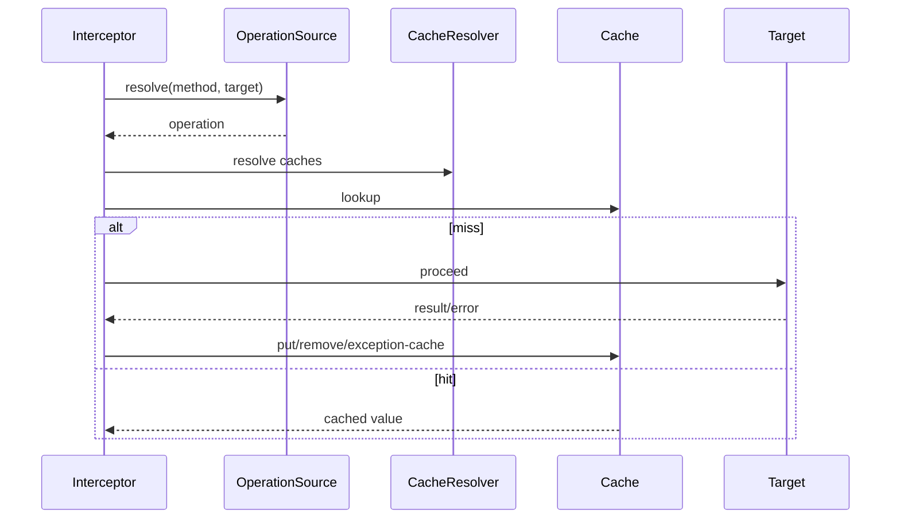

<!-- migration-doc: authority=authoritative canonical=../迁移验收规范.md -->
# spring-context-support → vernal-context-support 语义迁移对照表
> 迁移文档治理：本文级别为 **authoritative**。正文中的历史统计或完成标记不得单独作为验收结论；以 [../迁移验收规范.md](../迁移验收规范.md) 和自动审计报告为准。

<!-- current-migration-contract-start -->
## 当前迁移规范执行口径

| 规范项 | 本模块当前要求 |
|---|---|
| 模块 | `vernal-context-support` |
| 来源基线 | `org.springframework` @ `9e8cea3ef8ae02efb7956b071cd7bbef7c22cb82` |
| 当前对象边界 | 78 个对象；不把 `package-info.java`、合并对象或模糊依赖豁免计入完成 |
| 目标根 | `crates/vernal-context-support/src` |
| 目录和文件 | 去掉组织及模块根包，保留末两层；目录/文件 snake_case，一个源对象一个 `.rs` 文件 |
| 类型和方法 | 类型 PascalCase；方法和参数 snake_case，名称与 Java 语义一一对应 |
| 模块文件 | `lib.rs`/`mod.rs` 只含模块文档、声明和显式重导出 |
| 完成口径 | 仅 `IMPLEMENTED`、`DEPENDENCY_REUSED`、`PLATFORM_NA` 计入完成 |
| 红线 | 禁止 stub、兼容文件转引充数、生产 wildcard import、无证据的依赖替代 |
| 注释和测试 | 中文来源注释；正常、失败、边界、顺序、生命周期和并发/取消测试 |

### 当前状态快照

| 状态 | 数量 |
|---|---:|
| `DEPENDENCY_REUSED` | 0 |
| `IMPLEMENTED` | 0 |
| `MISPLACED` | 6 |
| `MISSING` | 39 |
| `PARTIAL` | 0 |
| `PLATFORM_NA` | 0 |
| `STUB` | 0 |
| `UNVERIFIED` | 33 |

### 本文档执行责任

- 本模块必须覆盖：缓存集成、调度与 Quartz、邮件抽象、模板与 UI 支持、依赖组件适配、资源生命周期、跨模块配置。
- 必须记录入口、协作对象、回调顺序、错误传播、资源释放以及异步取消/背压语义。
- 接口相似不能代替行为证据；每个关键语义域都要有正常、失败和边界测试。
<!-- current-migration-contract-end -->

> 基于双方 CodeGraph 索引；对象状态以[生成审计](../migration-audit/vernal-context-support.md)为准。

| Spring 链 | Vernal 候选 | 当前判断 | 必测语义 |
|---|---|---|---|
| `JCacheInterceptor.invoke → JCacheAspectSupport.execute` | JCache interceptor/aspect support | `UNVERIFIED/PARTIAL` | hit/miss、put、remove、异常缓存 |
| `JCacheOperationSource` | annotation/default operation source | `UNVERIFIED` | method/class precedence、key |
| `SchedulerFactoryBean.afterPropertiesSet/start/stop` | scheduler factory/state | `UNVERIFIED/PARTIAL` | startup delay、standby、幂等关闭 |
| `CronTriggerFactoryBean` | cron trigger | `UNVERIFIED` | timezone、misfire、invalid cron |
| `SpringBeanJobFactory` | job construction/injection | `PARTIAL` | scope、property injection、失败 |
| `JavaMailSenderImpl.send` | lettre sender adapter | `MISSING/PARTIAL` | multipart、批量失败、transport |
| `MimeMessageHelper` | MIME builder | `UNVERIFIED` | charset、附件、inline、address |
| `FreeMarkerConfigurationFactory.createConfiguration` | template configuration/loader | `UNVERIFIED` | loader 顺序、encoding、not found |
| `LocalValidatorFactoryBean` | Rust validation adapter | `MISSING` | initialize、message interpolation |
| transaction-aware cache decorator | callback registrar | `UNVERIFIED` | commit 后执行、rollback 不执行 |

现有 `JCacheAspectSupport` 中的清理注释或空实现属于未完成证据；语义表不得将其提升为完整。

---

<!-- restored-detail-from-head: dd20300d16a09200bd8a379ff14db1e2da99b67c -->

## 原详细文档（完整保留）

> 以下正文完整恢复自 Vernal 提交 `dd20300d16a09200bd8a379ff14db1e2da99b67c`。其中历史对象数量、完成状态、
> 路径算法和依赖替代结论如与本文顶部或自动对象台账冲突，以顶部当前结论和
> `docs/migration-audit/` 为准；其 API、设计背景、阶段拆解和测试说明继续保留。

# spring-context-support → vernal-context-support 功能语义迁移对照表

基线：Spring Framework **7.0.8**（spring-context-support）。

迁移原则：**功能语义对齐，实现方式 Rust 化**。
Java 的反射、SPI、FactoryBean、Caffeine 缓存、Quartz 调度、JavaMail 邮件、FreeMarker 模板，
分别映射为：

| Java 侧 | Rust 侧 |
|---------|---------|
| 反射 / ClassLoader | trait 对象 + `Arc<dyn Trait>` |
| SPI / `META-INF/services` | 过程宏 + 显式注册 |
| FactoryBean | 直接构造函数 + `Component` derive |
| Caffeine（Java 高性能本地缓存） | **moka**（Rust 等价物） |
| JCache / JSR-107 | **cacache**（content-addressable 缓存） |
| Quartz Scheduler | **tokio-cron-scheduler**（cron 调度） |
| JavaMail / Jakarta Mail | **lettre**（异步邮件） |
| FreeMarker | **tera**（模板引擎） |
| AOP / Advisor / Pointcut | **vernal-aop**（已有的 AOP 模块） |

状态图例：✅ 已迁移并有测试 / 🔶 语义等价但形态不同 / ⬜ 未迁移（路线图）/ 🚫 不迁移 / 🆕 Rust 新增

## 一、缓存抽象（Cache）

| Java 接口/类 | 语义 | Rust 实现 | 状态 |
|---|---|---|---|
| Cache | 缓存读写接口（get/put/evict/clear/lookup） | `Cache` trait | ⬜ |
| CacheManager | 缓存管理器（getCache/getCacheNames） | `CacheManager` trait | ⬜ |
| Cache.ValueWrapper | 缓存值包装器 | `ValueWrapper` struct | ⬜ |
| Cache#get(key, Class<T>) | 按类型读取 | `Cache::get_typed` | ⬜ |
| Cache#get(key, Callable<T>) | 缺失时计算 | `Cache::get_with_loader` | ⬜ |
| Cache#retrieve(key) | 异步读取（Java 8+） | `Cache::get` async | ⬜ |
| Cache#putIfAbsent | 原子 put-if-absent | `Cache::put_if_absent` | ⬜ |
| Cache#evictIfPresent | 条件失效 | `Cache::evict_if_present` | ⬜ |

## 二、事务感知缓存装饰器（Cache Transaction）

| Java 类 | 语义 | Rust 实现 | 状态 |
|---|---|---|---|
| TransactionAwareCacheDecorator | 装饰 Cache：put/evict/clear 延迟到 after-commit | `TransactionAwareCacheDecorator` struct | ⬜ |
| AbstractTransactionSupportingCacheManager | 事务支持缓存管理器基类 | `AbstractTransactionSupportingCacheManager` struct | ⬜ |
| TransactionAwareCacheManagerProxy | 装饰 CacheManager：返回 TransactionAwareCache | `TransactionAwareCacheManagerProxy` struct | ⬜ |
| TransactionSynchronizationManager 回调 | 注册 afterCommit / afterCompletion | `vernal-context::transaction::after_commit` 闭包 | ⬜ |

## 三、Caffeine 缓存适配（moka 后端）

| Java 类 | 语义 | Rust 实现 | 状态 |
|---|---|---|---|
| CaffeineCache | Caffeine 单缓存实例 | `CaffeineCache` struct（包装 `moka::sync::Cache`） | ⬜ |
| CaffeineCacheManager | Caffeine 缓存管理器（动态/静态模式） | `CaffeineCacheManager` struct | ⬜ |
| CaffeineSpec | 字符串配置解析（"maximumSize=10000,expireAfterWrite=5m"） | `CaffeineSpec` struct + parser | 🆕 |
| Caffeine builder | Builder 模式配置 | `CaffeineCacheBuilder` struct | 🆕 |
| AsyncCacheMode | 异步缓存模式 | `AsyncCacheMode` enum | ⬜ |
| CaffeineCacheManager#setAsyncCacheMode | 配置异步模式 | builder method | ⬜ |
| CaffeineCache#setAllowNullValues | 是否允许 null 值 | builder method | ⬜ |

## 四、JCache（JSR-107）适配

| Java 类 | 语义 | Rust 实现 | 状态 |
|---|---|---|---|
| JCacheCache | JCache 单缓存实例 | `JCacheCache` struct | ⬜ |
| JCacheCacheManager | JCache 缓存管理器 | `JCacheCacheManager` struct | ⬜ |
| JCacheManagerFactoryBean | JCache 管理器工厂 | `JCacheManagerFactoryBean` struct | ⬜ |
| JCacheConfigurer | JCache 配置 SPI | `JCacheConfigurer` trait | ⬜ |
| JCacheConfigurerSupport | JCache 配置默认实现 | `JCacheConfigurerSupport` struct | ⬜ |
| ProxyJCacheConfiguration | 代理配置（启用 @CacheResult 等） | `ProxyJCacheConfiguration` struct | ⬜ |
| @CacheResult 注解 | 方法结果缓存 | `#[cache_result]` 过程宏（通过 vernal-aop） | 🔶 形式不同 |
| @CachePut 注解 | 方法执行后写入缓存 | `#[cache_put]` 过程宏 | 🔶 形式不同 |
| @CacheRemove 注解 | 方法执行后失效缓存 | `#[cache_remove]` 过程宏 | 🔶 形式不同 |
| @CacheRemoveAll 注解 | 方法执行后清空缓存 | `#[cache_remove_all]` 过程宏 | 🔶 形式不同 |
| CacheResolver | 缓存名解析器 | `CacheResolver` trait | ⬜ |
| ExceptionCacheResolver | 异常缓存解析器 | `ExceptionCacheResolver` trait | ⬜ |

> 注：JCache 注解驱动拦截器大幅精简，只保留核心 trait + 1-2 个实现。完整 19 个 Spring 拦截器类合并到 11 个 Rust 文件。

## 五、调度（Scheduling Quartz → tokio-cron-scheduler）

| Java 类 | 语义 | Rust 实现 | 状态 |
|---|---|---|---|
| Scheduler | Quartz 调度器（启动/暂停/恢复/停止） | `tokio_cron_scheduler::JobScheduler` | ⬜ |
| SchedulerFactoryBean | Spring 工厂 Bean，启动/停止调度器 | `SchedulerFactoryBean` struct | ⬜ |
| SchedulerAccessor | 调度器访问抽象 | `SchedulerAccessor` trait | ⬜ |
| JobDetail | 任务详情 | `Job` trait + `JobDetail` struct | ⬜ |
| JobDetailFactoryBean | 任务详情工厂 | `JobDetailFactoryBean` struct | ⬜ |
| Trigger | 触发器（SimpleTrigger / CronTrigger） | `Trigger` enum | ⬜ |
| SimpleTriggerFactoryBean | 简单触发器工厂 | `SimpleTriggerFactoryBean` struct | ⬜ |
| CronTriggerFactoryBean | Cron 触发器工厂 | `CronTriggerFactoryBean` struct | ⬜ |
| MethodInvokingJobDetailFactoryBean | 方法调用任务工厂 | `MethodInvokingJobDetailFactoryBean` struct | ⬜ |
| AdaptableJobFactory | 可适配任务工厂 | `AdaptableJobFactory` trait | ⬜ |
| SpringBeanJobFactory | Spring Bean 任务工厂 | `SpringBeanJobFactory` struct | ⬜ |
| QuartzJobBean | Quartz 任务基类 | `QuartzJob` trait | ⬜ |
| DelegatingJob | 委托任务 | `DelegatingJob` struct | ⬜ |
| SchedulerContextAware | 调度器上下文感知 | `SchedulerContextAware` trait | ⬜ |
| LocalDataSourceJobStore | 本地数据源任务存储 | `LocalDataSourceJobStore` struct | ⬜ |
| LocalTaskExecutorThreadPool | 本地任务执行器线程池 | `LocalTaskExecutorThreadPool` struct | ⬜ |
| SimpleThreadPoolTaskExecutor | 简单线程池 | `SimpleThreadPoolTaskExecutor` struct | ⬜ |
| ResourceLoaderClassLoadHelper | 资源加载助手 | `ResourceLoaderClassLoadHelper` struct | ⬜ |
| JobMethodInvocationFailedException | 任务调用失败异常 | `JobMethodInvocationFailedException` struct | ⬜ |

## 六、邮件（Mail → lettre）

### 6.1 抽象层（org.springframework.mail）

| Java 接口/类 | 语义 | Rust 实现 | 状态 |
|---|---|---|---|
| MailSender | 邮件发送器（send SimpleMailMessage） | `MailSender` trait | ⬜ |
| MailMessage | 邮件消息接口 | `MailMessage` trait | ⬜ |
| SimpleMailMessage | 简单邮件消息（from/to/subject/text） | `SimpleMailMessage` struct | ⬜ |
| MailException | 邮件异常基类 | `MailError` enum | ⬜ |
| MailParseException | 邮件解析异常 | `MailParseError` struct | ⬜ |
| MailPreparationException | 邮件准备异常 | `MailPreparationError` struct | ⬜ |
| MailSendException | 邮件发送异常 | `MailSendError` struct | ⬜ |
| MailAuthenticationException | 邮件认证异常 | `MailAuthenticationError` struct | ⬜ |

### 6.2 JavaMail 实现层（org.springframework.mail.javamail）

| Java 类 | 语义 | Rust 实现 | 状态 |
|---|---|---|---|
| JavaMailSender | JavaMail 发送器（支持 MIME） | `JavaMailSender` trait | ⬜ |
| JavaMailSenderImpl | JavaMail 发送器实现（lettre 后端） | `JavaMailSenderImpl` struct | ⬜ |
| MimeMessage | MIME 消息 | `MimeMessage` struct（包装 `lettre::Message`） | ⬜ |
| MimeMessageHelper | MIME 消息助手（from/to/subject/text/html/attachments） | `MimeMessageHelper` struct | ⬜ |
| MimeMessagePreparator | MIME 消息准备回调 | `MimeMessagePreparator` trait（回调） | ⬜ |
| MimeMailMessage | MIME 邮件消息 | `MimeMailMessage` struct | ⬜ |
| SmartMimeMessage | 智能 MIME 消息（保存模式） | `SmartMimeMessage` struct | ⬜ |
| InternetAddressEditor | 邮箱地址属性编辑器 | `InternetAddressEditor` struct | ⬜ |
| ConfigurableMimeFileTypeMap | MIME 文件类型映射 | `ConfigurableMimeFileTypeMap` struct | ⬜ |

## 七、UI 模板（FreeMarker → tera）

| Java 类 | 语义 | Rust 实现 | 状态 |
|---|---|---|---|
| FreeMarkerConfigurationFactory | FreeMarker 配置工厂 | `FreeMarkerConfigurationFactory` struct（包装 `tera::Tera`） | ⬜ |
| FreeMarkerConfigurationFactoryBean | FreeMarker 配置工厂 Bean | `FreeMarkerConfigurationFactoryBean` struct | ⬜ |
| SpringTemplateLoader | Spring 资源加载器适配 | `SpringTemplateLoader` struct | ⬜ |
| FreeMarkerTemplateUtils | FreeMarker 模板工具（process） | `FreeMarkerTemplateUtils` struct | ⬜ |

## 八、与 vernal-context 集成（🆕 Rust 新增）

| Rust 模块 | 说明 | 对应 Java 语义 |
|---|---|---|
| `cache/cache_component.rs` | Cache 组件注册到 vernal-context | Spring `@Component` 注解 |
| `mail/mail_component.rs` | MailSender 组件注册 | Spring `@Component` 注解 |
| `scheduling/quartz/scheduler_lifecycle.rs` | Scheduler 与 ApplicationContext 生命周期集成 | `SmartLifecycle.start/stop` |
| `ui/freemarker/freemarker_component.rs` | FreeMarker 配置工厂 Bean 注册 | `FactoryBean<T>` |

## 九、不迁移的 Java 特有功能

| Java 类 | 原因 | Rust 替代 |
|---|---|---|
| JavaMailMimeTypesRuntimeHints | GraalVM 原生镜像提示 | Rust 不需要 |
| SchedulerFactoryBeanRuntimeHints | GraalVM 原生镜像提示 | Rust 不需要 |
| BeanFactoryJCacheOperationSourceAdvisor | Spring AOP Advisor | vernal-aop trait |
| JCacheOperationSourcePointcut | Spring AOP Pointcut | vernal-aop trait |
| Cache$Function（函数式接口） | Java 8 函数式接口 | Rust 闭包 |
| Quartz JDBC 集群模式 | 依赖外部数据库 | 仅支持单机模式 |
| Quartz RMI 远程调度 | Java RMI 特有 | 不实现 |
| JavaMail Session JNDI 绑定 | Java EE 特有 | 直接构造 Session |

## 十、Rust 侧新增功能

| Rust 模块 | 说明 | 对应 Java 语义 |
|---|---|---|
| `cache/caffeine/caffeine_spec.rs` | CaffeineSpec 字符串解析 | 内部工具 |
| `cache/caffeine/caffeine_cache_builder.rs` | Caffeine builder 模式 | 内部 builder |
| `cache/caffeine/moka_adapters.rs` | moka ↔ Cache trait 适配 | 公开 trait |
| `mail/javamail/lettre_adapters.rs` | lettre ↔ MailSender trait 适配 | 公开 trait |
| `cache/cache_component.rs` | 缓存组件注册到 IoC | Spring `@Component` |
| `mail/mail_component.rs` | 邮件组件注册 | Spring `@Component` |
| `scheduling/quartz/scheduler_lifecycle.rs` | 调度器生命周期 | `SmartLifecycle` |
| `ui/freemarker/freemarker_component.rs` | 模板组件注册 | `FactoryBean` |

---

## 测试基线

- `vernal-context-support`：待建立
- 目标：`Cache` trait 至少 1 个 mock 实现测试
- 目标：`TransactionAwareCacheDecorator` 至少 3 测试（立即 / 提交后 / 回滚）
- 目标：`CaffeineCacheManager` 至少 3 测试（动态 / 静态 / 异步）
- 目标：`SchedulerFactoryBean` 至少 5 测试（启动 / 暂停 / 恢复 / 停止 / 生命周期）
- 目标：`JavaMailSender` 至少 3 测试（纯文本 / HTML / 附件）
- 目标：`FreeMarkerConfigurationFactoryBean` 至少 2 测试（模板加载 / 多路径）
- 目标：与 vernal-context 集成测试 6 个（每个子模块至少 1 个）
