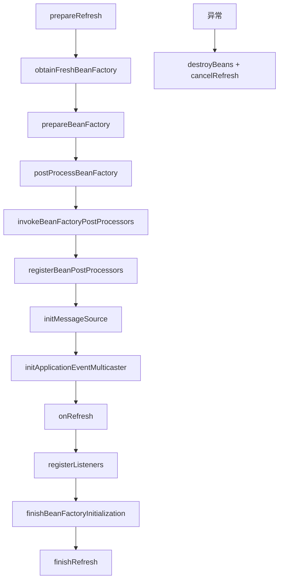

<!-- migration-doc: authority=authoritative canonical=../迁移验收规范.md -->
# spring-context → vernal-context 技术要求
> 迁移文档治理：本文级别为 **authoritative**。正文中的历史统计或完成标记不得单独作为验收结论；以 [../迁移验收规范.md](../迁移验收规范.md) 和自动审计报告为准。


> 当前文档。对象事实以[自动审计](../migration-audit/vernal-context.md)为准；统一路径和验收规则见[迁移验收规范](../迁移验收规范.md)。

## 当前事实

- 审计范围：`spring-context/src/main/java/org/springframework/context`。
- Java 业务对象 196 个：`IMPLEMENTED=0`、`MISPLACED=3`、`MISSING=190`、`UNVERIFIED=3`。
- `vernal-context` 当前已有 Application builder、事件总线、生命周期协调、任务监督等 Rust 原生能力，
  但非同名对象、不同路径或缺少 Spring 语义证据时不能计入 196 对象完成。

## 目标目录

```text
crates/vernal-context/src/
├── annotation/
├── aot/
├── config/
├── event/
├── expression/
├── i18n/
├── index/
├── support/
├── weaving/
└── <context 根对象>.rs
```

例如：

- `context/event/SimpleApplicationEventMulticaster.java` → `event/simple_application_event_multicaster.rs`
- `context/support/AbstractApplicationContext.java` → `support/abstract_application_context.rs`
- `context/annotation/ConfigurationClassPostProcessor.java` → `annotation/configuration_class_post_processor.rs`

## Spring 刷新语义

CodeGraph 确认 `AbstractApplicationContext.refresh` 是有序事务式流程：



Rust 可以采用 builder/startup coordinator，但必须证明：

- 阶段顺序、失败回滚和状态转换对应；
- BeanFactoryPostProcessor 与 BeanPostProcessor 在实例化前后位置正确；
- early event、listener 注册、事件多播和错误策略一致；
- singleton 初始化、Lifecycle 启动、关闭/销毁顺序可重复且并发安全；
- AOP plan 构建发生在业务调用前，不能替代 Spring Context 对象文件台账。

## Vernal 现有链

CodeGraph 显示 `ApplicationContextBuilder::build` 收集组件、listener、advisor 和运行计划；
`ApplicationStartupCoordinator` 与 `ApplicationCloseCoordinator` 管理生命周期；
`ApplicationContext` 向 Web 请求作用域暴露 Beans container。它们是有价值的 Rust 原生能力，
但需在语义表中逐链对照，而不是统一标为 Spring 对象完成。

## 文件和质量门禁

- 一个 Java 对象一个真实文件，末两层目录对齐。
- `application_context_event.rs`、`event_listener_registration.rs`、`resource/resource.rs`
  等多公开对象文件必须拆分。
- 每个 pub API 有中文参数、返回和错误说明，并标注 Java 来源。
- refresh 每阶段、失败回滚、事件顺序、生命周期关闭必须有集成测试。

## 验收

```bash
python3 scripts/audit_migration_docs.py --module vernal-context --check
cargo test -p vernal-context
cargo clippy -p vernal-context --all-targets -- -D warnings
```

---

<!-- restored-detail-from-head: dd20300d16a09200bd8a379ff14db1e2da99b67c -->

## 原详细文档（完整保留）

> 以下正文完整恢复自 Vernal 提交 `dd20300d16a09200bd8a379ff14db1e2da99b67c`。其中历史对象数量、完成状态、
> 路径算法和依赖替代结论如与本文顶部或自动对象台账冲突，以顶部当前结论和
> `docs/migration-audit/` 为准；其 API、设计背景、阶段拆解和测试说明继续保留。

# vernal-context 技术要求文档

> **对标**：Spring Framework `spring-context`（应用上下文模块）
> **版本**：v1.0（2026-07-28）
> **现状**：87 文件 / 10,850 行 Rust 代码
> **工具链**：edition 2024 / rustc 1.88
> **引用约定**：`docs/Spring-组件替换约定.md`（v1.5）

---

## 一、模块定位与架构概览

### 1.1 对标关系

`vernal-context` 是 Vernal Framework 的应用上下文模块，对标 Spring Framework
`spring-context`。它组合 IoC 容器（`vernal-beans`）与 Tokio 异步运行时，提供完整
的应用生命周期编排、事件总线、环境配置、条件装配和定时任务能力。

| Spring 模块 | vernal-context 对应 | 说明 |
|:---|:---|:---|
| `ApplicationContext` | `ApplicationContext` | 应用上下文门面 |
| `ConfigurableApplicationContext` | `ApplicationContext`（合并） | 可配置上下文，Rust 不需要独立接口 |
| `AbstractApplicationContext` | `ApplicationStartupCoordinator` + `ApplicationCloseCoordinator` | 启动与关闭协调器 |
| `ApplicationEvent` | `ApplicationContextEvent` trait | 事件基类契约 |
| `ApplicationListener` | `ApplicationEventListener<E>` trait | 强类型事件监听器 |
| `ApplicationEventPublisher` | `EventBus` | 类型化事件总线 |
| `Lifecycle` / `SmartLifecycle` | `Lifecycle` trait（合并） | 异步组件生命周期 |
| `LifecycleProcessor` | `LifecycleProcessor` trait | 生命周期协调器 |
| `Environment` / `PropertySources` | `ApplicationEnvironment` + `PropertySource` trait | 属性来源与 Profile |
| `MessageSource` | 未实现 | i18n 计划在 `vernal-context-support` 中实现 |
| `@Configuration` / `@Bean` | `ApplicationModule` trait + `ConditionalComponentModule` | 过程宏替代注解 |
| `@Conditional` / `@Profile` | `ComponentCondition` trait + `ProfileCondition` | 条件装配 |
| `ApplicationRunner` / `CommandLineRunner` | `ApplicationRunner` trait | 一次性启动任务 |
| `@Scheduled` | `ScheduledTask` trait | 周期任务 |

### 1.2 依赖关系

```toml
[dependencies]
serde = { workspace = true }
tokio = { workspace = true }
tokio-util = { workspace = true }
vernal-aop = { path = "../vernal-aop" }
vernal-core = { path = "../vernal-core" }
vernal-beans = { path = "../vernal-beans" }
vernal-expression = { path = "../vernal-expression" }
```

`vernal-context` 依赖四个内部 crate：`vernal-beans`（IoC 容器）、`vernal-core`
（共享基础类型）、`vernal-aop`（面向切面编程）和 `vernal-expression`（表达式引擎）。
外部依赖仅 `serde`（序列化）、`tokio`（异步运行时）和 `tokio-util`（取消令牌）。

### 1.3 关键设计决策

| 决策 | 选择 | 原因 |
|:---|:---|:---|
| 运行时 | Tokio-first | Rust 异步生态主流，edition 2024 原生支持 |
| 事件总线 | `tokio::sync::broadcast` | 无外部依赖，背压语义明确 |
| 依赖图 | `vernal-beans` 内部图 | 已有 petgraph 集成，不重复引入 |
| 父上下文 | 不实现 | 单一 `ApplicationContext`，不支持 parent 链 |
| 过程宏 | 不在本 crate | `@Configuration` 等注解由上层宏 crate 替代 |
| `unsafe` | `#![forbid(unsafe_code)]` | workspace 硬约束 |

### 1.4 模块文件结构

```
vernal-context/src/
├── lib.rs                          # 模块声明与 re-export
├── application_context.rs          # ApplicationContext 门面
├── application_context_builder.rs  # 低层 Context 建造器
├── vernal_application_builder.rs   # 高层应用建造器（11 类内建组件）
├── application_startup_coordinator.rs  # 启动协调器（refresh/start/pause/restart）
├── application_close_coordinator.rs    # 关闭协调器（drain/stop/close）
├── context_state.rs                # 显式状态机（11 个状态）
├── context_resources.rs            # 内建资源聚合
├── event_bus.rs                    # 类型化事件总线
├── application_context_event.rs    # 事件基类契约
├── application_event_listener.rs   # 监听器契约
├── payload_application_event.rs    # 载荷事件
├── component_lifecycle.rs          # Lifecycle trait
├── lifecycle_processor.rs          # LifecycleProcessor trait
├── lifecycle_phase.rs              # 生命周期阶段枚举
├── lifecycle_execution_policy.rs   # 钩子执行预算
├── lifecycle_future.rs             # 生命周期 Future 类型别名
├── application_environment.rs      # 应用环境
├── application_environment_builder.rs  # 环境建造器
├── property_source.rs              # PropertySource trait
├── map_property_source.rs          # Map 实现
├── environment_snapshot.rs         # 环境诊断快照
├── configuration_properties.rs     # 类型安全配置绑定
├── component_condition.rs          # 条件装配契约
├── profile_condition.rs            # Profile 条件
├── property_condition.rs           # 属性条件
├── predicate_condition.rs          # 谓词条件
├── expression_condition.rs         # 表达式条件
├── conditional_component_module.rs # 条件组件模块
├── configuration_phase.rs          # 配置阶段枚举
├── application_module.rs           # 应用模块契约
├── application_module_registrar.rs # 模块注册器
├── application_runner.rs           # 一次性启动任务契约
├── scheduled_task.rs               # 周期任务契约
├── task_schedule.rs                # 调度计划
├── task_schedule_mode.rs           # 调度模式
├── async_task.rs                   # 通用后台任务 trait
├── managed_task_supervisor.rs      # 任务监督器
├── managed_task_registry.rs        # 任务注册表
├── startup_report.rs               # 启动诊断报告
├── startup_observation.rs          # 启动观察记录
├── application_ready_event.rs      # 就绪事件
├── application_refreshed_event.rs  # 刷新完成事件
├── application_paused_event.rs     # 暂停事件
├── application_shutdown_signal.rs  # 关闭信号枚举
├── system_shutdown_signal_listener.rs  # 系统信号监听器
├── value_binding.rs                # @Value 注解等价物
└── ... (错误类型、诊断、任务策略等)
```

---

## 二、ApplicationContext 与生命周期状态机

### 2.1 ApplicationContext 结构

`ApplicationContext` 是面向调用方的轻量门面，不直接持有可变生命周期流程。内部通过
两个协调器分工：

- **`ApplicationStartupCoordinator`**：负责 `refresh` / `initialize` / `start` /
  `pause` / `restart`，在独立 Tokio task 中执行
- **`ApplicationCloseCoordinator`**：负责任务排空与逆序 `stop`，共享同一状态、
  组件栈、取消令牌和诊断报告

```rust
pub struct ApplicationContext {
    startup_coordinator: Arc<ApplicationStartupCoordinator>,
    id: std::sync::Mutex<String>,
    application_name: std::sync::Mutex<String>,
    display_name: std::sync::Mutex<String>,
    parent: std::sync::Mutex<Option<Arc<ApplicationContext>>>,
    startup_date_millis: AtomicU64,
    startup_instant: Instant,
    shutdown_hook_registered: AtomicBool,
}
```

### 2.2 状态机（ContextState）

`ContextState` 是显式枚举状态机，对标 Spring `ConfigurableApplicationContext` 的
`isActive()` + `isClosed()` 语义，并新增 `Pausing` / `Paused` 以承载 Spring 7.0
引入的 `pause()` / `restart()` 钩子。

```
Created → Refreshing → Refreshed → Starting → Ready
                                                  ↓
                                             Pausing → Paused
                                                  ↓
                                            restart → Starting → Ready
                                                  ↓
                                            Draining → Closed
失败路径：RollingBack → Closed / Failed → Closed
```

| 状态 | 含义 | 对标 Spring |
|:---|:---|:---|
| `Created` | 已创建，尚未解析组件 | `isActive() == false` |
| `Refreshing` | 正在预热容器并初始化组件 | `isActive() == true` |
| `Refreshed` | 组件已初始化，尚未启动 | `isActive() == true` |
| `Starting` | 正在启动组件 | `isActive() == true` |
| `Ready` | 所有组件已启动，可接收流量 | `isActive() == true` |
| `Pausing` | 正在暂停可暂停组件 | `isActive() == true` |
| `Paused` | 可暂停组件已暂停 | `isActive() == true` |
| `RollingBack` | 启动失败，正在逆序回滚 | `isActive() == true` |
| `Draining` | 已请求关闭，正在排空 | `isActive() == true` |
| `Failed` | refresh 失败但尚未完成关闭 | `isActive() == false` |
| `Closed` | 资源已释放 | `isClosed() == true` |

### 2.3 生命周期方法

| 方法 | Spring 对标 | 行为 |
|:---|:---|:---|
| `refresh()` | `ConfigurableApplicationContext#refresh()` | 预热单例、解析并初始化生命周期组件 |
| `start()` | `LifecycleProcessor#onRefresh()` | 按依赖顺序启动组件、执行 Runner、激活周期任务 |
| `pause()` | `ConfigurableApplicationContext#pause()` | 只停止 `is_pauseable() == true` 的组件 |
| `restart()` | `ConfigurableApplicationContext#restart()` | 重新启动此前被暂停的组件 |
| `close()` | `ConfigurableApplicationContext#close()` | 幂等关闭，排空任务并逆序停止全部组件 |
| `run_until_cancelled()` | — | 等待取消信号后执行关闭 |
| `run_until_shutdown_signal()` | — | 等待 OS 信号或内部取消后执行关闭 |

### 2.4 取消安全设计

所有生命周期方法都在独立 Tokio task 中执行。调用方取消等待 Future 只会丢弃一次性
结果接收端；实际操作由协调器持有，不会因调用方取消而中断。多个并发调用者共享同一
可克隆结果，不会重复执行生命周期钩子。

```rust
// 典型用法
let context = VernalApplicationBuilder::new(runtime_handle)
    .register_module(MyModule)?
    .build()?;

context.refresh().await?;
context.start().await?;

// 阻塞等待关闭信号
context.run_until_shutdown_signal().await?;
```

### 2.5 ApplicationContext 元数据方法

对标 Spring `ApplicationContext` 的元数据查询接口：

| 方法 | Spring 对标 | 默认值 |
|:---|:---|:---|
| `id()` / `set_id()` | `getId()` / `setId()` | `vernal-context-{epoch_millis}` |
| `application_name()` | `getApplicationName()` | 空字符串 |
| `display_name()` | `getDisplayName()` | `vernal-context` |
| `parent()` | `getParent()` | `None`（不实现父子嵌套） |
| `startup_date()` | `getStartupDate()` | epoch 毫秒 |
| `is_active()` | `isActive()` | 基于状态机判断 |
| `is_closed()` | `isClosed()` | 基于状态机判断 |
| `bean_factory()` | `getBeanFactory()` | 返回 `&Container` |
| `environment()` | `getEnvironment()` | 返回 `&ApplicationEnvironment` |
| `events()` | — | 返回 `&EventBus` |

---

## 三、事件系统（ApplicationEvent / EventBus）

### 3.1 事件基类契约

对标 Spring `ApplicationEvent`，vernal 定义 `ApplicationContextEvent` trait：

```rust
pub trait ApplicationContextEvent: Any + Send + Sync + 'static {
    fn source(&self) -> &dyn Any;
    fn timestamp(&self) -> i64;
}
```

`ApplicationContextEventBase` 提供默认实现，封装 `source`（`Arc<dyn Any + Send + Sync>`）
和 `timestamp`（`SystemTime::now()` 毫秒值）。事件类型可以选择实现 trait 暴露
source/timestamp，也可以是裸 struct/enum。

### 3.2 EventBus（事件总线）

`EventBus` 是按事件 Rust 类型隔离的 Tokio 广播总线，每个 `ApplicationContext` 拥有
独立实例，不使用进程级静态注册表。

```rust
pub struct EventBus {
    capacity: NonZeroUsize,                    // 默认 64
    senders: RwLock<HashMap<TypeId, Box<dyn Any + Send + Sync>>>,
    runtime_listeners: Mutex<HashMap<String, RuntimeRegistration>>,
    typed_listeners: Mutex<Vec<TypedListenerEntry>>,
}
```

核心 API：

| 方法 | 说明 |
|:---|:---|
| `subscribe::<T>()` | 订阅一种事件类型，返回 `broadcast::Receiver<Arc<T>>` |
| `publish(event)` | 向所有同类型订阅方发布事件，返回接收方数量 |
| `publish_payload(source, payload)` | 包装成 `PayloadApplicationEvent<T>` 广播 |
| `subscriber_count::<T>()` | 返回指定事件类型的当前订阅方数量 |
| `add_application_listener()` | 运行时注册监听器 |
| `remove_application_listener()` | 运行时移除监听器 |

事件以 `Arc<T>` 广播，多个订阅方共享只读值。慢订阅方遵循 Tokio broadcast 的
lagged 语义，由消费方显式处理。

### 3.3 ApplicationEventListener（监听器契约）

对标 Spring `SmartApplicationListener` + `GenericApplicationListener`：

```rust
pub trait ApplicationEventListener<E>: Send + Sync + 'static
where
    E: Any + Send + Sync + 'static,
{
    type Error: Error + Send + Sync + 'static;

    fn on_event(&self, event: Arc<E>) -> impl Future<Output = Result<(), Self::Error>> + Send;
    fn name(&self) -> &'static str { ... }
    fn supports_event_type(&self, _event_type: TypeId) -> bool { true }
    fn supports_source(&self, _source_type: Option<TypeId>) -> bool { true }
    fn listener_id(&self) -> &'static str { "" }
    fn order(&self) -> i32 { i32::MAX }
}
```

监听器必须作为 Singleton 注册到 IoC。Vernal 在 `refresh()` 阶段先建立 Tokio
broadcast 订阅，再初始化生命周期组件，确保初始化阶段发布的事件也不会错过。

### 3.4 PayloadApplicationEvent（载荷事件）

对标 Spring 7.0 `PayloadApplicationEvent<T>`。调用方传入 source 与 payload，
EventBus 包装成 `PayloadApplicationEvent<T>` 并按该类型广播。订阅方需要订阅
`PayloadApplicationEvent<T>` 而不是裸 `T`。

```rust
// 发布
bus.publish_payload(source_arc, "order-42").await;
// 订阅
let mut rx = bus.subscribe::<PayloadApplicationEvent<String>>().await;
```

### 3.5 内建事件类型

| 事件 | 触发时机 | 对标 Spring |
|:---|:---|:---|
| `ApplicationRefreshedEvent` | refresh 完成 | `ContextRefreshedEvent` |
| `ApplicationReadyEvent` | 全部启动完成，进入 Ready | `ApplicationReadyEvent`（Spring Boot） |
| `ApplicationPausedEvent` | pause 完成 | — （Spring 7.0 新增） |
| `ApplicationShutdownSignal` | OS 关闭信号到达 | — |

---

## 四、Lifecycle 组件与任务编排

### 4.1 Lifecycle trait（组件生命周期）

合并 Spring `Lifecycle` + `SmartLifecycle` 的完整语义：

```rust
pub trait Lifecycle: Send + Sync + 'static {
    fn name(&self) -> &'static str;
    fn initialize(&self) -> LifecycleFuture<'_>;
    fn start(&self, _cancellation: CancellationToken) -> LifecycleFuture<'_>;
    fn stop(&self) -> LifecycleFuture<'_>;
    fn stop_with_callback(&self, callback: Arc<dyn Fn() + Send + Sync>) -> LifecycleFuture<'_>;
    fn pause(&self) -> LifecycleFuture<'_>;
    fn is_pauseable(&self) -> bool { true }
    fn is_auto_startup(&self) -> bool { true }
    fn phase(&self) -> i32 { i32::MAX }
}
```

| 钩子 | Spring 对标 | 说明 |
|:---|:---|:---|
| `initialize()` | Bean 初始化后回调 | 单例构造完成后的异步初始化 |
| `start(token)` | `SmartLifecycle#start()` | 启动组件，监听取消令牌 |
| `stop()` | `SmartLifecycle#stop()` | 释放资源 |
| `stop_with_callback()` | `SmartLifecycle#stop(Runnable)` | 异步 stop 完成后调用回调 |
| `pause()` | `SmartLifecycle#isPauseable()` 钩子 | 暂停但不释放资源 |
| `is_pauseable()` | `SmartLifecycle#isPauseable()` | 是否参与 pause/restart 序列 |
| `is_auto_startup()` | `SmartLifecycle#isAutoStartup()` | 是否在 refresh 阶段自动启动 |
| `phase()` | `SmartLifecycle#getPhase()` | 同层启动排序，值越小越先启动 |

### 4.2 LifecycleProcessor trait

对标 Spring `LifecycleProcessor`，提供 `is_running()` / `on_refresh()` /
`on_close()` / `on_restart()` / `on_pause()` 回调。vernal 的默认实现由
`ApplicationStartupCoordinator` + `ApplicationCloseCoordinator` 组合提供。

### 4.3 ApplicationRunner（一次性启动任务）

对标 Spring `ApplicationRunner` / `CommandLineRunner`：

```rust
pub trait ApplicationRunner: Send + Sync + 'static {
    type Error: Error + Send + Sync + 'static;
    fn run(&self, cancellation: CancellationToken)
        -> impl Future<Output = Result<(), Self::Error>> + Send;
    fn name(&self) -> &'static str;
}
```

Runner 在全部 Lifecycle `start()` 成功后、Context 提交 `Ready` 前按依赖计划串行
执行。适合缓存预热、投影恢复、工具索引加载等一次性工作。任一错误、panic、超时或
应用取消都会阻止后续 Runner，取消应用并逆序回滚。

### 4.4 ScheduledTask（周期任务）

对标 Spring `@Scheduled`：

```rust
pub trait ScheduledTask: Send + Sync + 'static {
    type Error: Error + Send + Sync + 'static;
    fn schedule(&self) -> TaskSchedule;
    fn run(&self, cancellation: CancellationToken)
        -> impl Future<Output = Result<(), Self::Error>> + Send;
    fn name(&self) -> &'static str;
}
```

`TaskSchedule` 描述调度计划：

| 模式 | 说明 | 对标 Spring |
|:---|:---|:---|
| `fixed_delay(interval)` | 上次完成后等待固定间隔 | `@Scheduled(fixedDelay=...)` |
| `fixed_delay_after(delay, interval)` | 带初始延迟的固定延迟 | `@Scheduled(initialDelay=..., fixedDelay=...)` |
| `fixed_rate(interval)` | 固定时间轴触发，过慢时跳过 | `@Scheduled(fixedRate=...)` |
| `fixed_rate_after(delay, interval)` | 带初始延迟的固定频率 | `@Scheduled(initialDelay=..., fixedRate=...)` |

同一个 `ScheduledTask` 不会并发重入；不同任务可以并发。任一次执行返回错误、
panic 或异常取消都会触发应用取消。

### 4.5 AsyncTask（通用后台任务）

对标 tx_di 的 `Component::async_run`。与 `ScheduledTask` 的区别：

| 特性 | AsyncTask | ScheduledTask |
|:---|:---|:---|
| 执行模式 | 长期运行，不退出 | 周期执行，每次运行后等待 |
| 退出条件 | 取消令牌被取消 | 单次执行完成 |
| 典型用途 | 消息消费、连接监听 | 定时清理、数据同步 |

### 4.6 ManagedTaskSupervisor（任务监督器）

持有应用后台 Tokio 任务并统一传播失败、取消与停机结果：

```rust
pub struct ManagedTaskSupervisor {
    runtime: Arc<Handle>,
    cancellation: Arc<CancellationToken>,
    registry: Mutex<ManagedTaskRegistry>,
    idle: Notify,
    shutdown_result: watch::Sender<Option<ShutdownResult>>,
}
```

核心能力：

- `spawn(name, future)`：提交后台任务，返回 `ManagedTaskId`
- `spawn_with_timeout(name, timeout, future)`：带超时的任务派生
- `cancellation_token()`：派生子令牌供单个任务监听
- `shutdown(policy)`：两阶段停机（优雅等待 + 强制 abort）
- 任一任务返回错误、panic 或异常取消时自动取消应用令牌

### 4.7 停机策略

`TaskShutdownPolicy` 定义两阶段停机预算：

1. **优雅阶段**：取消令牌后等待任务自行退出（默认 30 秒）
2. **强制阶段**：向存活任务发送 Tokio abort，等待清理（默认 10 秒）

`LifecycleExecutionPolicy` 定义单个生命周期钩子的执行与 abort 收口预算。

---

## 五、Environment 与条件装配

### 5.1 ApplicationEnvironment（应用环境）

对标 Spring `Environment` + `PropertySources`。Context-local、不可变且按优先级
解析：

```rust
pub struct ApplicationEnvironment {
    sources: Arc<[Arc<dyn PropertySource>]>,
    active_profiles: Arc<[String]>,
    default_profiles: Arc<[String]>,
}
```

核心 API：

| 方法 | Spring 对标 | 说明 |
|:---|:---|:---|
| `property(key)` | `getProperty()` | 按优先级读取并展开 `${key:default}` |
| `raw_property(key)` | — | 读取未展开占位符的原始值 |
| `get::<T>(key)` | `getProperty(key, Class)` | 解析为指定 Rust 类型 |
| `require::<T>(key)` | — | 必需属性，缺失时返回错误 |
| `contains_property(key)` | `containsProperty()` | 判断属性是否存在 |
| `active_profiles()` | `getActiveProfiles()` | 显式启用的 Profile |
| `default_profiles()` | `getDefaultProfiles()` | 默认 Profile |
| `effective_profiles()` | — | 实际生效的 Profile |
| `is_profile_active(profile)` | `acceptsProfiles()` | 判断 Profile 是否生效 |

### 5.2 PropertySource trait（属性来源）

向 `ApplicationEnvironment` 提供字符串属性的框架中立端口：

```rust
pub trait PropertySource: Send + Sync + 'static {
    fn name(&self) -> &str;
    fn get(&self, key: &str) -> Result<Option<String>, EnvironmentError>;
}
```

Vernal 只定义来源优先级与解析语义，不直接依赖 TOML、YAML、环境变量、Nacos 或
Hutool `.setting`。适配器实现本 trait 暴露数据。`MapPropertySource` 提供基于
`HashMap` 的默认实现。

### 5.3 占位符解析

`ApplicationEnvironment::property()` 支持 `${key}` 和 `${key:default}` 占位符
展开，支持嵌套（最大深度 32），检测循环引用。展开使用相同优先级规则，高优先级
来源返回值后不继续访问低优先级来源。

### 5.4 ConfigurationProperties（类型安全配置）

对标 Spring `@ConfigurationProperties`：

```rust
pub trait ConfigurationProperties: Any + Send + Sync + Sized {
    const PREFIX: &'static str;
    fn bind(environment: &ApplicationEnvironment) -> Result<Self, ConfigurationPropertiesError>;
    fn bind_with_prefix(environment: &ApplicationEnvironment, prefix: &str)
        -> Result<Self, ConfigurationPropertiesError>;
    fn component_definition() -> ComponentDefinition;
}
```

配置对象注册为普通 Singleton，依赖 `ApplicationEnvironment`。`refresh()` 阶段
预热全部 Singleton，配置绑定在进入 `Refreshed` 前完成并快速失败。

### 5.5 条件装配（ComponentCondition）

对标 Spring `@Conditional`：

```rust
pub trait ComponentCondition: Send + Sync + 'static {
    fn name(&self) -> &'static str;
    fn matches(&self, environment: &ApplicationEnvironment) -> Result<bool, BoxError>;
}
```

内建条件类型：

| 条件 | 对标 Spring | 说明 |
|:---|:---|:---|
| `ProfileCondition` | `@Profile` | `any` / `all` / `none` 三种模式 |
| `PropertyCondition` | `@ConditionalOnProperty` | 属性值匹配 |
| `ExpressionCondition` | `@ConditionalOnExpression` | 表达式求值 |
| `PredicateCondition` | — | 自定义闭包谓词 |

### 5.6 ConditionalComponentModule（条件组件模块）

把同一装配条件下的组件定义、Trait Binding、生命周期、监听器、Runner 与任务登记
组成原子模块。模块只有在条件命中时才整体提交到 `RegistryBuilder`，避免半装配
状态。

```rust
pub struct ConditionalComponentModule {
    name: &'static str,
    condition: Arc<dyn ComponentCondition>,
    phase: ConfigurationPhase,  // ParseConfiguration 或 RegisterBean
    definitions: Vec<ComponentDefinition>,
    bindings: Vec<TraitBinding>,
    lifecycle_registrars: Vec<Box<LifecycleRegistrar>>,
    event_listener_registrars: Vec<Box<EventListenerRegistrar>>,
    application_runner_registrars: Vec<Box<ApplicationRunnerRegistrar>>,
    scheduled_task_registrars: Vec<Box<ScheduledTaskRegistrar>>,
}
```

`phase` 字段对标 Spring `ConfigurationCondition#getConfigurationPhase`：
默认 `ParseConfiguration`，可设置为 `RegisterBean`。

### 5.7 ValueBinding（@Value 等价物）

Spring `@Value` 注解的 Rust 等价物。支持三种形式：

- SpEL：`#{expr}` 或裸表达式
- 占位符：`${key}` 或 `${key:default}`
- Bean 名称：直接引用 bean 名称

```rust
pub struct ValueBinding {
    pub expression: String,
    pub field_name: String,
    pub required: bool,
}
```

---

## 六、应用建造器与模块装配

### 6.1 VernalApplicationBuilder（高层应用建造器）

统一收集组件、生命周期、Runner、周期任务、切面和 Tokio Context 资源的建造器。
与接收冻结 `Registry` 的低层 `ApplicationContextBuilder` 不同，该建造器在依赖图
冻结前自动注册十一类框架内建组件：

| 内建组件 | 类型 | 说明 |
|:---|:---|:---|
| Tokio Runtime Handle | `Arc<Handle>` | 应用绑定的运行时 |
| CancellationToken | `Arc<CancellationToken>` | 应用关闭与任务协作取消 |
| ManagedTaskSupervisor | `Arc<ManagedTaskSupervisor>` | 后台任务所有权与失败传播 |
| TaskShutdownPolicy | `Arc<TaskShutdownPolicy>` | 两阶段停机预算 |
| LifecycleExecutionPolicy | `Arc<LifecycleExecutionPolicy>` | 钩子执行与 abort 收口预算 |
| SystemShutdownSignalListener | `Arc<SystemShutdownSignalListener>` | 跨平台 OS 信号监听 |
| ApplicationEnvironment | `Arc<ApplicationEnvironment>` | 不可变属性来源与 Profile |
| EventBus | `Arc<EventBus>` | Context 内类型化事件 |
| ScopeCleanupPolicy | `Arc<ScopeCleanupPolicy>` | 应用 Scope 异步释放策略 |
| InvocationPlanCatalog | `Arc<InvocationPlanCatalog>` | 预编译 AOP 调用计划 |
| LocalInvocationPlanCatalog | `Arc<LocalInvocationPlanCatalog>` | 预编译 Local-AOP 调用计划 |

业务组件可以像依赖普通 Rust 类型一样依赖它们，不需要全局 Service Locator。

### 6.2 ApplicationModule trait（应用模块）

对标 Spring `@Configuration` + `@ComponentScan` 的组合，由应用或消费方 Bridge
实现：

```rust
pub trait ApplicationModule: Sized {
    fn name(&self) -> &'static str;
    fn configure(self, registrar: &mut ApplicationModuleRegistrar) -> Result<(), BoxError>;
}
```

模块通过 `ApplicationModuleRegistrar` 声明组件、Trait Binding、生命周期、事件
监听器、Runner、周期任务、AOP Advisor、Operation、属性来源和条件模块。建造器
先在隔离 Registrar 中执行完整配置，再统一校验并提交；配置或提交失败不会留下半个
模块。

```rust
struct MyModule;

impl ApplicationModule for MyModule {
    fn name(&self) -> &'static str { "my-module" }

    fn configure(self, registrar: &mut ApplicationModuleRegistrar) -> Result<(), BoxError> {
        registrar.register(MyService::definition())?;
        registrar.bind(TraitBinding::new::<dyn MyTrait, MyServiceImpl>())?;
        registrar.lifecycle::<MyLifecycleComponent>()?;
        registrar.event_listener::<MyEvent, MyListener>()?;
        registrar.application_runner::<MyRunner>()?;
        registrar.scheduled_task::<MyScheduledTask>()?;
        Ok(())
    }
}
```

### 6.3 构建流程

`VernalApplicationBuilder::build()` 的执行顺序：

1. **冻结 Environment**：所有条件模块对同一个不可变快照执行一次判断
2. **评估条件模块**：命中模块通过原子 bundle API 提交，未命中模块不留残片
3. **注册内建组件**：十一类框架对象进入依赖图
4. **冻结依赖图**：`RegistryBuilder::build()` 一次性校验
5. **创建 Container**：IoC 拦截器在此解析，Singleton 身份不会因 AOP 装配再创建
6. **编译 AOP 计划**：Pointcut 匹配、拦截器链排序、目录封存
7. **组装 ContextResources**：聚合所有内建资源
8. **创建 ApplicationContext**：按 IoC 依赖计划排序生命周期、监听器、Runner 和任务

### 6.4 launch() 便捷方法

`VernalApplicationBuilder::launch()` 构建应用并以取消安全的方式完成 refresh 与
start：

```rust
pub async fn launch(self) -> Result<Arc<ApplicationContext>, ApplicationLaunchError> {
    let context = Arc::new(self.build()?);
    // 独立 Tokio task 执行 refresh + start
    // 观察任务处理 JoinError 和交接失败
    // 成功返回 Ready 状态的 Arc<ApplicationContext>
}
```

成功返回的 `Arc<ApplicationContext>` 已进入 `Ready` 状态，可直接交给 Web/RPC
Adapter 共享。

### 6.5 启动诊断报告（StartupReport）

可序列化、只读、脱敏的诊断快照：

```rust
pub struct StartupReport {
    framework_version: String,
    minimum_rust_version: String,
    project_status: String,
    context_state: String,
    environment: EnvironmentSnapshot,       // 不含属性键和值
    registry: RegistrySnapshot,
    aop_plan_count: usize,
    aop_interceptor_count: usize,
    local_aop_plan_count: usize,
    local_aop_interceptor_count: usize,
    enabled_features: Vec<String>,
    adapters: Vec<SubsystemStatus>,
    external_dependencies: Vec<SubsystemStatus>,
    condition_evaluations: Vec<ConditionEvaluationSnapshot>,  // 脱敏判断结果
    observations: Vec<StartupObservation>,
    warnings: Vec<String>,                  // 静态、去重、稳定排序
    unused_definitions: Vec<String>,
}
```

报告持有值对象而不是容器或实例；条件模块只保留静态身份与命中状态，不包含配置键
和值。调用 `startup_report()` 时克隆当前快照，后续操作不会修改已获得的报告。

### 6.6 错误体系

| 错误类型 | 场景 |
|:---|:---|
| `ApplicationBuildError` | 建造阶段：条件评估失败、内建组件冲突、依赖图无效 |
| `ApplicationLaunchError` | launch 阶段：构建/refresh/start 失败，携带脱敏 StartupReport |
| `ContextError` | 运行阶段：状态非法、组件解析/初始化/启动/停止失败 |
| `ConditionError` | 条件装配：名称非法、模块重复、评估失败 |
| `EnvironmentError` | 环境配置：属性键非法、占位符循环、类型转换失败 |
| `EventListenerError` | 事件监听器：注册/移除失败 |
| `ManagedTaskError` | 受管任务：派生拒绝、任务失败、panic、停机超时 |
| `ConfigurationPropertiesError` | 配置绑定：字段缺失、类型错误 |

所有错误类型都不包含凭证、Token、请求正文或数据库错误原文，可安全序列化用于
诊断和监控。

---

### 6.7 ContextResources（内建资源聚合）

`ContextResources` 聚合一个 `ApplicationContext` 独占或共享的基础运行资源，只在
Context 内部传递：

```rust
pub(crate) struct ContextResources {
    pub(crate) runtime: Option<Arc<Handle>>,
    pub(crate) cancellation: Arc<CancellationToken>,
    pub(crate) managed_tasks: Option<Arc<ManagedTaskSupervisor>>,
    pub(crate) task_shutdown_policy: Arc<TaskShutdownPolicy>,
    pub(crate) lifecycle_execution_policy: Arc<LifecycleExecutionPolicy>,
    pub(crate) shutdown_signals: Arc<SystemShutdownSignalListener>,
    pub(crate) environment: Arc<ApplicationEnvironment>,
    pub(crate) events: Arc<EventBus>,
    pub(crate) scope_cleanup_policy: Arc<ScopeCleanupPolicy>,
    pub(crate) invocation_plans: Arc<InvocationPlanCatalog>,
    pub(crate) local_invocation_plans: Arc<LocalInvocationPlanCatalog>,
    pub(crate) diagnostics: DiagnosticConfiguration,
}
```

高层应用建造器会把其中的 Tokio Handle、取消令牌、任务监督器、应用环境、事件总线
以及 AOP 计划目录同时注册到 IoC 容器，使业务组件与 Context 使用相同实例。低层
API（`ApplicationContextBuilder::new(registry)`）不隐式捕获 Runtime，`runtime`
字段为 `None`。

### 6.8 ShutdownHook 与系统信号

`ApplicationContext::register_shutdown_hook()` 对标 Spring
`ConfigurableApplicationContext#registerShutdownHook()`。Rust 端通过
`std::sync::at_exit` 实现，调用可多次但只有第一次生效。

`SystemShutdownSignalListener` 封装跨平台 Tokio 信号监听：

| 信号 | 平台 | 枚举值 |
|:---|:---|:---|
| Ctrl-C | 跨平台 | `ApplicationShutdownSignal::Interrupt` |
| SIGTERM | Unix | `ApplicationShutdownSignal::Terminate` |
| SIGHUP | Unix | `ApplicationShutdownSignal::Hangup` |
| Ctrl-Break | Windows | `ApplicationShutdownSignal::Break` |
| 控制台关闭 | Windows | `ApplicationShutdownSignal::Close` |
| 系统关机 | Windows | `ApplicationShutdownSignal::Shutdown` |

OS 信号会先作为 `ApplicationShutdownSignal` 发布到 Context-local EventBus，随后
立即取消应用令牌。事件订阅方不能延迟关闭。

### 6.9 Scope 支持

`ApplicationContext::open_scope::<S>()` 进入绑定当前应用和类型标记 `S` 的根
自定义作用域。Scope 使用应用取消令牌的子令牌：应用关闭会立即阻止新组件解析，但
Scope 所有者仍须显式调用 `ScopeContext::close()` 执行自己的异步关闭钩子。

`ScopeCleanupPolicy` 定义应用 Scope 的有界异步释放策略（默认 30 秒上限），
调用方可在构建阶段显式改为其他上限或无界等待。

### 6.10 AOP 集成

`VernalApplicationBuilder` 支持两类 AOP 顾问注册：

| 类型 | 方法 | 说明 |
|:---|:---|:---|
| Send Advisor | `advisor_component::<I, P>()` | 线程安全拦截器，可跨线程传递 |
| Local Advisor | `local_advisor_component::<I, P>()` | `!Send` 目标 Future，Worker-local |

两类顾问都支持：
- 直接实例注册（`advisor()` / `local_advisor()`）
- IoC 组件注册（`advisor_component()` / `local_advisor_component()`）
- 限定符组件注册（`advisor_component_qualified()` / `local_advisor_component_qualified()`）
- 原子注册（`register_advisor_component()` / `register_local_advisor_component()`）

组件必须声明为 Singleton；Transient 或 Custom Scope 在构建阶段被拒绝。Pointcut
只在应用构建阶段匹配，封存后目录没有修改入口，热路径只执行 Operation 查找和
预排序拦截器链。

---

## 附录 A：Spring 对照速查表

| Spring 概念 | vernal-context 实现 | 文件 |
|:---|:---|:---|
| `ApplicationContext` | `ApplicationContext` | `application_context.rs` |
| `ConfigurableApplicationContext` | `ApplicationContext`（合并） | `application_context.rs` |
| `AbstractApplicationContext.refresh()` | `ApplicationStartupCoordinator` | `application_startup_coordinator.rs` |
| `AbstractApplicationContext.close()` | `ApplicationCloseCoordinator` | `application_close_coordinator.rs` |
| `ApplicationEvent` | `ApplicationContextEvent` trait | `application_context_event.rs` |
| `ApplicationListener` | `ApplicationEventListener<E>` trait | `application_event_listener.rs` |
| `ApplicationEventPublisher` | `EventBus` | `event_bus.rs` |
| `PayloadApplicationEvent` | `PayloadApplicationEvent<T>` | `payload_application_event.rs` |
| `Lifecycle` | `Lifecycle` trait（合并 SmartLifecycle） | `component_lifecycle.rs` |
| `LifecycleProcessor` | `LifecycleProcessor` trait | `lifecycle_processor.rs` |
| `Environment` | `ApplicationEnvironment` | `application_environment.rs` |
| `PropertySources` | `PropertySource` trait + `Vec<Arc<dyn PropertySource>>` | `property_source.rs` |
| `@ConfigurationProperties` | `ConfigurationProperties` trait | `configuration_properties.rs` |
| `@Conditional` | `ComponentCondition` trait | `component_condition.rs` |
| `@Profile` | `ProfileCondition` | `profile_condition.rs` |
| `@Configuration` | `ApplicationModule` trait | `application_module.rs` |
| `@ComponentScan` | 不实现（显式注册） | — |
| `@Bean` | `ComponentDefinition` + `TraitBinding` | `vernal_beans` |
| `@Value` | `ValueBinding` | `value_binding.rs` |
| `ApplicationRunner` | `ApplicationRunner` trait | `application_runner.rs` |
| `CommandLineRunner` | `ApplicationRunner` trait（合并） | `application_runner.rs` |
| `@Scheduled` | `ScheduledTask` trait | `scheduled_task.rs` |
| `MessageSource` | 未实现 | 计划在 `vernal-context-support` |

## 附录 B：未实现 / 待规划

| Spring 概念 | 状态 | 说明 |
|:---|:---|:---|
| `MessageSource`（i18n） | 待规划 | 计划在 `vernal-context-support` 中实现 |
| 父子上下文（HierarchicalBeanFactory） | 不实现 | 单一 `ApplicationContext`，`parent` 字段仅记录引用 |
| `ApplicationEventMulticaster`（自定义） | 不实现 | `EventBus` 使用 Tokio broadcast，不暴露扩展点 |
| `@ComponentScan` | 不实现 | 显式模块注册替代 classpath 扫描 |
| `@Import` / `@ImportResource` | 不实现 | `ApplicationModuleRegistrar` 提供等价能力 |
| `@EventListener`（方法级注解） | 待规划 | 需要过程宏支持 |
| `@Async` | 待规划 | 需要过程宏 + AOP 集成 |
| `@Transactional` | 由 `vernal-tx` 实现 | 不在本 crate 范围 |
