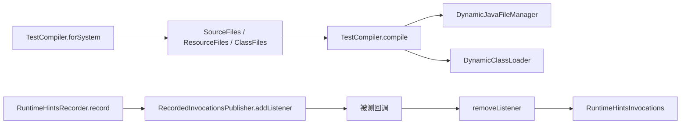

<!-- migration-doc: authority=authoritative canonical=../迁移验收规范.md -->
# spring-core-test → vernal-core-test 技术要求
> 迁移文档治理：本文级别为 **authoritative**。正文中的历史统计或完成标记不得单独作为验收结论；以 [../迁移验收规范.md](../迁移验收规范.md) 和自动审计报告为准。


> 当前文档。验收遵循[迁移验收规范](../迁移验收规范.md)。Spring 基线提交：
>`9e8cea3ef8ae02efb7956b071cd7bbef7c22cb82`。

## 当前事实

- 来源 `spring-core-test/src/main/java/org/springframework` 含 40 个业务对象（已排除 5 个 `package-info.java`）。
- 当前工作区不存在 `crates/vernal-core-test`，因此 40 个对象全部为 `MISSING/PLANNED`。
- `crates/vernal-test/src/context.rs` 的 `TestContext` 是其他测试支持能力，既不同名也不覆盖动态编译、AOT Agent 记录等语义，不能计作迁移完成。
- 本模块尚未加入生成审计清单；在纳入 manifest 前，本目录对象表是临时权威事实源。

## 目标目录

```text
crates/vernal-core-test/src/
├── aot/
│   └── agent/
├── test/
│   ├── agent/
│   ├── generate/
│   └── tools/
├── io/
│   └── support/
└── lib.rs
```

路径示例：

- `aot/agent/RuntimeHintsAgent.java` → `aot/agent/runtime_hints_agent.rs`
- `aot/test/generate/TestGenerationContext.java` → `test/generate/test_generation_context.rs`
- `core/test/tools/TestCompiler.java` → `test/tools/test_compiler.rs`
- `core/test/io/support/MockSpringFactoriesLoader.java` → `io/support/mock_spring_factories_loader.rs`

## 核心语义

CodeGraph 给出的 Spring 主链为：



Rust 不需要复制 `JavaCompiler` 或字节码 Agent；但必须逐对象决定：

- 用 `trybuild`、临时 Cargo 工程或编译器进程实现可观察的测试编译语义；
- 由精确依赖复用并提供符号和集成测试；
- 或记录 JVM Agent/字节码专属证据后标 `PLATFORM_NA`。

## 验收要求

- 新建 crate 后纳入 workspace、manifest 与自动审计。
- 每个非 `PLATFORM_NA` Java 对象有对应真实文件、中文来源注释和语义测试。
- 编译失败诊断、动态资源、隔离 classloader 等需有 Rust 对等错误/隔离模型。
- 当前不得宣称任何对象完成。

---

<!-- restored-detail-from-head: dd20300d16a09200bd8a379ff14db1e2da99b67c -->

## 原详细文档（完整保留）

> 以下正文完整恢复自 Vernal 提交 `dd20300d16a09200bd8a379ff14db1e2da99b67c`。其中历史对象数量、完成状态、
> 路径算法和依赖替代结论如与本文顶部或自动对象台账冲突，以顶部当前结论和
> `docs/migration-audit/` 为准；其 API、设计背景、阶段拆解和测试说明继续保留。

# vernal-core-test 技术要求（对标 spring-core-test）

> **版本**：v1.0（2026-07-28）
> **定位**：vernal-core-test crate 技术交接文档，对标 Spring Framework 6.x 拆分的 spring-core-test 轻量测试工具。
> **主线**：零 ApplicationContext 依赖的轻量测试层，编译期条件宏替代 SpEL。
> **现状**：待建 crate，edition 2024 / rustc 1.88。
> **引用约定**：crate 选型依据见《Spring 组件替换约定》。

---

## 一、总览

### 1.1 定位与边界

vernal-core-test 是 Vernal Framework 的 **轻量测试工具层**，
对标 Spring 6.x 拆分出的 spring-core-test 模块，提供零 ApplicationContext
依赖的条件测试注解和测试工具。

| 维度 | spring-core-test（语义参考） | vernal-core-test（实现） | 差异说明 |
|:---|:---|:---|:---|
| 语言 | Java（注解 + SpEL） | Rust（属性宏 + `#[cfg]`） | 编译期条件替代运行时表达式 |
| 条件注解 | `@EnabledIf` / `@DisabledIf` | `#[cfg]` + `#[enabled_if]` 宏 | 编译期求值，零运行时开销 |
| 表达式 | SpEL | 闭包 / `#[cfg]` 谓词 | Rust 原生，无 DSL 解析 |
| 注解工具 | `TestAnnotationUtils` | 🚫 不迁移 | Rust 无注解反射机制 |
| Context 依赖 | 无 | 无 | 轻量层，零 Context 依赖 |
| 测试元数据 | `TestInfo` / `@Tag` | `#[test_tag]` 宏（待建） | 编译期标签 |

### 1.2 架构分层

```
┌─────────────────────────────────────────────────────┐
│  条件层：#[enabled_if] / #[disabled_if] 属性宏       │
│  → 编译期条件断言 → 条件编译测试函数                   │
├─────────────────────────────────────────────────────┤
│  标签层：#[test_tag] 属性宏（待建）                    │
│  → 测试分类 → cargo test --tag smoke                 │
├─────────────────────────────────────────────────────┤
│  断言层：轻量断言宏（待建）                            │
│  → assert_matches! / assert_contains!               │
├─────────────────────────────────────────────────────┤
│  工具层：测试辅助函数                                 │
│  → 随机数据生成 / 临时目录 / 端口分配                  │
└─────────────────────────────────────────────────────┘
```

### 1.3 关键决策

| 项 | 决策 | 理由 |
|:---|:---|:---|
| 条件求值 | `#[cfg]` + `#[enabled_if]` 闭包 | 编译期求值，零运行时开销 |
| SpEL 替代 | 闭包 / `#[cfg]` 谓词 | Rust 无 SpEL，闭包更自然 |
| 注解反射 | 🚫 不迁移 | Rust 无运行时注解机制 |
| Context 依赖 | 零依赖 | 轻量层核心原则 |
| 表达式 DSL | 不新建 | `#[cfg]` + 闭包已足够 |

### 1.4 命名映射

| Spring 原名 | vernal-core-test 移植名 | 说明 |
|:---|:---|:---|
| `@EnabledIf` | `#[enabled_if]` | 属性宏 + 闭包 |
| `@DisabledIf` | `#[disabled_if]` | 属性宏 + 闭包 |
| `TestAnnotationUtils` | 🚫 不迁移 | Rust 无注解反射 |
| `@Tag` | `#[test_tag]`（待建） | 编译期标签 |
| `@DisplayName` | `#[test_name]`（待建） | 测试显示名 |
| `TestInfo` | `TestMetadata`（待建） | 测试元数据 |

---

## 二、条件测试注解

### 2.1 EnabledIf —— 条件启用测试

**语义参照**：spring-core-test `@EnabledIf`。

#### Spring API（Java）

```java
// spring-core-test 条件启用
@EnabledIf("T(java.lang.Runtime).getRuntime().availableProcessors() > 2")
@Test
void testMultiCore() { ... }

@EnabledIf(expression = "#{systemProperties['os.name'].toLowerCase().contains('mac')}",
           reason = "仅在 macOS 上运行")
@Test
void testMacOnly() { ... }
```

#### Rust 宏设计稿

```rust
/// 条件启用测试。对标 @EnabledIf。
/// 闭包返回 true 时编译测试函数，否则跳过。
#[enabled_if(|| {
    std::env::var("CI").is_ok()
})]
#[tokio::test]
async fn test_ci_only() {
    // 仅在 CI 环境运行
}

/// 带原因的条件启用。
#[enabled_if(
    || cfg!(target_os = "macos"),
    reason = "仅在 macOS 上运行"
)]
#[tokio::test]
async fn test_mac_only() {
    // 仅在 macOS 运行
}
```

#### 实现机制

```rust
// #[enabled_if] 宏展开伪代码：
// 方案 A：编译期求值（闭包必须是 const）
//   - 闭包返回 const bool
//   - 宏在编译期调用闭包
//   - 返回 false 时生成 #[ignore] 或不生成函数

// 方案 B：运行时求值（闭包可以是运行时）
//   - 宏生成条件检查代码
//   - 运行时闭包返回 false 时 panic!("test disabled: ...")

// 推荐方案 A（编译期求值），零运行时开销
```

#### 约束表

| 约束项 | 要求 | 说明 |
|:---|:---|:---|
| 闭包类型 | `fn() -> bool`（const） | 编译期可求值 |
| 位置 | `#[tokio::test]` 或 `#[test]` 之前 | 属性宏顺序敏感 |
| reason | 可选 | 跳过原因，用于日志 |

#### 待补齐

- [ ] `#[enabled_if]` 属性宏（P0）
- [ ] `#[disabled_if]` 属性宏（P0）
- [ ] trybuild 负例测试（P0）
- [ ] 编译期 vs 运行时求值选型（P0）

---

### 2.2 DisabledIf —— 条件禁用测试

**语义参照**：spring-core-test `@DisabledIf`。

#### Spring API（Java）

```java
// spring-core-test 条件禁用
@DisabledIf("T(java.lang.Runtime).getRuntime().availableProcessors() < 4")
@Test
void testRequiresQuadCore() { ... }
```

#### Rust 宏设计稿

```rust
/// 条件禁用测试。对标 @DisabledIf。
/// 闭包返回 true 时跳过测试。
#[disabled_if(|| {
    !cfg!(feature = "integration")
})]
#[tokio::test]
async fn test_integration_only() {
    // 仅在启用 integration feature 时运行
}

/// 带原因的条件禁用。
#[disabled_if(
    || std::env::var("SKIP_SLOW").is_ok(),
    reason = "跳过慢速测试"
)]
#[tokio::test]
async fn test_slow_operation() {
    // 当 SKIP_SLOW 环境变量存在时跳过
}
```

#### EnabledIf vs DisabledIf

| 特性 | `#[enabled_if]` | `#[disabled_if]` |
|:---|:---|:---|
| 语义 | 闭包返回 true → 启用 | 闭包返回 true → 禁用 |
| 默认 | 禁用 | 启用 |
| 适用场景 | 特定环境才运行 | 特定环境要跳过 |

---

### 2.3 TestAnnotationUtils 🚫 不迁移说明

**语义参照**：spring-core-test `TestAnnotationUtils`。

#### Spring API（Java）

```java
// spring-core-test 注解工具
public final class TestAnnotationUtils {
    public static boolean hasAnnotation(Class<?> testClass, Class<? extends Annotation> annotationType) { ... }
    public static <A extends Annotation> A findAnnotation(Class<?> testClass, Class<A> annotationType) { ... }
    public static List<String> getTags(Class<?> testClass) { ... }
}
```

#### 🚫 不迁移原因

| Spring 概念 | Rust 无等价物原因 | vernal-core-test 替代 |
|:---|:---|:---|
| `hasAnnotation()` | Rust 无运行时注解反射 | `#[cfg]` 编译期检查 |
| `findAnnotation()` | Rust 无注解实例 | 过程宏编译期提取 |
| `getTags()` | Rust 无运行时注解遍历 | `#[test_tag]` 宏编译期生成 |
| `@AliasFor` | Rust 无注解别名 | 宏参数映射 |

Rust 的过程宏在编译期完成所有注解处理，不需要运行时反射工具。
`TestAnnotationUtils` 的每个方法都有更高效的编译期等价物。

---

## 三、测试标签与元数据

### 3.1 TestTag —— 测试标签（待建）

**语义参照**：spring-core-test `@Tag`。

#### Spring API（Java）

```java
// spring-core-test 测试标签
@Tag("smoke")
@Tag("integration")
@Test
void testSmoke() { ... }
```

#### Rust 宏设计稿

```rust
/// 测试标签。对标 @Tag。
/// 编译期生成 feature gate，支持 cargo test --features smoke。
#[test_tag("smoke")]
#[tokio::test]
async fn test_smoke() {
    // 仅在 --features smoke 时编译
}

/// 多标签。
#[test_tag("smoke", "integration")]
#[tokio::test]
async fn test_smoke_integration() {
    // smoke 或 integration feature 时编译
}
```

#### 实现机制

```rust
// #[test_tag] 宏展开伪代码：
// 生成 #[cfg(feature = "tag_<name>")] 属性
// 用户在 Cargo.toml 中定义对应 feature

// Cargo.toml:
// [features]
// smoke = []
// integration = []
// slow = []
```

#### 待补齐

- [ ] `#[test_tag]` 属性宏（P1）
- [ ] 自动 feature 生成（P2）
- [ ] `cargo test --tag smoke` CLI 集成（P2）

---

### 3.2 TestMetadata —— 测试元数据（待建）

**语义参照**：spring-core-test `TestInfo`。

#### Spring API（Java）

```java
// spring-core-test 测试信息
@Test
void testWithInfo(TestInfo testInfo) {
    assertEquals("testWithInfo", testInfo.getTestMethod().getName());
    assertEquals(1, testInfo.getTags().size());
}
```

#### Rust 设计稿

```rust
/// 测试元数据。对标 Spring `TestInfo`。
/// 编译期收集，零运行时开销。
pub struct TestMetadata {
    /// 测试函数名。
    pub function_name: &'static str,
    /// 测试模块路径。
    pub module_path: &'static str,
    /// 测试标签。
    pub tags: &'static [&'static str],
    /// 测试显示名。
    pub display_name: Option<&'static str>,
}

impl TestMetadata {
    #[must_use]
    pub const fn function_name(&self) -> &str;
    #[must_use]
    pub const fn module_path(&self) -> &str;
    #[must_use]
    pub const fn tags(&self) -> &[&str];
    #[must_use]
    pub const fn display_name(&self) -> Option<&str>;
}
```

#### 待补齐

- [ ] `TestMetadata` 结构体定义（P2）
- [ ] `#[test_metadata]` 宏自动生成（P2）

---

## 四、轻量断言宏

### 4.1 assert_matches! —— 模式匹配断言（待建）

```rust
/// 模式匹配断言。当值不匹配模式时 panic。
#[macro_export]
macro_rules! assert_matches {
    ($value:expr, $pattern:pat $(if $guard:expr)?) => {
        match $value {
            $pattern $(if $guard)? => {},
            ref other => panic!(
                "assertion failed: `{:?}` does not match `{}`",
                other,
                stringify!($pattern $(if $guard)?)
            ),
        }
    };
}
```

### 4.2 assert_contains! —— 包含断言（待建）

```rust
/// 集合包含断言。
#[macro_export]
macro_rules! assert_contains {
    ($collection:expr, $item:expr) => {
        assert!(
            $collection.contains(&$item),
            "assertion failed: `{:?}` does not contain `{:?}`",
            $collection,
            $item
        );
    };
}
```

### 4.3 assert_err! —— 错误断言（待建）

```rust
/// Result 错误断言。
#[macro_export]
macro_rules! assert_err {
    ($result:expr) => {
        assert!($result.is_err(), "assertion failed: expected Err, got {:?}", $result);
    };
    ($result:expr, $pattern:pat) => {
        match $result {
            $pattern => {},
            ref other => panic!("assertion failed: expected `{}`, got {:?}", stringify!($pattern), other),
        }
    };
}
```

---

## 五、测试辅助工具

### 5.1 临时目录辅助（待建）

```rust
/// RAII 临时目录。测试结束自动清理。
pub struct TempDir {
    path: PathBuf,
}

impl TempDir {
    /// 创建临时目录。
    #[must_use]
    pub fn new(prefix: &str) -> Self;

    /// 获取路径。
    #[must_use]
    pub fn path(&self) -> &Path;
}

impl Drop for TempDir {
    fn drop(&mut self) {
        let _ = std::fs::remove_dir_all(&self.path);
    }
}
```

### 5.2 端口分配辅助（待建）

```rust
/// 随机可用端口分配。
#[must_use]
pub fn random_port() -> u16 {
    let listener = std::net::TcpListener::bind("127.0.0.1:0").unwrap();
    listener.local_addr().unwrap().port()
}
```

### 5.3 随机数据生成（待建）

```rust
/// 随机测试数据生成器。
pub struct TestDataGen;

impl TestDataGen {
    /// 随机字符串。
    #[must_use]
    pub fn random_string(len: usize) -> String;

    /// 随机邮箱。
    #[must_use]
    pub fn random_email() -> String;

    /// 随机 UUID。
    #[must_use]
    pub fn random_uuid() -> String;
}
```

---

## 六、运行时与集成约束

### 6.1 运行时核心对象

| 对象 | 说明 | spring-core-test 对应 |
|:---|:---|:---|
| `#[enabled_if]` | 条件启用测试宏 | `@EnabledIf` |
| `#[disabled_if]` | 条件禁用测试宏 | `@DisabledIf` |
| `#[test_tag]` | 测试标签宏（待建） | `@Tag` |
| `TestMetadata` | 测试元数据（待建） | `TestInfo` |
| `TempDir` | RAII 临时目录（待建） | `@TempDir` |
| `random_port()` | 端口分配（待建） | （无直接对应） |
| `TestDataGen` | 随机数据生成（待建） | （无直接对应） |

### 6.2 与 spring-core-test 概念的不移植项

| spring-core-test 概念 | 不移植原因 | vernal-core-test 替代 |
|:---|:---|:---|
| `TestAnnotationUtils`（7 方法） | Rust 无运行时注解反射 | 过程宏编译期处理 |
| `@AliasFor` | Rust 无注解别名 | 宏参数映射 |
| SpEL 表达式 | Rust 无 SpEL DSL | 闭包 / `#[cfg]` 谓词 |
| `ApplicationContext` 集成 | 轻量层原则：零 Context | vernal-test 承载 |
| `ReflectionTestUtils` | Rust 无反射 | 直接访问 pub 字段 |
| `AopTestUtils` | Rust 无运行时代理 | vernal-aop trait 直接调用 |

### 6.3 与 vernal-test 的职责边界

| 维度 | vernal-core-test | vernal-test |
|:---|:---|:---|
| Context 依赖 | 零 | 需要 ApplicationContext |
| 条件测试 | `#[enabled_if]` / `#[disabled_if]` | `#[spring_test]` |
| Mock 测试 | 不提供 | `axum::Router::oneshot` |
| 容器化测试 | 不提供 | testcontainers |
| 断言宏 | `assert_matches!` 等 | 不提供 |
| 测试标签 | `#[test_tag]` | 不提供 |
| 临时目录 | `TempDir` | 不提供 |

### 6.4 待补齐工作路线图

| 阶段 | 内容 | 优先级 | 预估工作量 |
|:---|:---|:---|:---|
| S1 | `#[enabled_if]` / `#[disabled_if]` 宏 | P0 | 2 天 |
| S1 | trybuild 负例测试 | P0 | 1 天 |
| S2 | `#[test_tag]` 宏 + feature gate | P1 | 1.5 天 |
| S2 | `TempDir` + `random_port()` | P1 | 1 天 |
| S3 | `TestMetadata` + `#[test_metadata]` | P2 | 1 天 |
| S3 | `assert_matches!` / `assert_contains!` / `assert_err!` | P2 | 1 天 |
| S3 | `TestDataGen` | P2 | 0.5 天 |

#### S1 #[enabled_if] 宏实现要点

```rust
// vernal-macros 中实现
#[proc_macro_attribute]
pub fn enabled_if(args: TokenStream, input: TokenStream) -> TokenStream {
    // 1. 解析闭包表达式
    // 2. 解析可选 reason 参数
    // 3. 编译期求值闭包（const eval）
    // 4. 返回 true → 原样返回函数
    // 5. 返回 false → 生成 #[ignore] 属性 + reason 消息
    // 注意：const eval 可能不可行，备选方案是运行时检查
}
```

### 6.5 测试基线

#### 待做

| 测试内容 | 预估数量 |
|:---|:---|
| `#[enabled_if]` 编译期 + 运行时 | 6+ |
| `#[disabled_if]` 编译期 + 运行时 | 6+ |
| trybuild 负例 | 4+ |
| `#[test_tag]` + feature gate | 4+ |
| `TempDir` 生命周期 | 3+ |
| `random_port()` | 2+ |
| 断言宏 | 6+ |

### 6.6 成熟度状态

| 维度 | 当前 | 目标 |
|:---|:---|:---|
| 文件数 | 0（待建） | 10+ |
| 行数 | 0 | 500+ |
| 条件宏 | 0 | 2（`#[enabled_if]` / `#[disabled_if]`） |
| 标签宏 | 0 | 1（`#[test_tag]`） |
| 断言宏 | 0 | 3+ |
| 辅助工具 | 0 | 3+（TempDir / random_port / TestDataGen） |
| 与 spring-core-test 语义对标度 | 0% | 60%+ |
| 测试数 | 0 | 30+ |

---

## 附录：spring-core-test 语义覆盖全景

| spring-core-test 包 | 类数 | vernal-core-test 状态 | 说明 |
|:---|:---|:---|:---|
| annotation（注解工具） | 8 | 🚫 不迁移 | Rust 无运行时注解反射 |
| condition（条件注解） | 5 | ⬜ S1 待建 | `#[enabled_if]` / `#[disabled_if]` |
| annotation.condition | 3 | ⬜ S1 待建 | 条件注解元数据 |
| tag（标签） | 3 | ⬜ S2 待建 | `#[test_tag]` |
| reflect（反射工具） | 5 | 🚫 不迁移 | Rust 无反射 |
| util（工具类） | 10 | ⬜ S3 待建 | 断言宏 + 辅助工具 |
