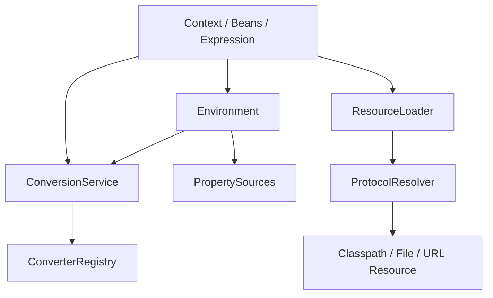

<!-- migration-doc: authority=authoritative canonical=../迁移验收规范.md -->
# spring-core → vernal-core 语义迁移对照表
> 迁移文档治理：本文级别为 **authoritative**。正文中的历史统计或完成标记不得单独作为验收结论；以 [../迁移验收规范.md](../迁移验收规范.md) 和自动审计报告为准。

<!-- current-migration-contract-start -->
## 当前迁移规范执行口径

| 规范项 | 本模块当前要求 |
|---|---|
| 模块 | `vernal-core` |
| 来源基线 | `org.springframework.core` @ `9e8cea3ef8ae02efb7956b071cd7bbef7c22cb82` |
| 当前对象边界 | 329 个对象；不把 `package-info.java`、合并对象或模糊依赖豁免计入完成 |
| 目标根 | `crates/vernal-core/src` |
| 目录和文件 | 去掉组织及模块根包，保留末两层；目录/文件 snake_case，一个源对象一个 `.rs` 文件 |
| 类型和方法 | 类型 PascalCase；方法和参数 snake_case，名称与 Java 语义一一对应 |
| 模块文件 | `lib.rs`/`mod.rs` 只含模块文档、声明和显式重导出 |
| 完成口径 | 仅 `IMPLEMENTED`、`DEPENDENCY_REUSED`、`PLATFORM_NA` 计入完成 |
| 红线 | 禁止 stub、兼容文件转引充数、生产 wildcard import、无证据的依赖替代 |
| 注释和测试 | 中文来源注释；正常、失败、边界、顺序、生命周期和并发/取消测试 |

### 当前状态快照

| 状态 | 数量 |
|---|---:|
| `DEPENDENCY_REUSED` | 0 |
| `IMPLEMENTED` | 6 |
| `MISPLACED` | 10 |
| `MISSING` | 306 |
| `PARTIAL` | 0 |
| `PLATFORM_NA` | 0 |
| `STUB` | 0 |
| `UNVERIFIED` | 7 |

### 本文档执行责任

- 本模块必须覆盖：资源定位与关闭、类型转换、元数据访问、I/O 与编码、并发上下文、错误因果链。
- 必须记录入口、协作对象、回调顺序、错误传播、资源释放以及异步取消/背压语义。
- 接口相似不能代替行为证据；每个关键语义域都要有正常、失败和边界测试。
<!-- current-migration-contract-end -->

> 本表基于 Spring 与 Vernal 的 CodeGraph 索引；对象状态仍以[自动审计](../migration-audit/vernal-core.md)为准。

| Spring 语义链 | Rust 目标语义 | 当前判断 | 验收证据 |
|---|---|---|---|
| `ResolvableType.forType → resolveClass/isAssignableFrom` | 独立类型描述、泛型参数与可赋值性判断 | `MISSING/PARTIAL` | 泛型、数组、通配边界测试 |
| `DefaultConversionService → addDefaultConverters → GenericConversionService.convert` | registry 查找、条件匹配、转换错误 | `PARTIAL` | 转换矩阵及错误类型测试 |
| `DefaultResourceLoader.getResource → ProtocolResolver → classpath/file/URL` | 协议策略与资源实现分离 | `MISSING` | 协议、相对路径、错误传播测试 |
| `AbstractEnvironment → PropertySourcesPropertyResolver` | property source 顺序、profile 与转换 | `PARTIAL` | precedence/profile/placeholder 测试 |
| `AnnotationUtils/MergedAnnotations` | Rust 属性/元数据组合 | `MISSING` | 合并、别名、继承规则测试 |
| `TaskExecutor.execute/submit` | async executor 与取消/错误语义 | `UNVERIFIED` | 并发、取消、panic 隔离测试 |
| `MimeType.parseMimeType` | MIME 解析、参数与错误 | `MISPLACED/UNVERIFIED` | RFC 边界和往返测试 |

## 调用关系

## 迁移约束

- Rust 可采用 trait、enum 与泛型表达 Java 接口层次，但对象文件仍须一一对应。
- 动态分派差异必须以行为测试证明，不能以“Rust 形态不同”豁免。
- 编译期或 JVM-only 能力只有具备逐对象证据时才可 `PLATFORM_NA`。

<!-- detailed-current-start -->
## vernal-core 语义边界

语义等价以可观察行为为准，但不能借“功能相似”消除源对象边界。

| 语义域 | Rust 目标表达 | 必须保留 | 验收证据 |
|---|---|---|---|
| 资源定位与关闭 | trait/struct + `Result`/显式上下文；流式边界使用 `Stream` | 正常、边界、错误、顺序与资源释放 | 单元测试和跨对象集成测试 |
| 类型转换 | trait/struct + `Result`/显式上下文；流式边界使用 `Stream` | 正常、边界、错误、顺序与资源释放 | 单元测试和跨对象集成测试 |
| 元数据访问 | trait/struct + `Result`/显式上下文；流式边界使用 `Stream` | 正常、边界、错误、顺序与资源释放 | 单元测试和跨对象集成测试 |
| I/O 与编码 | trait/struct + `Result`/显式上下文；流式边界使用 `Stream` | 正常、边界、错误、顺序与资源释放 | 单元测试和跨对象集成测试 |
| 并发上下文 | trait/struct + `Result`/显式上下文；流式边界使用 `Stream` | 正常、边界、错误、顺序与资源释放 | 单元测试和跨对象集成测试 |
| 错误因果链 | trait/struct + `Result`/显式上下文；流式边界使用 `Stream` | 正常、边界、错误、顺序与资源释放 | 单元测试和跨对象集成测试 |

## 对象簇职责

| 目标目录 | 数量 | 代表对象 | 当前状态 |
|---|---:|---|---|
| `annotation` | 33 | `AbstractMergedAnnotation`、`AliasFor`、`AnnotatedElementAdapter`、`AnnotatedElementUtils`、`AnnotatedMethod` | MISSING:33 |
| `codec` | 25 | `AbstractCharSequenceDecoder`、`AbstractDataBufferDecoder`、`AbstractDecoder`、`AbstractEncoder`、`AbstractSingleValueEncoder` | IMPLEMENTED:5、MISSING:20 |
| `convert` | 6 | `ConversionException`、`ConversionFailedException`、`ConversionService`、`ConverterNotFoundException`、`Property` | IMPLEMENTED:1、MISSING:5 |
| `convert/converter` | 7 | `ConditionalConverter`、`ConditionalGenericConverter`、`Converter`、`ConverterFactory`、`ConverterRegistry` | MISPLACED:4、MISSING:3 |
| `convert/support` | 51 | `AbstractConditionalEnumConverter`、`ArrayToArrayConverter`、`ArrayToCollectionConverter`、`ArrayToObjectConverter`、`ArrayToStringConverter` | MISSING:51 |
| `crate 根目录` | 47 | `AliasRegistry`、`AttributeAccessor`、`AttributeAccessorSupport`、`BridgeMethodResolver`、`CollectionFactory` | MISSING:42、UNVERIFIED:5 |
| `env` | 25 | `AbstractEnvironment`、`AbstractPropertyResolver`、`CommandLineArgs`、`CommandLinePropertySource`、`CompositePropertySource` | MISPLACED:6、MISSING:19 |
| `io` | 23 | `AbstractFileResolvingResource`、`AbstractResource`、`ByteArrayResource`、`ClassPathResource`、`ClassRelativeResourceLoader` | MISSING:23 |
| `io/buffer` | 19 | `CloseableDataBuffer`、`DataBuffer`、`DataBufferFactory`、`DataBufferInputStream`、`DataBufferLimitException` | MISSING:19 |
| `io/support` | 16 | `DefaultPropertySourceFactory`、`EncodedResource`、`LocalizedResourceHelper`、`PathMatchingResourcePatternResolver`、`PropertiesLoaderSupport` | MISSING:16 |
| `log` | 5 | `CompositeLog`、`LogAccessor`、`LogDelegateFactory`、`LogFormatUtils`、`LogMessage` | MISSING:5 |
| `metrics` | 3 | `ApplicationStartup`、`DefaultApplicationStartup`、`StartupStep` | MISSING:3 |
| `metrics/jfr` | 3 | `FlightRecorderApplicationStartup`、`FlightRecorderStartupEvent`、`FlightRecorderStartupStep` | MISSING:3 |
| `retry` | 8 | `DefaultRetryPolicy`、`RetryException`、`RetryListener`、`RetryOperations`、`RetryPolicy` | MISSING:8 |
| `retry/support` | 2 | `CompositeRetryListener`、`RetryTask` | MISSING:2 |
| `serializer` | 4 | `DefaultDeserializer`、`DefaultSerializer`、`Deserializer`、`Serializer` | MISSING:4 |
| `serializer/support` | 4 | `DeserializingConverter`、`SerializationDelegate`、`SerializationFailedException`、`SerializingConverter` | MISSING:4 |
| `style` | 7 | `DefaultToStringStyler`、`DefaultValueStyler`、`SimpleValueStyler`、`StylerUtils`、`ToStringCreator` | MISSING:7 |
| `task` | 10 | `AsyncTaskExecutor`、`SimpleAsyncTaskExecutor`、`SyncTaskExecutor`、`TaskCallback`、`TaskDecorator` | MISSING:8、UNVERIFIED:2 |
| `task/support` | 4 | `CompositeTaskDecorator`、`ContextPropagatingTaskDecorator`、`ExecutorServiceAdapter`、`TaskExecutorAdapter` | MISSING:4 |
| `type` | 7 | `AnnotatedTypeMetadata`、`AnnotationMetadata`、`ClassMetadata`、`MethodMetadata`、`StandardAnnotationMetadata` | MISSING:7 |
| `type/classreading` | 13 | `AbstractMetadataReaderFactory`、`CachingMetadataReaderFactory`、`ClassFormatException`、`MergedAnnotationReadingVisitor`、`MetadataReader` | MISSING:13 |
| `type/filter` | 7 | `AbstractClassTestingTypeFilter`、`AbstractTypeHierarchyTraversingFilter`、`AnnotationTypeFilter`、`AspectJTypeFilter`、`AssignableTypeFilter` | MISSING:7 |

## 目标调用链

入口、适配、执行、回调和清理都必须可观察；只验证最终返回值不足以证明顺序、取消或释放正确。

## Java 到 Rust 技术语义

| Java 机制 | Rust 映射 | 验证重点 |
|---|---|---|
| nullable | `Option<T>` | `None` 与空值不得混同 |
| checked exception | `thiserror` + `Result<T, E>` | 分类、cause 和上下文 |
| synchronized/并发容器 | `Arc<RwLock<_>>`/`DashMap` | 竞争、可见性和死锁 |
| CompletableFuture | `Future`/`JoinHandle` | 完成、失败、取消和超时 |
| Reactor Mono | `async fn -> Result<T, E>` | 单值、空结果和错误 |
| Reactor Flux | `Stream<Item=Result<T,E>>` | 背压、顺序、取消和终止 |
| ServiceLoader | `inventory` + registry | 自动注册和确定性 |
| JVM/字节码 | 有证据才可 `PLATFORM_NA` | 困难不等于不适用 |

## 语义测试矩阵

| 语义域 | 正常场景 | 失败/边界 | 观察点 |
|---|---|---|---|
| 资源定位与关闭 | 最小有效输入完成全链路 | 空输入、重复、下游错误或取消 | 返回值、错误类型、调用顺序、状态和释放 |
| 类型转换 | 最小有效输入完成全链路 | 空输入、重复、下游错误或取消 | 返回值、错误类型、调用顺序、状态和释放 |
| 元数据访问 | 最小有效输入完成全链路 | 空输入、重复、下游错误或取消 | 返回值、错误类型、调用顺序、状态和释放 |
| I/O 与编码 | 最小有效输入完成全链路 | 空输入、重复、下游错误或取消 | 返回值、错误类型、调用顺序、状态和释放 |
| 并发上下文 | 最小有效输入完成全链路 | 空输入、重复、下游错误或取消 | 返回值、错误类型、调用顺序、状态和释放 |
| 错误因果链 | 最小有效输入完成全链路 | 空输入、重复、下游错误或取消 | 返回值、错误类型、调用顺序、状态和释放 |

## 语义完成清单

- [ ] 对象职责和协作边界明确。
- [ ] Javadoc 前置、后置和异常语义译为中文注释。
- [ ] 关键链路有正常、失败和边界测试。
- [ ] 异步能力覆盖完成、错误、取消、超时与背压。
- [ ] 资源型对象覆盖获取、复用和释放。
- [ ] 依赖复用有固定提交、精确符号和集成测试。
- [ ] JVM 专属能力有不可迁移证据。
- [ ] 状态严格使用验收规范定义。
<!-- detailed-current-end -->
