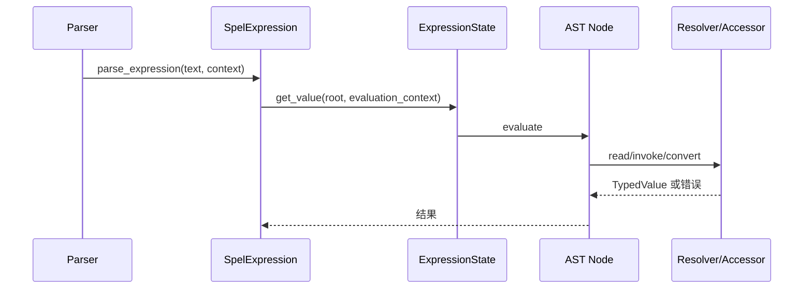

<!-- migration-doc: authority=authoritative canonical=../迁移验收规范.md -->
# spring-expression → vernal-expression 语义迁移对照表
> 迁移文档治理：本文级别为 **authoritative**。正文中的历史统计或完成标记不得单独作为验收结论；以 [../迁移验收规范.md](../迁移验收规范.md) 和自动审计报告为准。

<!-- current-migration-contract-start -->
## 当前迁移规范执行口径

| 规范项 | 本模块当前要求 |
|---|---|
| 模块 | `vernal-expression` |
| 来源基线 | `org.springframework.expression` @ `9e8cea3ef8ae02efb7956b071cd7bbef7c22cb82` |
| 当前对象边界 | 117 个对象；不把 `package-info.java`、合并对象或模糊依赖豁免计入完成 |
| 目标根 | `crates/vernal-expression/src` |
| 目录和文件 | 去掉组织及模块根包，保留末两层；目录/文件 snake_case，一个源对象一个 `.rs` 文件 |
| 类型和方法 | 类型 PascalCase；方法和参数 snake_case，名称与 Java 语义一一对应 |
| 模块文件 | `lib.rs`/`mod.rs` 只含模块文档、声明和显式重导出 |
| 完成口径 | 仅 `IMPLEMENTED`、`DEPENDENCY_REUSED`、`PLATFORM_NA` 计入完成 |
| 红线 | 禁止 stub、兼容文件转引充数、生产 wildcard import、无证据的依赖替代 |
| 注释和测试 | 中文来源注释；正常、失败、边界、顺序、生命周期和并发/取消测试 |

### 当前状态快照

| 状态 | 数量 |
|---|---:|
| `DEPENDENCY_REUSED` | 0 |
| `IMPLEMENTED` | 7 |
| `MISPLACED` | 7 |
| `MISSING` | 11 |
| `PARTIAL` | 0 |
| `PLATFORM_NA` | 0 |
| `STUB` | 3 |
| `UNVERIFIED` | 89 |

### 本文档执行责任

- 本模块必须覆盖：表达式解析、AST 求值、类型转换、属性与方法访问、运算符语义、求值上下文、错误位置和诊断。
- 必须记录入口、协作对象、回调顺序、错误传播、资源释放以及异步取消/背压语义。
- 接口相似不能代替行为证据；每个关键语义域都要有正常、失败和边界测试。
<!-- current-migration-contract-end -->

> 基于双方 CodeGraph 索引；状态以[对象审计](../migration-audit/vernal-expression.md)为准。

| Spring 调用链/能力 | Vernal 目标链 | 当前判断 | 关键测试 |
|---|---|---|---|
| `TemplateAwareExpressionParser.parseExpression` | 普通/模板解析分流 | `UNVERIFIED` | 前后缀、嵌套、空模板 |
| `SpelExpressionParser → InternalSpelExpressionParser` | tokenizer → parser → AST | `MISPLACED/UNVERIFIED` | precedence、语法错误位置 |
| `SpelExpression.getValue → ExpressionState → getValueInternal` | evaluation state 驱动节点动态求值 | `PARTIAL` | 每种 AST 节点、短路 |
| `PropertyOrFieldReference → PropertyAccessor` | 顺序化属性访问策略 | `UNVERIFIED` | 读写、缓存失效、拒绝 |
| `MethodReference → MethodResolver/Executor` | 方法筛选、参数转换、执行 | `PARTIAL` | 重载、varargs、错误封装 |
| `ConstructorReference → ConstructorResolver` | 构造器解析执行 | `STUB/PARTIAL` | 无匹配、歧义、panic 隔离 |
| `Selection/Projection` | 集合筛选/投影 | `UNVERIFIED` | null、map/list、首尾选择 |
| `StandardEvaluationContext` | resolver/accessor/converter 注册 | `UNVERIFIED` | 策略顺序与并发读取 |

Rust enum 动态分支可替代 Java 虚方法，但每个 Java AST 对象仍保留独立文件和行为测试。

---

<!-- restored-detail-from-head: dd20300d16a09200bd8a379ff14db1e2da99b67c -->

## 原详细文档（完整保留）

> 以下正文完整恢复自 Vernal 提交 `dd20300d16a09200bd8a379ff14db1e2da99b67c`。其中历史对象数量、完成状态、
> 路径算法和依赖替代结论如与本文顶部或自动对象台账冲突，以顶部当前结论和
> `docs/migration-audit/` 为准；其 API、设计背景、阶段拆解和测试说明继续保留。

# spring-expression → vernal-expression 功能语义迁移对照表

> **版本**：v1.1（2026-07-30）｜基线：Spring Framework **7.0.8**（spring-expression）
> **测试**：1,634 passing / 覆盖率 86.12% lines / 77.08% functions / 84.37% regions

迁移原则：**功能语义对齐，实现方式 Rust 化**。
Java 的反射、字节码编译、MethodHandle 分别映射为：trait 对象、
编译期宏、闭包。

状态图例：✅ 已迁移并有测试 / 🔶 语义等价但形态不同 / ⬜ 未迁移（路线图）/ 🚫 不迁移

## 一、核心接口

| Java 接口 | 语义 | Rust 实现 | 状态 |
|---|---|---|---|
| Expression | 表达式求值 + 赋值 + 类型查询 | `Expression` trait | ✅ |
| ExpressionParser | 解析表达式字符串 | `ExpressionParser` trait | ✅ |
| EvaluationContext | 求值上下文（根对象、变量、访问器、转换器） | `EvaluationContext` trait | ✅ |
| TypedValue | 类型化值封装 | `TypedValue` struct | ✅ |
| TypeDescriptor | 类型描述符 | `TypeDescriptor` enum + `PrimitiveKind` | ✅ |
| PropertyAccessor | 属性读写 | `PropertyAccessor` trait | ✅ |
| IndexAccessor (7.0) | 索引读写 | `IndexAccessor` trait | ✅ |
| BeanResolver | Bean 引用解析 | `BeanResolver` trait | ✅ |
| TypeConverter | 类型转换 | `TypeConverter` trait | ✅ |
| TypeLocator | 类型定位 | `TypeLocator` trait | ✅ |
| TypeComparator | 类型比较 | `TypeComparator` trait | ✅ |
| OperatorOverloader | 运算符重载 | `OperatorOverloader` trait | ✅ |
| MethodResolver | 方法解析 | `MethodResolver` trait | ✅ |
| ConstructorResolver | 构造器解析 | `ConstructorResolver` trait | ✅ |
| MethodExecutor | 方法执行 | `MethodExecutor` trait | ✅ |
| ConstructorExecutor | 构造器执行 | `ConstructorExecutor` trait | ✅ |
| ParserContext | 解析器上下文（模板模式） | `ParserContext` trait | ✅ |
| Operation | 操作枚举 | `Operation` enum (21 variants) | ✅ |

## 二、字面量

| Java 类 | 语义 | Rust 实现 | 状态 |
|---|---|---|---|
| IntLiteral | 整数字面量 `42` | `IntLiteral` struct | ⬜ |
| LongLiteral | 长整数字面量 `42L` | `LongLiteral` struct | ⬜ |
| RealLiteral | 双精度浮点 `3.14` | `RealLiteral` struct | ⬜ |
| FloatLiteral | 单精度浮点 `3.14f` | `FloatLiteral` struct | ⬜ |
| StringLiteral | 字符串 `'hello'` | `StringLiteral` struct | ⬜ |
| BooleanLiteral | 布尔 `TRUE`/`FALSE` | `BooleanLiteral` struct | ⬜ |
| NullLiteral | 空值 `null` | `NullLiteral` struct | ⬜ |

## 三、算术运算符

| Java 类 | 语义 | Rust 实现 | 状态 |
|---|---|---|---|
| OpPlus | 加法 `+`、字符串连接 | `OpPlus` struct | ⬜ |
| OpMinus | 减法 `-`、取负 | `OpMinus` struct | ⬜ |
| OpMultiply | 乘法 `*` | `OpMultiply` struct | ⬜ |
| OpDivide | 除法 `/`（支持 BigDecimal/BigInteger） | `OpDivide` struct | ⬜ |
| OpModulus | 取模 `%` | `OpModulus` struct | ⬜ |
| OperatorPower | 幂运算 `^` | `OperatorPower` struct | ⬜ |
| OpInc | 自增 `++`（前缀/后缀） | `OpInc` struct | ⬜ |
| OpDec | 自减 `--`（前缀/后缀） | `OpDec` struct | ⬜ |

## 四、比较运算符

| Java 类 | 语义 | Rust 实现 | 状态 |
|---|---|---|---|
| OpEQ | 等于 `==` | `OpEQ` struct | ⬜ |
| OpNE | 不等于 `!=` | `OpNE` struct | ⬜ |
| OpLT | 小于 `<` | `OpLT` struct | ⬜ |
| OpLE | 小于等于 `<=` | `OpLE` struct | ⬜ |
| OpGT | 大于 `>` | `OpGT` struct | ⬜ |
| OpGE | 大于等于 `>=` | `OpGE` struct | ⬜ |
| OperatorBetween | between 运算符 | `OperatorBetween` struct | ⬜ |
| OperatorInstanceof | instanceof 运算符 | `OperatorInstanceof` struct | ⬜ |
| OperatorMatches | 正则匹配 `matches` | `OperatorMatches` struct | ⬜ |

## 五、逻辑运算符

| Java 类 | 语义 | Rust 实现 | 状态 |
|---|---|---|---|
| OpAnd | 逻辑与 `&&`（短路） | `OpAnd` struct | ⬜ |
| OpOr | 逻辑或 `\|\|`（短路） | `OpOr` struct | ⬜ |
| OperatorNot | 逻辑非 `!` | `OperatorNot` struct | ⬜ |

## 六、表达式节点

| Java 类 | 语义 | Rust 实现 | 状态 |
|---|---|---|---|
| CompoundExpression | 点分表达式序列 `a.b.c` | `CompoundExpression` struct | ⬜ |
| PropertyOrFieldReference | 属性/字段引用 `name` | `PropertyOrFieldReference` struct | ⬜ |
| MethodReference | 方法调用 `method(args)` | `MethodReference` struct | ⬜ |
| FunctionReference | 函数引用 `#fn(args)` | `FunctionReference` struct | ⬜ |
| ConstructorReference | 构造器 `new Foo()` / 数组 `new int[]{}` | `ConstructorReference` struct | ⬜ |
| Indexer | 索引访问 `[i]`（数组/列表/Map/字符串） | `Indexer` struct | ⬜ |
| Projection | 投影 `![expr]` | `Projection` struct | ⬜ |
| Selection | 选择/过滤 `?[criteria]` / `^[first]` / `$[last]` | `Selection` struct | ⬜ |
| Ternary | 三元 `a ? b : c` | `Ternary` struct | ⬜ |
| Elvis | Elvis `a ?: b` | `Elvis` struct | ⬜ |
| VariableReference | 变量引用 `#var` / `#root` / `#this` | `VariableReference` struct | ⬜ |
| BeanReference | Bean 引用 `@bean` / `&factory` | `BeanReference` struct | ⬜ |
| TypeReference | 类型引用 `T(Type)` | `TypeReference` struct | ⬜ |
| Assign | 赋值 `a = b` | `Assign` struct | ⬜ |
| Identifier | 标识符 | `Identifier` struct | ⬜ |
| QualifiedIdentifier | 限定标识符 `com.example.Foo` | `QualifiedIdentifier` struct | ⬜ |
| InlineList | 内联列表 `{1,2,3}` | `InlineList` struct | ⬜ |
| InlineMap | 内联映射 `{k:'v'}` | `InlineMap` struct | ⬜ |

## 七、求值上下文

| Java 类 | 语义 | Rust 实现 | 状态 |
|---|---|---|---|
| StandardEvaluationContext | 全功能上下文（反射、变量、访问器） | `StandardEvaluationContext` struct | ⬜ |
| SimpleEvaluationContext | 受限数据绑定上下文 | `SimpleEvaluationContext` struct | ⬜ |
| ExpressionState | 每次求值的状态（变量、作用域、上下文对象栈） | `ExpressionState` struct | ⬜ |

## 八、属性访问器

| Java 类 | 语义 | Rust 实现 | 状态 |
|---|---|---|---|
| ReflectivePropertyAccessor | 反射属性访问器 | `ReflectivePropertyAccessor` struct | 🔶 Rust 用 trait 方法替代 |
| DataBindingPropertyAccessor | 数据绑定属性访问器 | `DataBindingPropertyAccessor` struct | ⬜ |
| MapAccessor | Map 键访问器 | `MapAccessor` struct | ⬜ |
| ReflectiveIndexAccessor | 反射索引访问器 | `ReflectiveIndexAccessor` struct | 🔶 Rust 用 Index trait 替代 |

## 九、方法/构造器解析

| Java 类 | 语义 | Rust 实现 | 状态 |
|---|---|---|---|
| ReflectiveMethodResolver | 反射方法解析器 | `ReflectiveMethodResolver` struct | 🔶 Rust 用 trait 方法替代 |
| ReflectiveMethodExecutor | 反射方法执行器 | `ReflectiveMethodExecutor` struct | 🔶 Rust 用闭包替代 |
| ReflectiveConstructorResolver | 反射构造器解析器 | `ReflectiveConstructorResolver` struct | 🔶 Rust 用 From::from 替代 |
| ReflectiveConstructorExecutor | 反射构造器执行器 | `ReflectiveConstructorExecutor` struct | 🔶 Rust 用工厂闭包替代 |
| DataBindingMethodResolver | 数据绑定方法解析器 | `DataBindingMethodResolver` struct | ⬜ |

## 十、类型系统

| Java 类 | 语义 | Rust 实现 | 状态 |
|---|---|---|---|
| StandardTypeLocator | 标准类型定位器 | `StandardTypeLocator` struct | ⬜ |
| StandardTypeConverter | 标准类型转换器 | `StandardTypeConverter` struct | ⬜ |
| StandardTypeComparator | 标准类型比较器 | `StandardTypeComparator` struct | ⬜ |
| StandardOperatorOverloader | 标准运算符重载器（空实现） | `StandardOperatorOverloader` struct | ⬜ |
| TypeCode | 类型代码枚举 | `TypeCode` enum | ⬜ |

## 十一、解析器

| Java 类 | 语义 | Rust 实现 | 状态 |
|---|---|---|---|
| SpelExpressionParser | 主解析器 | `SpelExpressionParser` struct | ⬜ |
| InternalSpelExpressionParser | 递归下降解析器 | `InternalParser` struct | ⬜ |
| Tokenizer | 词法分析器 | `Tokenizer` struct | ⬜ |
| Token | 词法单元 | `Token` struct | ⬜ |
| TokenKind | 词法单元类型 | `TokenKind` enum | ⬜ |
| SpelParserConfiguration | 解析器配置 | `SpelParserConfiguration` struct | ⬜ |
| TemplateAwareExpressionParser | 模板感知解析器 | `TemplateAwareExpressionParser` struct | ⬜ |
| TemplateParserContext | 模板解析上下文 | `TemplateParserContext` struct | ⬜ |

## 十二、表达式实现

| Java 类 | 语义 | Rust 实现 | 状态 |
|---|---|---|---|
| SpelExpression | 已解析的 SpEL 表达式 | `SpelExpression` struct | ⬜ |
| LiteralExpression | 字面量表达式 | `LiteralExpression` struct | ⬜ |
| CompositeStringExpression | 模板组合表达式 | `CompositeStringExpression` struct | ⬜ |

## 十三、错误体系

| Java 类 | 语义 | Rust 实现 | 状态 |
|---|---|---|---|
| ExpressionException | 表达式异常基类 | `ExpressionError` enum | ⬜ |
| EvaluationException | 求值异常 | `EvaluationError` struct | ⬜ |
| ParseException | 解析异常 | `ParseError` struct | ⬜ |
| SpelEvaluationException | SpEL 求值异常 | `SpelEvaluationError` struct | ⬜ |
| SpelParseException | SpEL 解析异常 | `SpelParseError` struct | ⬜ |
| InternalParseException | 内部解析异常 | `InternalParseError` struct | ⬜ |
| AccessException | 访问异常 | `AccessError` struct | ⬜ |
| ExpressionInvocationTargetException | 方法调用异常 | `InvocationTargetError` struct | ⬜ |
| SpelMessage | 错误消息枚举（85 个常量） | `SpelMessage` enum | ⬜ |

## 十四、不迁移的 Java 特有功能

| Java 类 | 原因 | Rust 替代 |
|---|---|---|
| CodeFlow | 字节码生成 | Rust 不需要（编译期宏替代） |
| CompiledExpression | 编译后表达式 | Rust 不需要 |
| SpelCompiler | 字节码编译器 | Rust 不需要 |
| CompilablePropertyAccessor | 可编译访问器 | Rust 不需要 |
| CompilableIndexAccessor | 可编译索引器 | Rust 不需要 |
| ReflectionHelper | 反射辅助 | Rust 用 trait 方法替代 |

## 十五、Rust 侧新增功能

| Rust 模块 | 说明 | 对应 Java 语义 |
|---|---|---|
| `spel/support/vernal_property_accessor.rs` | Vernal IoC 容器属性访问器 | 从 ApplicationContext 注入属性 |
| `spel/support/vernal_bean_resolver.rs` | Vernal IoC 容器 Bean 解析器 | 从 Container 解析 Bean |
| `spel/support/environment_type_locator.rs` | Vernal Environment 类型定位 | 从 ApplicationEnvironment 定位类型 |
| `spel/ast/safe_navigation.rs` | 安全导航运算符 `?.` | Java 7.0 新增，分散在各节点 |

## 测试基线

- `vernal-expression`：待建立
- 目标：每个 AST 节点至少 1 个求值测试
- 目标：解析器覆盖所有 TokenKind
- 目标：StandardEvaluationContext + SimpleEvaluationContext 各 5+ 测试
- 目标：与 vernal-context 的 ExpressionCondition 集成测试
