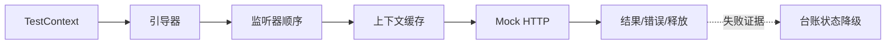

<!-- migration-doc: authority=authoritative canonical=../迁移验收规范.md -->
# vernal-test 语义迁移对照表
> 迁移文档治理：本文级别为 **authoritative**。正文中的历史统计或完成标记不得单独作为验收结论；以 [../迁移验收规范.md](../迁移验收规范.md) 和自动审计报告为准。

<!-- current-migration-contract-start -->
## 当前迁移规范执行口径

| 规范项 | 本模块当前要求 |
|---|---|
| 模块 | `vernal-test` |
| 来源基线 | `org.springframework.test` @ `9e8cea3ef8ae02efb7956b071cd7bbef7c22cb82` |
| 当前对象边界 | 371 个对象；不把 `package-info.java`、合并对象或模糊依赖豁免计入完成 |
| 目标根 | `crates/vernal-test/src` |
| 目录和文件 | 去掉组织及模块根包，保留末两层；目录/文件 snake_case，一个源对象一个 `.rs` 文件 |
| 类型和方法 | 类型 PascalCase；方法和参数 snake_case，名称与 Java 语义一一对应 |
| 模块文件 | `lib.rs`/`mod.rs` 只含模块文档、声明和显式重导出 |
| 完成口径 | 仅 `IMPLEMENTED`、`DEPENDENCY_REUSED`、`PLATFORM_NA` 计入完成 |
| 红线 | 禁止 stub、兼容文件转引充数、生产 wildcard import、无证据的依赖替代 |
| 注释和测试 | 中文来源注释；正常、失败、边界、顺序、生命周期和并发/取消测试 |

### 当前状态快照

| 状态 | 数量 |
|---|---:|
| `DEPENDENCY_REUSED` | 0 |
| `IMPLEMENTED` | 0 |
| `MISPLACED` | 0 |
| `MISSING` | 371 |
| `PARTIAL` | 0 |
| `PLATFORM_NA` | 0 |
| `STUB` | 0 |
| `UNVERIFIED` | 0 |

### 本文档执行责任

- 本模块必须覆盖：TestContext、引导器、监听器顺序、上下文缓存、Mock HTTP、测试事务、异步超时、失败诊断。
- 必须记录入口、协作对象、回调顺序、错误传播、资源释放以及异步取消/背压语义。
- 接口相似不能代替行为证据；每个关键语义域都要有正常、失败和边界测试。
<!-- current-migration-contract-end -->

> CodeGraph 表明 `TestContextManager` 按顺序动态分派到多个
> `TestExecutionListener`：prepare、before、after 的异常聚合与逆序清理是框架语义。

| Spring 语义 | Rust 目标 | 状态 |
|---|---|---|
| bootstrapper 选择配置 | test harness builder | `MISSING` |
| prepare test instance | listener pipeline | `MISSING` |
| before/after class/method | async hooks + guaranteed cleanup | `MISSING` |
| context cache 与 dirties | keyed cache + eviction | `MISSING` |
| transactional test | begin/rollback hooks | `MISSING` |
| MockMvc/WebTestClient | runtime test clients | `MISSING` |

仅能构造一个名为 `TestContext` 的结构体，不等价于生命周期管理器。

<!-- detailed-current-start -->
## vernal-test 语义边界

语义等价以可观察行为为准，但不能借“功能相似”消除源对象边界。

| 语义域 | Rust 目标表达 | 必须保留 | 验收证据 |
|---|---|---|---|
| TestContext | trait/struct + `Result`/显式上下文；流式边界使用 `Stream` | 正常、边界、错误、顺序与资源释放 | 单元测试和跨对象集成测试 |
| 引导器 | trait/struct + `Result`/显式上下文；流式边界使用 `Stream` | 正常、边界、错误、顺序与资源释放 | 单元测试和跨对象集成测试 |
| 监听器顺序 | trait/struct + `Result`/显式上下文；流式边界使用 `Stream` | 正常、边界、错误、顺序与资源释放 | 单元测试和跨对象集成测试 |
| 上下文缓存 | trait/struct + `Result`/显式上下文；流式边界使用 `Stream` | 正常、边界、错误、顺序与资源释放 | 单元测试和跨对象集成测试 |
| Mock HTTP | trait/struct + `Result`/显式上下文；流式边界使用 `Stream` | 正常、边界、错误、顺序与资源释放 | 单元测试和跨对象集成测试 |
| 测试事务 | trait/struct + `Result`/显式上下文；流式边界使用 `Stream` | 正常、边界、错误、顺序与资源释放 | 单元测试和跨对象集成测试 |
| 异步超时 | trait/struct + `Result`/显式上下文；流式边界使用 `Stream` | 正常、边界、错误、顺序与资源释放 | 单元测试和跨对象集成测试 |
| 失败诊断 | trait/struct + `Result`/显式上下文；流式边界使用 `Stream` | 正常、边界、错误、顺序与资源释放 | 单元测试和跨对象集成测试 |

## 对象簇职责

| 目标目录 | 数量 | 代表对象 | 当前状态 |
|---|---:|---|---|
| `annotation` | 11 | `Commit`、`DirtiesContext`、`IfProfileValue`、`ProfileValueSource`、`ProfileValueSourceConfiguration` | MISSING:11 |
| `bean/override` | 11 | `BeanOverride`、`BeanOverrideBeanFactoryPostProcessor`、`BeanOverrideContextCustomizer`、`BeanOverrideContextCustomizerFactory`、`BeanOverrideHandler` | MISSING:11 |
| `client/assertj` | 3 | `DefaultRestTestClientResponse`、`RestTestClientResponse`、`RestTestClientResponseAssert` | MISSING:3 |
| `client/match` | 4 | `ContentRequestMatchers`、`JsonPathRequestMatchers`、`MockRestRequestMatchers`、`XpathRequestMatchers` | MISSING:4 |
| `client/response` | 3 | `DefaultResponseCreator`、`ExecutingResponseCreator`、`MockRestResponseCreators` | MISSING:3 |
| `context` | 32 | `ActiveProfiles`、`ActiveProfilesResolver`、`ApplicationContextFailureProcessor`、`BootstrapContext`、`BootstrapUtils` | MISSING:32 |
| `context/aot` | 19 | `AotContextLoader`、`AotTestAttributes`、`AotTestAttributesCodeGenerator`、`AotTestAttributesFactory`、`AotTestContextInitializers` | MISSING:19 |
| `context/cache` | 5 | `AotMergedContextConfiguration`、`ContextCache`、`ContextCacheUtils`、`DefaultCacheAwareContextLoaderDelegate`、`DefaultContextCache` | MISSING:5 |
| `context/event` | 15 | `AfterTestClassEvent`、`AfterTestExecutionEvent`、`AfterTestMethodEvent`、`ApplicationEvents`、`ApplicationEventsApplicationListener` | MISSING:15 |
| `context/hint` | 2 | `StandardTestRuntimeHints`、`TestContextRuntimeHints` | MISSING:2 |
| `context/jdbc` | 6 | `MergedSqlConfig`、`Sql`、`SqlConfig`、`SqlGroup`、`SqlMergeMode` | MISSING:6 |
| `context/junit4` | 4 | `AbstractJUnit4SpringContextTests`、`AbstractTransactionalJUnit4SpringContextTests`、`SpringJUnit4ClassRunner`、`SpringRunner` | MISSING:4 |
| `context/observation` | 1 | `MicrometerObservationRegistryTestExecutionListener` | MISSING:1 |
| `context/support` | 31 | `AbstractContextLoader`、`AbstractDelegatingSmartContextLoader`、`AbstractDirtiesContextTestExecutionListener`、`AbstractGenericContextLoader`、`AbstractTestContextBootstrapper` | MISSING:31 |
| `context/testng` | 2 | `AbstractTestNGSpringContextTests`、`AbstractTransactionalTestNGSpringContextTests` | MISSING:2 |
| `context/transaction` | 7 | `AfterTransaction`、`BeforeTransaction`、`TestContextTransactionUtils`、`TestTransaction`、`TransactionContext` | MISSING:7 |
| `context/util` | 3 | `TestContextFailureHandler`、`TestContextResourceUtils`、`TestContextSpringFactoriesUtils` | MISSING:3 |
| `context/web` | 9 | `AbstractGenericWebContextLoader`、`AnnotationConfigWebContextLoader`、`GenericGroovyXmlWebContextLoader`、`GenericXmlWebContextLoader`、`ServletTestExecutionListener` | MISSING:9 |
| `event/annotation` | 7 | `AfterTestClass`、`AfterTestExecution`、`AfterTestMethod`、`BeforeTestClass`、`BeforeTestExecution` | MISSING:7 |
| `htmlunit/webdriver` | 2 | `MockMvcHtmlUnitDriverBuilder`、`WebConnectionHtmlUnitDriver` | MISSING:2 |
| `http` | 3 | `HttpHeadersAssert`、`HttpMessageContentConverter`、`MediaTypeAssert` | MISSING:3 |
| `jdbc` | 1 | `JdbcTestUtils` | MISSING:1 |
| `json` | 12 | `AbstractJsonContentAssert`、`AbstractJsonValueAssert`、`DefaultJsonConverterDelegate`、`JsonAssert`、`JsonComparator` | MISSING:12 |
| `junit/jupiter` | 8 | `AbstractExpressionEvaluatingCondition`、`DisabledIf`、`DisabledIfCondition`、`EnabledIf`、`EnabledIfCondition` | MISSING:8 |
| `junit4/rules` | 2 | `SpringClassRule`、`SpringMethodRule` | MISSING:2 |
| `junit4/statements` | 10 | `ProfileValueChecker`、`RunAfterTestClassCallbacks`、`RunAfterTestExecutionCallbacks`、`RunAfterTestMethodCallbacks`、`RunBeforeTestClassCallbacks` | MISSING:10 |
| `jupiter/web` | 1 | `SpringJUnitWebConfig` | MISSING:1 |
| `override/convention` | 4 | `TestBean`、`TestBeanOverrideHandler`、`TestBeanOverrideProcessor`、`TestBeanReflectiveProcessor` | MISSING:4 |
| `override/mockito` | 12 | `AbstractMockitoBeanOverrideHandler`、`MockBeans`、`MockReset`、`MockitoBean`、`MockitoBeanOverrideHandler` | MISSING:12 |
| `reactive/server` | 24 | `AbstractMockServerSpec`、`ApplicationContextSpec`、`CookieAssertions`、`DefaultControllerSpec`、`DefaultMockServerSpec` | MISSING:24 |
| `server/assertj` | 4 | `DefaultWebTestClientResponse`、`ResponseCookieMapAssert`、`WebTestClientResponse`、`WebTestClientResponseAssert` | MISSING:4 |
| `servlet/assertj` | 11 | `AbstractHttpServletRequestAssert`、`AbstractHttpServletResponseAssert`、`AbstractMockHttpServletRequestAssert`、`AbstractMockHttpServletResponseAssert`、`CookieMapAssert` | MISSING:11 |
| `servlet/client` | 14 | `CookieAssertions`、`DefaultRestTestClient`、`DefaultRestTestClientBuilder`、`EntityExchangeResult`、`ExchangeResult` | MISSING:14 |
| `servlet/htmlunit` | 10 | `DelegatingWebConnection`、`ForwardRequestPostProcessor`、`HostRequestMatcher`、`HtmlUnitRequestBuilder`、`MockMvcWebClientBuilder` | MISSING:10 |
| `servlet/request` | 7 | `AbstractMockHttpServletRequestBuilder`、`AbstractMockMultipartHttpServletRequestBuilder`、`ConfigurableSmartRequestBuilder`、`MockHttpServletRequestBuilder`、`MockMultipartHttpServletRequestBuilder` | MISSING:7 |
| `servlet/result` | 14 | `ContentResultMatchers`、`CookieResultMatchers`、`FlashAttributeResultMatchers`、`HandlerResultMatchers`、`HeaderResultMatchers` | MISSING:14 |
| `servlet/setup` | 12 | `AbstractMockMvcBuilder`、`ConfigurableMockMvcBuilder`、`DefaultMockMvcBuilder`、`MockMvcBuilders`、`MockMvcConfigurer` | MISSING:12 |
| `util` | 10 | `AopTestUtils`、`AssertionErrors`、`ExceptionCollector`、`JsonExpectationsHelper`、`JsonPathExpectationsHelper` | MISSING:10 |
| `validation` | 1 | `AbstractBindingResultAssert` | MISSING:1 |
| `web` | 2 | `ModelAndViewAssert`、`UriAssert` | MISSING:2 |
| `web/client` | 12 | `AbstractRequestExpectationManager`、`DefaultRequestExpectation`、`ExpectedCount`、`MockMvcClientHttpRequestFactory`、`MockRestServiceServer` | MISSING:12 |
| `web/servlet` | 12 | `DefaultMvcResult`、`DispatcherServletCustomizer`、`MockMvc`、`MockMvcBuilder`、`MockMvcBuilderSupport` | MISSING:12 |
| `web/socket` | 3 | `MockServerContainer`、`MockServerContainerContextCustomizer`、`MockServerContainerContextCustomizerFactory` | MISSING:3 |
| `web/support` | 5 | `AbstractCookieAssertions`、`AbstractHeaderAssertions`、`AbstractJsonPathAssertions`、`AbstractStatusAssertions`、`AbstractXpathAssertions` | MISSING:5 |

## 目标调用链

入口、适配、执行、回调和清理都必须可观察；只验证最终返回值不足以证明顺序、取消或释放正确。

## Java 到 Rust 技术语义

| Java 机制 | Rust 映射 | 验证重点 |
|---|---|---|
| nullable | `Option<T>` | `None` 与空值不得混同 |
| checked exception | `thiserror` + `Result<T, E>` | 分类、cause 和上下文 |
| synchronized/并发容器 | `Arc<RwLock<_>>`/`DashMap` | 竞争、可见性和死锁 |
| CompletableFuture | `Future`/`JoinHandle` | 完成、失败、取消和超时 |
| Reactor Mono | `async fn -> Result<T, E>` | 单值、空结果和错误 |
| Reactor Flux | `Stream<Item=Result<T,E>>` | 背压、顺序、取消和终止 |
| ServiceLoader | `inventory` + registry | 自动注册和确定性 |
| JVM/字节码 | 有证据才可 `PLATFORM_NA` | 困难不等于不适用 |

## 语义测试矩阵

| 语义域 | 正常场景 | 失败/边界 | 观察点 |
|---|---|---|---|
| TestContext | 最小有效输入完成全链路 | 空输入、重复、下游错误或取消 | 返回值、错误类型、调用顺序、状态和释放 |
| 引导器 | 最小有效输入完成全链路 | 空输入、重复、下游错误或取消 | 返回值、错误类型、调用顺序、状态和释放 |
| 监听器顺序 | 最小有效输入完成全链路 | 空输入、重复、下游错误或取消 | 返回值、错误类型、调用顺序、状态和释放 |
| 上下文缓存 | 最小有效输入完成全链路 | 空输入、重复、下游错误或取消 | 返回值、错误类型、调用顺序、状态和释放 |
| Mock HTTP | 最小有效输入完成全链路 | 空输入、重复、下游错误或取消 | 返回值、错误类型、调用顺序、状态和释放 |
| 测试事务 | 最小有效输入完成全链路 | 空输入、重复、下游错误或取消 | 返回值、错误类型、调用顺序、状态和释放 |
| 异步超时 | 最小有效输入完成全链路 | 空输入、重复、下游错误或取消 | 返回值、错误类型、调用顺序、状态和释放 |
| 失败诊断 | 最小有效输入完成全链路 | 空输入、重复、下游错误或取消 | 返回值、错误类型、调用顺序、状态和释放 |

## 语义完成清单

- [ ] 对象职责和协作边界明确。
- [ ] Javadoc 前置、后置和异常语义译为中文注释。
- [ ] 关键链路有正常、失败和边界测试。
- [ ] 异步能力覆盖完成、错误、取消、超时与背压。
- [ ] 资源型对象覆盖获取、复用和释放。
- [ ] 依赖复用有固定提交、精确符号和集成测试。
- [ ] JVM 专属能力有不可迁移证据。
- [ ] 状态严格使用验收规范定义。
<!-- detailed-current-end -->
