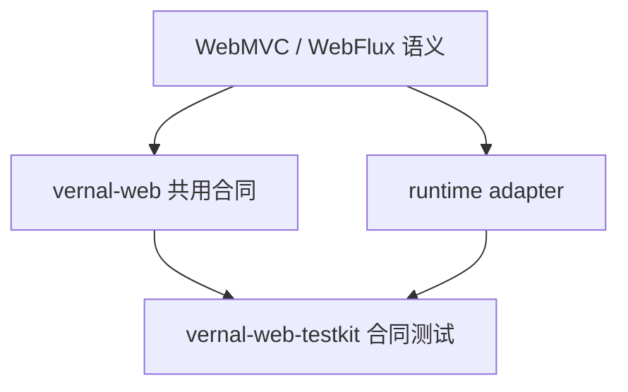

<!-- migration-doc: authority=authoritative canonical=../迁移验收规范.md -->
# vernal-web-support 技术要求
> 迁移文档治理：本文级别为 **authoritative**。正文中的历史统计或完成标记不得单独作为验收结论；以 [../迁移验收规范.md](../迁移验收规范.md) 和自动审计报告为准。

> 规则见[迁移验收规范](../迁移验收规范.md)。本目录是跨运行时支撑文档，不对应单一
> `vernal-web-support` crate。

## 来源与目标

- 来源主线：`spring-webmvc` 337 个对象、`spring-webflux` 252 个对象。
- 目标：`vernal-web` 核心合同加 `vernal-actix-web`、`vernal-axum`、`vernal-warp`、
  `vernal-rocket`、`vernal-salvo`、`vernal-tide` 等运行时 crate。
- 当前没有统一对象台账报告，也没有名为 `vernal-web-support` 的 crate；状态为 `PLANNED`，
  不能宣称 589 个来源对象已迁移。

## 目录规则

Servlet/Reactive 包去掉模块根包后保留末两层，例如：

| Java | 规划 Rust |
|---|---|
| `servlet/handler/AbstractHandlerMapping.java` | `servlet/handler/abstract_handler_mapping.rs` |
| `reactive/result/HandlerResultHandler.java` | `result/handler_result_handler.rs` |
| `reactive/function/server/RouterFunction.java` | `function/server/router_function.rs` |

运行时专有对象放对应 runtime crate；共用合同必须先落在 `vernal-web`。

