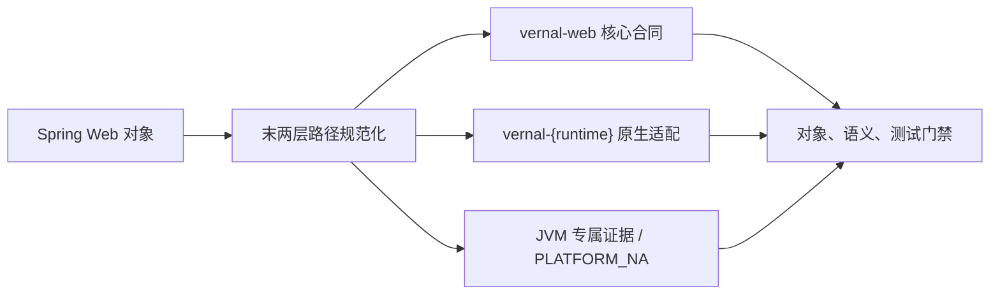

<!-- migration-doc: authority=authoritative canonical=../迁移验收规范.md -->
# vernal-web 技术要求
> 迁移文档治理：本文级别为 **authoritative**。正文中的历史统计或完成标记不得单独作为验收结论；以 [../迁移验收规范.md](../迁移验收规范.md) 和自动审计报告为准。


> 当前权威规范：[迁移验收规范](../迁移验收规范.md)。Spring 基线：
> `9e8cea3ef8ae02efb7956b071cd7bbef7c22cb82`。事实统计以
> [vernal-web 审计报告](../migration-audit/vernal-web.md)为准。

## 范围与当前结论

- 来源：`spring-web/src/main/java/org/springframework`，719 个 Java 业务对象。
- 目标：`crates/vernal-web/src`，当前是框架中立的请求上下文、路由元数据、作用域和错误合同。
- 严格台账：`MISSING=719`、严格已处理为 0。已有 Rust 能力不能按“形态相近”抵消 Spring 对象。
- Axum、Actix Web、Warp、Rocket、Salvo、Tide 的集成属于独立 runtime crate，不得塞进 `vernal-web`。

## 文件与目录

去掉 `org.springframework` 后保留包路径末两层，类型名转 snake_case：

| Java | 目标 Rust |
|---|---|
| `http/HttpHeaders.java` | `http/http_headers.rs` |
| `web/bind/WebDataBinder.java` | `web/bind/web_data_binder.rs` |
| `web/context/request/RequestAttributes.java` | `context/request/request_attributes.rs` |
| `web/multipart/support/StandardMultipartHttpServletRequest.java` | `multipart/support/standard_multipart_http_servlet_request.rs` |

一个 Java 顶层对象对应一个真实 `.rs` 文件；`lib.rs`、`mod.rs` 只能声明和重导出。

## 分层边界



核心合同必须保持 HTTP/runtime 中立；运行时 adapter 负责从已匹配路由读取低基数模板、建立
`RequestContext`/`WebRequestScope`、执行 AOP plan，并让 scope 跟随响应 body 关闭。

## 验收

- 每个对象必须是 `IMPLEMENTED`、有精确证据的 `DEPENDENCY_REUSED` 或 `PLATFORM_NA`。
- `MISPLACED`、`MISSING`、`PARTIAL`、`STUB`、`UNVERIFIED` 都未完成。
- 必须保留中文 Java 来源注释和语义测试；Cargo 测试通过不能替代对象级验收。

---

<!-- restored-detail-from-head: dd20300d16a09200bd8a379ff14db1e2da99b67c -->

## 原详细文档（完整保留）

> 以下正文完整恢复自 Vernal 提交 `dd20300d16a09200bd8a379ff14db1e2da99b67c`。其中历史对象数量、完成状态、
> 路径算法和依赖替代结论如与本文顶部或自动对象台账冲突，以顶部当前结论和
> `docs/migration-audit/` 为准；其 API、设计背景、阶段拆解和测试说明继续保留。

# vernal-web 技术要求（对标 spring-web）

> **版本**：v1.0（2026-07-28）
> **对标**：`spring-web` 6.1 / Spring Framework 6.1
> **Rust 基线**：edition 2024 / rustc 1.88
> **crate 现状**：26 文件 / 1482 行（已实现）
> **选型**：Topcoat 0.5 全家桶 + `http` 1.4 + `hyper` 1.9 + `tower` 0.5

---

## 一、概述与定位

### 1.1 crate 职责

`vernal-web` 是 Vernal Framework Web 层的**框架中立应用层合同**，对标 Spring
Framework 中的 `spring-web` 模块。它只定义抽象 trait 和结构体，不包含任何具体
Web 框架的类型。所有十个 HTTP 框架适配器（Axum、Actix Web、Rocket 等）和
Topcoat 全栈主线均依赖 `vernal-web` 作为公共契约。

`vernal-web` 在 Vernal 双轨架构中的位置：

```
轨道一（Topcoat 全栈主线）          轨道二（10 个 API 后端适配器）
  vernal-webmvc  ──┐                   vernal-axum      ──┐
  vernal-webflux ──┼── vernal-web ──┤  vernal-actix-web ──┤
                   │   (本 crate)   │  vernal-rocket    ──┼── vernal-web
                   │                │  vernal-salvo     ──┤
                   └────────────────┘  ... (共 10 个)     ┘
```

### 1.2 与 spring-web 的对齐边界

| spring-web 概念 | vernal-web 对应 | 说明 |
|:---|:---|:---|
| `WebRequest` | `RequestContext` | 请求级上下文，包含 ID、路由、安全主体、扩展 |
| `RequestScope` | `WebRequestScope` | IoC `ScopeContext` 的 Web 门面 |
| `HandlerInterceptor` | `vernal-aop` 拦截器 | 通过 AOP 切点实现，不单独建拦截器接口 |
| `Filter` | Tower `Layer` / 框架原生中间件 | 不在 vernal-web 中定义 |
| `HttpMessageConverter` | `serde` + `http-body` | Rust 生态已有成熟方案 |
| `MultipartResolver` | 框架原生 multipart | 不在 vernal-web 中抽象 |
| `ProblemDetails` | `ProblemDetails` | RFC 9457 错误分类 |

### 1.3 设计约束

1. **`#![forbid(unsafe_code)]`**：vernal-web 全 crate 禁止 unsafe。
2. **无框架类型泄漏**：公共 API 中不得出现 `axum::Router`、`actix_web::HttpRequest` 等。
3. **Tokio 原生**：可使用 `tokio::sync`、`tokio_util::sync::CancellationToken` 等。
4. **Send + Sync**：所有公共类型满足跨线程边界。
5. **零分配路由元数据**：`RouteMetadata` 使用 `Arc<str>` 避免运行时分配。
6. **`async_trait` 兼容**：异步 trait 方法使用 `Pin<Box<dyn Future>>` 而非
   `async_trait` 宏，减少过程宏依赖。
7. **最小公共 API**：只暴露 Adapter 和下游消费方必需的类型，内部实现不公开。

### 1.4 与 spring-web 的不继承项

| spring-web 概念 | 不继承原因 |
|:---|:---|
| `Servlet` / `Filter` / `FilterChain` | Rust 无 Servlet 模型，由 Tower Layer 替代 |
| `HttpMessageConverter` | `serde` + `http-body` 已覆盖序列化需求 |
| `MultipartResolver` | 各框架原生 multipart 更成熟 |
| `RestTemplate` / `WebClient` | 出站 HTTP 客户端，由 `reqwest` 负责 |
| `@ControllerAdvice` | 由 vernal-aop 全局拦截器替代 |
| `@ModelAttribute` | Topcoat 提取器直接处理 |
| `@InitBinder` | Rust 类型系统 + `serde` 已足够 |

---

## 二、现状分析

### 2.1 文件清单

vernal-web 当前包含 15 个源文件和 1 个入口文件，共计 1482 行：

| 文件 | 行数 | 职责 |
|:---|:---:|:---|
| `lib.rs` | 33 | 入口，re-export 全部公共类型 |
| `request_context.rs` | 85 | 请求上下文：ID、路由、安全主体、扩展、取消 |
| `request_id.rs` | — | 请求唯一标识 |
| `route_metadata.rs` | 56 | 路由元数据：handler、operation、path_template |
| `security_principal.rs` | — | 安全主体载体 |
| `web_request_scope.rs` | 218 | 请求作用域：IoC ScopeContext 的 Web 门面 |
| `web_request_scope_owner.rs` | — | Scope 所有权模式（Standalone / Application） |
| `context_carrier.rs` | — | 跨 Future/Stream/任务的上下文传播 |
| `handler_invocation.rs` | — | Handler 调用描述 |
| `integration_descriptor.rs` | — | Adapter 能力描述 |
| `integration_role.rs` | — | Adapter 角色枚举 |
| `transport_kind.rs` | — | 传输类型枚举 |
| `problem_details.rs` | — | RFC 9457 错误详情 |
| `problem_kind.rs` | — | 错误分类枚举 |
| `web_failure.rs` | — | Web 层失败类型 |

### 2.2 已验证能力

- `RequestContext` 持有请求 ID、`RouteMetadata`、`RwLock<Option<Arc<SecurityPrincipal>>>`、
  `InvocationContext` 扩展、`CancellationToken` 和可选 `deadline`。
- `WebRequestScope` 从 `ApplicationContext` 派生请求级 `ScopeContext`，支持
  `resolve` / `resolve_qualified` / `resolve_trait` / `resolve_all_traits`，
  以及原生请求对象缓存（`get_or_insert_with`）和异步关闭钩子（`on_close`）。
- `RouteMetadata` 使用三个 `Arc<str>` 字段（handler / operation / path_template），
  可直接转换为 AOP `Operation`。
- `ContextCarrier` 在 `Future` / `Stream` / `tokio::spawn` 边界传播请求上下文。
- `ProblemDetails` 对标 RFC 9457，提供稳定的错误分类。

### 2.3 与 Topcoat 的集成路径

Topcoat 0.5 是 tokio-rs 官方全栈 Web 框架（2026-07-22 发布）。vernal-web 的
抽象层可直接桥接到 Topcoat 的 `AppContext`：

```
vernal-web 的 RequestContext        → Topcoat Request Extension
vernal-web 的 WebRequestScope      → Topcoat 中间件创建，Handler 内共享
vernal-web 的 RouteMetadata        → Topcoat 路由匹配后填充
vernal-web 的 SecurityPrincipal    → Sa-Token-Rust Bridge 写入
```

---

## 三、选型与依赖

### 3.1 核心依赖

引用 [Spring 组件替换约定](../Spring-组件替换约定.md) 第四节。

| 用途 | crate | 版本 | 说明 |
|:---|:---|:---|:---|
| HTTP 类型 | `http` | 1.4.0 | `Request`/`Response`/`StatusCode`/`HeaderMap` |
| HTTP Body | `http-body` | 1.0.1 | Body trait |
| HTTP Body 工具 | `http-body-util` | 0.1.3 | Body 组合器 |
| HTTP 传输 | `hyper` | 1.9.0 | `vernal-hyper` 的底层传输 |
| 中间件 | `tower` | 0.5.3 | `Service` / `Layer` 抽象 |
| 异步运行时 | `tokio` | 1.52.4 | `sync`、`time`、`net` |
| 异步工具 | `tokio-util` | 0.7.16 | `CancellationToken` |
| 错误派生 | `thiserror` | 2.0 | 结构化错误类型 |
| 序列化 | `serde` | 1.0.228 | 请求/响应序列化 |
| tracing | `tracing` | 0.1.41 | 结构化日志 |

### 3.2 vernal 内部依赖

| 依赖 crate | 用途 |
|:---|:---|
| `vernal-aop` | `InvocationContext`、`Operation`、AOP 拦截器基础 |
| `vernal-beans` | `ScopeContext`、`ScopeKey`、`Container`、`Registry` |
| `vernal-context` | `ApplicationContext`、`ScopeCleanupPolicy` |

### 3.3 Topcoat 全家桶集成计划

Topcoat 0.5 提供三个层次的 API，vernal-web 对应集成：

| Topcoat 层次 | API | vernal-web 桥接点 |
|:---|:---|:---|
| 路由层 | `Router`、`Route` | `RouteMetadata` 填充 |
| 请求处理层 | `Request`、`Response` | `RequestContext` / `ProblemDetails` |
| 中间件层 | `Middleware`、`AppContext` | `WebRequestScope` 创建与关闭 |
| 视图层 | `View`、`ViewEngine` | 由 `vernal-webmvc` 负责 |
| 响应式层 | `Stream`、`SSE` | 由 `vernal-webflux` 负责 |

### 3.4 不引入的 crate

| crate | 原因 |
|:---|:---|
| `axum` | 具体框架，在 `vernal-axum` 中引入 |
| `actix-web` | 具体框架，在 `vernal-actix-web` 中引入 |
| `warp` | 具体框架，在 `vernal-warp` 中引入 |
| `serde_json` | 可选依赖，不在核心合同中强制 |
| `mime` | HTTP Content-Type 类型，使用 `http` crate 的 HeaderValue 替代 |
| `url` | URL 解析，由各 Adapter 自行处理 |

### 3.5 Feature Flags

```toml
[features]
default = []
# 启用 serde 序列化支持
serde = ["dep:serde", "dep:serde_json"]
# 启用 tracing 诊断
tracing = ["dep:tracing"]
# 启用 Topcoat 集成（轨道一）
topcoat = ["dep:topcoat"]
```

### 3.6 Cargo.lock 版本锁定策略

vernal-web 作为公共合同 crate，其依赖版本遵循以下策略：

| 策略 | 说明 |
|:---|:---|
| `http` 精确版本 | `=1.4.0`，避免 minor 升级导致类型不兼容 |
| `http-body` 精确版本 | `=1.0.1`，Body trait 签名敏感 |
| `tower` 最低版本 | `>=0.5.3`，Layer/Service trait 稳定 |
| `tokio` 最低版本 | `>=1.52.4`，与 workspace 一致 |
| `thiserror` 最低版本 | `>=2.0`，derive 宏语义 |

---

## 四、核心抽象详解

### 4.1 RequestContext

`RequestContext` 是 vernal-web 最核心的类型，对标 Spring 的 `WebRequest`：

```rust
pub struct RequestContext {
    id: RequestId,                              // 请求唯一标识
    route: RouteMetadata,                       // 路由元数据
    principal: RwLock<Option<Arc<SecurityPrincipal>>>, // 安全主体
    extensions: InvocationContext,              // 类型化扩展
    cancellation: CancellationToken,            // 请求取消令牌
    deadline: Option<Instant>,                  // 绝对截止时间
}
```

**创建时机**：Adapter 在路由匹配后、Handler 调用前创建。

**生命周期**：从请求进入 Adapter 到 Scope 关闭，与 `WebRequestScope` 同生命周期。

**跨 `.await` 共享**：`RequestContext` 实现 `Send + Sync`，可安全跨 `.await` 边界
传递。安全主体通过 `RwLock` 允许异步认证后写入。

### 4.2 WebRequestScope

`WebRequestScope` 对标 Spring 的 `RequestScope`，是 IoC `ScopeContext` 的 Web
门面：

```rust
pub struct WebRequestScope {
    owner: WebRequestScopeOwner,   // Standalone 或 Application
    scope: Arc<ScopeContext>,      // IoC 自定义作用域
}
```

**两种创建模式**：

1. **`from_application_context(context)`**：正常模式，从 `ApplicationContext`
   派生子作用域，支持完整组件解析。
2. **`new(cancellation)`**：兼容模式，绑定空注册表，只能缓存原生请求对象。

**解析能力**：

| 方法 | Spring 对标 | 说明 |
|:---|:---|:---|
| `resolve::<T>()` | `getBean(Class)` | 解析唯一注册的 `T` 组件 |
| `resolve_qualified::<T>(qualifier)` | `getBean(name, Class)` | 带限定符解析 |
| `resolve_trait::<T>()` | `getBean(Trait)` | 解析 Trait Object 的 Primary 实现 |
| `resolve_all_traits::<T>()` | `getBeansOfType(Trait)` | 解析某 Trait 的全部实现 |
| `get_or_insert_with::<T>(factory)` | `Request.getAttribute()` | 原生请求对象缓存 |

**关闭语义**：

- `close()` 取消请求、等待构造结束、逆序执行关闭钩子。
- 应用绑定 Scope 使用 `ScopeCleanupPolicy` 的超时设置（默认 30 秒）。
- 关闭失败向 `ApplicationContext` 写入脱敏告警 `web.request-scope.cleanup-failed`。
- 后台协调器继续执行其余钩子，最终进入 `Closed` 状态。

### 4.3 RouteMetadata

`RouteMetadata` 对标 Spring MVC 的 `RequestMappingInfo`，但更轻量：

```rust
pub struct RouteMetadata {
    handler: Arc<str>,        // Handler 逻辑名称
    operation: Arc<str>,      // 操作名称（用于 AOP/指标）
    path_template: Arc<str>,  // 低基数路由模板，如 /orders/{id}
}
```

**关键约束**：`path_template` 必须是低基数模板，不能包含用户输入的原始 URI。
这直接决定了 AOP Operation 身份和监控指标标签的基数。

### 4.4 ContextCarrier

`ContextCarrier` 解决 Rust 异步编程中上下文传播的三大场景：

| 场景 | 问题 | 解决方案 |
|:---|:---|:---|
| `tokio::spawn` | task-local 丢失 | `ContextCarrier::spawn()` 携带上下文 |
| `Stream` 处理 | 每个 item 需要上下文 | `ContextCarrier::stream()` 注入 |
| `JoinSet` 并发 | 多任务共享上下文 | `ContextCarrier::join_set()` 分发 |

### 4.5 ProblemDetails

`ProblemDetails` 对标 RFC 9457（Problem Details for HTTP APIs）：

```rust
pub struct ProblemDetails {
    kind: ProblemKind,       // 错误分类
    status: u16,             // HTTP 状态码
    title: String,           // 人类可读标题
    detail: Option<String>,  // 详细描述
    instance: Option<String>,// 问题实例 URI
}
```

`ProblemKind` 枚举覆盖 Web 层全部失败点：

| ProblemKind | 含义 | 典型 HTTP 状态码 |
|:---|:---|:---|
| `Infrastructure` | Context 缺失/已关闭 | 500 |
| `Resolution` | 组件缺失或歧义 | 500 |
| `ClientInput` | 参数提取/校验失败 | 400 |
| `PolicyDenied` | 认证/授权拒绝 | 401 / 403 |
| `Application` | Handler 业务错误 | 由用户定义 |
| `Transport` | Body/Stream 失败 | 502 |

### 4.6 SecurityPrincipal

`SecurityPrincipal` 是 Sa-Token-Rust Bridge 的投影目标：

```rust
pub struct SecurityPrincipal {
    login_id: Option<String>,       // 登录标识
    roles: Vec<String>,             // 角色列表
    permissions: Vec<String>,       // 权限列表
    attributes: HashMap<String, String>, // 扩展属性
}
```

Bridge 在认证完成后通过 `RequestContext::set_principal()` 写入，Handler 和后续
拦截器通过 `RequestContext::principal()` 读取。

### 4.7 IntegrationDescriptor

`IntegrationDescriptor` 描述 Adapter 的能力和诊断信息：

```rust
pub struct IntegrationDescriptor {
    name: String,           // Adapter 名称，如 "axum"、"actix-web"
    version: String,        // 上游框架版本
    transport: TransportKind, // HTTP / gRPC / WebSocket
    capabilities: Vec<String>, // 支持的能力列表
}
```

用于运行时诊断和合同测试，不在请求处理热路径上使用。

### 4.8 TransportKind

```rust
pub enum TransportKind {
    Http,
    Grpc,
    WebSocket,
}
```

### 4.9 WebFailure

`WebFailure` 是 vernal-web 的统一错误类型，各 Adapter 将其映射为框架原生响应：

```rust
pub enum WebFailure {
    /// 基础设施错误（Context 缺失/已关闭）。
    Infrastructure(String),
    /// 组件解析错误。
    Resolution(ResolveError),
    /// 客户端输入错误。
    ClientInput(String),
    /// 安全策略拒绝。
    PolicyDenied { status: u16, reason: String },
    /// Handler 业务错误。
    Application(Box<dyn std::error::Error + Send + Sync>),
    /// 传输层错误。
    Transport(Box<dyn std::error::Error + Send + Sync>),
}
```

### 4.10 请求执行主链

vernal-web 定义的请求执行主链适用于所有 Adapter：

```text
框架原生请求到达
  │
  ▼
Adapter 提取 Arc<ApplicationContext>
  │
  ▼
创建 WebRequestScope（from_application_context）
  │
  ▼
构建 RequestContext（RouteMetadata + CancellationToken）
  │
  ▼
AOP 拦截链
  ├── before: 安全检查（Sa-Token-Rust）
  ├── before: 事务开始
  ├── around: Handler 执行
  │     ├── resolve::<T>() 解析组件
  │     ├── 调用业务方法
  │     └── 返回 Result / Future / Stream
  ├── after: 事务提交/回滚
  └── after: 审计记录
  │
  ▼
Adapter 映射为框架原生响应
  │
  ▼
WebRequestScope::close()（成功、错误、取消均执行）
  │
  ▼
框架原生响应返回
```

约束：

1. `ApplicationContext` 必须通过应用 State、Extension 或显式构造传入。
2. Adapter 不允许从进程全局变量猜测当前 Context。
3. `before` 阶段拒绝时，不执行 Handler，但已创建的 Scope 仍必须关闭。
4. `after`/Around 阶段应观察成功、业务错误、传输错误和取消。
5. 框架原生 Body/Stream 不能为了统一接口而被无条件缓冲。

---

## 五、Topcoat AppContext 桥接 vernal-beans Container

### 5.1 桥接架构

```
Topcoat AppContext                    vernal-beans Container
┌──────────────────────┐              ┌──────────────────────┐
│ Router               │              │ Registry             │
│   ├─ Route /users    │  ──桥接──→   │   ├─ Component<UserSvc> │
│   ├─ Route /orders   │              │   ├─ Component<OrderSvc>│
│   └─ Middleware       │              │   └─ TraitBinding<dyn>  │
│ Request Extensions   │              │ ScopeContext          │
│   ├─ RequestContext   │  ──同步──→   │   ├─ WebRequestScope   │
│   └─ WebRequestScope │              │   └─ NativeObjCache    │
└──────────────────────┘              └──────────────────────┘
```

### 5.2 桥接步骤

1. **应用启动时**：`ApplicationContext` 从 `vernal-context` 创建，包含所有已注册
   的组件定义。Topcoat 的 `AppContext` 通过 `Arc<ApplicationContext>` 持有引用。

2. **请求到达时**：Topcoat 中间件从 `AppContext` 提取 `Arc<ApplicationContext>`，
   调用 `WebRequestScope::from_application_context()` 创建请求作用域。

3. **路由匹配后**：中间件从 Topcoat 路由信息构建 `RouteMetadata`，创建
   `RequestContext`，并通过 `Request Extensions` 传递给 Handler。

4. **Handler 执行时**：Handler 从 Request Extensions 获取 `WebRequestScope`，
   调用 `resolve::<T>()` 解析业务组件。

5. **响应完成时**：中间件调用 `WebRequestScope::close()` 触发关闭钩子。

### 5.3 约束

- `ApplicationContext` **必须**通过 Topcoat 的 `AppContext` 或 `Request Extension`
  传入，不允许从进程全局变量猜测。
- `WebRequestScope` 的生命周期**必须**覆盖整个请求处理过程，包括响应 Body 的
  传输完成。
- Scope 关闭**必须**在响应发送后、连接释放前执行，即使 Handler 返回错误。
- Topcoat 的原生 Body 类型**不能**为了统一接口而被无条件缓冲。

### 5.4 与 vernal-beans 的交互契约

```rust
// 正常模式：从 ApplicationContext 创建
let scope = WebRequestScope::from_application_context(app_context.clone());

// 解析业务组件
let user_service = scope.resolve::<UserService>()?;

// 解析 Trait Object
let repository = scope.resolve_trait::<dyn OrderRepository>()?;

// 缓存原生请求对象
let native_req = scope.get_or_insert_with(|| NativeRequest::from(topcoat_req))?;

// 注册关闭钩子
scope.on_close(|| async { /* 清理资源 */ }).await?;

// 关闭作用域
scope.close().await?;
```

---

## 六、集成规范与引用约定

### 6.1 引用约定

本文档引用 [Spring 组件替换约定](../Spring-组件替换约定.md) 第四节"Web/HTTP 层"
作为 crate 选型的最终依据。

具体引用条目：

- **4.1 双轨架构**：vernal-web 属于轨道一 Topcoat 全栈主线的底层合同。
- **4.2 轨道一 Topcoat 全栈主线**：vernal-web 对标 `spring-web`，定义框架无关
  的 Web 合约。
- **4.4 传输层基础 crate**：`http` 1.4、`http-body` 1.0、`hyper` 1.9、`tower` 0.5。

### 6.2 下游 crate 依赖关系

```
vernal-web
  ├── vernal-webmvc    (待建，Topcoat MVC)
  ├── vernal-webflux   (待建，Topcoat 响应式)
  ├── vernal-axum      (Axum 适配器)
  ├── vernal-actix-web (Actix Web 适配器)
  ├── vernal-rocket    (Rocket 适配器)
  ├── vernal-warp      (Warp 适配器)
  ├── vernal-salvo     (Salvo 适配器)
  ├── vernal-poem      (Poem 适配器)
  ├── vernal-ntex      (Ntex 适配器)
  ├── vernal-gotham    (Gotham 适配器)
  ├── vernal-tide      (Tide 适配器)
  ├── vernal-tonic     (Tonic 适配器)
  └── vernal-web-testkit (合同测试工具)
```

### 6.3 API 稳定性承诺

| 承诺项 | 说明 |
|:---|:---|
| `RequestContext` 字段布局 | 不删除已有字段，新字段通过 `with_xxx()` 构建器添加 |
| `WebRequestScope` 解析方法 | 签名不变，新能力通过新方法添加 |
| `RouteMetadata` 三字段 | handler / operation / path_template 语义不变 |
| `ProblemKind` 枚举 | 新 variant 可追加，已有 variant 不改名 |
| `SecurityPrincipal` 结构 | 字段可追加，已有字段语义不变 |

### 6.4 测试要求

vernal-web 作为公共合同 crate，需要满足以下测试覆盖：

| 测试类别 | 覆盖内容 |
|:---|:---|
| 单元测试 | 每个结构体的创建、字段访问、边界条件 |
| 集成测试 | `WebRequestScope` 与 `ApplicationContext` 的完整生命周期 |
| 合同测试 | 通过 `vernal-web-testkit` 验证所有 Adapter 的行为一致性 |
| 编译测试 | `#![forbid(unsafe_code)]` 保证无 unsafe |
| 文档测试 | 公共 API 的示例代码可编译运行 |

### 6.5 错误分类与映射

vernal-web 定义了六个错误分类，覆盖 Web 层全部失败点。每个 Adapter 负责将
`WebFailure` 映射为框架原生响应：

| WebFailure 分类 | 含义 | HTTP 状态码 | Adapter 映射 |
|:---|:---|:---|:---|
| `Infrastructure` | Context 缺失/已关闭 | 500 | Axum: `StatusCode::INTERNAL_SERVER_ERROR` |
| `Resolution` | 组件缺失或歧义 | 500 | Actix: `HttpResponse::InternalServerError` |
| `ClientInput` | 参数提取/校验失败 | 400 | Rocket: `Status::BadRequest` |
| `PolicyDenied` | 认证/授权拒绝 | 401/403 | Salvo: `StatusCode::FORBIDDEN` |
| `Application` | Handler 业务错误 | 用户定义 | Poem: `IntoResponse` |
| `Transport` | Body/Stream 失败 | 502 | Warp: `Rejection` |

**日志脱敏规则**：

- 默认日志不记录 Token、Cookie、Authorization Header 或组件 Secret。
- Trace/Metric 标签禁止使用无限基数的原始路径或用户 ID。
- 诊断报告只公开 Adapter、版本、状态、Scope 计数和静态脱敏告警代码。
- Scope 清理失败统一使用 `web.request-scope.cleanup-failed`，不记录关闭钩子
  错误正文。

### 6.6 Scope 关闭语义详解

`WebRequestScope::close()` 的执行流程：

```text
close() 调用
  │
  ├── 1. 取消请求 CancellationToken
  │
  ├── 2. 等待正在进行的组件构造完成
  │
  ├── 3. 逆序执行关闭钩子（on_close 注册的）
  │      ├── 钩子 1（最后注册的先执行）
  │      ├── 钩子 2
  │      └── 钩子 N（最先注册的最后执行）
  │
  ├── 4. 如果有超时：在限定时间内等待
  │      ├── 超时 → 记录告警，后台继续
  │      └── 完成 → 正常返回
  │
  └── 5. 进入 Closed 状态
```

**超时行为**：

- 应用绑定 Scope 使用 `ScopeCleanupPolicy` 的超时设置（默认 30 秒）。
- 等待超时**不会**取消后台关闭任务，只结束 Adapter 当前等待。
- 共享 Tokio 清理协调器仍在后台运行，后续调用者可以等待同一结果且不会重复
  执行钩子。
- 超时后向 `ApplicationContext` 写入 `web.request-scope.cleanup-failed` 告警。

**幂等保证**：

- `close()` 多次调用安全，第二次及之后的调用立即返回。
- 关闭钩子不会重复执行。
- 取消令牌已取消时，`close()` 仍会执行关闭钩子。

### 6.7 后续演进

| 阶段 | 内容 | 前置条件 |
|:---|:---|:---|
| Phase 5 | Topcoat 适配器集成 | Topcoat 0.5 API 稳定 |
| Phase 6 | `vernal-webmvc` 基于 vernal-web 构建 MVC 层 | Topcoat MVC 模式验证 |
| Phase 6 | `vernal-webflux` 基于 vernal-web 构建响应式层 | Topcoat 响应式模式验证 |
| Phase 7 | WebSocket 扩展点完善 | `vernal-websocket` STOMP 集成 |
| Phase 8 | SSE 流式支持 | `vernal-webflux` 流式端点 |

---

> **文档结束** — vernal-web 是 Vernal Web 层的框架中立合同，所有下游 Adapter
> 和 Topcoat 全栈主线均以此为公共契约。选型依据参见
> [Spring 组件替换约定](../Spring-组件替换约定.md) 第四节。
