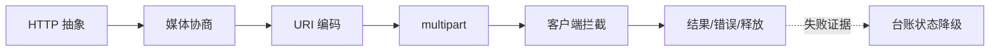

<!-- migration-doc: authority=authoritative canonical=../迁移验收规范.md -->
# vernal-web 语义迁移对照表
> 迁移文档治理：本文级别为 **authoritative**。正文中的历史统计或完成标记不得单独作为验收结论；以 [../迁移验收规范.md](../迁移验收规范.md) 和自动审计报告为准。

<!-- current-migration-contract-start -->
## 当前迁移规范执行口径

| 规范项 | 本模块当前要求 |
|---|---|
| 模块 | `vernal-web` |
| 来源基线 | `org.springframework` @ `9e8cea3ef8ae02efb7956b071cd7bbef7c22cb82` |
| 当前对象边界 | 719 个对象；不把 `package-info.java`、合并对象或模糊依赖豁免计入完成 |
| 目标根 | `crates/vernal-web/src` |
| 目录和文件 | 去掉组织及模块根包，保留末两层；目录/文件 snake_case，一个源对象一个 `.rs` 文件 |
| 类型和方法 | 类型 PascalCase；方法和参数 snake_case，名称与 Java 语义一一对应 |
| 模块文件 | `lib.rs`/`mod.rs` 只含模块文档、声明和显式重导出 |
| 完成口径 | 仅 `IMPLEMENTED`、`DEPENDENCY_REUSED`、`PLATFORM_NA` 计入完成 |
| 红线 | 禁止 stub、兼容文件转引充数、生产 wildcard import、无证据的依赖替代 |
| 注释和测试 | 中文来源注释；正常、失败、边界、顺序、生命周期和并发/取消测试 |

### 当前状态快照

| 状态 | 数量 |
|---|---:|
| `DEPENDENCY_REUSED` | 0 |
| `IMPLEMENTED` | 0 |
| `MISPLACED` | 0 |
| `MISSING` | 719 |
| `PARTIAL` | 0 |
| `PLATFORM_NA` | 0 |
| `STUB` | 0 |
| `UNVERIFIED` | 0 |

### 本文档执行责任

- 本模块必须覆盖：HTTP 抽象、媒体协商、URI 编码、multipart、客户端拦截、消息编解码、错误映射、运行时边界。
- 必须记录入口、协作对象、回调顺序、错误传播、资源释放以及异步取消/背压语义。
- 接口相似不能代替行为证据；每个关键语义域都要有正常、失败和边界测试。
<!-- current-migration-contract-end -->

> 调用链依据 CodeGraph 对 `WebDataBinder`、HTTP 抽象以及 Vernal runtime middleware 的查询；
> 规则见[迁移验收规范](../迁移验收规范.md)。

| Spring 语义链 | Rust 目标语义 | 当前判断 |
|---|---|---|
| 请求参数 → `WebDataBinder` marker/default → `DataBinder` | 参数提取 → typed binder → validation | `MISSING` |
| multipart request → `bindMultipart` → property values | 流式 multipart → 限额 → typed field | `MISSING` |
| 请求属性 → request scope → destruction callback | `RequestContext` → `WebRequestScope` → body drop 关闭 | `PARTIAL/UNVERIFIED` |
| Handler metadata → adapter invocation | `RouteMetadata` → `HandlerInvocation` → runtime target | Vernal 自有链已存在，非对象级替代 |
| 异常 → status/problem detail | `WebFailure` → `ProblemDetails` → runtime response | Vernal 自有链，需逐语义测试 |

CodeGraph 还确认各 runtime adapter 从匹配后的路径模板建立 AOP operation，并在响应 body
生命周期结束时关闭 scope；这属于 Vernal 集成语义，不应冒充 Spring Web 全对象覆盖。

<!-- detailed-current-start -->
## vernal-web 语义边界

语义等价以可观察行为为准，但不能借“功能相似”消除源对象边界。

| 语义域 | Rust 目标表达 | 必须保留 | 验收证据 |
|---|---|---|---|
| HTTP 抽象 | trait/struct + `Result`/显式上下文；流式边界使用 `Stream` | 正常、边界、错误、顺序与资源释放 | 单元测试和跨对象集成测试 |
| 媒体协商 | trait/struct + `Result`/显式上下文；流式边界使用 `Stream` | 正常、边界、错误、顺序与资源释放 | 单元测试和跨对象集成测试 |
| URI 编码 | trait/struct + `Result`/显式上下文；流式边界使用 `Stream` | 正常、边界、错误、顺序与资源释放 | 单元测试和跨对象集成测试 |
| multipart | trait/struct + `Result`/显式上下文；流式边界使用 `Stream` | 正常、边界、错误、顺序与资源释放 | 单元测试和跨对象集成测试 |
| 客户端拦截 | trait/struct + `Result`/显式上下文；流式边界使用 `Stream` | 正常、边界、错误、顺序与资源释放 | 单元测试和跨对象集成测试 |
| 消息编解码 | trait/struct + `Result`/显式上下文；流式边界使用 `Stream` | 正常、边界、错误、顺序与资源释放 | 单元测试和跨对象集成测试 |
| 错误映射 | trait/struct + `Result`/显式上下文；流式边界使用 `Stream` | 正常、边界、错误、顺序与资源释放 | 单元测试和跨对象集成测试 |
| 运行时边界 | trait/struct + `Result`/显式上下文；流式边界使用 `Stream` | 正常、边界、错误、顺序与资源释放 | 单元测试和跨对象集成测试 |

## 对象簇职责

| 目标目录 | 数量 | 代表对象 | 当前状态 |
|---|---:|---|---|
| `bind/annotation` | 31 | `BindParam`、`ControllerAdvice`、`ControllerMappingReflectiveProcessor`、`CookieValue`、`CrossOrigin` | MISSING:31 |
| `bind/support` | 14 | `BindParamNameResolver`、`ConfigurableWebBindingInitializer`、`DefaultDataBinderFactory`、`DefaultSessionAttributeStore`、`SessionAttributeStore` | MISSING:14 |
| `client/observation` | 4 | `ClientHttpObservationDocumentation`、`ClientRequestObservationContext`、`ClientRequestObservationConvention`、`DefaultClientRequestObservationConvention` | MISSING:4 |
| `client/reactive` | 22 | `AbstractClientHttpRequest`、`AbstractClientHttpResponse`、`ClientHttpConnector`、`ClientHttpRequest`、`ClientHttpRequestDecorator` | MISSING:22 |
| `client/support` | 11 | `BasicAuthenticationInterceptor`、`HttpAccessor`、`HttpRequestWrapper`、`InterceptingHttpAccessor`、`ProxyFactoryBean` | MISSING:11 |
| `codec/cbor` | 6 | `Jackson2CborDecoder`、`Jackson2CborEncoder`、`JacksonCborDecoder`、`JacksonCborEncoder`、`KotlinSerializationCborDecoder` | MISSING:6 |
| `codec/json` | 14 | `AbstractJackson2Decoder`、`AbstractJackson2Encoder`、`GsonDecoder`、`GsonEncoder`、`Jackson2CodecSupport` | MISSING:14 |
| `codec/multipart` | 19 | `DefaultPartEvents`、`DefaultPartHttpMessageReader`、`DefaultParts`、`FilePart`、`FilePartEvent` | MISSING:19 |
| `codec/protobuf` | 8 | `KotlinSerializationProtobufDecoder`、`KotlinSerializationProtobufEncoder`、`ProtobufCodecSupport`、`ProtobufDecoder`、`ProtobufEncoder` | MISSING:8 |
| `codec/smile` | 2 | `JacksonSmileDecoder`、`JacksonSmileEncoder` | MISSING:2 |
| `codec/support` | 6 | `BaseCodecConfigurer`、`BaseDefaultCodecs`、`ClientDefaultCodecsImpl`、`DefaultClientCodecConfigurer`、`DefaultServerCodecConfigurer` | MISSING:6 |
| `codec/xml` | 7 | `JacksonXmlDecoder`、`JacksonXmlEncoder`、`Jaxb2Helper`、`Jaxb2XmlDecoder`、`Jaxb2XmlEncoder` | MISSING:7 |
| `context/annotation` | 3 | `ApplicationScope`、`RequestScope`、`SessionScope` | MISSING:3 |
| `context/request` | 17 | `AbstractRequestAttributes`、`AbstractRequestAttributesScope`、`AsyncWebRequestInterceptor`、`DestructionCallbackBindingListener`、`FacesRequestAttributes` | MISSING:17 |
| `context/support` | 24 | `AbstractRefreshableWebApplicationContext`、`AnnotationConfigWebApplicationContext`、`ContextExposingHttpServletRequest`、`GenericWebApplicationContext`、`GroovyWebApplicationContext` | MISSING:24 |
| `converter/cbor` | 3 | `JacksonCborHttpMessageConverter`、`KotlinSerializationCborHttpMessageConverter`、`MappingJackson2CborHttpMessageConverter` | MISSING:3 |
| `converter/feed` | 3 | `AbstractWireFeedHttpMessageConverter`、`AtomFeedHttpMessageConverter`、`RssChannelHttpMessageConverter` | MISSING:3 |
| `converter/json` | 18 | `AbstractJackson2HttpMessageConverter`、`AbstractJsonHttpMessageConverter`、`GsonBuilderUtils`、`GsonFactoryBean`、`GsonHttpMessageConverter` | MISSING:18 |
| `converter/protobuf` | 3 | `KotlinSerializationProtobufHttpMessageConverter`、`ProtobufHttpMessageConverter`、`ProtobufJsonFormatHttpMessageConverter` | MISSING:3 |
| `converter/smile` | 2 | `JacksonSmileHttpMessageConverter`、`MappingJackson2SmileHttpMessageConverter` | MISSING:2 |
| `converter/support` | 1 | `AllEncompassingFormHttpMessageConverter` | MISSING:1 |
| `converter/xml` | 8 | `AbstractJaxb2HttpMessageConverter`、`AbstractXmlHttpMessageConverter`、`JacksonXmlHttpMessageConverter`、`Jaxb2CollectionHttpMessageConverter`、`Jaxb2RootElementHttpMessageConverter` | MISSING:8 |
| `converter/yaml` | 2 | `JacksonYamlHttpMessageConverter`、`MappingJackson2YamlHttpMessageConverter` | MISSING:2 |
| `cors/reactive` | 8 | `CorsConfigurationSource`、`CorsProcessor`、`CorsUtils`、`CorsWebFilter`、`DefaultCorsProcessor` | MISSING:8 |
| `filter/reactive` | 3 | `HiddenHttpMethodFilter`、`ServerWebExchangeContextFilter`、`UrlHandlerFilter` | MISSING:3 |
| `http` | 30 | `CacheControl`、`ContentDisposition`、`DefaultHttpStatusCode`、`ETag`、`HttpCookie` | MISSING:30 |
| `http/client` | 34 | `AbstractBufferingClientHttpRequest`、`AbstractClientHttpRequest`、`AbstractClientHttpRequestFactoryWrapper`、`AbstractStreamingClientHttpRequest`、`BufferingClientHttpRequestFactory` | MISSING:34 |
| `http/codec` | 28 | `AbstractJacksonDecoder`、`AbstractJacksonEncoder`、`ClientCodecConfigurer`、`CodecConfigurer`、`CodecConfigurerFactory` | MISSING:28 |
| `http/converter` | 22 | `AbstractGenericHttpMessageConverter`、`AbstractHttpMessageConverter`、`AbstractJacksonHttpMessageConverter`、`AbstractKotlinSerializationHttpMessageConverter`、`AbstractSmartHttpMessageConverter` | MISSING:22 |
| `http/server` | 13 | `DefaultPathContainer`、`DefaultRequestPath`、`DelegatingServerHttpResponse`、`PathContainer`、`RequestPath` | MISSING:13 |
| `http/support` | 4 | `HttpComponentsHeadersAdapter`、`JacksonHandlerInstantiator`、`JettyHeadersAdapter`、`Netty4HeadersAdapter` | MISSING:4 |
| `jsf/el` | 2 | `SpringBeanFacesELResolver`、`WebApplicationContextFacesELResolver` | MISSING:2 |
| `method/annotation` | 22 | `AbstractCookieValueMethodArgumentResolver`、`AbstractNamedValueMethodArgumentResolver`、`AbstractWebArgumentResolverAdapter`、`ErrorsMethodArgumentResolver`、`ExceptionHandlerMappingInfo` | MISSING:22 |
| `method/support` | 9 | `AsyncHandlerMethodReturnValueHandler`、`CompositeUriComponentsContributor`、`HandlerMethodArgumentResolver`、`HandlerMethodArgumentResolverComposite`、`HandlerMethodReturnValueHandler` | MISSING:9 |
| `multipart/support` | 11 | `AbstractMultipartHttpServletRequest`、`ByteArrayMultipartFileEditor`、`DefaultMultipartHttpServletRequest`、`MissingServletRequestPartException`、`MultipartFilter` | MISSING:11 |
| `reactive/observation` | 4 | `DefaultServerRequestObservationConvention`、`ServerHttpObservationDocumentation`、`ServerRequestObservationContext`、`ServerRequestObservationConvention` | MISSING:4 |
| `request/async` | 14 | `AsyncRequestNotUsableException`、`AsyncRequestTimeoutException`、`AsyncWebRequest`、`CallableInterceptorChain`、`CallableProcessingInterceptor` | MISSING:14 |
| `server/adapter` | 5 | `AbstractReactiveWebInitializer`、`DefaultServerWebExchange`、`ForwardedHeaderTransformer`、`HttpWebHandlerAdapter`、`WebHttpHandlerBuilder` | MISSING:5 |
| `server/handler` | 5 | `DefaultWebFilterChain`、`ExceptionHandlingWebHandler`、`FilteringWebHandler`、`ResponseStatusExceptionHandler`、`WebHandlerDecorator` | MISSING:5 |
| `server/i18n` | 3 | `AcceptHeaderLocaleContextResolver`、`FixedLocaleContextResolver`、`LocaleContextResolver` | MISSING:3 |
| `server/observation` | 6 | `DefaultServerRequestObservationConvention`、`OpenTelemetryServerHttpObservationDocumentation`、`OpenTelemetryServerRequestObservationConvention`、`ServerHttpObservationDocumentation`、`ServerRequestObservationContext` | MISSING:6 |
| `server/reactive` | 31 | `AbstractListenerReadPublisher`、`AbstractListenerServerHttpResponse`、`AbstractListenerWriteFlushProcessor`、`AbstractListenerWriteProcessor`、`AbstractServerHttpRequest` | MISSING:31 |
| `server/session` | 7 | `CookieWebSessionIdResolver`、`DefaultWebSessionManager`、`HeaderWebSessionIdResolver`、`InMemoryWebSessionStore`、`WebSessionIdResolver` | MISSING:7 |
| `service/annotation` | 8 | `DeleteExchange`、`GetExchange`、`HttpExchange`、`HttpExchangeBeanRegistrationAotProcessor`、`HttpExchangeReflectiveProcessor` | MISSING:8 |
| `service/invoker` | 21 | `AbstractNamedValueArgumentResolver`、`AbstractReactorHttpExchangeAdapter`、`CookieValueArgumentResolver`、`HttpExchangeAdapter`、`HttpExchangeAdapterDecorator` | MISSING:21 |
| `service/registry` | 11 | `AbstractHttpServiceRegistrar`、`GroupsMetadata`、`GroupsMetadataValueDelegate`、`HttpServiceGroup`、`HttpServiceGroupAdapter` | MISSING:11 |
| `util/pattern` | 14 | `CaptureSegmentsPathElement`、`CaptureVariablePathElement`、`InternalPathPatternParser`、`LiteralPathElement`、`PathElement` | MISSING:14 |
| `web` | 11 | `DefaultErrorResponseBuilder`、`ErrorResponse`、`ErrorResponseException`、`HttpMediaTypeException`、`HttpMediaTypeNotAcceptableException` | MISSING:11 |
| `web/accept` | 24 | `AbstractMappingContentNegotiationStrategy`、`ApiVersionDeprecationHandler`、`ApiVersionHolder`、`ApiVersionParser`、`ApiVersionResolver` | MISSING:24 |
| `web/bind` | 14 | `EscapedErrors`、`MethodArgumentNotValidException`、`MissingMatrixVariableException`、`MissingPathVariableException`、`MissingRequestCookieException` | MISSING:14 |
| `web/client` | 28 | `ApiVersionFormatter`、`ApiVersionInserter`、`ClientHttpResponseDecorator`、`DefaultApiVersionInserter`、`DefaultApiVersionInserterBuilder` | MISSING:28 |
| `web/context` | 9 | `AbstractContextLoaderInitializer`、`ConfigurableWebApplicationContext`、`ConfigurableWebEnvironment`、`ContextCleanupListener`、`ContextLoader` | MISSING:9 |
| `web/cors` | 7 | `CorsConfiguration`、`CorsConfigurationSource`、`CorsProcessor`、`CorsUtils`、`DefaultCorsProcessor` | MISSING:7 |
| `web/filter` | 20 | `AbstractRequestLoggingFilter`、`CharacterEncodingFilter`、`CommonsRequestLoggingFilter`、`CompositeFilter`、`CorsFilter` | MISSING:20 |
| `web/jsf` | 4 | `DecoratingNavigationHandler`、`DelegatingNavigationHandlerProxy`、`DelegatingPhaseListenerMulticaster`、`FacesContextUtils` | MISSING:4 |
| `web/method` | 3 | `ControllerAdviceBean`、`HandlerMethod`、`HandlerTypePredicate` | MISSING:3 |
| `web/multipart` | 7 | `MaxUploadSizeExceededException`、`MultipartException`、`MultipartFile`、`MultipartFileResource`、`MultipartHttpServletRequest` | MISSING:7 |
| `web/server` | 18 | `ContentTooLargeException`、`DefaultServerWebExchangeBuilder`、`MethodNotAllowedException`、`MissingRequestValueException`、`NotAcceptableStatusException` | MISSING:18 |
| `web/util` | 31 | `BindErrorUtils`、`ContentCachingRequestWrapper`、`ContentCachingResponseWrapper`、`DefaultUriBuilderFactory`、`DisconnectedClientHelper` | MISSING:31 |

## 目标调用链

入口、适配、执行、回调和清理都必须可观察；只验证最终返回值不足以证明顺序、取消或释放正确。

## Java 到 Rust 技术语义

| Java 机制 | Rust 映射 | 验证重点 |
|---|---|---|
| nullable | `Option<T>` | `None` 与空值不得混同 |
| checked exception | `thiserror` + `Result<T, E>` | 分类、cause 和上下文 |
| synchronized/并发容器 | `Arc<RwLock<_>>`/`DashMap` | 竞争、可见性和死锁 |
| CompletableFuture | `Future`/`JoinHandle` | 完成、失败、取消和超时 |
| Reactor Mono | `async fn -> Result<T, E>` | 单值、空结果和错误 |
| Reactor Flux | `Stream<Item=Result<T,E>>` | 背压、顺序、取消和终止 |
| ServiceLoader | `inventory` + registry | 自动注册和确定性 |
| JVM/字节码 | 有证据才可 `PLATFORM_NA` | 困难不等于不适用 |

## 语义测试矩阵

| 语义域 | 正常场景 | 失败/边界 | 观察点 |
|---|---|---|---|
| HTTP 抽象 | 最小有效输入完成全链路 | 空输入、重复、下游错误或取消 | 返回值、错误类型、调用顺序、状态和释放 |
| 媒体协商 | 最小有效输入完成全链路 | 空输入、重复、下游错误或取消 | 返回值、错误类型、调用顺序、状态和释放 |
| URI 编码 | 最小有效输入完成全链路 | 空输入、重复、下游错误或取消 | 返回值、错误类型、调用顺序、状态和释放 |
| multipart | 最小有效输入完成全链路 | 空输入、重复、下游错误或取消 | 返回值、错误类型、调用顺序、状态和释放 |
| 客户端拦截 | 最小有效输入完成全链路 | 空输入、重复、下游错误或取消 | 返回值、错误类型、调用顺序、状态和释放 |
| 消息编解码 | 最小有效输入完成全链路 | 空输入、重复、下游错误或取消 | 返回值、错误类型、调用顺序、状态和释放 |
| 错误映射 | 最小有效输入完成全链路 | 空输入、重复、下游错误或取消 | 返回值、错误类型、调用顺序、状态和释放 |
| 运行时边界 | 最小有效输入完成全链路 | 空输入、重复、下游错误或取消 | 返回值、错误类型、调用顺序、状态和释放 |

## 语义完成清单

- [ ] 对象职责和协作边界明确。
- [ ] Javadoc 前置、后置和异常语义译为中文注释。
- [ ] 关键链路有正常、失败和边界测试。
- [ ] 异步能力覆盖完成、错误、取消、超时与背压。
- [ ] 资源型对象覆盖获取、复用和释放。
- [ ] 依赖复用有固定提交、精确符号和集成测试。
- [ ] JVM 专属能力有不可迁移证据。
- [ ] 状态严格使用验收规范定义。
<!-- detailed-current-end -->
