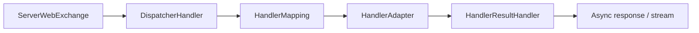

<!-- migration-doc: authority=authoritative canonical=../迁移验收规范.md -->
# vernal-webflux 技术要求
> 迁移文档治理：本文级别为 **authoritative**。正文中的历史统计或完成标记不得单独作为验收结论；以 [../迁移验收规范.md](../迁移验收规范.md) 和自动审计报告为准。


> 当前权威规范：[迁移验收规范](../迁移验收规范.md)。Spring 基线提交：
> `9e8cea3ef8ae02efb7956b071cd7bbef7c22cb82`。

## 事实基线

- 来源：`spring-webflux/src/main/java/org/springframework`，252 个业务对象文件。
- 目标：当前不存在 `crates/vernal-webflux`。
- 状态：`PLANNED`；不能用 Tokio、Tower 或某个 Web runtime “天然支持异步”来豁免对象和语义。

## 规划目录

| Java | 目标 |
|---|---|
| `web/reactive/DispatcherHandler.java` | `web/reactive/dispatcher_handler.rs` |
| `web/reactive/handler/AbstractHandlerMapping.java` | `reactive/handler/abstract_handler_mapping.rs` |
| `web/reactive/function/server/RouterFunction.java` | `function/server/router_function.rs` |
| `web/reactive/result/method/annotation/RequestMappingHandlerAdapter.java` | `method/annotation/request_mapping_handler_adapter.rs` |

`Mono<T>` 映射为 async `Result<T, E>`；`Flux<T>` 映射为带 `Send` 的错误流，并保留取消、
背压、响应提交和错误恢复语义。



---

<!-- restored-detail-from-head: dd20300d16a09200bd8a379ff14db1e2da99b67c -->

## 原详细文档（完整保留）

> 以下正文完整恢复自 Vernal 提交 `dd20300d16a09200bd8a379ff14db1e2da99b67c`。其中历史对象数量、完成状态、
> 路径算法和依赖替代结论如与本文顶部或自动对象台账冲突，以顶部当前结论和
> `docs/migration-audit/` 为准；其 API、设计背景、阶段拆解和测试说明继续保留。

# vernal-webflux 技术要求（对标 spring-webflux）

> **版本**：v1.0（2026-07-28）
> **对标**：`spring-webflux` 6.1 / Spring Framework 6.1
> **Rust 基线**：edition 2024 / rustc 1.88
> **crate 现状**：待建（规划中）
> **选型**：Topcoat 响应式模式

---

## 一、概述与定位

### 1.1 crate 职责

`vernal-webflux` 是 Vernal Framework 的**响应式 Web 编程模型层**，对标 Spring
Framework 中的 `spring-webflux` 模块。它在 `vernal-web` 的框架中立合同之上，
提供基于 Rust 原生 `async`/`await` + `futures` 的响应式编程模型，包括函数式
端点、流式响应、SSE 和背压传播。

**核心设计理念**：Rust 不需要 Project Reactor。Vernal 直接使用 Rust 原生
`Future`/`Stream` 和 Tokio 运行时能力，不发明第二套响应式类型系统。

```
Spring WebFlux                    Vernal WebFlux
  Mono<T>           →             impl Future<Output = T>
  Flux<T>           →             impl Stream<Item = T>
  WebFilter         →             Tower Layer / Topcoat Middleware
  RouterFunction    →             Topcoat RouterBuilder DSL
  ServerResponse    →             http::Response + Stream Body
  ServerSentEvent   →             SSE 流式响应
```

### 1.2 在双轨架构中的位置

```
轨道一：Topcoat 全栈主线
  ┌──────────────────────────────────────────────┐
  │  vernal-webflux (本 crate)                    │
  │    ├─ DispatcherHandler → Topcoat Router       │
  │    ├─ RouterBuilder DSL → 函数式端点           │
  │    ├─ Stream Body       → Rust Stream          │
  │    └─ SSE 支持          → tokio-stream         │
  ├──────────────────────────────────────────────┤
  │  vernal-webmvc                                 │
  │    └─ 传统 MVC Handler（同步风格）              │
  ├──────────────────────────────────────────────┤
  │  vernal-web (框架中立合同)                      │
  └──────────────────────────────────────────────┘
```

### 1.3 设计约束

1. **`#![forbid(unsafe_code)]`**：与 vernal-web 保持一致。
2. **Rust 原生响应式**：使用 `Future`/`Stream` 而非自建 `Mono`/`Flux`。
3. **Tokio-first**：基于 Tokio 运行时，使用 `tokio-stream` 适配。
4. **背压传播**：Stream Body 必须传播上游背压，不使用无限队列。
5. **取消安全**：Stream 处理必须响应 `CancellationToken`。
6. **Send + Sync**：所有公共类型满足跨线程边界。

---

## 二、待建 crate 规划

### 2.1 目录结构

```
crates/vernal-webflux/
├── Cargo.toml
└── src/
    ├── lib.rs                      # 入口
    ├── dispatcher_handler.rs       # 请求分发器
    ├── router_builder.rs           # 函数式端点 RouterBuilder DSL
    ├── server_response.rs          # 流式响应构建器
    ├── server_sent_event.rs        # SSE 事件类型
    ├── sse_stream.rs               # SSE 流式适配
    ├── stream_body.rs              # Stream Body 封装
    ├── filter.rs                   # WebFilter trait
    ├── handler_function.rs         # 函数式 Handler trait
    ├── request_predicate.rs        # 请求谓词
    ├── content_type_negotiation.rs # 内容协商
    ├── exception_handler.rs        # 响应式异常处理
    ├── backpressure.rs             # 背压策略
    └── cancellation.rs             # 取消传播
```

### 2.2 Cargo.toml 依赖规划

```toml
[package]
name = "vernal-webflux"
edition = "2024"
rust-version = "1.88"

[dependencies]
vernal-web = { path = "../vernal-web" }
vernal-aop = { path = "../vernal-aop" }
vernal-beans = { path = "../vernal-beans" }
vernal-context = { path = "../vernal-context" }
http = "1.4.0"
http-body = "1.0.1"
http-body-util = "0.1.3"
tokio = { version = "1.52.4", features = ["rt-multi-thread", "sync", "time"] }
tokio-stream = { version = "0.1", features = ["sync"] }
futures-core = "0.3.32"
futures-util = { version = "0.3.32", features = ["sink"] }
bytes = "1.11.1"
serde = { version = "1.0.228", features = ["derive"] }
serde_json = "1.0.150"
thiserror = "2.0"
tracing = "0.1.41"
pin-project-lite = "0.2"
```

### 2.3 实施阶段

| 阶段 | 内容 | 前置条件 |
|:---|:---|:---|
| P0 | trait 定义（HandlerFunction、WebFilter、ServerResponse） | vernal-web 稳定 |
| P1 | RouterBuilder DSL + 函数式端点 | Topcoat 0.5 流式 API 稳定 |
| P2 | SSE 流式响应 + Stream Body | tokio-stream 集成验证 |
| P3 | 背压传播 + 取消安全 | 性能基准测试 |
| P4 | 合同测试 + 文档 | 所有 trait 实现完成 |

---

## 三、选型与依赖

### 3.1 核心选型

引用 [Spring 组件替换约定](../Spring-组件替换约定.md) 第 4.1 节"双轨架构"。

| 用途 | crate / 技术 | 说明 |
|:---|:---|:---|
| 响应式框架 | Topcoat 0.5 响应式模式 | tokio-rs 官方全栈框架 |
| 函数式路由 | Topcoat RouterBuilder | 声明式函数端点 |
| 异步 Stream | `futures-core` 0.3 | `Stream` trait |
| Stream 工具 | `futures-util` 0.3 | Stream 组合器 |
| Stream 适配 | `tokio-stream` 0.1 | Tokio channel → Stream |
| 异步运行时 | `tokio` 1.52.4 | `rt-multi-thread`、`sync` |
| HTTP Body | `http-body` 1.0.1 | Stream Body trait |
| 字节操作 | `bytes` 1.11.1 | 零拷贝字节缓冲 |
| 取消传播 | `tokio-util` 0.7.16 | `CancellationToken` |
| pin 工具 | `pin-project-lite` 0.2 | 安全 pin 投影 |

### 3.2 Mono/Flux → Rust 映射

Spring WebFlux 的核心类型在 Rust 中的对应：

| Spring WebFlux | Rust 对应 | 说明 |
|:---|:---|:---|
| `Mono<T>` | `impl Future<Output = Result<T, E>>` | 单值异步结果 |
| `Flux<T>` | `impl Stream<Item = Result<T, E>>` | 多值异步流 |
| `Mono<Void>` | `impl Future<Output = Result<(), E>>` | 无值异步操作 |
| `Flux<DataBuffer>` | `impl Stream<Item = Result<Bytes, E>>` | 字节流 |
| `Mono<ServerResponse>` | `http::Response<StreamBody>` | HTTP 响应 |
| `Scheduler` | `tokio::task::spawn` / `spawn_blocking` | 调度策略 |
| `Disposable` | `CancellationToken` | 取消句柄 |
| `BackpressureStrategy` | `BackpressurePolicy` | 背压策略 |

### 3.3 不引入的方案

| 方案 | 原因 |
|:---|:---|
| `futures` 全量依赖 | 只需 `futures-core` + `futures-util` |
| `async-stream` 宏 | 增加复杂度，`async fn` + `yield` 足够 |
| `tokio::sync::broadcast` | 用于多播，SSE 使用 `watch` 或自建 |
| 自建 `Mono`/`Flux` 类型 | Rust 原生 `Future`/`Stream` 已足够 |

---

## 四、核心组件设计

### 4.1 DispatcherHandler

Spring WebFlux 的 `DispatcherHandler` 是请求分发入口。vernal-webflux 中由
Topcoat Router + 中间件链承担：

```rust
/// 响应式请求分发器，对标 DispatcherHandler。
///
/// 将 HTTP 请求分发到匹配的函数式端点，支持同步和流式响应。
pub struct DispatcherHandler {
    router: topcoat::Router,
    app_context: Arc<ApplicationContext>,
    exception_handler: Arc<dyn ExceptionHandler>,
}

impl DispatcherHandler {
    /// 创建分发器。
    pub fn new(
        router: topcoat::Router,
        app_context: Arc<ApplicationContext>,
        exception_handler: Arc<dyn ExceptionHandler>,
    ) -> Self {
        Self { router, app_context, exception_handler }
    }

    /// 处理请求。
    pub async fn handle(
        &self,
        request: http::Request<impl http_body::Body>,
    ) -> http::Response<StreamBody> {
        // 1. 创建请求上下文
        // 2. 路由匹配
        // 3. AOP 拦截链
        // 4. 函数式端点调用
        // 5. 异常处理
        // 6. 返回流式响应
        todo!()
    }
}
```

### 4.2 RouterBuilder DSL

Spring WebFlux 的 `RouterFunction` 在 Vernal 中通过 RouterBuilder DSL 实现，
对标 `RouterFunctions.route()`：

```rust
/// 函数式路由构建器，对标 Spring WebFlux 的 RouterFunction DSL。
///
/// 提供声明式路由注册，每个路由绑定一个请求谓词和一个 Handler 函数。
pub struct RouterBuilder {
    routes: Vec<RouteDefinition>,
}

impl RouterBuilder {
    /// 创建路由构建器。
    pub fn new() -> Self {
        Self { routes: Vec::new() }
    }

    /// 注册 GET 路由。
    pub fn get<F, Fut, B>(mut self, pattern: &str, handler: F) -> Self
    where
        F: Fn(RequestContext) -> Fut + Send + Sync + 'static,
        Fut: Future<Output = Result<http::Response<B>, WebFailure>> + Send,
        B: http_body::Body + Send + 'static,
    {
        self.routes.push(RouteDefinition {
            method: http::Method::GET,
            pattern: pattern.to_string(),
            handler: Box::new(move |ctx| Box::pin(handler(ctx))),
        });
        self
    }

    /// 注册 POST 路由。
    pub fn post<F, Fut, B>(mut self, pattern: &str, handler: F) -> Self
    where
        F: Fn(RequestContext) -> Fut + Send + Sync + 'static,
        Fut: Future<Output = Result<http::Response<B>, WebFailure>> + Send,
        B: http_body::Body + Send + 'static,
    {
        self.routes.push(RouteDefinition {
            method: http::Method::POST,
            pattern: pattern.to_string(),
            handler: Box::new(move |ctx| Box::pin(handler(ctx))),
        });
        self
    }

    /// 注册 SSE 流式路由。
    pub fn sse<F, S, T>(mut self, pattern: &str, handler: F) -> Self
    where
        F: Fn(RequestContext) -> S + Send + Sync + 'static,
        S: Stream<Item = Result<T, WebFailure>> + Send + 'static,
        T: Serialize + Send + 'static,
    {
        self.routes.push(RouteDefinition {
            method: http::Method::GET,
            pattern: pattern.to_string(),
            handler: Box::new(move |ctx| {
                let stream = handler(ctx);
                Box::pin(async move {
                    Ok(SseStream::new(stream).into_response())
                })
            }),
        });
        self
    }

    /// 构建 Topcoat Router。
    pub fn build(self) -> topcoat::Router {
        let mut router = topcoat::Router::new();
        for route in self.routes {
            router = router.route(&route.pattern, route.into_topcoat());
        }
        router
    }
}
```

### 4.3 函数式端点

Spring WebFlux 的 `HandlerFunction` 在 Vernal 中定义为：

```rust
/// 函数式 Handler，对标 Spring WebFlux 的 HandlerFunction。
///
/// 接收请求上下文，返回 HTTP 响应。
#[async_trait]
pub trait HandlerFunction: Send + Sync {
    /// 响应 Body 类型。
    type Body: http_body::Body + Send + 'static;

    /// 处理请求。
    async fn handle(
        &self,
        request: RequestContext,
    ) -> Result<http::Response<Self::Body>, WebFailure>;
}

/// 请求谓词，对标 Spring WebFlux 的 RequestPredicate。
///
/// 用于路由匹配前的额外条件检查。
pub trait RequestPredicate: Send + Sync {
    /// 检查请求是否匹配。
    fn test(&self, request: &http::Request<()>) -> bool;
}
```

### 4.4 Stream Body

Spring WebFlux 的 `Flux<DataBuffer>` 在 Vernal 中封装为 `StreamBody`：

```rust
/// 流式 HTTP 响应 Body，对标 Spring WebFlux 的 Flux<DataBuffer>。
///
/// 将 `Stream<Item = Result<Bytes, E>>` 包装为 `http_body::Body` 实现，
/// 保留上游背压和错误传播。
pub struct StreamBody<S> {
    stream: S,
    state: StreamBodyState,
}

impl<S, E> http_body::Body for StreamBody<S>
where
    S: Stream<Item = Result<Bytes, E>> + Send,
    E: Into<Box<dyn std::error::Error + Send + Sync>>,
{
    type Data = Bytes;
    type Error = Box<dyn std::error::Error + Send + Sync>;

    fn poll_frame(
        self: Pin<&mut Self>,
        cx: &mut Context<'_>,
    ) -> Poll<Option<Result<Frame<Self::Data>, Self::Error>>> {
        // 从 Stream 拉取下一个数据帧
        // 传播上游背压（返回 Poll::Pending）
        // 传播上游错误（返回 Err）
        // Stream 结束时返回 None
        todo!()
    }

    fn size_hint(&self) -> http_body::SizeHint {
        // 流式 Body 无法预知大小
        http_body::SizeHint::new()
    }
}
```

### 4.5 SSE 流式响应

```rust
/// Server-Sent Event，对标 Spring WebFlux 的 ServerSentEvent。
#[derive(Debug, Clone, Serialize)]
pub struct ServerSentEvent<T> {
    /// 事件 ID。
    #[serde(skip)]
    pub id: Option<String>,
    /// 事件类型。
    #[serde(skip)]
    pub event: Option<String>,
    /// 重试间隔（毫秒）。
    #[serde(skip)]
    pub retry: Option<u64>,
    /// 事件数据。
    pub data: T,
}

impl<T: Serialize> ServerSentEvent<T> {
    /// 转换为 SSE 文本格式。
    pub fn to_sse_text(&self) -> String {
        let mut text = String::new();
        if let Some(id) = &self.id {
            text.push_str(&format!("id: {id}\n"));
        }
        if let Some(event) = &self.event {
            text.push_str(&format!("event: {event}\n"));
        }
        if let Some(retry) = self.retry {
            text.push_str(&format!("retry: {retry}\n"));
        }
        let data = serde_json::to_string(&self.data).unwrap_or_default();
        for line in data.lines() {
            text.push_str(&format!("data: {line}\n"));
        }
        text.push('\n');
        text
    }
}

/// SSE 流式响应，将 Stream<Item = T> 转换为 SSE HTTP 响应。
pub struct SseStream<S> {
    stream: S,
    keep_alive: Option<Duration>,
}

impl<S, T> SseStream<S>
where
    S: Stream<Item = Result<T, WebFailure>> + Send + 'static,
    T: Serialize + Send + 'static,
{
    /// 创建 SSE 流。
    pub fn new(stream: S) -> Self {
        Self { stream, keep_alive: Some(Duration::from_secs(30)) }
    }

    /// 设置 keep-alive 间隔。
    pub fn keep_alive(mut self, interval: Duration) -> Self {
        self.keep_alive = Some(interval);
        self
    }

    /// 转换为 HTTP 响应。
    pub fn into_response(self) -> http::Response<StreamBody<impl Stream<Item = Result<Bytes, WebFailure>>>> {
        let sse_stream = self.stream.map(|item| {
            match item {
                Ok(data) => {
                    let event = ServerSentEvent { data, ..Default::default() };
                    Ok(Bytes::from(event.to_sse_text()))
                }
                Err(e) => Err(e),
            }
        });

        let body = StreamBody::new(sse_stream);
        http::Response::builder()
            .status(200)
            .header("content-type", "text/event-stream")
            .header("cache-control", "no-cache")
            .header("connection", "keep-alive")
            .body(body)
            .unwrap()
    }
}
```

### 4.6 WebFilter

```rust
/// 响应式过滤器，对标 Spring WebFlux 的 WebFilter。
///
/// 在请求到达 Handler 之前和响应返回之后执行。
#[async_trait]
pub trait WebFilter: Send + Sync {
    /// 过滤请求。
    ///
    /// 返回 `Ok(response)` 表示短路，返回 `Err` 表示继续传递。
    async fn filter(
        &self,
        request: &mut RequestContext,
        next: &dyn WebFilterChain,
    ) -> Result<http::Response<StreamBody>, WebFailure>;
}

/// 过滤器链。
#[async_trait]
pub trait WebFilterChain: Send + Sync {
    /// 继续执行下一个过滤器。
    async fn next(
        &self,
        request: &mut RequestContext,
    ) -> Result<http::Response<StreamBody>, WebFailure>;
}
```

---

## 五、背压与取消语义

### 5.1 背压传播

Spring WebFlux 通过 Project Reactor 的背压机制控制流量。Vernal 直接使用 Rust
`Stream` 的 poll 模型实现背压：

```
上游数据源 (Database / MQ / Timer)
  │
  │  Stream::poll_next() → Poll::Ready(Some(item))
  │  无需求时 → Poll::Pending（暂停生产）
  │
  ▼
StreamBody::poll_frame()
  │
  │  传递给 HTTP 传输层
  │  传输层缓冲区满时 → 返回 Poll::Pending
  │
  ▼
客户端接收
```

**约束**：

- Stream Body **不能**使用无界队列缓冲。
- Adapter **只能**桥接上游背压，不能通过无限队列伪造吞吐。
- `BackpressurePolicy` 控制出站行为：

```rust
/// 背压策略。
pub enum BackpressurePolicy {
    /// 等待消费者就绪（默认）。
    Wait,
    /// 丢弃最旧的消息。
    DropOldest,
    /// 丢弃最新的消息。
    DropNewest,
    /// 返回错误。
    Error,
}
```

### 5.2 取消传播

```
客户端断开连接
  │
  ▼
CancellationToken::cancel()
  │
  ├──→ Stream 处理中断
  │      └──→ 资源清理（关闭数据库连接、取消订阅等）
  │
  ├──→ WebRequestScope::close()
  │      └──→ 逆序执行关闭钩子
  │
  └──→ AOP 拦截链中断
         └──→ 事务回滚（如果已开启）
```

**约束**：

- 取消清理**必须**幂等，不能依赖 `Drop` 中执行异步工作。
- 需要异步释放的组件由 Scope 显式 `close().await`。
- 默认等待上限为 30 秒。

### 5.3 取消安全的 Stream 实现

```rust
/// 取消安全的 Stream 包装器。
///
/// 当 CancellationToken 被触发时，Stream 停止产生新元素，
/// 但允许当前元素完成处理。
pub struct CancellableStream<S> {
    inner: S,
    cancellation: CancellationToken,
}

impl<S, T> Stream for CancellableStream<S>
where
    S: Stream<Item = T> + Unpin,
{
    type Item = T;

    fn poll_next(
        mut self: Pin<&mut Self>,
        cx: &mut Context<'_>,
    ) -> Poll<Option<Self::Item>> {
        // 检查取消令牌
        if self.cancellation.is_cancelled() {
            return Poll::Ready(None);
        }

        // 尝试从内部 Stream 获取下一个元素
        Pin::new(&mut self.inner).poll_next(cx)
    }
}
```

---

## 六、集成规范与引用约定

### 6.1 引用约定

本文档引用 [Spring 组件替换约定](../Spring-组件替换约定.md) 第 4.1 节"双轨架构"。

具体引用条目：

- **4.1 双轨架构**：vernal-webflux 属于轨道一 Topcoat 全栈主线。
- **4.2 轨道一 Topcoat 全栈主线**：vernal-webflux 对标 `spring-webflux`，提供
  Topcoat 响应式集成。
- **4.4 传输层基础 crate**：`http` 1.4、`http-body` 1.0、`tower` 0.5。
- **4.5 WebSocket**：SSE 与 WebSocket 的选型边界。

### 6.2 与兄弟 crate 的关系

```
vernal-webflux
  ├── 依赖 vernal-web      (框架中立合同)
  ├── 依赖 vernal-aop      (AOP 拦截链)
  ├── 依赖 vernal-beans    (IoC 容器)
  ├── 依赖 vernal-context  (ApplicationContext)
  ├── 扩展 vernal-webmvc   (从 MVC 迁移到响应式)
  ├── 协作 vernal-websocket (SSE vs WebSocket 选型)
  └── 被 vernal-web-testkit 测试
```

### 6.3 SSE vs WebSocket 选型

| 维度 | SSE（vernal-webflux） | WebSocket（vernal-websocket） |
|:---|:---|:---|
| 方向 | 服务端 → 客户端单向 | 双向通信 |
| 协议 | HTTP/1.1 或 HTTP/2 | 独立协议（RFC 6455） |
| 重连 | 浏览器自动重连 | 需手动实现 |
| 二进制 | 不支持（仅文本） | 支持 |
| 子协议 | 不支持 | 支持（STOMP 等） |
| 适用场景 | 通知、实时数据推送、日志流 | 聊天、协作编辑、游戏 |

### 6.4 与轨道二适配器的关系

vernal-webflux **不替代**轨道二适配器的流式能力。Tonic 适配器已支持 gRPC
流式；其他 HTTP 框架适配器通过各自的 Body 类型支持流式响应。vernal-webflux
提供的是 Topcoat 全栈主线的**统一响应式编程模型**。

### 6.5 测试策略

| 测试类别 | 覆盖内容 |
|:---|:---|
| 单元测试 | RouterBuilder、SseStream、StreamBody 等独立组件 |
| 集成测试 | 完整响应式请求链：路由 → Handler → Stream Body → 响应 |
| 背压测试 | 慢消费者场景，验证不会无限缓冲 |
| 取消测试 | 客户端断开后，Stream 中止、Scope 关闭、资源释放 |
| SSE 测试 | 多客户端订阅、事件格式、重连语义 |
| 性能基准 | 吞吐量、延迟、内存使用 |

### 6.6 后续演进

| 阶段 | 内容 | 前置条件 |
|:---|:---|:---|
| Phase 5 | trait 定义 + 骨架 crate | vernal-web 稳定 |
| Phase 6 | RouterBuilder DSL + 函数式端点 | Topcoat 0.5 流式 API 稳定 |
| Phase 6 | SSE 流式响应 + Stream Body | tokio-stream 集成验证 |
| Phase 7 | 背压传播 + 取消安全 | 性能基准测试 |
| Phase 8 | WebSocket 流式集成 | vernal-websocket STOMP 集成 |

---

> **文档结束** — vernal-webflux 是 Vernal Web 层的响应式编程模型，基于 Rust
> 原生 `Future`/`Stream` 和 Topcoat 全栈框架。选型依据参见
> [Spring 组件替换约定](../Spring-组件替换约定.md) 第 4.1 节。
