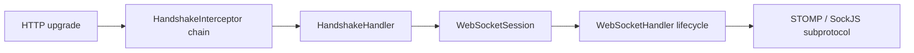

<!-- migration-doc: authority=authoritative canonical=../迁移验收规范.md -->
# vernal-websocket 技术要求
> 迁移文档治理：本文级别为 **authoritative**。正文中的历史统计或完成标记不得单独作为验收结论；以 [../迁移验收规范.md](../迁移验收规范.md) 和自动审计报告为准。


> 规则见[迁移验收规范](../迁移验收规范.md)；真实统计见
> [vernal-websocket 审计](../migration-audit/vernal-websocket.md)。

## 基线

- 来源：`spring-websocket`，149 个 Java 业务对象。
- 当前严格状态：13 `IMPLEMENTED`、8 `MISPLACED`、125 `MISSING`、3 `UNVERIFIED`。
- 多个现有文件定义多个公开对象，违反“一文件一对象”，必须拆分后再验收。

## 目录与边界

| Java | 目标 Rust |
|---|---|
| `web/socket/WebSocketHandler.java` | `web/socket/websocket_handler.rs` |
| `web/socket/server/support/DefaultHandshakeHandler.java` | `server/support/default_handshake_handler.rs` |
| `web/socket/sockjs/frame/SockJsFrame.java` | `sockjs/frame/sock_js_frame.rs` |
| `web/socket/messaging/SubProtocolWebSocketHandler.java` | `socket/messaging/sub_protocol_web_socket_handler.rs` |

WebSocket 协议、session、handler、handshake、SockJS、STOMP 都按 Spring 包末两层组织；
底层 Tokio/WebSocket 库只能作为依赖，不可模糊豁免 Spring 对象。



---

<!-- restored-detail-from-head: dd20300d16a09200bd8a379ff14db1e2da99b67c -->

## 原详细文档（完整保留）

> 以下正文完整恢复自 Vernal 提交 `dd20300d16a09200bd8a379ff14db1e2da99b67c`。其中历史对象数量、完成状态、
> 路径算法和依赖替代结论如与本文顶部或自动对象台账冲突，以顶部当前结论和
> `docs/migration-audit/` 为准；其 API、设计背景、阶段拆解和测试说明继续保留。

# vernal-websocket 技术要求（对标 spring-websocket）

> **版本**：v1.0（2026-07-28）
> **对标**：`spring-websocket` 6.1 / Spring Framework 6.1
> **Rust 基线**：edition 2024 / rustc 1.88
> **crate 现状**：已实现（99 文件 / 8659 行，较完整）
> **选型**：tokio-websockets 0.12.0（Tokio-native WebSocket 库）
> **引用约定**：《Spring 组件替换约定》第 4.3 节（轨道二：API 后端适配器矩阵）

---

## 一、概述与定位

### 1.1 crate 职责

`vernal-websocket` 是 Vernal Framework 的 **WebSocket 抽象层**，对标
Spring Framework 中的 `spring-websocket` 模块。它在 `tokio-websockets` 之上，
提供 Spring WebSocket 语义的编程模型，包括 `WebSocketHandler`、
`WebSocketSession`、`HandshakeInterceptor` 和 STOMP 子协议。

当前 crate 已较完整实现（99 文件 / 8659 行），覆盖了 spring-websocket 的
核心功能。本文档梳理现有实现状态、对标关系和待完善事项。

```
WebSocket 层全景
  ┌─────────────────────────────────────────────────┐
  │  vernal-websocket (本 crate，99 文件/8659 行)     │
  │    ├─ handler/       → WebSocketHandler 体系      │
  │    ├─ session/       → WebSocketSession 体系      │
  │    ├─ server/        → 握手处理 + 拦截器          │
  │    ├─ stomp/         → STOMP 子协议编解码         │
  │    ├─ sockjs/        → SockJS 传输层 🚫           │
  │    ├─ messaging/     → 消息子协议处理器           │
  │    ├─ client/        → WebSocket 客户端           │
  │    └─ adapter/       → 会话适配器                 │
  ├─────────────────────────────────────────────────┤
  │  tokio-websockets 0.12.0 (底层传输)              │
  │    └─ Tokio-native WebSocket 帧编解码            │
  ├─────────────────────────────────────────────────┤
  │  vernal-messaging (消息通道抽象)                  │
  │    └─ Message / MessageChannel / MessageHandler   │
  ├─────────────────────────────────────────────────┤
  │  vernal-web (框架中立合同)                        │
  │    └─ RequestContext / Handler 抽象               │
  └─────────────────────────────────────────────────┘
```

### 1.2 与 spring-websocket 的对齐边界

| spring-websocket 概念 | vernal-websocket 对应 | 状态 | 说明 |
|:---|:---|:---:|:---|
| `WebSocketHandler` | `WebSocketHandler` trait | 已实现 | 消息处理核心 trait |
| `WebSocketSession` | `WebSocketSession` trait | 已实现 | 会话抽象 |
| `TextWebSocketHandler` | `TextWebSocketHandler` | 已实现 | 文本消息处理器 |
| `BinaryWebSocketHandler` | `BinaryWebSocketHandler` | 已实现 | 二进制消息处理器 |
| `HandshakeInterceptor` | `HandshakeInterceptor` trait | 已实现 | 握手拦截器 |
| `DefaultHandshakeHandler` | `DefaultHandshakeHandler` | 已实现 | 默认握手处理器 |
| `WebSocketMessage` | `WebSocketMessage` enum | 已实现 | 消息类型枚举 |
| `CloseStatus` | `CloseStatus` / `CloseCode` | 已实现 | 关闭状态码 |
| `WebSocketSession` (STOMP) | `SubProtocolHandler` | 已实现 | 子协议处理器 |
| `SockJS` | `sockjs/` 模块 | 已实现 | SockJS 传输层 |
| `WebSocketClient` | `WebSocketClient` | 已实现 | 客户端支持 |
| `WebSocketExtension` | `WebSocketExtension` | 已实现 | 扩展支持 |

### 1.3 现状统计

| 模块 | 文件数 | 行数 | 说明 |
|:---|:---:|:---:|:---|
| `handler/` | 13 | ~1800 | Handler 装饰器链 |
| `session/` | 1 | ~170 | 会话抽象 |
| `server/` | 10 | ~900 | 握手处理 |
| `stomp/` | 3 | ~400 | STOMP 编解码 |
| `sockjs/` | 28 | ~2500 | SockJS 传输层 |
| `messaging/` | 7 | ~700 | 消息子协议 |
| `client/` | 5 | ~500 | 客户端 |
| `adapter/` | 3 | ~250 | 会话适配器 |
| 其他模块 | 29 | ~1400 | 配置/错误/生命周期等 |
| **合计** | **99** | **~8659** | |

### 1.4 设计约束

1. **`#![forbid(unsafe_code)]`**：lib.rs 第一行声明。
2. **tokio-websockets-first**：默认 feature 使用 tokio-websockets 0.12.0。
3. **IoC 桥接**：Handler 通过 vernal-beans `Container` 解析，支持依赖注入。
4. **Send + Sync**：所有公共类型满足跨线程边界。
5. **子协议扩展**：通过 `SubProtocolHandler` trait 支持 STOMP 等子协议。
6. **版本锁定**：Cargo.toml 锁定 `tokio-websockets = "=0.12.0"`。

---

## 二、现有实现详解

### 2.1 核心 trait：WebSocketHandler

```rust
/// WebSocket 消息处理器，对标 spring-websocket WebSocketHandler。
pub trait WebSocketHandler: Send + Sync {
    /// 连接建立后调用。
    fn after_connection_established(
        &self,
        session: &dyn WebSocketSession,
    ) -> HandlerFuture<'_>;

    /// 收到文本消息时调用。
    fn handle_text_message(
        &self,
        message: &str,
        session: &dyn WebSocketSession,
    ) -> HandlerFuture<'_>;

    /// 收到二进制消息时调用。
    fn handle_binary_message(
        &self,
        payload: &[u8],
        session: &dyn WebSocketSession,
    ) -> HandlerFuture<'_>;

    /// 收到 Ping 消息时调用。
    fn handle_ping_message(
        &self,
        payload: &[u8],
        session: &dyn WebSocketSession,
    ) -> HandlerFuture<'_>;

    /// 收到 Pong 消息时调用。
    fn handle_pong_message(
        &self,
        payload: &[u8],
        session: &dyn WebSocketSession,
    ) -> HandlerFuture<'_>;

    /// 连接关闭时调用。
    fn after_connection_closed(
        &self,
        close_status: &CloseStatus,
        session: &dyn WebSocketSession,
    ) -> HandlerFuture<'_>;

    /// 收到传输错误时调用。
    fn handle_transport_error(
        &self,
        error: &WebSocketError,
        session: &dyn WebSocketSession,
    ) -> HandlerFuture<'_>;
}
```

### 2.2 核心 trait：WebSocketSession

```rust
/// WebSocket 会话，对标 spring-websocket WebSocketSession。
pub trait WebSocketSession: Send + Sync {
    /// 返回会话 ID。
    fn id(&self) -> &str;

    /// 返回请求 URI。
    fn uri(&self) -> Option<&Uri>;

    /// 返回握手请求头。
    fn headers(&self) -> &HeaderMap;

    /// 返回当前状态。
    fn state(&self) -> SessionState;

    /// 返回协商出的子协议。
    fn accepted_protocol(&self) -> Option<&str>;

    /// 发送消息。
    fn send(
        &self,
        message: WebSocketMessage,
    ) -> HandlerFuture<'_, Result<(), WebSocketError>>;

    /// 关闭会话。
    fn close(
        &self,
        status: CloseStatus,
    ) -> HandlerFuture<'_, Result<(), WebSocketError>>;
}

/// 会话状态。
pub enum SessionState {
    Connecting,
    Open,
    Closing,
    Closed,
    Failed,
}
```

### 2.3 消息类型

```rust
/// WebSocket 消息类型，对标 spring-websocket WebSocketMessage。
pub enum WebSocketMessage {
    Text(String),
    Binary(Bytes),
    Ping(Bytes),
    Pong(Bytes),
    Continuation {
        payload: Bytes,
        is_final: bool,
    },
    Close(Option<CloseStatus>),
}
```

### 2.4 握手处理

```rust
/// 握手请求快照。
pub struct HandshakeRequest {
    pub method: Method,
    pub uri: Uri,
    pub headers: HeaderMap,
}

impl HandshakeRequest {
    /// 从 HTTP 元数据创建快照。
    pub fn new(method: Method, uri: Uri, headers: HeaderMap) -> Self { ... }

    /// 验证 RFC 6455 基本握手头。
    pub fn validate(&self) -> Result<(), WebSocketError> { ... }

    /// 按客户端请求头协商子协议。
    pub fn negotiate_subprotocol(&self, supported: &[String]) -> Option<String> { ... }
}

/// Origin 白名单策略。
pub struct OriginPolicy {
    allowed: Vec<String>,
    allow_missing: bool,
}

impl OriginPolicy {
    pub fn deny_all() -> Self { ... }
    pub fn allow_all() -> Self { ... }
    pub fn allow(mut self, origin: impl Into<String>) -> Self { ... }
    pub fn allow_missing(mut self, allow: bool) -> Self { ... }
    pub fn validate(&self, headers: &HeaderMap) -> Result<(), WebSocketError> { ... }
}
```

### 2.5 拦截器体系

```rust
/// 握手拦截器，对标 spring-websocket HandshakeInterceptor。
pub trait HandshakeInterceptor: Send + Sync {
    /// 握手前拦截。
    fn before_handshake(
        &self,
        request: &HandshakeRequest,
    ) -> impl Future<Output = Result<bool, WebSocketError>> + Send;

    /// 握手后拦截。
    fn after_handshake(
        &self,
        request: &HandshakeRequest,
        response: &mut http::Response<()>,
    ) -> impl Future<Output = Result<(), WebSocketError>> + Send;
}
```

---

## 三、STOMP 子协议

### 3.1 STOMP 编解码

`vernal-websocket` 内置 STOMP 子协议支持，位于 `stomp/` 模块：

```rust
/// STOMP 帧。
pub struct StompFrame {
    pub command: StompCommand,
    pub headers: StompHeaders,
    pub body: Option<Bytes>,
}

/// STOMP 命令。
pub enum StompCommand {
    Connect,
    Connected,
    Disconnect,
    Send,
    Subscribe,
    Unsubscribe,
    Ack,
    Nack,
    Message,
    Receipt,
    Error,
    Heartbeat,
}

/// STOMP 头部。
pub struct StompHeaders {
    headers: HashMap<String, String>,
}

impl StompHeaders {
    pub fn get(&self, key: &str) -> Option<&str> { ... }
    pub fn set(&mut self, key: impl Into<String>, value: impl Into<String>) { ... }
    pub fn destination(&self) -> Option<&str> { ... }
    pub fn content_type(&self) -> Option<&str> { ... }
    pub fn subscription(&self) -> Option<&str> { ... }
    pub fn message_id(&self) -> Option<&str> { ... }
}
```

### 3.2 STOMP 子协议处理器

```rust
/// STOMP 子协议处理器，对标 spring-websocket StompSubProtocolHandler。
pub struct StompSubProtocolHandler {
    // ... 内部状态
}

impl SubProtocolHandler for StompSubProtocolHandler {
    fn after_connection_established(
        &self,
        session: &dyn WebSocketSession,
    ) -> impl Future<Output = Result<(), WebSocketError>> + Send { ... }

    fn handle_message(
        &self,
        session: &dyn WebSocketSession,
        message: &WebSocketMessage,
    ) -> impl Future<Output = Result<(), WebSocketError>> + Send { ... }

    fn after_session_ended(
        &self,
        session: &dyn WebSocketSession,
        close_status: &CloseStatus,
    ) -> impl Future<Output = Result<(), WebSocketError>> + Send { ... }
}
```

---

## 四、SockJS 传输层

### 4.1 SockJS 模块现状

`vernal-websocket` 包含完整的 SockJS 传输层实现，位于 `sockjs/` 模块
（28 文件 / ~2500 行）。SockJS 提供在不支持 WebSocket 的环境中模拟
WebSocket 语义的传输层。

**重要声明**：SockJS 是**不推荐使用**的传输层。现代浏览器已全面支持
WebSocket，SockJS 仅用于兼容遗留环境。

### 4.2 SockJS 核心组件

```rust
/// SockJS 服务。
pub trait SockJsService: Send + Sync {
    fn handle_request(
        &self,
        request: &http::Request<()>,
    ) -> impl Future<Output = Result<http::Response<Vec<u8>>, SockJsError>> + Send;
}

/// SockJS 会话。
pub trait SockJsSession: Send + Sync {
    fn id(&self) -> &str;
    fn send(&self, message: &str) -> impl Future<Output = Result<(), SockJsError>> + Send;
    fn close(&self, code: u16, reason: &str) -> impl Future<Output = Result<(), SockJsError>> + Send;
}

/// SockJS 传输类型。
pub enum TransportType {
    WebSocket,
    XhrStreaming,
    XhrPolling,
    EventSource,
    HtmlFile,
    JsonpPolling,
}
```

### 4.3 SockJS 传输处理器

| 传输类型 | 实现文件 | 说明 |
|:---|:---|:---|
| WebSocket | `websocket_transport_handler.rs` | 原生 WebSocket 传输 |
| XHR Streaming | `abstract_http_sending_transport_handler.rs` | XHR 流式传输 |
| XHR Polling | `abstract_http_receiving_transport_handler.rs` | XHR 轮询传输 |
| EventSource | `streaming_sockjs_session.rs` | SSE 传输 |
| HTMLFile | `streaming_sockjs_session.rs` | HTMLFile 传输 |
| JSONP Polling | `polling_sockjs_session.rs` | JSONP 轮询传输 |

---

## 五、客户端与适配器

### 5.1 WebSocket 客户端

```rust
/// WebSocket 客户端，对标 spring-websocket WebSocketClient。
pub struct AbstractWebSocketClient {
    // ... 配置
}

impl AbstractWebSocketClient {
    /// 连接到远程 WebSocket 服务器。
    pub async fn connect(
        &self,
        url: &str,
        handler: Arc<dyn WebSocketHandler>,
    ) -> Result<Box<dyn WebSocketSession>, WebSocketError> { ... }

    /// 连接到远程 WebSocket 服务器，带握手拦截器。
    pub async fn connect_with_interceptors(
        &self,
        url: &str,
        handler: Arc<dyn WebSocketHandler>,
        interceptors: &[Arc<dyn HandshakeInterceptor>],
    ) -> Result<Box<dyn WebSocketSession>, WebSocketError> { ... }
}
```

### 5.2 会话适配器

```rust
/// 抽象 WebSocket 会话适配器。
pub struct AbstractWebSocketSession {
    // ... 包装底层会话
}

/// 原生 WebSocket 会话（基于 tokio-websockets）。
pub struct NativeWebSocketSession {
    // ... tokio-websockets 会话
}

/// 并发会话装饰器。
pub struct ConcurrentWebSocketSessionDecorator {
    // ... 线程安全包装
}

/// 会话装饰器（日志、异常处理等）。
pub struct WebSocketSessionDecorator {
    // ... 装饰器链
}
```

### 5.3 Handler 装饰器

`handler/` 模块提供了丰富的 Handler 装饰器链：

| 装饰器 | 说明 |
|:---|:---|
| `LoggingWebSocketHandlerDecorator` | 日志记录装饰器 |
| `ExceptionWebSocketHandlerDecorator` | 异常处理装饰器 |
| `PerConnectionWebSocketHandler` | 每连接独立 Handler |
| `BeanCreatingHandlerProvider` | IoC 容器 Handler 提供者 |
| `WebSocketHandlerDecorator` | 通用装饰器基类 |
| `WebSocketHandlerDecoratorFactory` | 装饰器工厂 |

---

## 六、版本规划与待完善事项

### 6.1 tokio-websockets 版本约定

当前 Cargo.toml 锁定 `tokio-websockets = "=0.12.0"`。版本升级注意事项：

| 版本 | 状态 | 说明 |
|:---|:---|:---|
| 0.12.0 | 当前锁定 | 稳定版本，已在生产环境验证 |
| 0.13.x | 待跟进 | 需评估 API 变更和兼容性 |

**升级流程**：
1. 检查 tokio-websockets 0.13 的 CHANGELOG 和 breaking changes
2. 更新 Cargo.toml 版本约束
3. 编译并运行全量测试
4. 验证 STOMP 子协议兼容性
5. 更新本文档版本号

### 6.2 已实现功能清单

| 功能 | 状态 | 说明 |
|:---|:---:|:---|
| WebSocketHandler trait | 已实现 | 核心消息处理 |
| WebSocketSession trait | 已实现 | 会话抽象 |
| HandshakeInterceptor | 已实现 | 握手拦截器 |
| DefaultHandshakeHandler | 已实现 | 默认握手 |
| OriginPolicy | 已实现 | Origin 校验 |
| WebSocketMessage | 已实现 | 消息类型枚举 |
| CloseStatus / CloseCode | 已实现 | 关闭状态码 |
| TextWebSocketHandler | 已实现 | 文本消息 |
| BinaryWebSocketHandler | 已实现 | 二进制消息 |
| STOMP 编解码 | 已实现 | StompFrame / StompCommand |
| STOMP 子协议处理器 | 已实现 | StompSubProtocolHandler |
| SockJS 传输层 | 已实现 | 28 文件完整实现 |
| WebSocketClient | 已实现 | 客户端连接 |
| 会话装饰器链 | 已实现 | 日志/异常/并发 |
| MemoryWebSocketSession | 已实现 | 测试用内存会话 |
| 生命周期管理 | 已实现 | LifecycleController |
| 背压控制 | 已实现 | BackpressurePolicy |
| WebSocket 扩展 | 已实现 | WebSocketExtension |

### 6.3 待完善事项

| 事项 | 优先级 | 说明 |
|:---|:---:|:---|
| tokio-websockets 0.13 跟进 | 中 | 评估 API 变更，更新版本约束 |
| SockJS 废弃标记 | 高 | 添加 `#[deprecated]` 注解，文档标注不推荐 |
| 集成测试补充 | 中 | 补充 STOMP 端到端测试 |
| 性能基准 | 低 | 大量并发连接的压力测试 |
| WebSocket over HTTP/2 | 低 | RFC 8441 支持 |

### 6.4 引用约定 4.3：适配器矩阵集成

参照《Spring 组件替换约定》第 4.3 节（轨道二：API 后端适配器矩阵），
`vernal-websocket` 通过 `vernal-messaging` 与 10 个 HTTP 框架适配器集成：

| 框架 | 集成方式 | 说明 |
|:---|:---|:---|
| Axum | `vernal-axum` WebSocket 路由 | 通过 axum::extract::ws 桥接 |
| Actix Web | `vernal-actix-web` WebSocket 路由 | 通过 actix-web-actors 桥接 |
| Rocket | `vernal-rocket` WebSocket 路由 | 通过 rocket_ws 桥接 |
| 其他 7 个框架 | 各自适配器 | 通过 vernal-messaging 统一消息通道 |

### 6.5 测试策略

#### 单元测试

- `WebSocketHandler` trait mock 实现
- `WebSocketSession` 状态机测试
- `HandshakeRequest` 验证测试
- `OriginPolicy` 白名单测试
- `StompFrame` 编解码测试
- `CloseStatus` / `CloseCode` 测试
- 背压控制测试

#### 集成测试

- STOMP 端到端消息传递测试
- 多客户端并发连接测试
- 握手拦截器链测试
- 会话生命周期测试
- 传输错误恢复测试

#### 性能基准

- 10000 并发连接压力测试
- 消息吞吐量（文本/二进制/STOMP）
- 内存占用（每连接开销）
- 握手延迟

### 6.6 与 spring-websocket 的差距分析

| 维度 | spring-websocket | vernal-websocket | 差距 |
|:---|:---|:---|:---|
| 核心 Handler | 完整 | 完整 | 无 |
| 会话管理 | 完整 | 完整 | 无 |
| 握手处理 | 完整 | 完整 | 无 |
| STOMP | 完整 | 完整 | 无 |
| SockJS | 完整 | 完整 | 已实现但不推荐使用 |
| 客户端 | 完整 | 完整 | 无 |
| HTTP/2 WebSocket | 支持 | 未支持 | 待实现 |
| 装饰器链 | 完整 | 完整 | 无 |
| 测试覆盖 | 高 | 中 | 需补充集成测试 |
