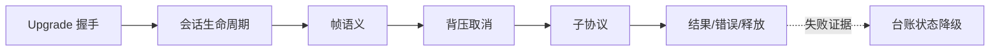

<!-- migration-doc: authority=authoritative canonical=../迁移验收规范.md -->
# vernal-websocket 语义迁移对照表
> 迁移文档治理：本文级别为 **authoritative**。正文中的历史统计或完成标记不得单独作为验收结论；以 [../迁移验收规范.md](../迁移验收规范.md) 和自动审计报告为准。

<!-- current-migration-contract-start -->
## 当前迁移规范执行口径

| 规范项 | 本模块当前要求 |
|---|---|
| 模块 | `vernal-websocket` |
| 来源基线 | `org.springframework.web.socket` @ `9e8cea3ef8ae02efb7956b071cd7bbef7c22cb82` |
| 当前对象边界 | 149 个对象；不把 `package-info.java`、合并对象或模糊依赖豁免计入完成 |
| 目标根 | `crates/vernal-websocket/src` |
| 目录和文件 | 去掉组织及模块根包，保留末两层；目录/文件 snake_case，一个源对象一个 `.rs` 文件 |
| 类型和方法 | 类型 PascalCase；方法和参数 snake_case，名称与 Java 语义一一对应 |
| 模块文件 | `lib.rs`/`mod.rs` 只含模块文档、声明和显式重导出 |
| 完成口径 | 仅 `IMPLEMENTED`、`DEPENDENCY_REUSED`、`PLATFORM_NA` 计入完成 |
| 红线 | 禁止 stub、兼容文件转引充数、生产 wildcard import、无证据的依赖替代 |
| 注释和测试 | 中文来源注释；正常、失败、边界、顺序、生命周期和并发/取消测试 |

### 当前状态快照

| 状态 | 数量 |
|---|---:|
| `DEPENDENCY_REUSED` | 0 |
| `IMPLEMENTED` | 13 |
| `MISPLACED` | 8 |
| `MISSING` | 125 |
| `PARTIAL` | 0 |
| `PLATFORM_NA` | 0 |
| `STUB` | 0 |
| `UNVERIFIED` | 3 |

### 本文档执行责任

- 本模块必须覆盖：Upgrade 握手、会话生命周期、帧语义、背压取消、子协议、STOMP、关闭状态、SockJS 边界。
- 必须记录入口、协作对象、回调顺序、错误传播、资源释放以及异步取消/背压语义。
- 接口相似不能代替行为证据；每个关键语义域都要有正常、失败和边界测试。
<!-- current-migration-contract-end -->

> CodeGraph 主链：
> `WebSocketHttpRequestHandler#handleRequest → HandshakeInterceptorChain#applyBeforeHandshake →
> HandshakeHandler#doHandshake → applyAfterHandshake`。

| Spring 语义 | Rust 目标 | 状态 |
|---|---|---|
| before interceptor 可短路 | 有序 async interceptor chain | 待逐对象验证 |
| handshake 成功/失败均 after | finally 风格 completion | 待异常路径测试 |
| connection established/message/error/closed | `WebSocketHandler` 生命周期 | 部分实现 |
| handler 异常关闭 1011 | decorator + close status | 部分实现 |
| partial message capability | fragment/last 语义 | `UNVERIFIED` |
| SockJS transport/session | polling/streaming 生命周期 | 大量 `MISSING` |
| STOMP subprotocol | codec、receipt、heartbeat、session | 大量 `MISSING` |

运行时 WebSocket 库提供帧传输，不自动提供 Spring 拦截、生命周期和子协议语义。

<!-- detailed-current-start -->
## vernal-websocket 语义边界

语义等价以可观察行为为准，但不能借“功能相似”消除源对象边界。

| 语义域 | Rust 目标表达 | 必须保留 | 验收证据 |
|---|---|---|---|
| Upgrade 握手 | trait/struct + `Result`/显式上下文；流式边界使用 `Stream` | 正常、边界、错误、顺序与资源释放 | 单元测试和跨对象集成测试 |
| 会话生命周期 | trait/struct + `Result`/显式上下文；流式边界使用 `Stream` | 正常、边界、错误、顺序与资源释放 | 单元测试和跨对象集成测试 |
| 帧语义 | trait/struct + `Result`/显式上下文；流式边界使用 `Stream` | 正常、边界、错误、顺序与资源释放 | 单元测试和跨对象集成测试 |
| 背压取消 | trait/struct + `Result`/显式上下文；流式边界使用 `Stream` | 正常、边界、错误、顺序与资源释放 | 单元测试和跨对象集成测试 |
| 子协议 | trait/struct + `Result`/显式上下文；流式边界使用 `Stream` | 正常、边界、错误、顺序与资源释放 | 单元测试和跨对象集成测试 |
| STOMP | trait/struct + `Result`/显式上下文；流式边界使用 `Stream` | 正常、边界、错误、顺序与资源释放 | 单元测试和跨对象集成测试 |
| 关闭状态 | trait/struct + `Result`/显式上下文；流式边界使用 `Stream` | 正常、边界、错误、顺序与资源释放 | 单元测试和跨对象集成测试 |
| SockJS 边界 | trait/struct + `Result`/显式上下文；流式边界使用 `Stream` | 正常、边界、错误、顺序与资源释放 | 单元测试和跨对象集成测试 |

## 对象簇职责

| 目标目录 | 数量 | 代表对象 | 当前状态 |
|---|---:|---|---|
| `adapter` | 2 | `AbstractWebSocketSession`、`NativeWebSocketSession` | MISSING:2 |
| `adapter/jetty` | 3 | `JettyWebSocketHandlerAdapter`、`JettyWebSocketSession`、`WebSocketToJettyExtensionConfigAdapter` | MISSING:3 |
| `adapter/standard` | 5 | `ConvertingEncoderDecoderSupport`、`StandardToWebSocketExtensionAdapter`、`StandardWebSocketHandlerAdapter`、`StandardWebSocketSession`、`WebSocketToStandardExtensionAdapter` | MISSING:5 |
| `client` | 4 | `AbstractWebSocketClient`、`ConnectionManagerSupport`、`WebSocketClient`、`WebSocketConnectionManager` | MISSING:3、UNVERIFIED:1 |
| `client/standard` | 4 | `AnnotatedEndpointConnectionManager`、`EndpointConnectionManager`、`StandardWebSocketClient`、`WebSocketContainerFactoryBean` | MISSING:4 |
| `config` | 5 | `HandlersBeanDefinitionParser`、`MessageBrokerBeanDefinitionParser`、`WebSocketMessageBrokerStats`、`WebSocketNamespaceHandler`、`WebSocketNamespaceUtils` | MISSING:5 |
| `config/annotation` | 20 | `AbstractWebSocketHandlerRegistration`、`DelegatingWebSocketConfiguration`、`DelegatingWebSocketMessageBrokerConfiguration`、`EnableWebSocket`、`EnableWebSocketMessageBroker` | MISSING:20 |
| `crate 根目录` | 12 | `AbstractWebSocketMessage`、`BinaryMessage`、`CloseStatus`、`PingMessage`、`PongMessage` | MISSING:11、UNVERIFIED:1 |
| `handler` | 12 | `AbstractWebSocketHandler`、`BeanCreatingHandlerProvider`、`BinaryWebSocketHandler`、`ConcurrentWebSocketSessionDecorator`、`ExceptionWebSocketHandlerDecorator` | IMPLEMENTED:1、MISSING:11 |
| `messaging` | 14 | `AbstractSubProtocolEvent`、`DefaultSimpUserRegistry`、`SessionConnectEvent`、`SessionConnectedEvent`、`SessionDisconnectEvent` | IMPLEMENTED:4、MISSING:10 |
| `server` | 4 | `HandshakeFailureException`、`HandshakeHandler`、`HandshakeInterceptor`、`RequestUpgradeStrategy` | IMPLEMENTED:3、MISSING:1 |
| `server/jetty` | 1 | `JettyRequestUpgradeStrategy` | MISSING:1 |
| `server/standard` | 5 | `ServerEndpointExporter`、`ServerEndpointRegistration`、`ServletServerContainerFactoryBean`、`SpringConfigurator`、`StandardWebSocketUpgradeStrategy` | MISSING:5 |
| `server/support` | 7 | `AbstractHandshakeHandler`、`DefaultHandshakeHandler`、`HandshakeInterceptorChain`、`HttpSessionHandshakeInterceptor`、`OriginHandshakeInterceptor` | MISPLACED:5、MISSING:2 |
| `sockjs` | 4 | `SockJsException`、`SockJsMessageDeliveryException`、`SockJsService`、`SockJsTransportFailureException` | MISSING:4 |
| `sockjs/client` | 15 | `AbstractClientSockJsSession`、`AbstractXhrTransport`、`DefaultTransportRequest`、`InfoReceiver`、`JettyXhrTransport` | IMPLEMENTED:3、MISSING:11、UNVERIFIED:1 |
| `sockjs/frame` | 8 | `AbstractSockJsMessageCodec`、`DefaultSockJsFrameFormat`、`Jackson2SockJsMessageCodec`、`JacksonJsonSockJsMessageCodec`、`SockJsFrame` | MISSING:8 |
| `sockjs/support` | 2 | `AbstractSockJsService`、`SockJsHttpRequestHandler` | MISSING:2 |
| `sockjs/transport` | 6 | `SockJsServiceConfig`、`SockJsSession`、`SockJsSessionFactory`、`TransportHandler`、`TransportHandlingSockJsService` | IMPLEMENTED:2、MISSING:4 |
| `transport/handler` | 11 | `AbstractHttpReceivingTransportHandler`、`AbstractHttpSendingTransportHandler`、`AbstractTransportHandler`、`DefaultSockJsService`、`EventSourceTransportHandler` | MISPLACED:3、MISSING:8 |
| `transport/session` | 5 | `AbstractHttpSockJsSession`、`AbstractSockJsSession`、`PollingSockJsSession`、`StreamingSockJsSession`、`WebSocketServerSockJsSession` | MISSING:5 |

## 目标调用链

入口、适配、执行、回调和清理都必须可观察；只验证最终返回值不足以证明顺序、取消或释放正确。

## Java 到 Rust 技术语义

| Java 机制 | Rust 映射 | 验证重点 |
|---|---|---|
| nullable | `Option<T>` | `None` 与空值不得混同 |
| checked exception | `thiserror` + `Result<T, E>` | 分类、cause 和上下文 |
| synchronized/并发容器 | `Arc<RwLock<_>>`/`DashMap` | 竞争、可见性和死锁 |
| CompletableFuture | `Future`/`JoinHandle` | 完成、失败、取消和超时 |
| Reactor Mono | `async fn -> Result<T, E>` | 单值、空结果和错误 |
| Reactor Flux | `Stream<Item=Result<T,E>>` | 背压、顺序、取消和终止 |
| ServiceLoader | `inventory` + registry | 自动注册和确定性 |
| JVM/字节码 | 有证据才可 `PLATFORM_NA` | 困难不等于不适用 |

## 语义测试矩阵

| 语义域 | 正常场景 | 失败/边界 | 观察点 |
|---|---|---|---|
| Upgrade 握手 | 最小有效输入完成全链路 | 空输入、重复、下游错误或取消 | 返回值、错误类型、调用顺序、状态和释放 |
| 会话生命周期 | 最小有效输入完成全链路 | 空输入、重复、下游错误或取消 | 返回值、错误类型、调用顺序、状态和释放 |
| 帧语义 | 最小有效输入完成全链路 | 空输入、重复、下游错误或取消 | 返回值、错误类型、调用顺序、状态和释放 |
| 背压取消 | 最小有效输入完成全链路 | 空输入、重复、下游错误或取消 | 返回值、错误类型、调用顺序、状态和释放 |
| 子协议 | 最小有效输入完成全链路 | 空输入、重复、下游错误或取消 | 返回值、错误类型、调用顺序、状态和释放 |
| STOMP | 最小有效输入完成全链路 | 空输入、重复、下游错误或取消 | 返回值、错误类型、调用顺序、状态和释放 |
| 关闭状态 | 最小有效输入完成全链路 | 空输入、重复、下游错误或取消 | 返回值、错误类型、调用顺序、状态和释放 |
| SockJS 边界 | 最小有效输入完成全链路 | 空输入、重复、下游错误或取消 | 返回值、错误类型、调用顺序、状态和释放 |

## 语义完成清单

- [ ] 对象职责和协作边界明确。
- [ ] Javadoc 前置、后置和异常语义译为中文注释。
- [ ] 关键链路有正常、失败和边界测试。
- [ ] 异步能力覆盖完成、错误、取消、超时与背压。
- [ ] 资源型对象覆盖获取、复用和释放。
- [ ] 依赖复用有固定提交、精确符号和集成测试。
- [ ] JVM 专属能力有不可迁移证据。
- [ ] 状态严格使用验收规范定义。
<!-- detailed-current-end -->

<!-- historical-design-appendix-start -->
## 历史设计附录（不参与当前状态）

> 合并来源：`语义迁移对照表-历史详细版.md`；Vernal 基线 `dd20300d16a09200bd8a379ff14db1e2da99b67c`。仅保留旧分析和决策轨迹；旧数量、状态、测试结果与完成标记不得覆盖本文件上方的当前要求。

### spring-websocket → vernal-websocket 语义迁移对照表

> 版本：v4.0（2026-07-27，与代码同步）

#### 状态

| 状态 | 含义 |
|---|---|
| ✅ | 语义实现并有验收测试 |
| 🟦 | 语义等价，SPI 形态待完整验证 |
| ⛔ | PLANNED_BLOCKED（依赖 vernal-http-client） |
| 🚫 | JAVA_ONLY_EXEMPT |

#### 核心修正（v4.0）

| Spring 行为 | Rust 实现 | 状态 | 验收 |
|---|---|---|---|
| ConcurrentWebSocketSessionDecorator flush lock tryLock | 双锁 flush_lock(Mutex try_lock) + buffer_lock，tryLock 失败入 buffer | ✅ | Terminate/Drop/close 测试 |
| WebSocketHttpRequestHandler HTTP 响应 | HandshakeResponse（status+headers+body+session），101/403/500 | ✅ | 测试断言 status/body |
| SubProtocolWebSocketHandler session registry | sessions HashMap + protocol dispatch + inbound/outbound | ✅ | open/message/close 测试 |
| StompSubProtocolHandler CONNECT→CONNECTED | handle_message_to_client 编码 CONNECTED | ✅ | 测试 |
| StompSubProtocolHandler DISCONNECT→RECEIPT | after_session_ended 发送 DISCONNECT SIMP Message | ✅ | 测试 |
| DefaultSimpUserRegistry | register/remove session/subscription | ✅ | CRUD 测试 |
| Session*Event | typed event structs (Connect/Connected/Disconnect/Subscribe/Unsubscribe) | ✅ | 构造测试 |
| SockJS HTTP transport handler | XHR polling/streaming/send, EventSource(data:), HtmlFile, WebSocket | ✅ | content-type/frame 测试 |
| SockJS session 状态机 | New→Open→Closed, initial/successive request, stream bytes 回收 | ✅ | 状态转换测试 |
| STOMP codec | 13 命令 + header 转义 + NULL + content-length | ✅ | round-trip 测试 |

#### 测试基线

113 个测试全部通过：
- core_contract 10, handler_decorators 12, messaging_stomp 13, server_handshake 8, sockjs_transport 14, tokio_websockets_integration 3, lib 内嵌 35
<!-- historical-design-appendix-end -->
