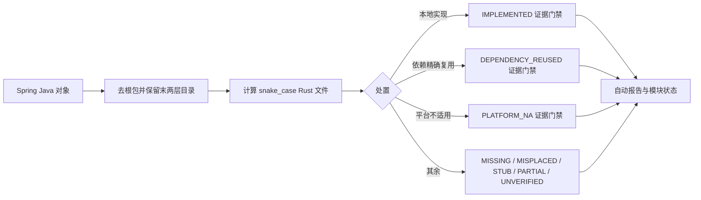
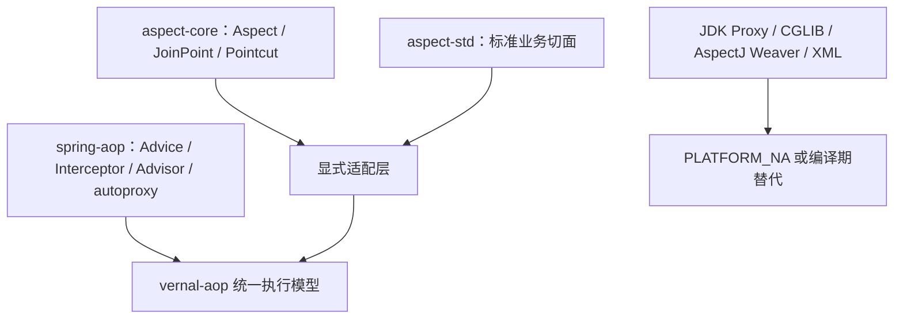

<!-- migration-doc: authority=authoritative canonical=迁移验收规范.md -->

> 迁移文档治理：本文级别为 **authoritative**。正文中的历史统计或完成标记不得单独作为验收结论；以 [迁移验收规范.md](迁移验收规范.md) 和自动审计报告为准。

# Spring → Vernal 迁移验收规范

> 本文是 Vernal Framework 迁移目录、对象文件、依赖复用和完成状态的唯一权威规范。
> 自动事实报告位于 `docs/migration-audit/`，机器清单位于
> `docs/migration-manifest.toml`。其他文档中的历史数字或勾选不得覆盖本规范。

## 一、对象与目录算法

1. 从 Java 源路径中去掉组织路径和 Spring 模块根包。
2. 剩余包路径有两层以上时保留末两层；仅一层时保留该层；没有子包时进入 crate 根目录。
3. Java 类型名转换为 snake_case 文件名；Rust 类型仍用 PascalCase。
4. 每个 Java class、interface、enum、record 对应一个真实 `.rs` 文件。内部类及主对象
   Builder 可留在主文件中。
5. `package-info.java` 不计对象；其语义可翻译为 `mod.rs` 的模块文档。

| Java 相对路径 | Rust 目标路径 |
|---|---|
| `factory/config/BeanDefinition.java` | `factory/config/bean_definition.rs` |
| `factory/xml/support/Foo.java` | `xml/support/foo.rs` |
| `propertyeditors/PatternEditor.java` | `propertyeditors/pattern_editor.rs` |
| `framework/autoproxy/target/Foo.java` | `autoproxy/target/foo.rs` |

`lib.rs` 和 `mod.rs` 只能包含模块文档、`mod` 声明和显式 `pub use`，不得定义业务类型
或承载兼容实现。生产代码禁止 wildcard import。

## 二、完成状态

只有下列三种状态计入“已处理”：

| 状态 | 必要证据 |
|---|---|
| `IMPLEMENTED` | 预期路径、独立主对象、完整逻辑、中文 Java 来源注释、语义测试 |
| `DEPENDENCY_REUSED` | 精确 crate/版本或提交、上游源码符号、Cargo 依赖、适配与集成测试 |
| `PLATFORM_NA` | JVM/字节码/类加载器等平台不可适用证据，且不得创建占位文件 |

以下状态全部属于未完成：

| 状态 | 含义 |
|---|---|
| `MISSING` | 没有同名 Rust 对象文件 |
| `MISPLACED` | 文件名存在，但目录不符合末两层算法 |
| `STUB` | 存在 `todo!()`、`unimplemented!()`、TODO、占位字段或空业务逻辑 |
| `PARTIAL` | 只覆盖部分回调、错误分支、生命周期或桥接语义 |
| `UNVERIFIED` | 文件存在，但来源注释或测试证据不足 |

“已合并”“已改名”“形态等价”“生态类似”不能计入完成。确需依赖复用时必须落入
`DEPENDENCY_REUSED` 并提供精确证据。

## 三、门禁流程



模块状态只能从逐对象台账汇总，禁止手写“完备”。测试总数、覆盖率和编译质量必须记录
复现命令、仓库提交与执行日期；通过测试不自动等价为对象迁移完成。

## 四、注释和语义验收

- 每个公开对象必须有中文 `///` 注释，并包含完整 Java 来源 FQN。
- 每个公开方法必须说明参数、返回与错误语义；复杂方法注明 Java 来源方法。
- Java Javadoc 的线程安全、生命周期、错误、顺序和回调语义必须翻译保留。
- 语义测试至少覆盖成功、失败、边界和关键生命周期；只测试构造器或 getter 不足以证明完成。
- 文件中出现占位或未实现标记时，无论测试是否通过都不得标记 `IMPLEMENTED`。

## 五、AOP 特别规则

Spring AOP 决定对象与目录结构；`aspect-rs` 只作为 Rust 依赖能力来源：



不能把相近的日志、限流、缓存能力直接视为某个 Spring Interceptor 的完整替代。同步
`Aspect` 到异步 `Interceptor` 的桥接必须保留 JoinPoint 元数据、成功回调、错误回调和
around 控制权，否则只能标记 `PARTIAL`。

## 六、复现命令

```bash
python3 -m unittest discover -s scripts/tests
python3 scripts/audit_migration_docs.py --module vernal-beans --check
python3 scripts/audit_migration_docs.py --module vernal-aop --check
python3 scripts/audit_migration_docs.py --all --check
cargo test -p vernal-beans
cargo test -p vernal-aop
```

## 七、每模块文档五件套

`docs/vernal-*` 下的每个模块目录都必须且只能有一套当前权威五件套：

| 文档 | 职责 |
|---|---|
| `Spring-<模块>-技术要求.md` | 来源边界、目标目录、技术映射、平台与依赖边界 |
| `对象名称一致性检查.md` | 当前数量汇总、命名和路径偏差、可复现命令 |
| `对象级对照表.md` | 每个 Java FQN 的预期路径、当前路径、状态和证据 |
| `语义迁移对照表.md` | 基于 CodeGraph 的关键调用链、顺序、错误和生命周期语义 |
| `迁移路线图.md` | 按 `MISPLACED` → `MISSING` → `STUB/PARTIAL` → `UNVERIFIED` 执行 |

四个迁移文档必须是可独立审阅的详细文档，只有文件存在或只有汇总数字不能通过：

1. `对象名称一致性检查.md` 必须包含规则、状态汇总、目标目录分布、逐对象命名与路径判定、
   修复顺序和验收清单。
2. `对象级对照表.md` 必须覆盖该模块的每个 Java class/interface/enum/record，记录 Java
   FQN、源路径、预期 Rust 路径、当前路径、状态和证据；文档型模块必须列出每个规划对象
   的职责、路径、依赖边界和集成测试要求。
3. `语义迁移对照表.md` 必须包含模块专属语义域、对象簇职责、关键调用链、Java→Rust
   技术语义、错误/生命周期以及正常、失败、边界、并发或取消测试矩阵。
4. `迁移路线图.md` 必须包含当前状态基线、阶段退出条件、目录批次、逐对象批次、语义能力
   顺序、每批门禁和最终验收命令。

新规范不能只写在本全局文件中。每个模块的上述四份当前文档都必须包含由
`current-migration-contract-start/end` 标记包围的“当前迁移规范执行口径”，并写明该模块
自己的来源提交、对象边界、状态快照、目标根、目录算法、完成口径，以及名称/对象/语义/
路线图各自的执行责任。缺少该执行块的模块文档一律视为未完成。

除自动生成的源码对象表外，每份当前迁移文档至少需要 45 行非空正文、3 个二级详细章节，
以及不少于 5 行的证据表或不少于 8 项的任务矩阵。自动生成的对象表按实际对象数量伸缩，
但必须具备汇总、结构红线、逐对象台账三个详细章节和足够的可审计表格行。该数量门禁只防止
摘要冒充详细文档，不能替代语义质量审查。

旧版、v2/v3、参考蓝本或长文件名对照表可以保留，但必须标记为 `historical`，并链接到
同目录的当前五件套。辅助设计说明标记为 `support`；它们均不得形成第二套当前状态。

四件套的历史版本不得以 `*-历史详细版.md` 或 `history/**/<四件套文件名>` 与当前权威
文档形成第二套入口。仍有价值的包分组、设计背景、外部组件分析和决策轨迹，统一合并到
对应当前文档的“历史设计附录”；合并后移除重复文件。附录必须标明来源基线，并明确旧数量、
旧路径、旧状态和旧完成标记不参与当前验收。

自动审计只重算对象表顶部的当前事实区，并通过
`historical-design-appendix-start/end` 标记保留附录。附录不得手写新的当前状态；
需要改变当前对象判定时，应修改源码、依赖处置证据或审计清单后重新生成事实区。

尚未建立目标 crate 的模块同样必须有五件套，但只能使用 `MISSING`、`PLANNED` 或有精确
证据的 `PLATFORM_NA`，不得因为“未来会使用某生态组件”而宣称完成。

自动门禁同时检查：

1. `docs/migration-manifest.toml` 登记了每个 `vernal-*` 文档目录；
2. 四个规范名文档和唯一一个 `Spring-*-技术要求.md` 均存在；
3. 当前五件套标为 `authoritative`，旧重复文档标为 `historical`；
4. 四个迁移文档分别满足上述详细度、章节和证据矩阵要求；
5. 有源码映射的模块对象表与自动报告完全一致。

需要从当前源码事实补齐短摘要时，可先执行
`PYTHONDONTWRITEBYTECODE=1 python3 scripts/enrich_migration_docs.py`，再执行全量审计。
补齐脚本只处理未通过详细度门禁的文档，并以对象审计结果生成逐对象和逐批次内容。
